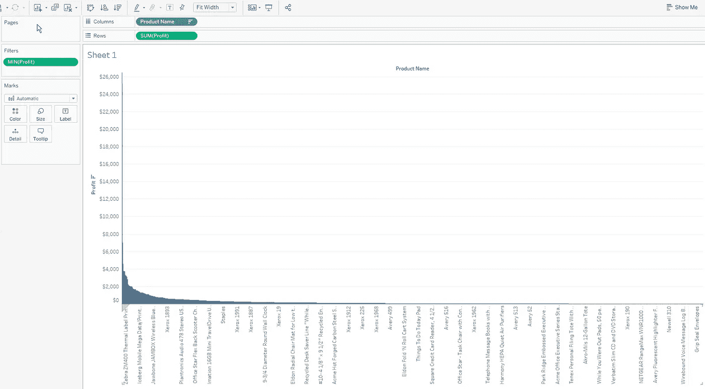
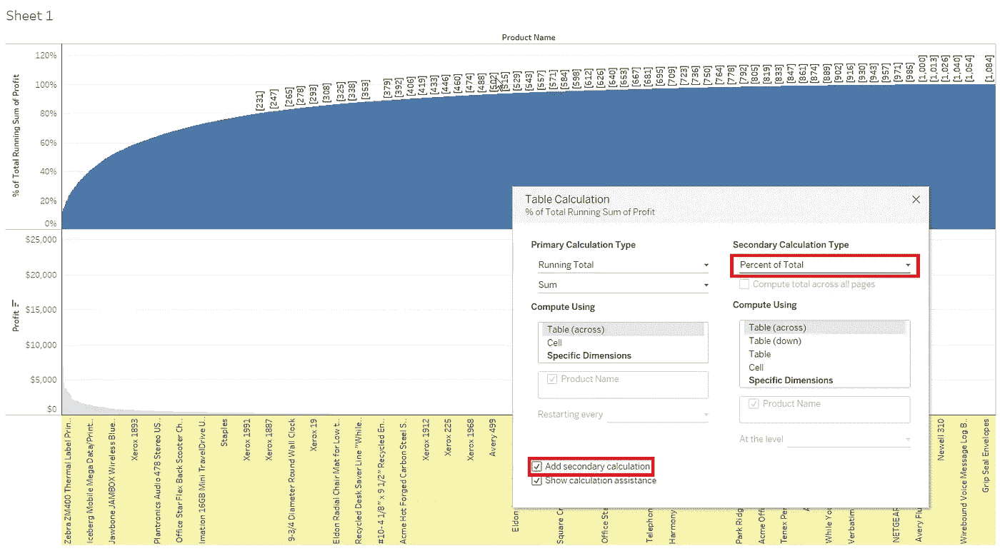
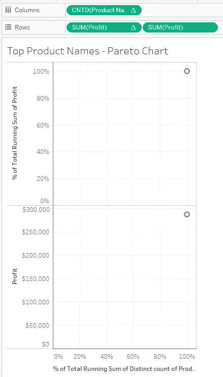
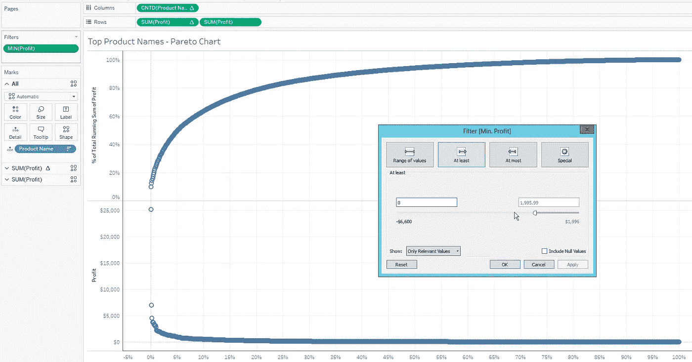
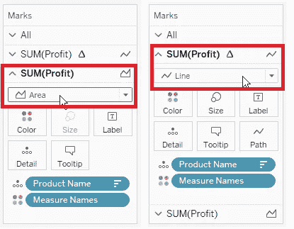
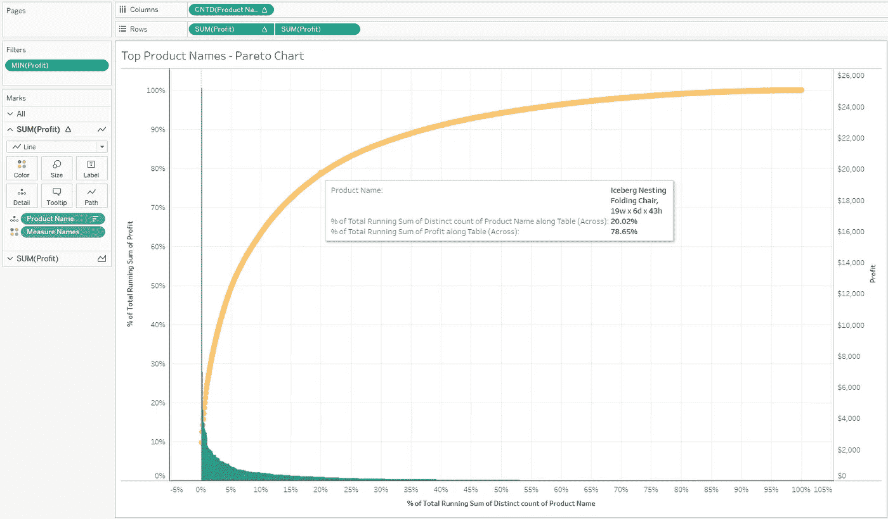

# Tableau:帕累托图(20，80) —热门产品、客户……

> 原文：<https://medium.com/hackernoon/tableau-pareto-chart-20-80-top-products-customers-51d53ffe16c6>

根据定义:*帕累托图(Pareto chart)是一种既包含条形图又包含折线图的图表，其中单个值以降序由条形图表示，累计总数由线条表示。*

因为帕累托图真正流行的是它的规则“280(20，80)”——在大多数企业中，前 20%的顾客贡献了 80%的收入。

让我们检查一下我们著名的*样本超市* [数据](https://hackernoon.com/tagged/data)来源是否也是如此:这样我还想说谢谢 [Milos Oroz](https://medium.com/u/5465a8b98d30?source=post_page-----51d53ffe16c6--------------------------------) 的帕累托图建议。

连接到[Tableau](https://hackernoon.com/tagged/tableau)*Sample super store*，选择 *Profit* 和*Product name*，然后按 SUM(Profit)降序排序，我们应该得到这样的结果:

按住 CTRL 键左键复制 *Sum(Profit)* 并拖动到边上，做*速算表*和*运行合计*，右键同样的度量并*编辑表计算* → *添加辅助计算* → *合计百分比*:

现在我们到了要将*产品名称*从文本转换成计算的步骤。

右击*产品名称*，选择*测量*，然后选择*计数(不同)*。

再次点击右键，选择*快表计算* → *累计*。

添加*二次计算* → *占总数的百分比进行编辑。*

您的工作表看起来会像这样(在*左侧*):

拖动一个新的*产品名称*字段，并将其放到*所有标记卡*的*细节*上。右键*按*利润总和*降序*排序。

右击*栏*测量 *CNTD(产品名称)* →编辑*表格计算* →选择*产品名称*作为*具体尺寸*。同样的事情做也是为了你的第*笔*利润*排*架子！

随着剔除利润的负值，你会得到这样的看法:

右键点击*利润*轴→ *双轴*。在*标记*卡上，将*金额(利润)*更改为*面积*，将总利润的 *%更改为*行*:*

将鼠标悬停在现有的点上，我们可以很容易地看到两个相应测量值之间的比率。我们的例子表明，20.02%的顶级*产品名称*给了我们 78.65%的*利润*:)

为了视觉效果，您还可以添加一些*参考线*。

发现这个帖子有用吗？请点击下面的❤按钮！:)

**关于作者**

莱昂·阿加蒂奇是一个画面爱好者。你可以在[中](/@leon.agatic)、[推特](https://twitter.com/LeonAgatic)、 [LinkedIn](https://www.linkedin.com/in/leonagatic/) 和 [Reddit](https://www.reddit.com/user/TableauEnthusiast) 上和他联系。

*想要**雇用**我吗？在 [LinkedIn](http://www.linkedin.com/in/leonagatic) 上联系我！

*读者还感兴趣的有*……[LTM 移动计算(财务 KPI)](/@leon.agatic/tableau-ltm-moving-calculation-finance-kpi-93f2e75d736c) 、[发散条形图](/@leon.agatic/tableau-diverging-bar-chart-8eb780e3a9b6)、[修正饼图](/@leon.agatic/tableau-modified-pie-charts-bf9499661ff6)

> [黑客中午](http://bit.ly/Hackernoon)是黑客如何开始他们的下午。我们是 [@AMI](http://bit.ly/atAMIatAMI) 家庭的一员。我们现在[接受投稿](http://bit.ly/hackernoonsubmission)并乐意[讨论广告&赞助](mailto:partners@amipublications.com)机会。
> 
> 如果你喜欢这个故事，我们推荐你阅读我们的[最新科技故事](http://bit.ly/hackernoonlatestt)和[趋势科技故事](https://hackernoon.com/trending)。直到下一次，不要把世界的现实想当然！

