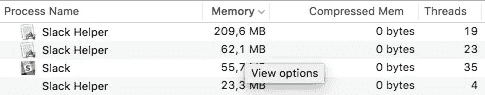
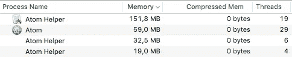
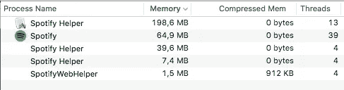
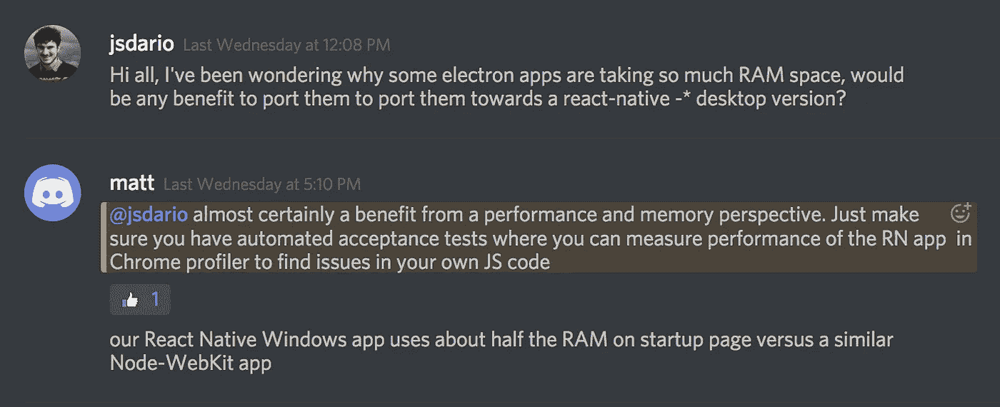
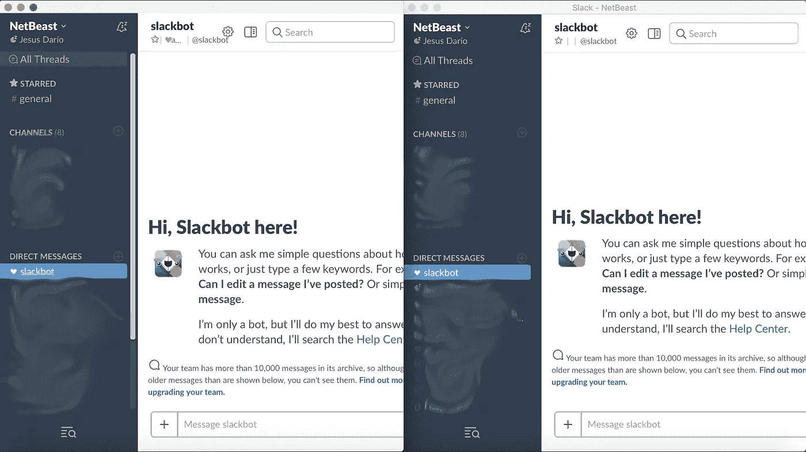

# 解决 app 肥胖危机

> 原文：<https://medium.com/hackernoon/tackling-down-the-app-obesity-crisis-ecbca793692f>

## Slack 原生 app 就是作为一个实验而诞生的

我最近读了一本很棒的书，是关于桌面的**。*而作者 Seph 说的完全正确。*

*我不讨厌电子。它在一个简单的 API 和伟大的维护者中有着难以置信的好处。事实上，它使我们——开发者——能够通过多种平台创建和维护更好的用户体验。只需看一眼，您就会发现您正在使用的大多数应用程序实际上都是 web 应用程序:*

*但它们有一个明显的缺点:它们消耗的资源和 Chrome 本身一样多。这与 RAM 上瘾者最相似，并且有自己神奇的方式来处理操作系统上的进程*。这对最终用户来说有一些非常痛苦的影响:电池真的飞走了，系统运行——总的来说——太慢了，几乎无法使用一些应用程序。**

*我是一名开发人员，因此我广泛使用我的计算机资源。通常在后台运行一个编译器，一个或多个虚拟机，一个浏览器(曾经是 Chrome)，一个文件编辑器(仍然是 Atom，因此是另一个 Chrome)，Slack(基本上是 Chrome)，Spotify(*又*)，有时——只是因为——Adobe Photoshop。*

*我的第一个回答是换成 firefox，从这个意义上来说 Firefox 更绅士，但这还不够，因为我仍然在大量使用 V8 引擎:*

**

*350MB and 102 threads for a chat service (with only one team sign on!)*

**

*263MB and 58 threads for a text editor.*

**

*315MB and 64 threads.*

*我也放弃了使用 Slack 和 Spotify *所谓的应用*。我也直接访问 Firefox 上的服务，这确实提高了电脑的性能。现在很少听到它换气过度了。*

*笔记本电脑不是便宜货，它曾经是 3 年前最新版的 Macbook Pro，但我总是牺牲磁盘空间来降低价格。现在我比以往任何时候都更需要它，因为我需要大量的交换空间。机器是好的，因此，解决方案(如果我还想享受安装的应用程序)必须在软件中。*

*出于好奇，我在 Reactiflux Discord 的频道上询问了我想到的一个可能的解决方案(或暂时的变通办法):*

**

*所以我们现在有工作要做。而不必等待我们最喜欢的服务开始开发本地应用。然而，验收测试，所以假设更多的工作——这只是一个小实验，所以暂时不会写这个。*

## *将应用引入本地*

*我们不能放弃电子的好处，但是我们可以使用最新的范例来创造伟大的软件体验。正如在*电子是新的 Flash* 文章中提到的，我们可以利用 [React](https://hackernoon.com/tagged/react) Native(例如，我确信有其他具有相同焦点的替代方案，如 [NativeScript](https://www.nativescript.org/) 可能)。*

*所以我做了一个非常简单的实验。由于 Slack desktop [应用](https://hackernoon.com/tagged/app)与 web 非常相似，**我决定将服务嵌入到一个 webview** 中，它使用了一个*本地*组件，而不是电子组件。结果就是 *Slack 原生。*它当然仍然缺少许多功能，比如通知和多个团队，但是使用 slack API 实现这些功能并不困难。*

**

*正如所料，结果几乎与电子版本相同(最终两者都依赖非常相似的引擎)，但同时使用的 RAM 不到一半。 *SlackNative* 是在“react-native-MAC OS”webview 上运行的进程的名称。*

**

*There you have Electron with all those misterious helpers*

*你可以在这里找到回购协议，我们可以努力让 Slack 变得更加本地化:[https://github.com/jsdario/SlackNative](https://github.com/jsdario/SlackNative)。我们也可以使用 [react-native-windows，](https://github.com/Microsoft/react-native-windows)将它分支到 windows，这样相同的代码库(目前只是一个 webview)可以为两个主要的操作系统提供。*

*我希望看到更多人复制这种努力，以将 Spotify 带到本地世界，例如，或者，**首先:**[**Atom**](https://atom.io/)**。起初，这是这个实验的目标。然而，Atom 并不完全是一个 webapp，它只是使用 web-coming 技术制作的。在不牺牲灵活性、插件和所谓的可攻击性的情况下，努力让 Atom 变得更本地(有更快的响应，更卓越的体验)应该是非常有趣的。***

*亲爱的读者，你应该对这个实验的结果保持警惕。我没有进一步实现更好的证明，这是要走的路。这篇文章更多的是关于问题而不是解决方案。无论如何，5 行代码可以极大地减少 RAM 的使用。这更证明了两个假设:*

*   *我们需要并将使用网络技术来创建跨平台的应用程序，直到新的解决方案问世。*
*   *重新创建一个完整的浏览器来使用 web 工具是一个很好的*解决方法*,但是在编写的时候无法与本地实现竞争。*

*因此，将业务逻辑(或用例逻辑)与表示完全分离是完全有意义的。不同形式和大小的物理设备投资于自己的显示器是很自然的:Pebble 不能提供与 iOS 设备或 Android 电视相同的 UI 或用户级 API。React Native 的任务是你可以*学会一次写遍*。这意味着，表示组件逻辑的模型必须以一种所有开发人员都容易访问的语言或接口提供(如果您希望他们创建您的平台本地的应用程序)。这并不意味着厂商放弃他们想要提供的操作系统级别的服装。*

*我想这篇文章的要点是:范式已经改变，但目标是一样的。我们可以在(electronic)上构建支持我们的 web 应用程序的完整运行时，也可以构建理解我们的 web 应用程序的环境和工具，并产生一个本地应用程序。*

******

> *[黑客中午](http://bit.ly/Hackernoon)是黑客如何开始他们的下午。我们是 [@AMI](http://bit.ly/atAMIatAMI) 家庭的一员。我们现在[接受投稿](http://bit.ly/hackernoonsubmission)并乐意[讨论广告&赞助](mailto:partners@amipublications.com)机会。*
> 
> *如果你喜欢这个故事，我们推荐你阅读我们的[最新科技故事](http://bit.ly/hackernoonlatestt)和[趋势科技故事](https://hackernoon.com/trending)。直到下一次，不要把世界的现实想当然！*

**