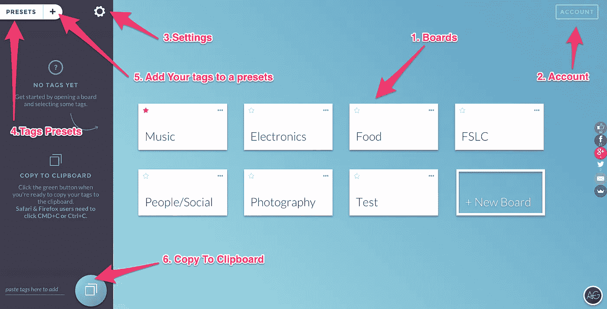
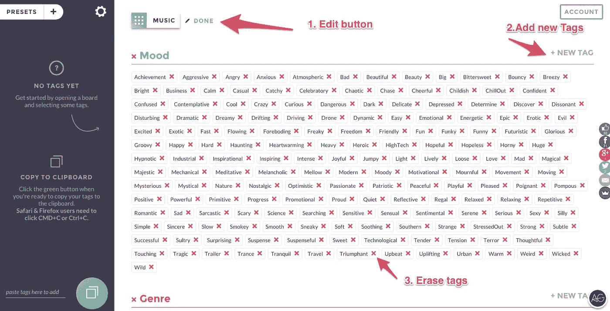
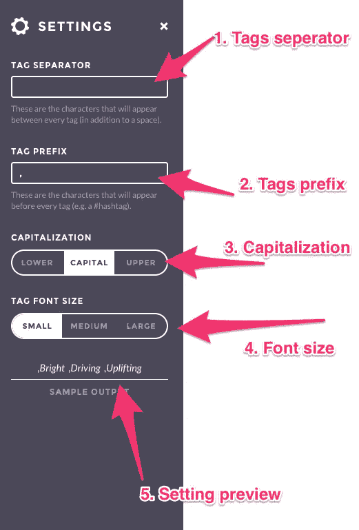
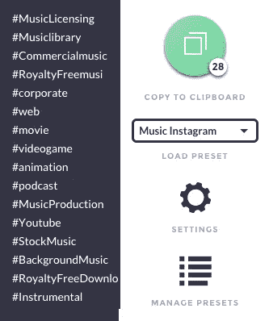
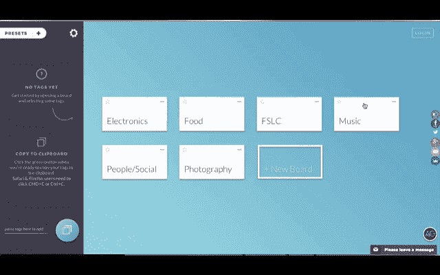
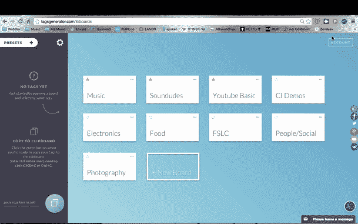

# 如何将你所有的#标签放在一个地方？介绍标签生成器 Web 工具。

> 原文：<https://medium.com/hackernoon/tags-generator-website-a8d0e755acaa>

嗯， [**AG 标签**](https://hackernoon.com/tagged/ag-tags) **生成器**是一个简单的 web [工具](https://hackernoon.com/tagged/tool)，它将帮助你组织所有的标签，并让你快速访问最常用的标签，但更重要的是，它将帮助你节省大量时间。

在数量、分隔符和前缀以及其他要求方面，所有社交平台都有不同的标签要求。有了这个工具，你可以在几秒钟内为所有不同的社交网络的帖子生成完美定制的标签。

该工具构建可定制的板来组织类别和标签。例如，如果我是一名摄影师，每周向 photodune 上传大量新照片，我会使用自己的“摄影”板，其中包含我自己的类别，如“海滩”，其中包括所有适合描述海滩的标签，通过按下编辑按钮，我可以添加自己的新标签等等，这同样适用于音乐家、视频制作人和代码开发人员。

# 以下是该工具的使用方法:

转到[**tagsgenerator.com**](http://tagsgenerator.com/#/)，使用您的社交账户登录，或者使用您的电子邮件地址创建一个账户。完成后，您将会看到主屏幕，在这里您会立即看到一些**主要功能，包括**:

*   轻松复制/粘贴和组织您的标签。
*   自定义分隔符和前缀。
*   铬延伸
*   标签预设
*   定制板

# 纸板

1 .版块:在这里您可以添加/编辑/删除和收藏您的版块
2。请务必登录到您的帐户，以保存您的更改供下次使用。
3。设定齿轮。
4。您的标签预设(也将应用于您的 chrome 扩展)
5。选择所有标签后，您现在可以通过单击“+”号添加自己的预设。
6。如果你所有的标签都设置好了，现在你只需要按绿色的按钮，这将执行电脑上的快捷键 CMD+C 或 Ctrl+c。

# 编辑和添加标签。

点击编辑按钮进入编辑模式。
输入您的标签名称，并按回车键将标签添加到列表中(它将按字母顺序排列)
按红色“X”删除您不需要的标签

# 设置

在这里，您可以选择任何字符来分隔标签。
使用标签前缀，您可以选择出现在所选标签前的字符。
您还可以选择标签的大小写
如果您要查看多个标签，为了方便起见，您可以选择以小字体查看所有标签。这一行将向您显示设置结果。

# 铬延伸

在 chrome 扩展的帮助下，您可以轻松访问该工具，以获得您之前创建的所有预设。要添加更多预设，只需返回主网页。希望你会喜欢使用标签生成器！

Here is how its looks like

Here is the chrome extension

更多信息:

# 你免费提供这个有用的工具吗？

这一切都始于 3 年前，当我第一次了解到 [**Envato Market**](http://bit.ly/12bgCpn) 的时候，也是在我的音乐专辑卖出之后。我当时就知道我的生活将要彻底改变，而且真的改变了！

从一个一周 7 天努力工作来谋生的音乐家，到现在，我终于有了一些自由时间来陪伴我的家人、自己以及创作和作曲，这是我对音乐的真正热情。

从那以后，我总是看着这个令人惊叹的社区，努力想出一种我可以回报的方式，因为自从我在 **AJ** 上出售我的音乐以来，它在过去的 3 年里为我做了很多好事。我心想:“*我怎样才能真正做出对我们大家都有益的东西，帮助我们节省一点时间，让我们有更多的时间来创作和专注于我们的音乐？*”

我很快发现没有真正简单的方法来填写 submission tags 字段，所以我想我可以编写一个小的 java 代码来帮助我复制和粘贴我喜欢的标签。唯一的问题是:如果我一行代码都不知道，我该怎么做呢？:)

这就是我热爱互联网的原因！你总是可以自学所有的东西！我上了一堂关于 JavaScript 的速成课，从这段漂亮简单的代码开始，当时我已经在我的 composer 网站上以博客的形式发布了这段代码。我得到了非常棒的反馈，人们告诉我他们有多喜欢它！这是我知道我刚刚得到了我一直想要的东西，我把一些爱带给了 Envato 上所有了不起的人。如果我有每个人的家庭住址，我一定会送花给他们:)

2 年后，在收集了所有来自社区的反馈后，我想:“为什么不把这个工具更进一步，使它成为一个真正独立的工具，不仅对我的音乐家朋友有帮助，对所有其他 Envato 作者也有帮助？”这成为我创建网站的主要目标之一。总之——是的，它是免费的，而且会一直免费，因为这是我说“谢谢你们帮助我改变我的世界”的方式:)

[www.TagsGenerator.com](http://www.TagsGenerator.com)

希望你会喜欢，请让我知道你的想法。

> [黑客中午](http://bit.ly/Hackernoon)是黑客如何开始他们的下午。我们是 [@AMI](http://bit.ly/atAMIatAMI) 家庭的一员。我们现在[接受投稿](http://bit.ly/hackernoonsubmission)，并乐意[讨论广告&赞助](mailto:partners@amipublications.com)机会。
> 
> 如果你喜欢这个故事，我们推荐你阅读我们的[最新科技故事](http://bit.ly/hackernoonlatestt)和[趋势科技故事](https://hackernoon.com/trending)。直到下一次，不要把世界的现实想当然！

