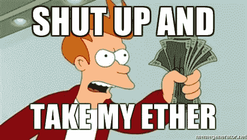

# 在乙醚拍卖游戏中碰碰运气

> 原文：<https://medium.com/hackernoon/take-your-chances-at-the-ether-auction-game-30f9df1ec80b>

Photo by [NeONBRAND](https://unsplash.com/photos/JW6r_0CPYec?utm_source=unsplash&utm_medium=referral&utm_content=creditCopyText) on [Unsplash](https://unsplash.com/?utm_source=unsplash&utm_medium=referral&utm_content=creditCopyText)

***免责声明:*** *这个智能合约是基于经济学家* [*马丁·舒比克*](https://en.m.wikipedia.org/wiki/Martin_Shubik) *设计的* [*美元拍卖*](https://en.m.wikipedia.org/wiki/Dollar_auction) *游戏。*

***免责声明 2:*** *本文、配套代码和部署的智能合约仅出于学术目的而编写。该游戏已经部署到以太坊主网络，这意味着，如果你尝试它，你会用真钱投标。参与风险自担。我对玩游戏的金钱损失不负任何责任，无论是由于出价过高还是由于一个错误。你可能想知道为什么，如果这仅仅是为了学术目的，我部署了合同来处理真实的钱。我相信这是实验成功的唯一途径，因为参与的人会在游戏中有所体现。*

***免责声明 3:*** *全披露。因为没有办法阻止拍卖人使用其他地址或让朋友出价高于某人，所以他/她几乎不可能输。如果有人出价 0.05 eth，他就要赢了，拍卖人可以使用他的一个帐户每次都比他们出价高，直到拍卖至少超过 1 eth，这样他就不赔不赚了。就像他们说的，房子总是赢。*

# 以太拍卖

以太拍卖严格基于美元拍卖游戏。根据维基百科:

> **美元拍卖**是由[经济学家](https://en.m.wikipedia.org/wiki/Economist) [马丁·舒比克](https://en.m.wikipedia.org/wiki/Martin_Shubik)设计的一个非[零和](https://en.m.wikipedia.org/wiki/Zero_sum) [序贯游戏](https://en.m.wikipedia.org/wiki/Sequential_game)，用来说明传统[理性选择理论](https://en.m.wikipedia.org/wiki/Rational_choice_theory)带来的一个[悖论](https://en.m.wikipedia.org/wiki/Paradox)，游戏中拥有[完美信息](https://en.m.wikipedia.org/wiki/Perfect_information)的玩家被迫完全基于一系列明显[理性](https://en.m.wikipedia.org/wiki/Rationality)的选择做出最终[非理性](https://en.m.wikipedia.org/wiki/Irrational)决定

在以太拍卖中，拍卖人自愿提供一个参与者可以出价的以太。出价从 0.05 eth 开始，然后上涨 0.05 eth。竞拍结束时，出价最高的人获得第一名。不过有一个警告，出价第二高的人会赔钱。

所以，当拍卖开始时，人们不必多想。他们在寻找一些轻松的利润。通过出价 0.05 eth，他们可以赢得 1eth。

随着拍卖的进行，它将变成两个人之间的战斗，他们将试图出价高于对方以赢得拍卖，即使他们最终赢得几个魏甚至不赔不赚。(通过出价 1 eth 获得 1 eth 赢得拍卖)。

此时，事情变得有趣了。正在输掉这场战斗的人现在会试图将他的损失最小化。毕竟，他们看到的是 0.95 eth 的亏损。如果他们现在出价 1.05 eth，他们只会损失 0.05 eth。这种情况可以一直持续下去，直到双方中的一方决定减少损失并停止竞标。

Douglas Noll 的这篇文章很好地解释了[的心理](https://hackernoon.com/tagged/psychological)原因，即为什么有人明知即使他们赢得或输掉拍卖，他们也会赔钱，但仍会继续推。

> 实际上有一个全局最优的解决方案，那就是根本不玩这个游戏，除非你确定没有其他玩家。—维基百科

# 在以太坊建造以太拍卖

[我第一次知道这个游戏是在 Reddit 的帖子](https://www.reddit.com/r/ethdev/comments/7bb7g6/potential_dollar_auction_game_scam/)中，帖子警告人们如何被诈骗。他写道:

> [……]然而，一旦智能合约成为主流，这种骗局很有可能会流行起来，考虑到加密货币成为主流时有多少人购买了比特币。
> 
> 我们需要教育公众，并试图防止这种类型的骗局，以确保智能合约技术的快速和无故障的部署，如果没有其他原因，只是为了保护我们拥有的以太坊的价值。

真的是骗局吗？我不确定，可能吧。诚然，赢得这场游戏的唯一方法是只有你一个人在玩(这样就不会引发竞价战)，但人们确实知道(或者应该知道)规则。规则非常清楚，你知道如果出价高于你，你会失去你的钱。

当我们在水晶般清晰的规则主题上时，你可以在下面找到带有注释和每个函数的一些解释的契约代码。
**如果你不在乎代码，想参与游戏，可以随意跳过这一节。但是，如果你不理解或不关心代码，我不建议你参加这个游戏或其他类似的游戏，或者 ICOs 游戏。**

我的 [Github repo](https://github.com/pabloruiz55/EthereumAuction) 和 [**上也有代码，已经在 Etherscan**](https://etherscan.io/address/0x2e63cceffa42b095f0bd6d0fcadb521200b8fef5#code) **上验证过。**

## 合同初始化

我们在构造函数中做的唯一一件事是让部署合同的人成为拍卖人。在这一点上，他不必发送将要拍卖的钱，我们稍后会这样做。在我上面链接的智能合同中，我是拍卖人。

## 开始拍卖

拍卖人现在必须通过调用下面的函数来开始拍卖:

StartAuction 是一个付费功能，只有拍卖人可以调用一次，以使拍卖运行。他必须把第一份送到将要拍卖的合同上。最后，我们将拍卖设置为在部署后 7 天结束。既然拍卖已经开始，其他人可以向它出价了。

## 参与拍卖

bid()函数接收发送的 eth，并确保出价是正确的(出价人发送的出价比最高出价高 0.05 eth)。然后，它更新投标人。之前的最高出价者现在是第二高出价者，调用这个函数的人成为最高出价者。
最后，如果拍卖即将结束，它会延长拍卖时间以防止所谓的[拍卖狙击](https://en.wikipedia.org/wiki/Auction_sniping)。

## 完成拍卖

7 天过后，可以通过调用 finalizeAuction()来完成拍卖。

通过调用这个函数，乙醚将被相应地分配给参与者来提取。

*   出价最高者将获得第一个拍卖权，他的出价将被转给拍卖人。
*   第二高的出价者将失去他出价的钱，它将被转让给拍卖人。
*   其余的参与者将能够收回他们出价的钱。
*   *如果由于某种原因没有收到投标，拍卖人可以撤回他自愿的 eth。

# 玩以太坊拍卖游戏

好了，理论够了！

我已经将以太坊拍卖游戏部署在地址:[0x 2e 63 cef fa 42 b 095 f 0 BD 6d 0 FCA db 521200 b 8 fef 5](https://etherscan.io/address/0x2e63cceffa42b095f0bd6d0fcadb521200b8fef5)。我已经通过自愿参加必要的 1 eth 开始了拍卖。
拍卖将持续 7 天，将于格林威治时间 2017 年 11 月 21 日星期二上午 10:52:19 结束**。**
如果在拍卖结束前 1 小时内有人出价，拍卖将延长一小时，直到无人出价为止。

如果没有人结束竞标，正如文章中所讨论的，这将是最明智的，一旦拍卖结束，我就可以拿回我的第一个。

与合同交互的最简单方式是使用带有 Metamask Chrome 扩展的 [MyEtherWallet](https://www.myetherwallet.com/#contracts) 。**你需要输入合同的地址(我在上面分享的)以及合同的 ABI，你可以在这里找到******。****

**为了提交投标，您必须在合同上执行 **bid()** 功能，并发送正确数量的 eth。您可以通过调用 **highestBid()** 函数来查看当前的最高出价。您必须提交比当前最高出价高 0.05 eth 的出价。**

**请记住，您的出价会不断累积，直到拍卖结束后，您才能收回这笔钱。因为你的出价是累积的，你只需要出价高于当前最高出价者。例如，如果您第一次出价 0.15 eth，然后您想以 0.45 eth 的出价高于最高出价，而不是提交 0.50 eth，您将只需发送 0.35 eth，因为您之前已经发送了 0.15 eth。
为了知道到目前为止你已经发送了多少，你可以调用**mylatebid()**函数。**

**拍卖结束后，您可以通过调用 **withdrawBalance()** 函数提取资金。调用此函数将返回您从合同中获得的所有未偿 eth，无论是您赢得的 eth 还是您之前的投标。如果你的出价是第二高的，记住你会失去你的钱。**

**您可以通过调用 **auctionEndTime()** 来确定拍卖何时结束，这将给出 Unix 纪元时间中的日期。[您可以在此转换数字以获得准确的日期。](https://www.epochconverter.com/)你也可以调用 **timeRemaining()** 来知道还剩多少秒。**

**所以，涂总结一下。为了参与，你必须:
1-打电话给 **highestBid()** 了解到目前为止最高的出价是多少。
2-致电 **myLatestBid()** 了解你的最新出价。
3-调用 **Bid()** 同时提供相应的 eth。(最高出价加上 0.05 eth，减去您在之前的出价中已经发出的金额)。
4-等待拍卖结束，调用 **withdrawBalance()** 获取您有权获得的相应 eth。除非你的出价是第二高的，在这种情况下…真扫兴。**

# **接下来去哪里？**

**我对这份合同的透明度有异议。考虑到拍卖人最感兴趣的是让人们出价，这样他就不会赔钱，他当然可以继续比别人出价高，直到达到盈亏平衡的阈值。即使我们阻止拍卖人在他的拍卖中直接出价，也没有什么可以阻止他从另一个帐户中这样做或要求其他人从他那里出价。这导致了一个巨大的透明度问题。玩这个游戏的人不能相信拍卖人是诚实的。
降低“the house”欺诈风险的一种方法是，从每个出价中抽取一部分，用于奖励，而不是由拍卖人提供。**