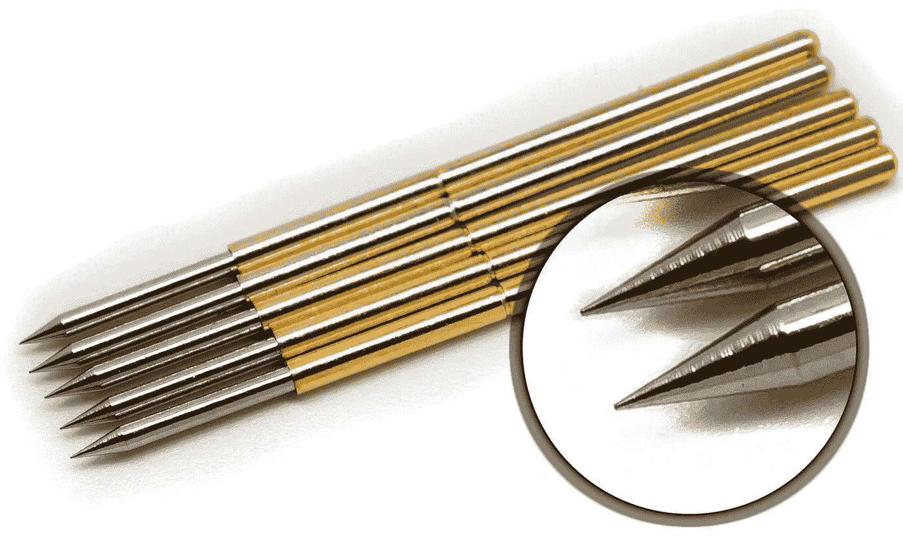
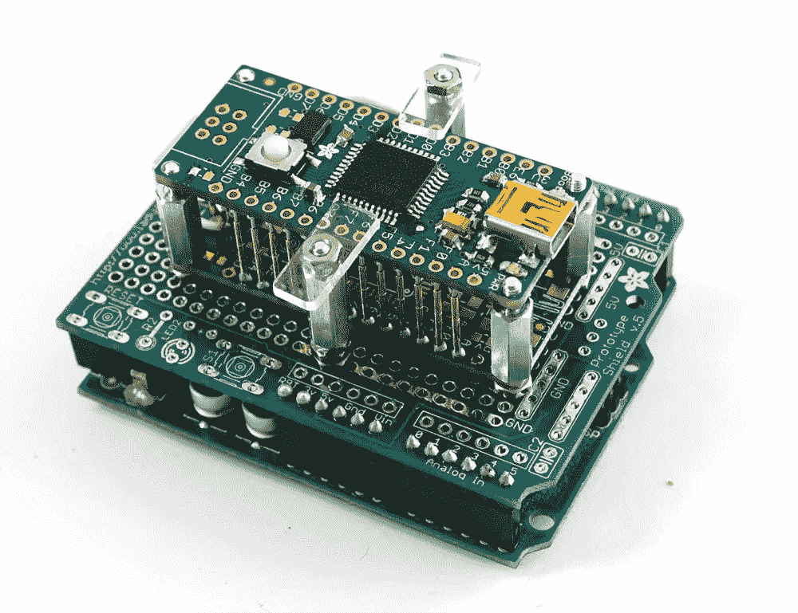
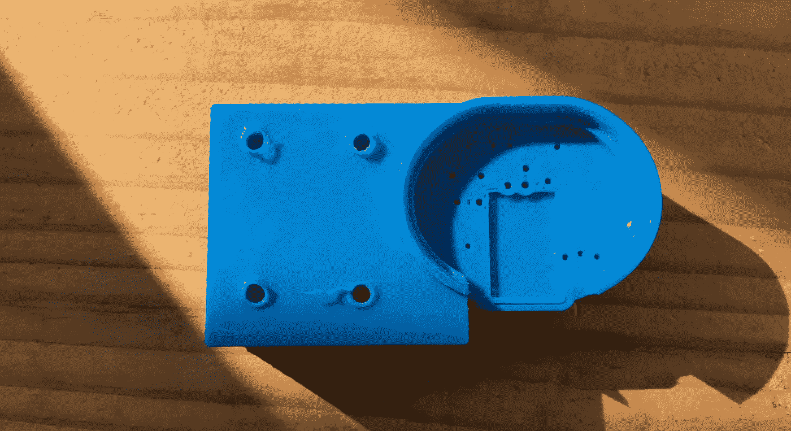
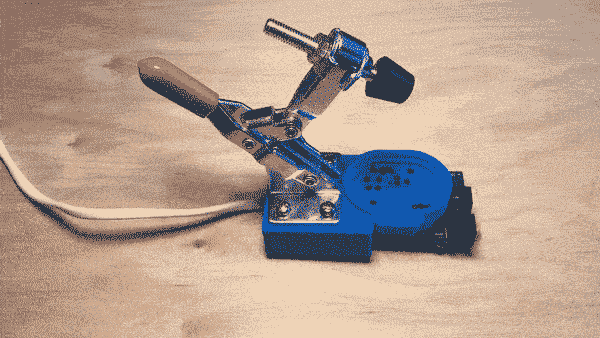
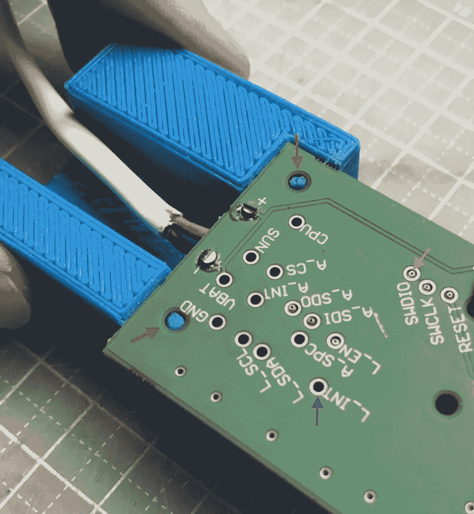
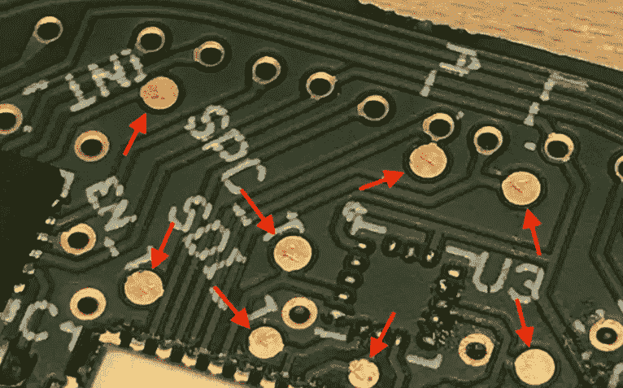
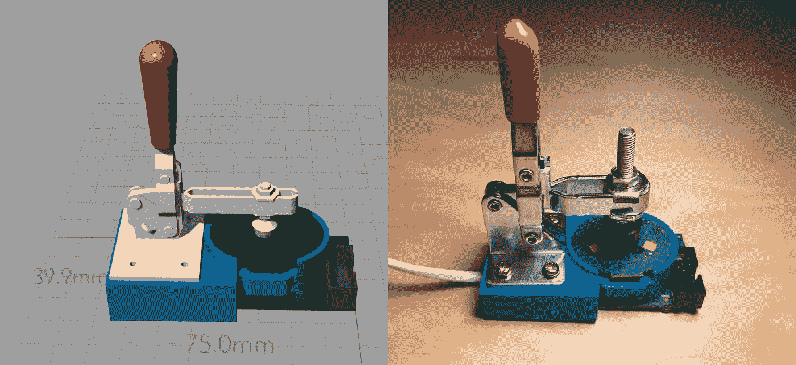
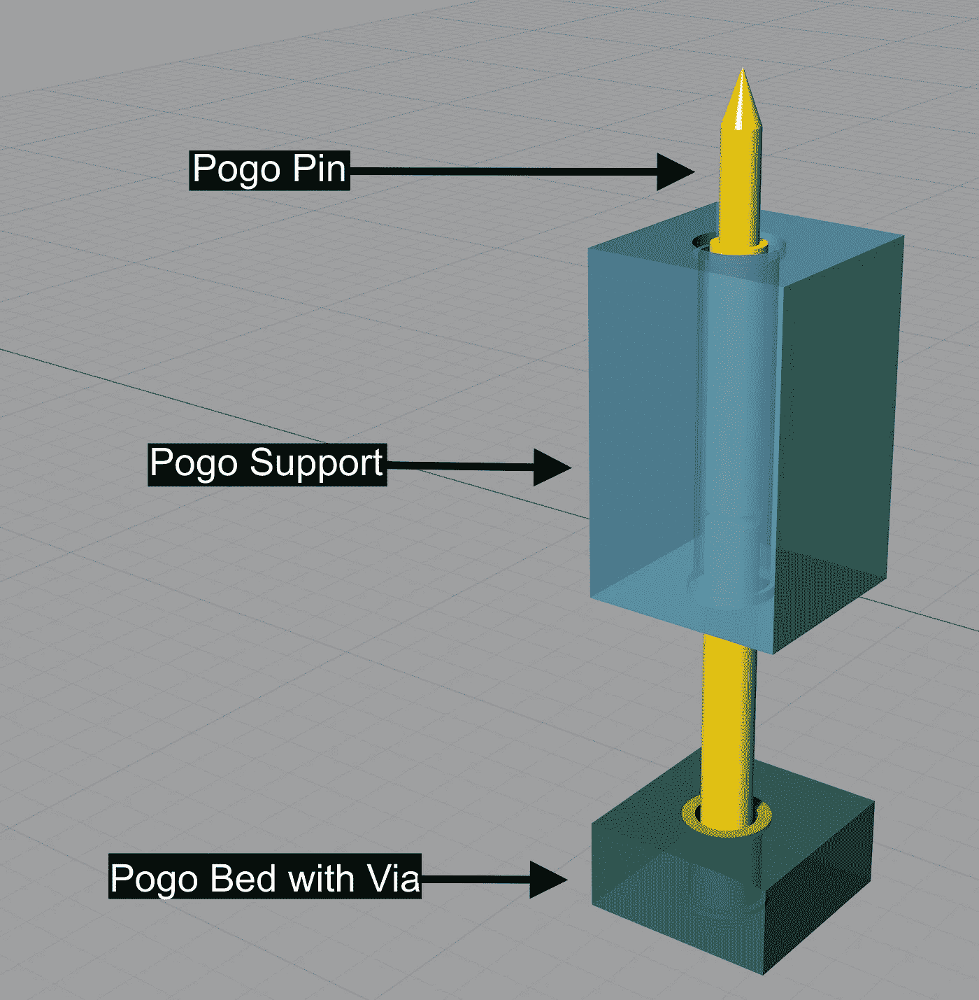

# 把你的弹簧跳汰机带到下一个层次

> 原文：<https://medium.com/hackernoon/take-your-pogo-jig-to-the-next-level-c016b483d6fc>

A pogo jig close up — made with a 3D printer

我们酝酿一个电子项目已经有一段时间了。自从我们进入 [SMD](https://en.wikipedia.org/wiki/Surface-mount_technology) 原型制作阶段以来，随着我们的原型尺寸越来越小，关于制作有效的测试/编程设置有许多问题。没有太多的空间来放置测试 led 或额外的螺丝孔之类的东西。

我们听说过 [*钉床*](https://www.allaboutcircuits.com/uploads/articles/bed_of_nails.png) ，但它似乎是一个只有大型工厂才能进入的花哨的工业设施。经过大量实验后，我们决定是时候更新我们的工艺并获得易于重现的精度了。

*注意:你会在本文末尾找到我们的 pogo 引脚设置设计文件，任何人都可以使用它，并制作自己的精密 pogo 夹具。*

# Pogo 什么？

pogo pins with spear heads. The notch in the middle of the shaft is typical of that sort of pins. Photo courtesy of [Tindie](https://www.tindie.com/products/upgradeindustries/10-pack-spear-tip-spring-loaded-pogo-test-pin-/)

[*弹簧针*](https://en.wikipedia.org/wiki/Pogo_pin) 已经有一段时间了，它们是整齐的，带弹簧的小针。弹簧针是很好的资源，只是有一个缺点:它们相对脆弱。

Pogo pin bent while trying too hard (by hand) to insert them in a jig

如果你还不熟悉它们，看看这些博客文章。大多数关于*弹簧针*的教程显示了或多或少相同的基本结构:1 块 PCB 板(弹簧床)连接有多组*弹簧针*，然后一块板(待测试/编程的那块)放置在*弹簧针*的顶部。两块板通过螺钉和埋头螺钉连接在一起。有时使用[肘节夹](https://www.adafruit.com/products/2459)。

This is a pogo jig of an arduino and a arduino shield (image courtesy of [Adafruit](https://learn.adafruit.com/how-to-make-a-pogo-pin-test-jig/overview))

通常，弹簧针的布局必须是规则的，遵循 PCB 上的网格或直线。我们希望从伸缩探针的尺寸中获益，以解放设计，并允许伸缩探针的不同排列。

此外，引脚和 PCB 之间的对准是通过手动或用螺丝将电路板固定在一起来完成的。不是很快或可重复的:(

# 局限性和乏味

无论这些教程有多好，都有一个密集的手工过程来将弹簧针焊接成直角，并且它们经常不能精确地对准所有的触点。

*   随着 PCB 变小，这种情况会变得更糟。它需要越来越多的关注，因为测试/编程设置本身变得小而脆弱。存在元件短路或误接触的风险。
*   测试 PCB 上的接触焊盘往往都被限制在一条直线上，以方便 pogo 对准，这进一步限制了 PCB 设计。
*   最大行程的 3 mm 弹簧针似乎被完全使用，导致当那些*弹簧针*被按压时[不稳定](https://www.adafruit.com/products/2459)插入:使用弹性*弹簧针*作为支撑不能提供稳定的保持。当弹簧针没有完全插入时，短路或针丢失是可能的，产生错误接触或永久损坏。

出于所有这些原因，我们决定寻找一种更安全的方法。

# 可扩展的解决方案

经过大量实验后，我们决定使用一台廉价的 3D 打印机来设计我们的精密 *pogo 夹具。*

这种迷你架构的功能就像一个三明治，中间是 3D 打印结构，插入了弹簧针。

3D 打印服务于 4 项任务:

*   容纳所有弹簧针的体积
*   一个供登机的地方
*   弹簧床的锚
*   一种用于肘节夹的夹具

An exploded view of the precision pogo jig. The space on the left is for a toggle clamp that is not represented in this image

组装实际上有 3 个步骤。这些步骤是:

*   将弹簧针插入 3D 打印
*   将弹簧针焊接到弹簧座上
*   安装一个肘节夹

放入测试板并夹紧测试板。测试板已准备好连接。现实世界看起来是这样的:

Pogo Jig in action! Note that the wire is our customized setup that isn’t required.

# 精密和 3D 打印

我们用于主板的[弹簧针](https://www.adafruit.com/products/2430)接近 0.091 英寸(2.3 毫米)。我们的打印机可以达到 0.055 英寸(1.4 毫米)的最小距离。这里的限制因素是打印机喷嘴。我们保留了标准的 0.4 毫米喷嘴，但如果有更好的打印机或简单的可以更换喷嘴的打印机，你可能会得到更好的结果。

您不必再担心引脚的位置，它们不需要在平面上均匀分布或对齐。3D 打印支架提供的支持不会限制测试焊盘在电路板上的放置。

# 弹簧引脚对齐

弹簧针可以用手穿过印刷插入。我们在每个孔中留了一个小空间(公差),这样它就可以贴合了。

Close-up of the pogo pins on the jig. The black marks were there to help us see the pogo holes :)

我们希望弹簧针保持在它们的位置，并保持与测试板上的焊点齐平。但是我们应该如何将它们排列在一起呢？

只需推动一根针，直到您看到金色部分从支架中露出来。我们包括了公差，所以这个操作不需要很精确。事实上，如果你看上面的图片，你会看到我们的一个引脚没有对齐。没关系，每个针移动 1 毫米，它们仍然会碰到目标。

当弹簧针就位时，其头部暴露在 3D 打印的支架之外。它拿得恰到好处，这样当夹具移动时，每个弹簧不会掉出来或倾斜。这种足够的紧密度是必不可少的，因为为了焊接弹簧针，我们需要翻转夹具。

# 焊接到 pogo 床上

弹簧座是一个 PCB，焊接有所有弹簧针。为了让支架和底座紧密结合，我们在支架上创建了锚点，并在 PCB 上创建了孔(见下图中的红色箭头)。这样，即使在焊接之前，两者也能很好地配合。孔锚间隙的公差为 0.004 英寸(0.1 毫米)。

在*弹簧座*上，有与*弹簧针*相匹配的过孔(电镀孔，用紫色箭头表示)。在下图中，只有一些过孔有弹簧针，你可以看到(图中的橙色箭头)这些引脚与表面齐平，它们的设计是为了留下一个小间隙用于焊接。

在焊接过程中，印刷支架不存在发热问题，因为焊接点远离印刷点，弹簧针本身是倒置的，避免了大部分热传导。

Blue pins (pointed by red arrows) are the anchor points to lock the 3D printed pogo holder. Yellow vias are for pogo pins, here are some already inserted (orange arrow) and waiting to be soldered, some aren’t yet inserted (purple arrow).

将所有引脚焊接到弹簧床上后，它实际上与支架不可分离。这个强度让我们感到惊讶，因为我们认为这将是系统的最薄弱环节。焊料的强度与固定器上的锁定锚相结合，使其成为一种坚固的装置。

# 精确打孔

对于长时间的编程/测试会话，安装一个肘节夹是很有用的。你可以用手按住你的电路板，因为它是连接的(我们试过，那很有趣)，但它只会有利于快速测试电路板。

我们添加了[一个从测试板中间向下压 0.039 英寸(1 毫米)的中型肘节夹](https://www.adafruit.com/products/2456)。有了它，我们可以连续几个小时交流和上传程序。如果你有运动传感器，你甚至可以摇动板子，它不会消失！

toggle action on the jig. The total board motion is only 1 mm

这种 0.039 英寸(1 毫米)的移动对于避免倾斜放置电路板的问题至关重要。较长的行程可能会导致引脚与其对应的焊盘不对准。

更短的行程也是可能的(0.5 毫米)，但这将使弹簧针的对准更加困难，电路板的放置更加复杂。我们在这里保持保守，但我们希望听到其他人的实验。

# 夹紧后的结果

在给我们的板加电之前，我们如上所述夹紧它，并嗯-夹紧它以检查测试垫:我们发现每个弹簧垫上都有小孔，其中大部分正好在中间！

test pads with scratch traces from pogo pins. Most are quite bang on

我们使用的测试垫直径介于 0.031 英寸(0.8 毫米)和 0.055 英寸(1.4 毫米)之间。如果您担心测试垫上的弹簧针划痕可能会导致重复使用的可靠性问题，可以使用平头或圆头弹簧针。

当我们启动夹具并测试电路板时，一切正常。包括小垫子。成功！在第一个工作夹具之后，我们印刷了更多，这样工作室的每个人都可以在几个小时内拥有自己的夹具。

# 期待与分享

The 3D model on the left, and the physical pogo jig on the right.

我们很高兴看到结果如何。正如你从上面的图片中看到的，计划的设置和实际的没有太大的区别。你可以使用任何 3D 建模软件来设计你的夹具(我们使用了 [Rhino](http://www.rhino3d.com/) )。该系统非常有弹性，3D 打印支架即使在夹具掉落时也能保护针脚。

最终，我们用设计工作取代了手工工作。这样，我们可以快速制作许多夹具，轻松修改和共享足够通用的模块，任何人都可以将它们用于自己的夹具。

这就是了，

Precision pogo pin jig module

一个 [**模块**](http://www.thingiverse.com/thing:2157755) 让你的*弹簧针*动起来。它包括:

*   弹簧针型号( [P75-B1](https://www.adafruit.com/products/2430) )
*   帮助弹簧针插入的公差对象(隐藏在上面的图片中)
*   用于弹簧插入间隙的边缘
*   pogo 支架将进行 3D 打印。
*   带有与这些引脚配合使用的正确过孔的 PCB 切口

上面显示的图片已经完成了所有的公差工作。有时打印机会弄脏弹簧针的入口点，因此我们在弹簧针支架的开始和结束位置都添加了一个轮圈。其他时候，你的 pogo 床板有自己的厚度。如果是这样，通孔的位置可以相应地移动/缩放。完整的说明包含在[下载页面](http://www.thingiverse.com/thing:2157755)的摘要部分，因此您可以根据需要进行更改。

# 超越这个项目

我们认为 3D 建模/打印带来的方法为电子设计和工程带来了有趣的解决方案。我们可以真正地跨学科工作:这是一个令人兴奋的制造东西的时代。

PCB 世界的一些限制(网格、2D、螺丝……)正在消失:这是相当自由的。在我们的设计中，更多的自由是通过将支持功能和电子功能联系起来而实现的，同时将它们分开。

这也意味着我们可以使用更少、更便宜、可回收的材料来完成同样的任务。所有这一切都发生在短短几个小时内。

我们希望其他人能丰富我们的分享。如果你自己制作，我们希望收到你的回复。尽情享受吧！

笔记

1: *该夹具的 3D 打印是用带有标准 0.4 毫米喷嘴的 FDM 3D 打印机进行的。我们的夹具用 PLA(长丝尺寸:1.75 mm)印刷，喷嘴温度为 210℃，床温度为 41℃。该设计以 0.2 层高印刷。在这个时间点上，市场上几乎任何 3D 打印机都应该能够产生这样的打印。我们用阿达·芬奇专业版进行了测试。*

> [黑客中午](http://bit.ly/Hackernoon)是黑客如何开始他们的下午。我们是 [@AMI](http://bit.ly/atAMIatAMI) 家庭的一员。我们现在[接受投稿](http://bit.ly/hackernoonsubmission)，并乐意[讨论广告&赞助](mailto:partners@amipublications.com)机会。
> 
> 如果你喜欢这个故事，我们推荐你阅读我们的[最新科技故事](http://bit.ly/hackernoonlatestt)和[趋势科技故事](https://hackernoon.com/trending)。直到下一次，不要把世界的现实想当然！

