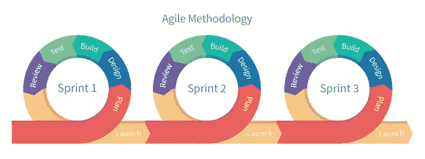
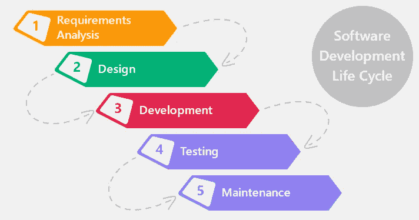

# 对新年计划采取灵活的方法

> 原文：<https://medium.com/hackernoon/taking-an-agile-approach-to-new-years-resolutions-10cde1081df5>

啊，是的！新年决心——每个人都有，而我们大多数人(包括我自己)经常不能遵守。今年我尝试了一种新方法，到目前为止，一切顺利。

如果你曾经参与过软件开发过程，你可能熟悉两种方法；[敏捷](https://hackernoon.com/tagged/agile)和瀑布开发。如果你还没有这里是一个快速运行下来:

## 敏捷

一种将工作限制在常规的、可重复的工作周期中的方法，通常被称为**冲刺**或迭代。这些冲刺是短暂的，通常由许多由三个主要部分组成的 ***用户故事*** 定义；角色、目标和目标的原因。例如:

> ***作为用户，我希望能够编辑我的个人资料，这样我就可以更新我的个人联系信息***

敏捷的美妙之处在于它允许短暂的增量里程碑、持续的反馈循环和迭代。构建应用程序的一部分，评估反馈，然后根据收到的反馈计划下一次冲刺。

## 瀑布

敏捷的宿敌叫做瀑布[开发](https://hackernoon.com/tagged/development)。它看起来有点像这样:

规划整个应用程序，构建，然后发布。如果你确切地知道你想要构建什么，这是非常好的，但是你经常不知道。瀑布不允许反馈和调整的空间。

典型的新年决心类似于使用瀑布构建的大型开发项目。它们通常是有固定路线图的大目标，无法适应不断变化的需求。

> 构建软件和追求你的目标是非常相似的，在这个过程中总会遇到障碍和意想不到的问题。

无论是新的请求(其他个人优先事项)、错误(你没有预见到的问题)还是需求的变化(你的目标可能会改变)，你都需要一个灵活的方法。敏捷允许这种能力，即在你朝着目标前进的过程中，利用短的迭代周期并在前进的过程中做出调整，来评估进展。

**我已经把我的新年决心分成了 3 个月的冲刺**列出了总体项目目标，然后是每个项目的具体冲刺，最后是适合这些冲刺的用户故事。在周期结束时，我会评估我的进展，并相应地计划下一次冲刺。

**新年决心/项目:**每周在媒体上发一篇帖子。

冲刺 1-写作:2017 年 1 月 1 日-3 月 31 日

为了实现这个目标，我需要花更多的时间来写作。我的用户故事不是针对最终目标，而是针对我需要做什么来实现这个目标。

***用户故事:*** *作为一名企业家，我希望能够每天早上 6 点醒来，这样我就可以有更多的时间来写作。*

请注意，这里有一个特定的任务以及完成该任务的原因。此外，用户故事为我实现目标创造了一个框架。这个周期很短，足以让我集中注意力。我能预见未来 3 个月，但很难想象一年后的情况。

事实上，在这一点上，我甚至不关心达成我的决心，我专注于当前的冲刺。一旦我完成冲刺，我会评估它的有效性。还值得追求吗？这个系统对我有用吗？我是否应该删除/添加一些东西以使其更有效？

我会在 3 个月后向你汇报，让你知道我做得怎么样。

直到下一次，

内特

*感谢阅读。如果你喜欢这篇文章，请点击*下面的*来帮助我。您可以关注我的*[*Twitter*](https://twitter.com/NateAndorsky)*并查看我的公司* [*创意科学实验室*](http://creativesci.co/) *。*

> [黑客中午](http://bit.ly/Hackernoon)是黑客如何开始他们的下午。我们是这个家庭的一员。我们现在[接受投稿](http://bit.ly/hackernoonsubmission)并乐意[讨论广告&赞助](mailto:partners@amipublications.com)机会。
> 
> 如果你喜欢这个故事，我们推荐你阅读我们的[最新科技故事](http://bit.ly/hackernoonlatestt)和[趋势科技故事](https://hackernoon.com/trending)。直到下一次，不要把世界的现实想当然！

