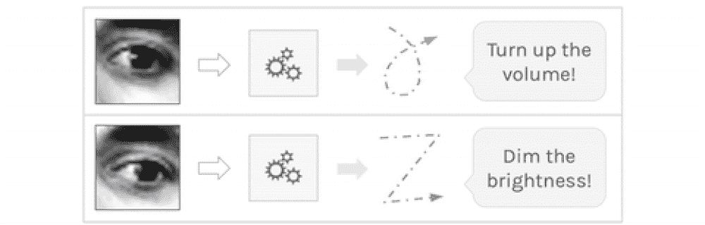
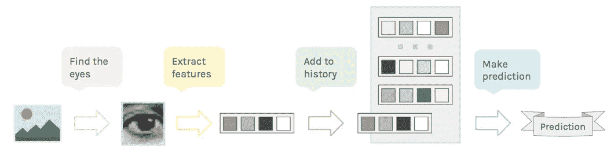
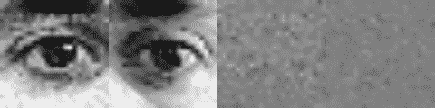
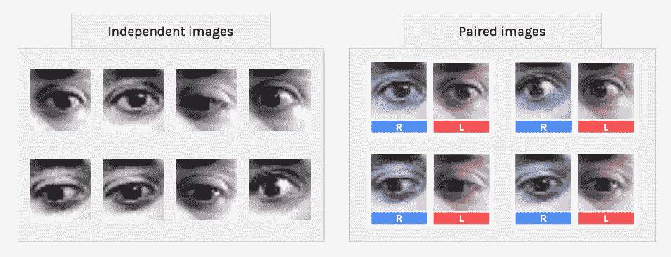
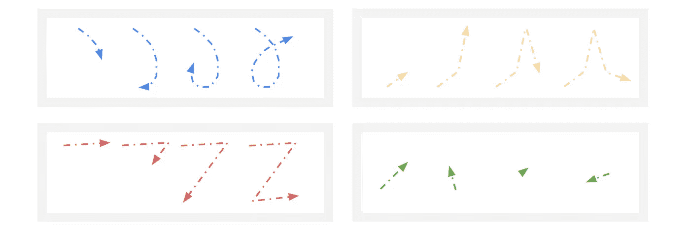
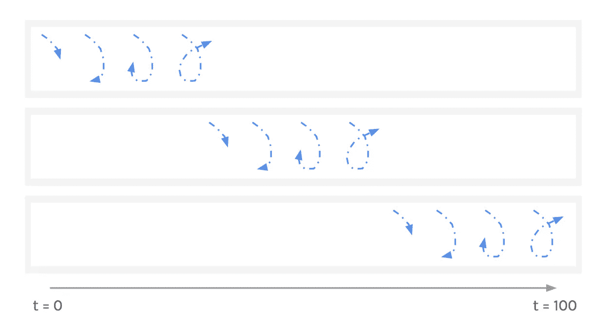
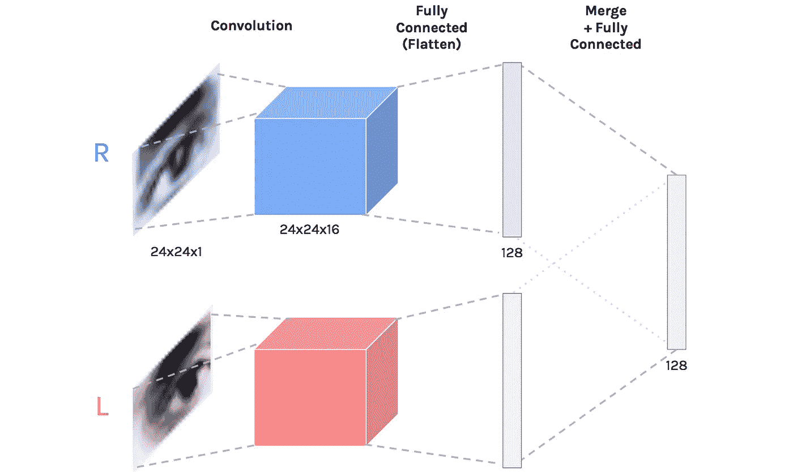
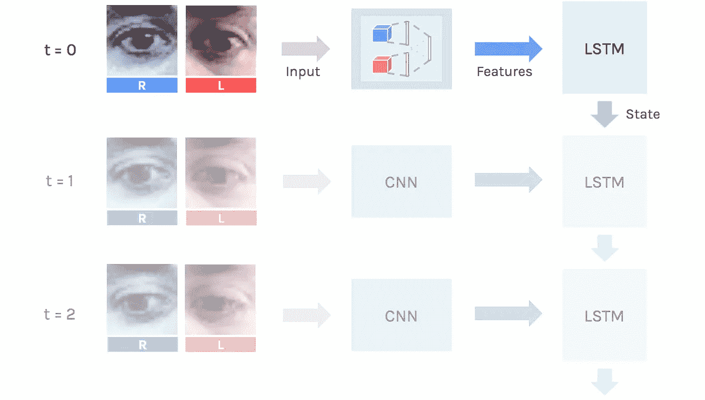
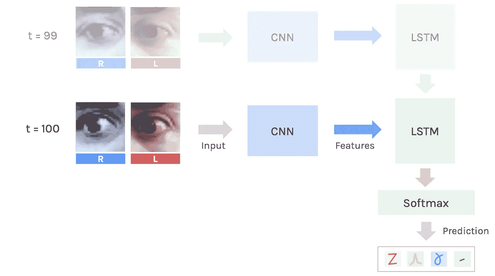

# 用你的眼睛和深度学习来指挥你的电脑——人工智能奥德赛部分。2

> 原文：<https://medium.com/hackernoon/talk-to-you-computer-with-you-eyes-and-deep-learning-a-i-odyssey-part-2-7d3405ab8be1>

What we’re going to build!

这一集:人脸检测，循环神经网络和更多。
*确保检查出* [***部分。1***](/@juliendespois/finding-the-genre-of-a-song-with-deep-learning-da8f59a61194#.r28dkpg2e)**太！**

> ****如果你喜欢人工智能，*** [***订阅时事通讯***](http://eepurl.com/cATXvT) ***接收文章更新等等！****

*你有没有发现自己在吃东西，却没有空闲的手来改变电影的音量？还是屏幕的亮度？我们将看到如何使用最先进的人工智能技术来解决这个问题，通过眼睛运动向计算机发送命令！*

****注:*** *看完这些，我邀请你去读一下* [*后续的帖子*](/@juliendespois/a-i-odyssey-part-2-implementation-details-f126f18bd320#.t4gpenon3) *专用于实现细节。**

# *介绍*

## *我们想要什么*

*这个项目的目标是用我们的眼睛在我们的电脑上触发动作。这是一个非常普遍的问题，所以我们需要指定*我们想要实现什么*。*

*例如，我们可以检测眼睛何时看向某个特定的角落，然后据此进行工作。然而，这是非常有限的，并不真正灵活，而且它需要我们硬编码的角落组合。相反，我们将使用**递归神经网络**来学习识别完整的眼球运动。*

## *数据*

*我们不会使用外部数据集，*我们将制作自己的*。这具有使用相同的源和处理来训练模型和进行预测的优点。*

*毫无疑问，从我们的眼睛中提取信息的最有效的方法是使用专用的特写镜头摄像机。有了这样的硬件，我们可以直接追踪瞳孔的中心，做各种新奇的事情。*

*我不想使用外部摄像头，所以我决定使用笔记本电脑上的好的*旧的 720p 网络摄像头*。*

## *管道*

*在我们直接跳到技术方面之前，让我们回顾一下这个过程的步骤。这是我想到的管道:*

*   *用网络摄像头拍照，找到眼睛*
*   *对图像进行预处理，提取重要特征*(你说神经网络？)**
*   *保持最近几帧提取特征的运行历史*
*   *基于历史预测当前的眼球运动*

**

*The pipeline we will use to process the images*

*我们将通过这些步骤来看看我们如何使这个工作。*

****言归正传！****

# *得到眼睛的照片*

## *寻找眼睛*

*直接从网络摄像头，我们开始下降采样图像，并将其转换为灰度(颜色通道是非常多余的)。这将使接下来的步骤更快，并有助于我们的模型实时运行。*

*对于探测部分，我们将使用[哈尔级联](http://docs.opencv.org/trunk/d7/d8b/tutorial_py_face_detection.html)，因为它们速度极快。通过一些调整，我们可以得到一些非常好的结果，但是试图直接检测眼睛会导致许多假阳性。为了摆脱这些，**我们并不试图在图像中寻找眼睛**，而是在图像中寻找人脸，然后**在人脸中寻找眼睛**。*

*一旦我们有了双眼的边界框，我们就可以从最初的全尺寸网络摄像头快照中提取图像，这样我们就不会丢失任何信息。*

## *数据预处理*

*一旦我们找到了两只眼睛，我们需要为我们的数据集处理它们。要做到这一点，我们可以简单地将两者调整为固定的大小——正方形，24px——并使用[直方图归一化](https://en.wikipedia.org/wiki/Histogram_equalization)来消除阴影。*

*然后我们可以直接使用标准化的图片作为输入，但是我们有机会在这里做更多的工作。我们不使用眼睛图像，而是计算当前*帧*和前一帧*中眼睛之间的**差异**。这是一种非常有效的运动编码方式，这也是我们最终所需要的。**

*** *注意，对于下面除 GIF 以外的所有图，我将用眼睛图片来表示眼睛差异，因为差异在屏幕上看起来很糟糕。****

**

*Comparison between normalized frames and frame differences*

*现在我们已经处理了两只眼睛，我们可以选择**将它们分别**作为同一类的两个代表，**或者将它们一起使用，就像它们是一个单一的图像*。我选择了后者，因为即使眼睛应该遵循完全相同的运动，拥有两个输入将使模型更加健壮。***

*我们要做的比简单地把图像拼接在一起更聪明一些。*

**

*Paring both eyes together*

# *创建数据集*

## ****录音****

*我已经记录了两个独立运动的 50 个样本(一个看起来像“ **gamma** ”，另一个看起来像“ **Z** ”)。我试图改变样本的位置、比例和速度，以帮助模型进行归纳。我还添加了 50 个“**闲置**”的例子，其中包含了大致通用的无模式眼球运动以及静止帧。*

**

*Motion examples — ‘gamma’, ‘mount’, ‘Z’, ‘idle’*

*不幸的是， **150 个样本对于这样的任务**来说太少了，所以我们需要**用新的样本来扩充**数据集。*

## *数据扩充*

*我们可以做的第一件事是固定一个任意长度的*序列——100 帧。从那里，我们可以**减慢较短的样本**和**加速较长的样本。这是可能的，因为速度并不能定义运动。****

*此外，因为短于 100 帧的序列**应在 100 帧窗口中的任何时间**在**被检测，我们可以添加*填充的*示例*。****

**

*Sliding window padding for samples shorter than 100 frames*

*利用这些技术，我们可以将数据集扩充到大约 1000–2000 个示例。*

## ***最终数据集***

*让我们后退一步，试着理解我们的数据。我们已经记录了一些带有相应标签的样品。这些样本中的每一个都是一系列两个 24px 宽的正方形图像。*

**注意，我们每只眼睛都有一个数据集。**

**

*Tensor description of the dataset*

# *模型*

*现在我们有了数据集，我们需要建立正确的模型来从这些数据中学习和归纳。我们可以把它的规格写成如下:*

> *我们的模型应该能够在每个时间步从两幅图像中提取信息，结合这些特征来预测眼睛执行的运动。*

*如此复杂的系统需要使用强大的人工智能模型— **神经网络**。让我们看看如何建立一个满足我们需要的。神经网络层就像乐高积木，我们只需选择**正确的砖块**并将它们放在**正确的位置**。*

## *视觉特征—卷积神经网络*

*为了从图像中提取信息，我们需要 [*卷积层*](https://ujjwalkarn.me/2016/08/11/intuitive-explanation-convnets/) 。这些特别擅长处理图像以挤出视觉特征。*(嘶！我们已经在* [*部分看到了这一点。1*](/@juliendespois/finding-the-genre-of-a-song-with-deep-learning-da8f59a61194#.r28dkpg2e) *)**

*我们需要分别对待每只眼睛，然后通过一个*全连通层*来合并特征。由此产生的卷积神经网络( *CNN* )将学习从一双双眼睛中提取相关知识。*

**

*Convolutional Neural Network — Two parallel convolutional layers extract visual features, which are then merged*

## *时间特征—递归神经网络*

*现在我们有了图像的简单表示，我们需要一些东西来顺序处理它们。为此，我们将使用一个 [*轮回层*](http://karpathy.github.io/2015/05/21/rnn-effectiveness/)——即 [*长短期记忆*](http://colah.github.io/posts/2015-08-Understanding-LSTMs/) 细胞。LSTM 使用在当前时间步**提取的特征**和它自己的先前状态来更新它的*状态*。*

*最后，当我们已经处理了整个图像序列时，LSTM 的状态然后被馈送到 *softmax 分类器*以预测每个运动的概率。*

## *全模型*

*看看我们最终的神经网络，它将一系列图像对作为输入，并输出每个运动的概率。这里**至关重要的**是，我们在一个单独的部件中建立模型，因此它可以通过*反向传播*进行端到端的**训练。***

> *想象一下，我们可以说这是一个双重深度卷积 LSTM 递归神经网络，但没有人这么说。*

****

*The CNN extracts visual features from the input, which are processed at each step by the LSTM*

# *结果*

*经过训练的模型在测试集上达到了 **85+%** **的准确率**。考虑到增强之前的训练集非常小，这是非常好的。有了更多的时间*和投入，*我可以每节课记录至少 100-200 个例子，也许 3-4 个动作而不是 2 个(*+空闲*)。这肯定会提高性能。*

*唯一剩下的步骤是实时使用分类器，调整它以避免误报，并实现逻辑来触发操作(改变音量，打开应用程序，运行宏等)。).更多信息请见[后续文章](/@juliendespois/a-i-odyssey-part-2-implementation-details-f126f18bd320#.9h95p31fs)。*

# *结论*

*在这篇文章中，我们已经看到了如何使用 *HAAR cascades* 来找到图片上的眼睛，如何清理图像，以及如何使用*图像差异*来帮助与运动相关的项目。*

*我们还看到了如何人工增加数据集的大小，以及如何通过组装*卷积*、*全连接*和*递归*层，使用深度神经网络来拟合数据集。*

*我希望你喜欢这个项目，我很高兴听到你的反馈！*

> ****如果你喜欢人工智能，*** [***订阅时事通讯***](http://eepurl.com/cATXvT) ***接收文章和更多更新！****

# *附加条款—代码和实施细节*

*如果你感兴趣，我会更详细地介绍这个项目的实施选择和问题(模型选择，眼球追踪等)。)[此处](/@juliendespois/a-i-odyssey-part-2-implementation-details-f126f18bd320#.yt5mfeyx5)。*

*你可以玩那边的代码:*

* [## GitHub-despisj/DeepEyeControl:用眼睛触发电脑上的快捷键

### 用眼睛触发电脑上的快捷键。阅读介质要求安装:创建文件夹…

github.com](https://github.com/despoisj/DeepEyeControl) 

感谢阅读这篇文章，敬请关注！

> [黑客中午](http://bit.ly/Hackernoon)是黑客如何开始他们的下午。我们是 AMI 家庭的一员。我们现在[接受投稿](http://bit.ly/hackernoonsubmission)并乐意[讨论广告&赞助](mailto:partners@amipublications.com)机会。
> 
> 如果你喜欢这个故事，我们推荐你阅读我们的[最新科技故事](http://bit.ly/hackernoonlatestt)和[趋势科技故事](https://hackernoon.com/trending)。直到下一次，不要把世界的现实想当然！

*