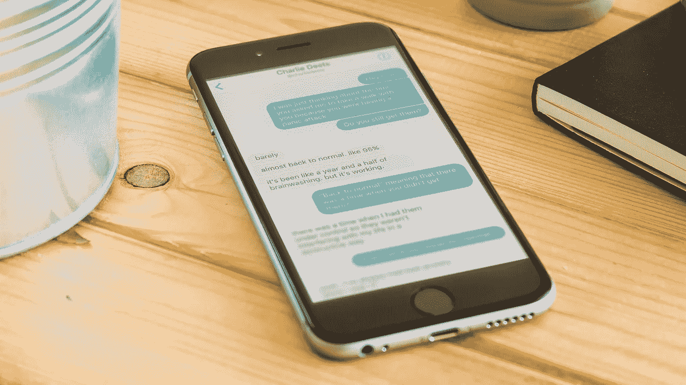
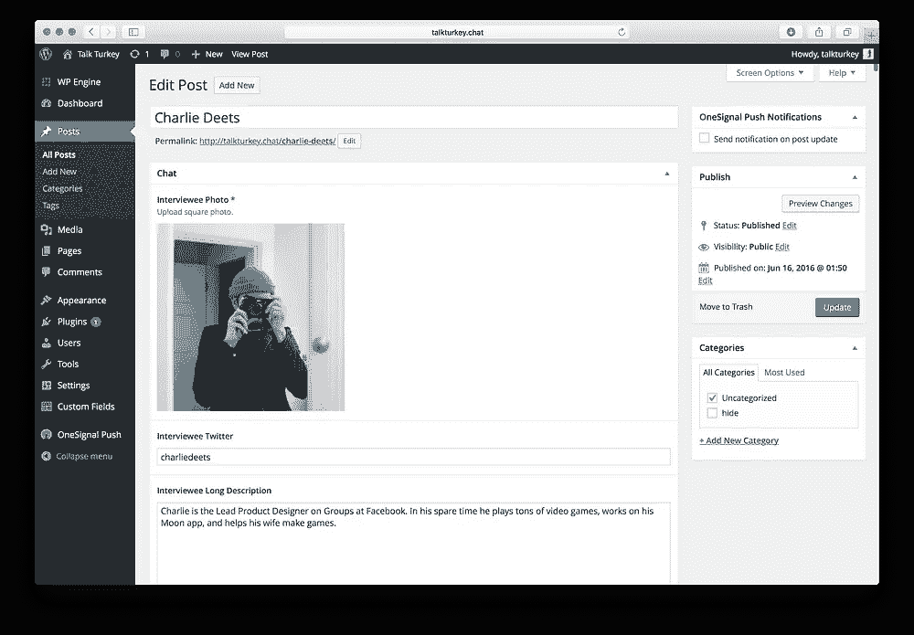
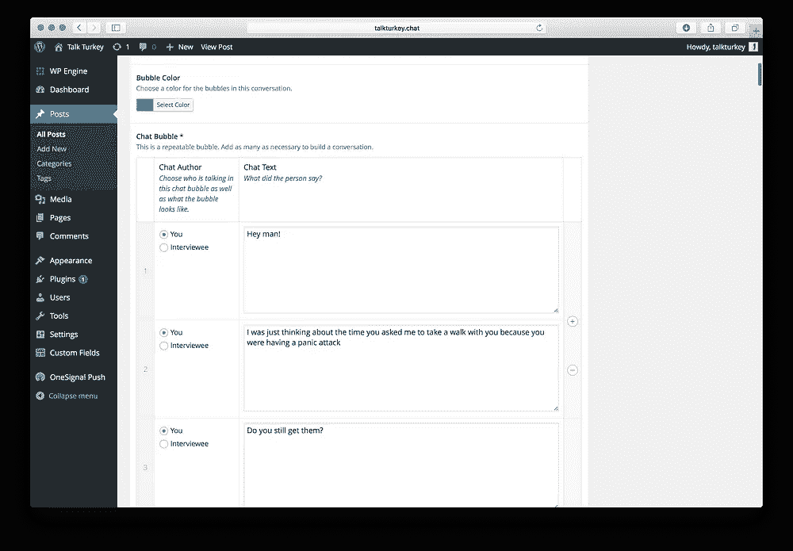
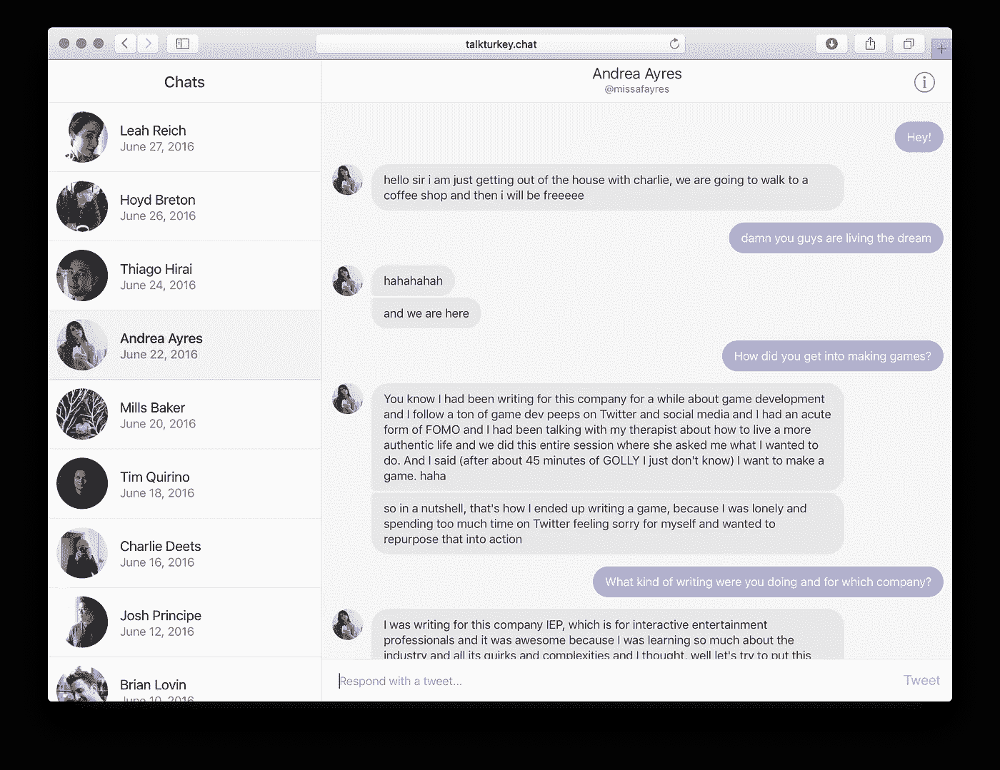

# 为土耳其定制 WordPress

> 原文：<https://medium.com/hackernoon/talk-turkey-8d6a2a3d0ff3>

我的好朋友 Gabriel Valdivia 有一个很好的主意，可以做一些访谈，让人们尽可能的诚实和坦率，然后以同样的形式呈现对话。

我认为这很棒，所以我帮他建立了一个[网站](http://talkturkey.chat)，它的行为和感觉就像一个聊天应用程序，你可以在那里浏览采访。我们对细节很感兴趣，所以我想在这里分享一些:

The custom input system for conversations in WordPress

1.  人们似乎对这个网站运行在 [WordPress](http://wordpress.org) 上感到惊讶。秘诀是[高级定制字段](https://www.advancedcustomfields.com)。我们精心制作了一个后端，允许 Gabe 完全管理采访，并相应地定制相关信息。聊天气泡是重复字段，Gabe[只需在进入对话时选择发表评论的是他自己还是受访者。](https://hackernoon.com/tagged/gabe)
2.  该主题是响应性的，完全自定义，基于[下划线](http://underscores.me)起始模板。Gabe 用 HTML 和 CSS 设计了一个前端，我们把代码转换成了 WordPress PHP 模板。在手机上，你登陆到对话列表视图，当你登陆到一个大的桌面屏幕时，信息面板是预先展开的，等等。
3.  聊天气泡会根据前后出现的气泡自动传播成正确的形状。有四种类型的气泡:初始气泡、闭合气泡、持续气泡和单个气泡。重要的是让这一步自动化，而不是为 WordPress 后端的每个气泡做这个选择。
4.  Gabe 可以从 WordPress 的颜色选择器界面中选择每个采访的颜色。他通常以受访者 Twitter 个人资料的原色为基础。
5.  该网站在每次聊天结束时都会有一个阅读计数，这在公共场合变得有点有趣。我们使用了一个名为 [WordPress Post View](https://wordpress.org/plugins/wp-post-view/) 的插件，并根据我们的需求对其进行了修改。
6.  如果你在文章中间离开网站，浏览器标签会提示你有新消息，直到你完成文章。这个实现是自定义的 JavaScript。我们检测窗口焦点何时丢失。当您的滚动位置将页面的结尾带入视野时，我们会停止激活提醒您的功能。
7.  第 404 页正是你所期待的。查看它在移动和桌面上的反应。
8.  如果你回复了这条消息，你实际上是在给文章的作者发推文。我们通过 PHP 将共享 url 与受访者 Twitter 名称的自定义字段进行传播，以及您通过 JavaScript 在编辑器中输入的任何内容。
9.  您可以使用向上和向下箭头在任何视图中的对话之间移动。你也可以点击回车键开始撰写推文。这些命令使用 jQuery 的 keydown 函数。
10.  另一个插件黑客使用[标记新帖子](https://wordpress.org/plugins/mark-new-posts/)来创建一个未读指示器，当你上次访问后网站上有新的对话时。
11.  我们使用 [OneSignal](https://onesignal.com) 为新文章添加了浏览器推送通知，这似乎是让文章尽快上线运行的最简单方法。

Talk Turkey launch look

里面还有一些其他有趣的东西，但我会让你自己去找。我们的下一步是完全自动化将对话转移到 WordPress 的过程。

本周，加布还与合作设计公司的麦智信坐下来谈了谈体验。我们帮助他们将与 Gabe 在 Talk Turkey 上的聊天嵌入到文章中。超级酷。

查看[网站](http://talkturkey.chat/)，这里有真正有趣的关于[真实性](http://talkturkey.chat/leah-reich/)、[焦虑](http://talkturkey.chat/charlie-deets/)、[心碎](http://talkturkey.chat/tim-quirino/)等内容！

—

在推特[或脸书](https://twitter.com/charliedeets)上关注我。

> [黑客中午](http://bit.ly/Hackernoon)是黑客如何开始他们的下午。我们是 [@AMI](http://bit.ly/atAMIatAMI) 家庭的一员。我们现在[接受投稿](http://bit.ly/hackernoonsubmission)，并乐意[讨论广告&赞助](mailto:partners@amipublications.com)机会。
> 
> 如果你喜欢这个故事，我们推荐你阅读我们的[最新科技故事](http://bit.ly/hackernoonlatestt)和[趋势科技故事](https://hackernoon.com/trending)。直到下一次，不要把世界的现实想当然！

