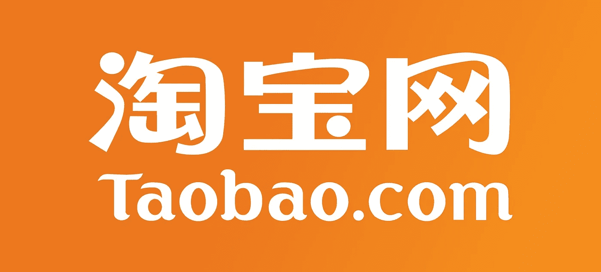
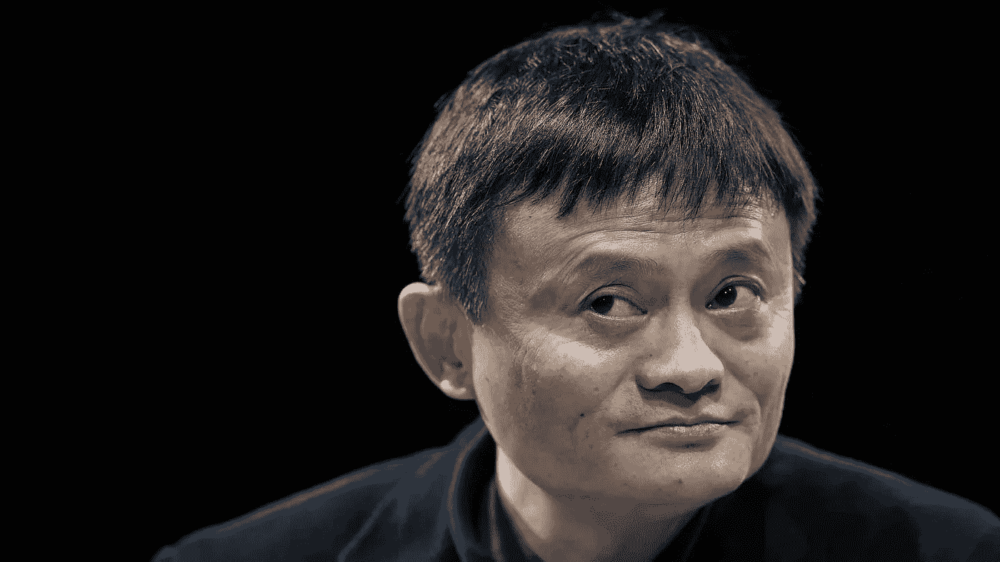
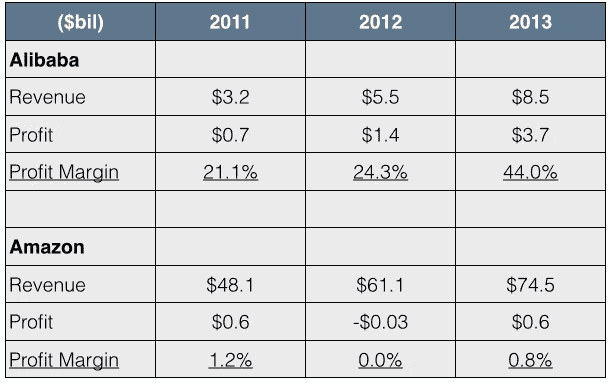
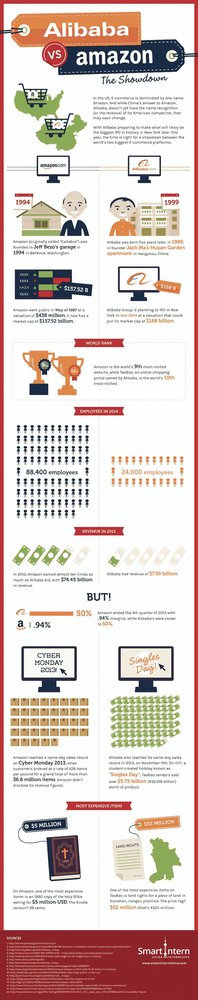

# 淘宝商城

> 原文：<https://medium.com/hackernoon/taobao-marketplace-c7797581af6a>

那是 1994 年。来自中国杭州的英语教师马云听说了互联网，设法飞到美国亲自体验了一番。1995 年，杰克创办了自己的网站开发公司。1999 年，他创建了阿里巴巴，一个连接西方企业和中国制造商的 B2B 市场。

今天，阿里巴巴成长为一个年收入 150 亿美元的集团。马云是中国首富，估计净资产为 240 亿美元。

> “我们的提议很简单:我们希望通过互联网[技术](https://hackernoon.com/tagged/technology)解决小企业的问题，从而帮助它们成长。我们为小人物而战。自 1999 年成立以来，我们已经帮助数百万小企业实现了更光明的[未来](https://hackernoon.com/tagged/future)

阿里巴巴集团超过 80%的财富来自他们在中国的电子商务平台。

淘宝成立于 2003 年，是一个面向小商户的免费市场，在这里，卖家和买家都不会因为完成交易而被收取费用。淘宝上有近 700 万活跃卖家，他们付费在该网站的内部搜索引擎上获得更高的排名，这为阿里巴巴带来了类似于谷歌核心商业模式的广告收入。

淘宝总监张宇表示，2011 年至 2013 年间，淘宝上年销售额低于 1.5 万美元的店铺数量增长了 60%。同期，销售额在 1.5 万美元至 15 万美元之间的商店数量增加了 30%，销售额超过 15 万美元的商店数量增加了 33%。

[https://youtu.be/XfivA1HvHZY](https://youtu.be/XfivA1HvHZY)

2008 年，阿里巴巴集团推出了面向大型企业和品牌的平台[天猫](https://www.tmall.com)(淘宝商城)。与亚马逊不同，天猫本身并不直接销售商品，但它为买家和卖家之间的交易提供便利。在这种情况下，阿里巴巴收取 2%至 5%的佣金，其商业模式接近 AirBnB，后者成为最大的连锁酒店，但没有拥有一家酒店。

总体而言，淘宝和天猫占中国网上购物总量的 80%，2013 年利润为 44%，相比之下，亚马逊同年的利润仅为 0.8%。

*阿里巴巴自己不卖产品。相反，他们提供了一个方便商品交换的网络平台。他们是世界上最大的电子商务公司，但他们实际上更像一个软件公司而不是商店。软件往往比仓库更容易扩展。*

此外，阿里巴巴明白，它的成功取决于卖家的成功。2007 年，他们成立了自己的咨询公司 Alimama，为卖家提供一系列服务，如客户细分、产品定位、营销活动等。

> 我们认为，将传统业务纯粹放在网上，这不叫电子商务。在未来，商业不会因为规模而赚钱，而是因为创造的价值——不同的价值。(……)我查了一下亚马逊。他们有 520 亿美元，但他们仍然不赚钱，所以“规模”没有任何意义。马云

> [黑客中午](http://bit.ly/Hackernoon)是黑客如何开始他们的下午。我们是 [@AMI](http://bit.ly/atAMIatAMI) 家庭的一员。我们现在[接受投稿](http://bit.ly/hackernoonsubmission)，并乐意[讨论广告&赞助](mailto:partners@amipublications.com)机会。
> 
> 如果你喜欢这个故事，我们推荐你阅读我们的[最新科技故事](http://bit.ly/hackernoonlatestt)和[趋势科技故事](https://hackernoon.com/trending)。直到下一次，不要把世界的现实想当然！

