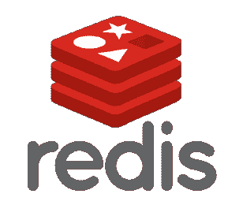

# 塔兰托尔 vs 雷迪斯

> 原文：<https://medium.com/hackernoon/tarantool-vs-redis-38a4041cc4bc>

嘿伙计们，

这是列昂尼德·尤里耶夫的一篇文章的英文翻译，最初发表在 https://www.facebook.com/leo.yuriev/posts/553318381522430?脸书 pnref=story 。

帖子讲的是 Leonid 同时使用 Tarantool 和 Redis 的经历。这仅仅是开始。更多文章即将发表。所以让我们开始:-)

作为我工作的一部分，我比较了来自 Redis 实验室的 Tarantool 和 Redis。

以下是一些中间结果。

1.  开发团队可用性

科斯特贾·奥西波夫和塔兰图尔团队的伙计们随时待命。

2.Lua 的支持

长话短说，Tarantool 是一个真正的 Lua 应用服务器，而 Redis 只能用局部变量运行 Lua 函数。

详细地说:

塔兰托尔

*   Tarantool 有一个带有 JIT 的全功能 Lua 引擎，它与[数据库](https://hackernoon.com/tagged/database)集成在一起，并具有嵌入式纤程支持。
*   对于大多数阻塞 libc 函数，Tarantool 的 Lua 实现有交换纤程的对应物。
*   你可以编写并运行一个全功能服务，它可以使用任何 Lua 库，使用[网络](https://hackernoon.com/tagged/network)，获取并处理内部请求，连接到外部服务。
*   存储过程和触发器只是存在，并按照它们应该的方式工作，包括你可以用 C 编写它们并作为共享库加载它们。
*   您可以轻松地更新/重新加载所有 Lua 函数，甚至无需重启服务器。

雷迪斯

*   Lua 解释器生活在一个沙箱中，只适合简单的脚本编写(只有纯函数和局部变量)。
*   您可以通过 EVAL 完成一个脚本，或者通过 EVALSHA 加载并稍后启动它。
*   Redis 本身只能通过本地连接器从脚本中获得。
*   在 Redis 的最新版本中，你可以用 c 编写模块/插件。

3.持续

Redis 专注于内存处理，可以定期或停止备份数据。另一方面，Tarantool 可以在磁盘上持续保存数据。

Tarantool:除了快照，它还有一个全面的 WAL(预写日志)。因此，它可以在每次开箱即用的交易后确保数据的持久性。

Redis:事实上，它只有快照。从技术上讲，您有 AOF(仅附加文件，所有操作都写入其中)，但它需要手动控制，包括重新启动后的手动恢复。简而言之，使用 Redis，您需要不时地手动暂停服务器，制作快照并归档 AOF。

4.延迟和吞吐量

在 Tarantool 中，您有专门的线程来处理网络和写入磁盘。这就是为什么你在现实生活中有更好的延迟。但是在合成测试中，Redis 应该有更好的吞吐量，因为在上下文切换和线程同步上没有使用 CPU。

5.指数

Tarantool 有二级索引，包括地理空间索引(R-TREE)。

Redis 没有二级索引，但是您可以通过几个操作或 Lua 脚本来模拟它们。有时候看起来很恶心。详情见此:[http://redis.io/topics/indexes](http://l.facebook.com/l.php?u=http%3A%2F%2Fredis.io%2Ftopics%2Findexes&h=8AQHWLdY4AQH70t1kNg0gh6CCGsD2z74ZQ3u_egCs4C_oOA&enc=AZMjpJ5DPjNMDKdTvVU7nRf_4fViwrMmbAlqGlLnJV5NmbDF6ue6Cdmb-ZeTfQTW88DNVAObeRas6lJblJ-wTuL-T7WG2tEkMTxxuogkIO7c5yb2K19zuJGDDhAzJWS23q40YoBWyi5s_YM4zzYctnk8cw9rMKhj9xww6uOzANZPRgVEUNNV_VV_oazEYwA9Od2K2_kKFOVb1xK7V7AXDZPO&s=1)

6.外部 API

Redis 为列表、集合、哈希表等基本数据结构提供了简单的接口。那些接口方法基于通过网络访问对象/结构的概念，这对于大多数人来说是直观的。

Tarantool 有一个更通用的数据操作接口，它支持上述所有功能。

7.集群化和复制

Redis 有现成的带复制和故障转移的 Sentinel。

Tarantool 具有复制功能，包括主-主，但没有集群或本机故障转移的内在编排(Tarantool 开发者称这正在进行中)。

8.数据库大小

Tarantool 有一个全新的存储引擎，名为“vinyl”(还没有正式发布，但是你已经可以尝试了)。它允许你存储和处理不适合你的内存的数据。

Redis 只有一个内存引擎，目前还没有其他计划。

9.结构化查询语言

Tarantool: SQL 支持即将推出(基于 sqlite 的一个分支)，包括 ODBC/JDBC。选择操作已经实现。你可以试试。

Redis:目前没有 SQL 支持，甚至在计划中也没有。

附言

如果你渴望绝对的客观主义，那么你应该知道上面的比较包含一些不准确之处。
然而，试图消除它们需要大量无法客观比较的细节。

感谢您的阅读。如果你想在上面所说的基础上增加一些东西或者澄清它，请随意发表评论。

> [黑客中午](http://bit.ly/Hackernoon)是黑客如何开始他们的下午。我们是 [@AMI](http://bit.ly/atAMIatAMI) 家庭的一员。我们现在[接受投稿](http://bit.ly/hackernoonsubmission)并乐意[讨论广告&赞助](mailto:partners@amipublications.com)机会。
> 
> 如果你喜欢这个故事，我们推荐你阅读我们的[最新科技故事](http://bit.ly/hackernoonlatestt)和[趋势科技故事](https://hackernoon.com/trending)。直到下一次，不要把世界的现实想当然！

