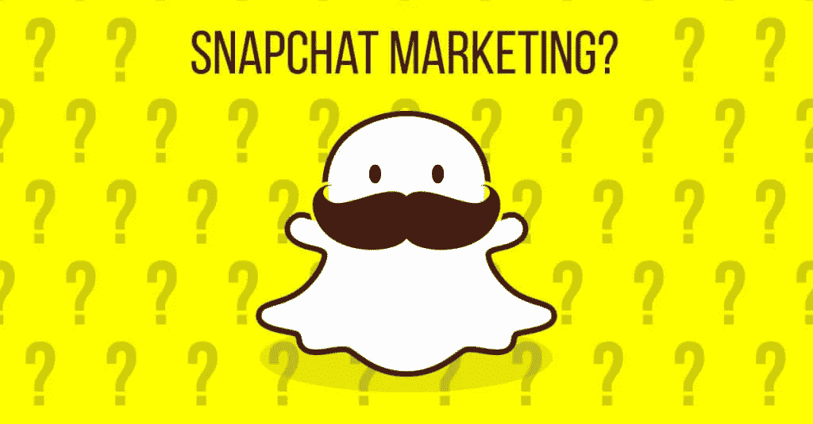

# 针对千禧一代？Snapchat 是你的营销策略！

> 原文：<https://medium.com/hackernoon/targeting-millennials-snapchat-is-your-marketing-strategy-53889e2da132>

Photo source [www.adespresso.com](http://www.adespresso.com)

你有兴趣探索如何接触年轻观众的方法吗？你有没有想过在你的业务中使用 [Snapchat](http://www.snapchat.com/) ？随着**视觉信息**近年来变得越来越受欢迎，通过科技设备的交流已经提升到一个全新的水平。这就是 [Snapchat](https://hackernoon.com/tagged/snapchat) 介入的地方！

**Snapchat** 你可能已经听说过，它是目前最受欢迎的社交(消息)平台之一，可以在全球范围内实现快速高效的沟通。我们中的许多人，尤其是中年一代，对此会耸耸肩，说“哼！”。\_(ツ)_/

然而，只要看看 Snapchat 在短短三年内取得的成就，就很容易理解它的影响力。Snapchat 在 2016 年成为**主流消息平台，并成功地每月增加用户数量。例如，2016 年 9 月，Snapchat 用户数量增长到**1.5 亿活跃用户**，每秒钟**分享 9.000 张快照**。想象一下！甚至脸书也将 Snapchat 视为潜在的资金助推器，这导致了 Snapchat 创始人不幸(或幸运地)拒绝了 30 亿美元的报价。**

# Snapchat 的工作原理

关于 Snapchat 要记住的第一件事是帖子的持续时间有限。别人只能在几秒钟内看到发布的视频或照片。用户可以选择 1 到 10 秒的持续时间，但请记住，持续时间结束后，它将永远消失。这对营销人员来说也是一个挑战——如何在仅仅 10 秒内获得关注？此外，Snapchat 过滤器是目前最受欢迎的功能(甚至脸书现在也在复制/粘贴这一功能)，三个编辑工具使用户能够设计有趣的帖子，并迅速获得一些关注。

过滤器包括地理位置，时间，速度，温度，颜色和有趣的变脸。还有一种有各种颜色的铅笔，可以帮助用户创建一个有趣的艺术作品。当然，如果没有在上面写东西的选项，会有什么类型的帖子呢？因此，使用工具“Type”个性化消息是另一个有趣的工具。到目前为止，发信息从未如此有趣，这就是为什么用户可以找到一个选项来与朋友聊天，而不用发送照片或视频。这和 Snapchat 上的其他东西一样，也是有时间限制的。一旦用户离开聊天，除非被保存，否则消息会很糟糕。

那么，如何开始使用 Snapchat 进行数字活动呢？

# 抢购您的活动

使用 Snapchat 的最好方法之一是创建**现场事件**并引发观众的兴趣。直播活动为不在现场的其他人提供了一个机会，让他们从自己的客厅参与到活动中来。如果你正在计划一个活动，或者如果你的生意都是关于活动的，这是特别有趣的。想象一下，将有趣的高峰发布到其他人看不到的现场活动中，即使在场的人也看不到。这听起来不像是对那些在 Snapchat 上关注你的人的特殊对待吗？确实如此。

以 **MTV 2015 VMA 奖**为例。当 [MTV 在 Snapchat](http://adage.com/article/media/mtv-expects-lots-snapchatting-vmas-taco-bell/305591/) 上发布直播故事，分享红地毯上的直播视频和照片时，他们统计到了 1200 万次观看！MTV 做了什么？它提供了流行活动期间最受欢迎的名人的独家观点。这不仅帮助他们宣传了他们的活动，还帮助他们领先于所有其他媒体五步，这些媒体最终会在几分钟或几小时后(通过社交媒体和新闻)告知活动的发生。

# 推销自己活(和聪明！)

Snapchat 是目前在线销售业务最有效的方式之一。忘记那些无效的广告，恼人的吹嘘和令人厌恶的炫耀方式。Snapchat 提供了一个独一无二的机会，让我们真正地说*嘿，我们玩吧！*并将其转化为企业的个性化广告。

我发现的最新例子之一是阿诺德·施瓦辛格的《终结者:Genisys》电影[的推广。用户被给予一个终结者过滤器，将它放在他们的图片或视频上，让自己看起来像电影英雄。当然，对 s*napchaters*影响最大的是阿诺德·施瓦辛格本人，他在自己的照片上使用了滤镜，并在社交媒体上推广。通过与顾客有趣的日常交流进行现场促销的想法确实是一个值得思考的问题，你同意吗？](http://www.complex.com/pop-culture/2016/02/arnold-schwarzenegger-snapchat)

# 说服并转化合适的人才

想找一个年轻新鲜的人才加入贵公司？嗯，也许 Snapchat 可以帮助你完成招聘流程。美国跨国大众传媒公司美国在线(AOL)做了一个聪明有趣的 Snapchat 招聘的最新例子。促进多元化和寻找人才的同时，AOL 专注于在公司招聘更多的千禧一代女性。所以他们想到[推出两个 10 秒钟的视频和现场故事](http://www.adweek.com/news/technology/how-aol-used-snapchat-recruitment-tool-millennial-women-171803)。第一个被推广的是 [#BuiltbyGirls](http://www.builtbygirls.com/) ，这是一个投资由女性运营的创业公司的项目。另一个是为 Snapchat 活动现场采访 AOL 员工的镜头。

> 虽然整个活动也在 Twitter 和 Instagram 上启动，但由于 Snapchat 在全球范围内拥有超过 40%的千禧一代受众，我们认为这是以有意义的方式与千禧一代交谈并向他们展示在 AOL 工作的最佳途径。— Monica Cepak，AOL 高级[营销](https://hackernoon.com/tagged/marketing)经理

该活动使应用数量增加了 18%，品牌认知度提高了 4%，达到了 800 万用户，产生了 1700 万次浏览。

# WordPress 上的 Snapchat

当然，我们希望你把你的 Snapchat 和你的 WordPress 连接起来，并通过博客联系你的粉丝。你所要做的就是使用快照代码。

登录你的 Snapchat 账户，下载 zip 文件，在你的电脑上解压，上传两个二维码， **snapcode.svg** 和**snapcode.png**到你的 WordPress 媒体库。在侧边栏中添加 Snapcode，在页脚中添加一个图像小部件，或者选择 WordPress 网站的其他地方。

你可以用另一种方式，使用插件 [Snapchat Snapcode Widget](http://wordpress.org/plugins/pipdig-snapcode-widget/) 。激活它并创建一个小部件。

因此，既然我们已经意识到 Snapchat 是目前市场上最成功的应用程序，而且实时通信已经改变了我们的通信方式，那么开始考虑如何将 Snapchat 实施到您的数字战略中是一件好事。所谓的*后 PC 时代*已经改变了我们看待设备的方式。他们现在对我们来说已经变得更加个人化，那么为什么不利用这一切为您的业务成功创建一个有趣的 Snapchat 活动呢？

*本文原载于* [*阿瓦隆博客*](http://www.avalon.host/blog/targeting-millennials-snapchat-marketing-strategy/) *。*

> [黑客中午](http://bit.ly/Hackernoon)是黑客如何开始他们的下午。我们是 [@AMI](http://bit.ly/atAMIatAMI) 家庭的一员。我们现在[接受投稿](http://bit.ly/hackernoonsubmission)并乐意[讨论广告&赞助](mailto:partners@amipublications.com)机会。
> 
> 如果你喜欢这个故事，我们推荐你阅读我们的[最新科技故事](http://bit.ly/hackernoonlatestt)和[趋势科技故事](https://hackernoon.com/trending)。直到下一次，不要把世界的现实想当然！

