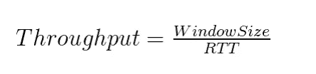
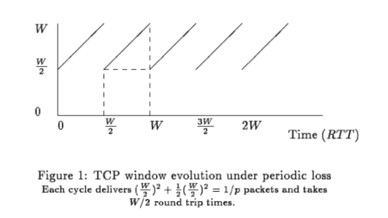
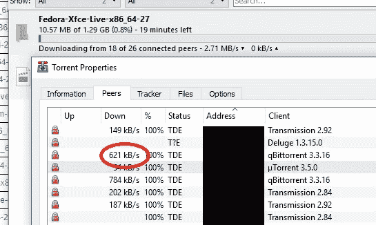
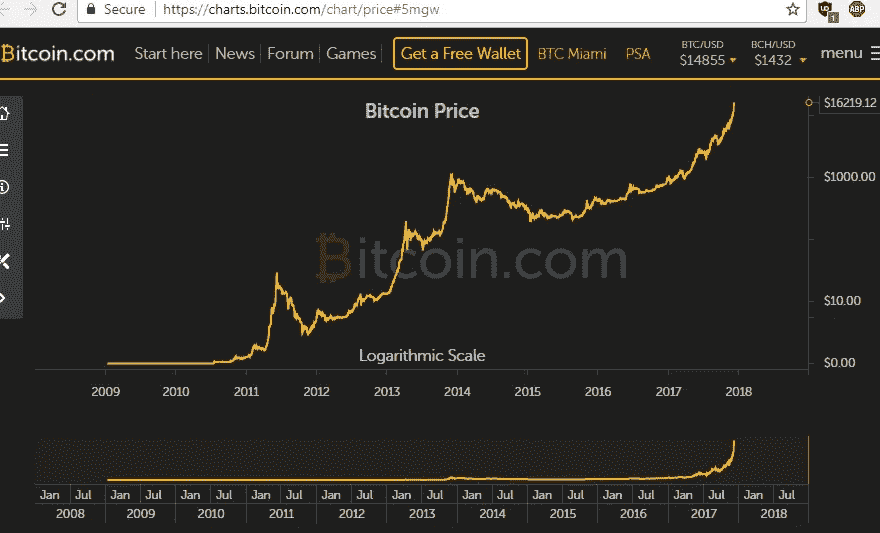

# TCP 可以帮助你了解比特币的价格变化

> 原文：<https://medium.com/hackernoon/tcp-can-help-you-understand-bitcoin-price-changes-c4a92a7b6392>

## 比特币可能会在瞬间失去一半的价格，但也会随着时间的推移而稳定下来。

# 什么是 TCP 协议？

协议是网络各部分如何交互的约定。互联网有不同的*层:*有连接设备的物理层，[网络](https://hackernoon.com/tagged/network)层路由数据包，传输层发送和接收数据包，应用层处理数据包中的信息。以下是一个概述:

## 互联网层

*   **物理:**电脑、路由器、交换机、线缆、调制解调器。
*   **网络:**分组路由，IP。
*   **传输:**数据包排序、传输和确认。TCP 和 UDP。由操作系统处理。
*   **应用:**程序如何使用数据包。**例子:** http、ftp、telnet、ssh 等。

TCP 代表*传输控制协议。* TCP 规定了操作系统如何处理程序通过网络发送或接收的数据。在发送机器上，操作系统构建数据包并传输它们。在接收方计算机上，操作系统收集数据包，按适当的顺序对它们进行排序，将它们组合成块，然后将它们交给等待的计算机程序。两台机器上的操作系统还需要确认或重新发送丢失的数据包，并控制数据包发送出去的速率。如果数据包发送的速度超过了网络的处理速度，它们就会被“丢弃”,信息就会丢失！TCP 是一种数学上神奇的算法，可以防止这种情况发生。

# TCP 保持网络正常运行

TCP 是互联网的泻药。它可以防止连接堵塞。不幸的是，互联网不仅仅是两台计算机之间的直接连接。同时有许多数据包在传输，它们可以通过管道有许多路径。如果太多的数据包试图使用同一管道，管道将被备份，直到它不得不丢弃数据包。

Packet Dropping: Let’s just delete cars until they can move freely again.

当数据包被丢弃时，所有用于发送数据包的努力都白费了。网络在丢弃的数据包上花费的精力越多，拥塞就越严重。被丢弃的数据包会被再次发送，直到用户或程序感到沮丧并停止尝试。目标是在不造成网络过度拥挤的情况下，允许尽可能多的流量。

# TCP 带宽算法

为了保持互联网畅通，TCP 分组发送数据包。操作系统会等待，直到听到该组已安全到达，然后再发送下一个组。

这些组的大小称为*窗口大小。这是一次可以发出多少个数据包。发送一个组并得到确认所花费的总时间就是 RTT: *往返时间*。*

这里有一篇很棒的文章描述了技术细节:

[一个非常简单的 TCP 吞吐量模型](https://blog.thousandeyes.com/a-very-simple-model-for-tcp-throughput/)

*吞吐量*由以下公式给出:

Throughput = WindowSize / Round Trip Time

为了保持网络不堵塞，但仍然使用其全部容量，TCP 随着时间的推移逐渐线性增加窗口大小，但每当一个或多个数据包被丢弃时，将窗口大小减半。

Source: A Very Simple Model For TCP Throughput

如果你的刷新率足够高，并且仔细观察，你可以在你的下载速度中看到这种模式。窗口大小是为每个唯一的连接设置的，所以如果您想在刷新 linux 发行版时观察这个模式，您需要从一个特定的对等点查看您的速度:

Watch closely how the connection speed changes over time

# 比特币的价格模式

比特币的价格并不遵循完全相同的规则，但你可以用同样的想法来分析价格的变化。

以下是比特币历史价格的对数图表:

Bitcoin’s Price History on a Logarithmic Scale

上面的图表使用以 10 为基数的对数标度。每个垂直凹口代表价格上涨 10 倍。比特币的价格已经爆炸了！

因为比特币的价格增长如此剧烈，如果不使用对数标度，图表实际上不会显示任何东西，所有更古老的历史在当前的价格水平下都变得相形见绌，你只能在底部看到一条平坦的线，在右边看到一条垂直线。对数标度表示几何关系，这对于具有指数增长的过程尤其具有洞察力。

比特币的价格似乎与 TCP 的窗口大小正好相反:价格快速上涨，然后在“低谷”中逐渐向下调整，直到再次开始上涨。比特币的价格历史上有三个主要峰值，在这三个峰值之间还有几个较小的峰值，显示出类似的模式。同样，这是一个对数标度，所以看似适度的减少，有可能减少一半或更多。

[比特币](https://hackernoon.com/tagged/bitcoin)有可能成为金融革命和政治演变的中心。我们看到的价格趋势不仅仅是*随机的猜测，尽管有很多猜测。随着加密货币社区的建立，金融界越来越多地投资比特币和加密货币，作为未来的重要金融范式。重要的是要考虑到这是比特币在美国法定货币中的价格，因此价格关系受到那些拥有大量法定货币或金融影响力的人的影响。*

像 TCP 一样，比特币的价格涉及网络中的同行谈判规则和涉及有限资源的预期。两者的成功都取决于我们稳定和和谐合作的能力。我希望看到比特币社区在定价、购买、销售、开采和收费方面采用有社会意识的习惯。利润可能是主要的动力，但是如果想要长期的成功，社区需要学习如何在寻求利润的同时公平有效的合作。

加密货币投资者需要让加密货币成为对社会实用有益的工具。潜在地，这些工具可以让我们改善我们的会计关系，更好地实现我们的社会目标。