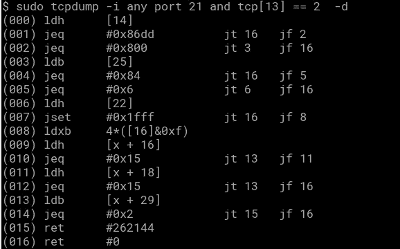
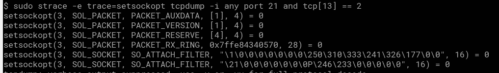

# Tcpdump 内部工程#1

> 原文：<https://medium.com/hackernoon/tcpdump-inner-works-1-3077c5709de0>

我经常使用 tcpdump，我们都这样做，但是如果有人告诉你解释它是如何工作的，你会怎么说？

我们知道 **tcpdump** 会应用一些**规则**(如果被告知的话)在内核(iptables 或类似的)丢弃流量之前过滤流量，这就是为什么如果你做一些像

```
tcpdump -i any dst port 21
```

如果您启动了一些针对端口 21 的连接，您将会看到流量，即使您可能没有将端口 21 绑定到任何进程(一些 ftp 服务器或其他什么)。

这是一个合理的假设，我想把这篇文章分成两/三部分，第一部分是关于 **tcpdump** 如何过滤端口，并向您展示您到底想要什么。

假设我希望看到所有发往端口 21 的数据包的 SYN 标志都亮起？

```
tcpdump -i any dst port 21 and tcp[13] == 2
```

你可以去检查 osi 层偏移，看看为什么这是有意义的，但问题是如何将它传递到套接字(可能是原始的)，这样它就可以过滤，而且它必须简单快速，这样开销就不会很大

原来有一种叫做 bpf([http://www.tcpdump.org/papers/bpf-usenix93.pdf](http://www.tcpdump.org/papers/bpf-usenix93.pdf))的字节码语言，它生成一个表达式，你可以使用 **setsockopt** )来附加套接字。

例如，如果您想查看表达式，可以将-d 传递给 **tcpdump** :



很好，如果你想知道这是如何传递给套接字的，你可以 **strace** ，例如:



关键是 **SO_ATTACH_FILTER** ，它附加了之前显示的过滤器，加上一些 sizeofs 等。

显然，有一些 **iptables** 模块可以让你在一个规则中附加复杂的 bfp 表达式，这意味着你的规则数量可以非常深入，并且都在一行中，这将对规则解析的速度产生巨大影响(从 **iptables** 的角度来看)。

因为我需要去工作，所以我们暂时把它留在这里，但是我想看看 iptables 模块，以及在 **tcpdump** accept()的一个包之后发生了什么，它如何把它交给内核或用户域进程等等。

谢谢！！！！

[](http://bit.ly/HackernoonFB)[](https://goo.gl/k7XYbx)[](https://goo.gl/4ofytp)

> [黑客中午](http://bit.ly/Hackernoon)是黑客如何开始他们的下午。我们是阿美族家庭的一员。我们现在[接受投稿](http://bit.ly/hackernoonsubmission)并乐意[讨论广告&赞助](mailto:partners@amipublications.com)机会。
> 
> 如果你喜欢这个故事，我们推荐你阅读我们的[最新科技故事](http://bit.ly/hackernoonlatestt)和[趋势科技故事](https://hackernoon.com/trending)。直到下一次，不要把世界的现实想当然！

