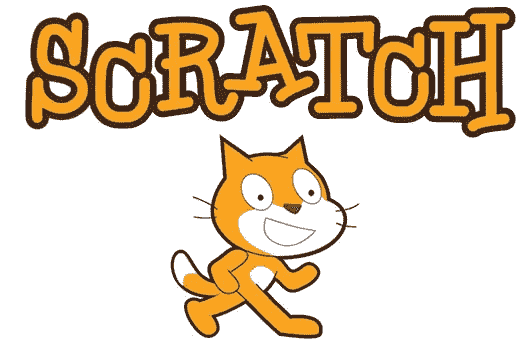
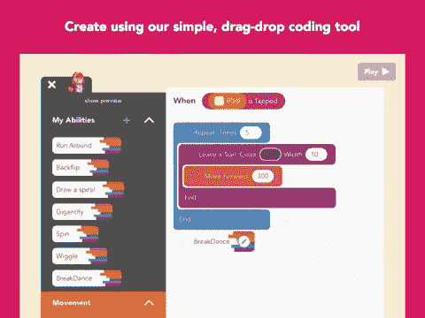
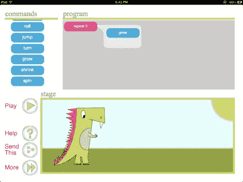
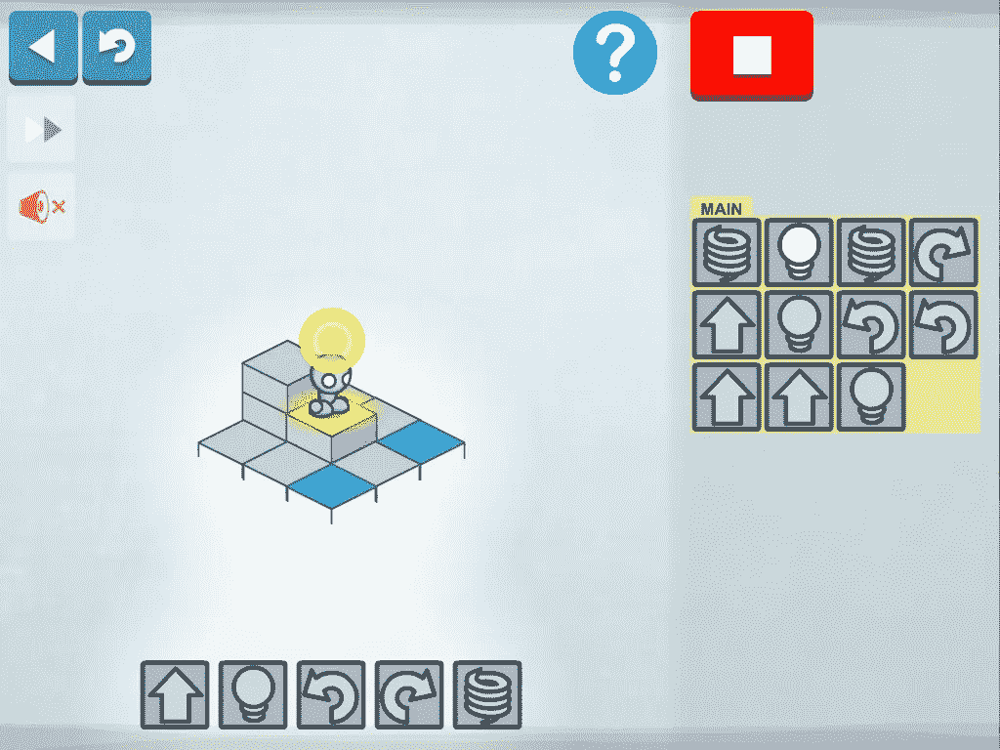

# 教你的孩子编程

> 原文：<https://medium.com/hackernoon/teach-your-kids-to-code-2349128df7d5>

这篇文章不是关于为什么你应该教你的孩子编程(有很多这样的例子)，而是关于如何去做。我在下面详细介绍了几个工具，它们对所有年龄的孩子学习[编程](https://hackernoon.com/tagged/programming)概念和语言都很有用。

我在大学才真正开始编程，这是一个遗憾，因为如果我早一点开始，我就可以比同龄人领先很多。

我知道软件[工程](https://hackernoon.com/tagged/engineering)并不适合所有人，但我相信应该有更多的人涉足这个领域，至少是为了更好地了解这项正在成为我们生活中越来越重要的一部分的技术，还有什么比在孩子小的时候激发他们的兴趣更好的方式呢。

我决定研究有哪些方法可以教孩子们如何编程，或者至少如何让他们对这种思维方式感兴趣(即逻辑思维和解决问题的思维方式)。那里有大量的资源，远远超过我在这里提到的，但是我在下面列出的这些应该涵盖了广泛的年龄和理解水平。我在这一页的底部列出了我个人的建议，给那些想跳过其他部分的人。

# [划痕](https://scratch.mit.edu/)

视觉语言和界面是在麻省理工学院媒体实验室创建的，目的是让孩子们尽早编码，即使他们还不能理解组成书面计算机语言的复杂语法。

> “迈出编程第一步的最佳方式之一。由麻省理工学院媒体实验室开发的 Scratch 是一种可视化编程语言。它允许孩子们构建互动的故事、动画、游戏和音乐。这种可视化编程方法是向孩子们传授编程和软件开发背后的基本概念的最佳方式。”

平台: **Web** 。年龄组:**8–17**。

 [## Scratch -想象、编程、分享

### Scratch 是一个免费的编程语言和在线社区，在这里你可以创建自己的互动故事、游戏…

scratch.mit.edu](https://scratch.mit.edu/) 

# [App 发明人](http://appinventor.mit.edu/explore/)

App Inventor 是一个基于云的工具，用于在浏览器中构建 Android 应用程序。该网站为学生创建(并可能发布)他们自己的 android 应用程序提供教程和支持！

平台: **Web** (也可以选择你的安卓手机)。年龄组 **12+** 。

 [## 麻省理工学院应用程序发明者|探索麻省理工学院应用程序发明者

### 对虚拟现实(VR)和增强现实(AR)应用的兴趣正在爆发。上个月的口袋妖怪 Go 热潮…

appinventor.mit.edu](http://appinventor.mit.edu/explore/) 

# [**code monster**](http://www.crunchzilla.com/code-monster)

关于使用 JavaScript 编程的基础的交互式教程，侧重于动作。代码更改会立即产生可见的结果。

Code Monster 是一个温和而有趣的编程概念介绍。它非常有趣，让孩子们可以马上实际操作代码，尽管它缺少一些其他图形解决方案可能提供的炫目效果，视觉效果也有点过时。

平台:**网**。年龄组:**9–14**。

 [## 来自克朗彻拉的代码怪物

### Code Monster 让孩子们对编程感到兴奋。这是一个游戏和教程的结合，孩子们可以尝试…

www.crunchzilla.com](http://www.crunchzilla.com/code-monster) 

# [雨燕游乐场](http://www.apple.com/uk/swift/playgrounds/)

苹果公司的一款全新应用。在 Swift Playgrounds 学习编码非常有趣。该应用程序附带了一套完整的苹果设计的课程。在“Swift 基础”中，使用真实代码引导角色在 3D 世界中体验基础知识。然后继续学习更高级的概念。感谢马修·菲奇的建议。

平台: **iPad** 。年龄组: **8+** 。

 [## 斯威夫特游乐场

### Swift Playgrounds 是一款适用于 iPad 的新应用，它教你以有趣、互动的方式编写 Swift 代码。学习代码…

www.apple.com](http://www.apple.com/uk/swift/playgrounds/) 

# [**跳房子**](http://gethopscotch.com/)

有点类似于 Scratch，尽管它更基本。跳房子是专为 iPad 设计的，对大多数孩子来说很简单，可以很快上手，但允许他们设置各种事件和动作，从简单的播放按钮到更高级的事情，如倾斜/摇动 iPad 和绘制/碰撞角色。

平台: **iPad** 。年龄组: **8+** 。

 [## 跳房子——通过创造性游戏学习编码

### 适合所有年龄段好奇的人。制作您自己的游戏、艺术品等。大量的应用内教程，甚至课程计划…

gethopscotch.com](http://gethopscotch.com/) 

# [**雏菊恐龙**](https://itunes.apple.com/gb/app/daisy-the-dinosaur/id490514278)

和跳房子一样的想法，除了这个游戏的目标是最年轻的程序员。我没有机会使用它，但据我所见，它非常基础，可能是 4-8 岁儿童学习编码的好入门。它允许孩子们创造一些基本的事件，比如“碰到恐龙，移动恐龙”。

平台: **iPad** 。年龄组:**4–8**。

[https://itunes . apple . com/GB/app/daisy-the-恐龙/id490514278](https://itunes.apple.com/gb/app/daisy-the-dinosaur/id490514278?mt=8)

# [**代号**](https://www.codecademy.com/)

作为一种有趣而简单的方式，让所有年龄段的人开始编码。使用赚取徽章的社交元素来完成一些代码，并通过可以分享给朋友的教程进行学习。它具有很强的交互性，可以显示代码的即时反馈/输出。

针对那些想真正学习如何使用真实代码而不是伪编程语言编程的高水平学生。它缺乏许多其他面向儿童的解决方案所提供的游戏性，但它仍然很容易掌握，并允许 12 岁的孩子学习许多语言的基础知识，包括 Ruby、JavaScript、PHP 和 Python。他们也有课后编程的努力，试图鼓励学生/老师在他们的学校开始编程俱乐部。

平台: **Web，iOS** 。年龄组: **12+。**

 [## 学习编码

### 免费学习交互式编码。

www.codecademy.com](https://www.codecademy.com/) 

# [**爱丽丝**](http://www.alice.org/)

Alice 是一个 3D 编程环境，允许孩子们创建动画、互动游戏或视频。该应用程序介绍并将帮助孩子理解关键原则，如面向对象的编程。程序是通过拖放图形块创建的。每条指令对应于编程语言(如 Java、C++和 C#)中的标准语句。这个工具看起来有点过时了(但是核心概念没有过时),并且仍然提供支持。

平台:**桌面**。年龄组: **12+** 。

[http://www.alice.org/](http://www.alice.org/)

# [**树莓与教育手册**](https://www.raspberrypi.org/)

Raspberry Pi 是专为儿童设计的廉价、可访问、可编程的计算机，对于所有年龄段的儿童来说，它都是学习如何编程的绝佳起点，当它是他们自己的每台计算机时，它会变得更加有趣！

Raspberry Pi 网站还提供免费下载的教育手册，指导学生如何设置它。它还包含上述流行的 Scratch 编程语言的教程。年长/更有经验的孩子也可能希望利用手册提供的 python 教程。

平台: **RaspberryPi** (当然)。年龄组: **8+** 。

 [## 树莓派-用树莓派教学、学习和制作

### Raspberry Pi 是一款小巧而经济的电脑，你可以用它通过有趣、实用的…

www.raspberrypi.org](https://www.raspberrypi.org/) 

# [**Code.org——小时代码**](https://hourofcode.com/us/en)

如果您的孩子以前从未编程过，这是一个较好的起点。网站上的年龄范围是 6-106 岁，因为他们相信任何人都可以而且应该去 code.org 的 T4 学习一个小时的基本编码。

Twitter 上来自谷歌、微软、脸书的工程师们帮助创建了这个一小时的教程，它得到了许多名人的支持(这可能会鼓励孩子们更多地尝试一下)。它还使用了非常受欢迎的《愤怒的小鸟》和《植物大战僵尸》中的图形，这当然不会有什么坏处。在完成一个小时的编码后，该网站会提供下一步去哪里继续学习的建议。

平台: **Web** 。年龄组: **6+** 。

 [## 每个孩子都应该有机会

### 《一小时的代码》最初是一小时的计算机科学介绍，旨在揭开“代码”的神秘面纱，展示…

hourofcode.com](https://hourofcode.com/us/en) 

# [**LightBot**](http://light-bot.com)

LightBot 是一个编程益智游戏，其中你必须使用高级编程概念(如循环和程序)将机器人移动到每一关的末尾。游戏包括拖放简单的指令，形成一个程序，让机器人完成每一关。

平台: **iOS** ， **Android，Windows，Mac，Kindle** 。年龄组:**4–8**(针对初级编码难题)****9+**。**

**[http://www.light-bot.com](http://light-bot.com/)**

**其他一些我印象深刻但没有机会好好看看的: **Stencyl** 、 **Tynker** 和 **Hackety Hack** 。**

# **我个人的建议**

**好吧，我知道我已经提到了很多，所以这里是我的三个最佳建议，排名不分先后:**

*****刮痕—***[http://scratch.mit.edu/](http://scratch.mit.edu/)**

*****CodeCademy—***【http://www.codecademy.com/】T42**

*****小时代码——***【https://hourofcode.com/】T4**

**感谢您的阅读，我希望您能从中受益。**

************

> **[黑客中午](http://bit.ly/Hackernoon)是黑客如何开始他们的下午。我们是 [@AMI](http://bit.ly/atAMIatAMI) 家庭的一员。我们现在[接受投稿](http://bit.ly/hackernoonsubmission)并乐意[讨论广告&赞助](mailto:partners@amipublications.com)机会。**
> 
> **如果你喜欢这个故事，我们推荐你阅读我们的[最新科技故事](http://bit.ly/hackernoonlatestt)和[趋势科技故事](https://hackernoon.com/trending)。直到下一次，不要把世界的现实想当然！**

****