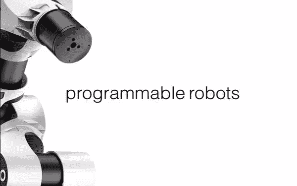
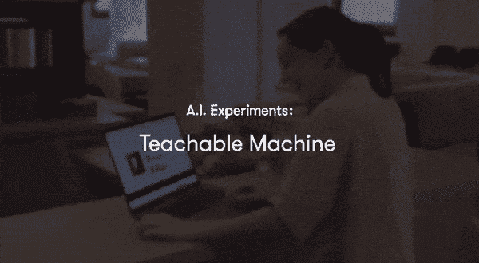
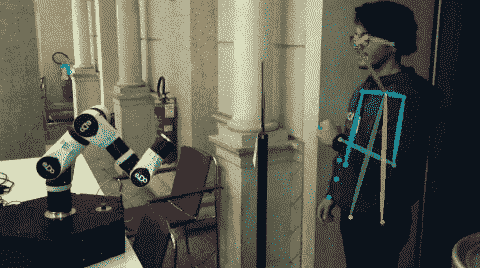
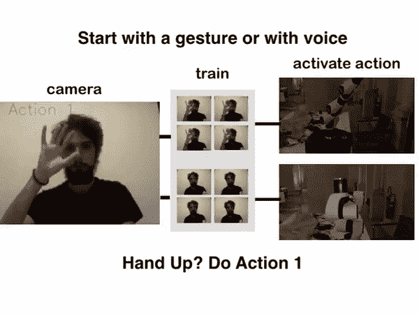
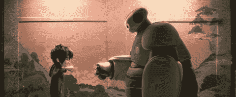

# 可教机器人是新的可编程机器人

> 原文：<https://medium.com/hackernoon/teachable-robots-are-the-new-programmable-robots-f60ae8766639>

## 范式如何从编程转移到机器教学。

很快我们就不会给电脑编程了。我们会像训练狗一样训练他们。

这是最近[连线文章](https://www.wired.com/2016/05/the-end-of-code/)的标题。他们在那里揭示的是，由于人工智能和机器学习，机器变得越来越聪明，它们将**理解我们的语言**和交流方式，而不是相反。

尽管这看起来像是一个很大的声明，但人工智能和人工智能的最新进展似乎表明，这确实可能是未来:计算机能够理解“人类友好”的数据，如图片、语音、语言，并产生有意义的结果，这些结果是在大量数据的基础上训练出来的。

一个很好的用户友好的例子是谷歌创意实验室最近的[可教机器](http://teachablemachine.withgoogle.com)实验:一个浏览器程序，任何人都可以教他们的计算机识别物体和手势，而不用写一行代码，而是向它展示例子并按下按钮。我认为，这个有趣的例子是我们未来与机器互动的**预演。**

> 我们坚信这些进步是让每个人接触机器人和人工智能的一种方式。

这对**机器人**意味着什么？这些年来，机器人变得越来越便宜、小巧和用户友好:从巨大的工业机器人到几乎所有对机器人感兴趣的人都可以购买的小型机械臂。但是，即使价格和材料变得越来越实惠，学习曲线往往不是。想想那些喜欢在工作中使用机器人作为助手的创意人员和工匠，但是他们害怕背后的大量代码、软件工程和数学。如果不用给机器人编程，你可以教他做什么，就像你对人做的一样，会怎么样？这是范式的根本转变，从**可编程机器人**到**可教机器人**。

Teaching a robot to fist bump, made during The Big Hack 4.0.

最近，我和一个开发团队一起研究这些主题，将人工智能和机器人技术的想法结合起来，创造出可以向人类学习的机器人。最近最先进的深度学习架构允许从原始图像执行精确的**姿态估计**。我们使用了这个 [GitHub repo](https://github.com/michalfaber/keras_Realtime_Multi-Person_Pose_Estimation) 的预训练模型，从网络摄像头中提取身体姿势。

然后可以处理这些信息来估计关节的角度，这样机器人就可以模仿运动，或者只是用自己的末端执行器跟随用户的手运动。虽然深度仍然不存在，但我相信新的模型可以从单目视图中获得足够精确的深度估计，正如最近在 CVPR 等会议上看到的那样，以获得完整的 3D 运动重建。

Teaching the robot the gestures that executes the actions, simply with examples. Inspired by the Teaching Machine by Google.

在教会机器人这些动作后，它们可以简单地用一个**手势**或一个**语音命令**来执行。你把手举起来，机器人抓住一个物体。你说一个语音命令，机器人就移动那个物体，就这么简单。你也可以教那些命令，只要给机器人看就行了。这是受可教机器实验的启发，我们在 Tensorflow 和 Keras 中重新实现了这个实验。

这为工匠、创意者和制造者、人们**用双手思考和工作**打开了许多可能性。他们可以教机器人做什么，而不用写任何代码，并用手势和语音命令与它互动。

这也将有助于学校中所有年龄的学生学习更多关于机器人和人工智能的知识，有一种直观和简单的方式与机器人互动并控制它。激发好奇心是打开他们的思维去发现科学和技术奇迹的关键。

这是软件和人机交互的未来。我们坚信这些进步是让每个人接触机器人和人工智能的一种方式。这些是改变游戏规则的技术，我们的目标是未来机器人可以合作并帮助人类，更广泛地说，帮助人类。