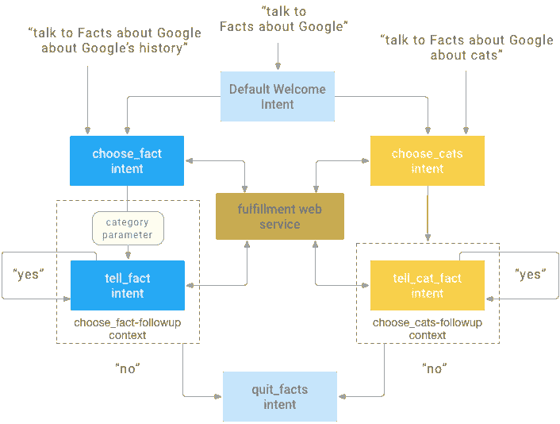
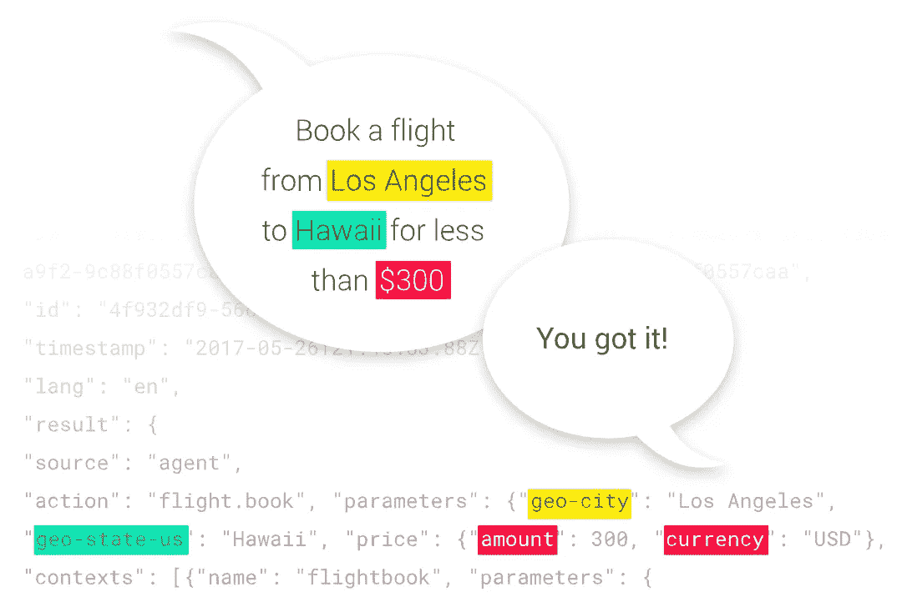

# 教黑猩猩弗雷迪和谷歌对话

> 原文：<https://medium.com/hackernoon/teaching-freddie-the-chimp-to-talk-to-google-d21612983b1d>

Where do I start?

人们对数字助理的即将到来已经谈得很多了。不过，在它们真正有用之前，还有很多工作要做。

在[技术](https://hackernoon.com/tagged/technology)的早期阶段，为像亚马逊 Alexa 或者[谷歌](https://hackernoon.com/tagged/google)助手这样的数字助手识别唾手可得的果实可能会很有趣。对数字营销人员有吸引力的一个助手功能是发送电子邮件活动，所以我决定为谷歌助手开发一个 MailChimp 应用程序。

第一步是理解谷歌平台上的操作，并获得一个运行谷歌[介绍指南](https://developers.google.com/actions/get-started/)的示例应用。这让我接触到他们的意图匹配系统和一个简单的事实检索应用程序。

也让我尝到了 API 的滋味。人工智能代理接受原始用户输入，并将其映射到你配置的特定意图。例如，在与示例 Google 应用程序开始对话后，我可能会说“给我一个关于猫的事实”，代理会知道根据我在 API 中设置的示例输入将它映射到 choose_cats 意图。人工智能控制台。

接下来，我需要将 MailChimp 与他们的 REST API 结合起来。在阅读了他们的[入门指南](http://developer.mailchimp.com/documentation/mailchimp/guides/get-started-with-mailchimp-api-3/)之后，我运行了 curl 命令来完成我需要的每一个交互(下拉用户的电子邮件列表，发送一个活动，等等)。为了让我的节点脚本可以访问它，我用 [MailChimp 节点包装器](https://www.npmjs.com/package/mailchimp-api-v3)写了一个[小类](https://github.com/ckirksey3/mailchimp-google-assistant/blob/master/mailchimp.js)(感谢 [@thorning](https://github.com/thorning) ！)为我做这些查询。这里有一个函数，用于发送一个已经排队的活动，带有一个电子邮件正文和一个目标分发列表:

有一次，我让 API 调用工作，这只是调整对话流程和配置 API 意图的问题。AI 正确。这需要大量的迭代才能顺利完成。出于某种原因，起初我对意向设置过程并不直观。这有助于了解其他应用程序的意图。这里有一个响应用户请求创建和发送新电子邮件活动的功能:

Google 上的 Actions 允许你做的一件很酷的事情是建立潜在答案的列表，并通过`.buildList()`功能用选项直观地提示用户。

管理这一切的最终脚本非常小。谷歌客户端库上的[动作使得代码非常高效。](https://www.npmjs.com/package/actions-on-google)

## 最终产品

Me demoing the end result

## 给你的问题

*   你还想在这个应用上看到什么？
*   你建过哪些数字助理 app？
*   你希望在谷歌样板应用的操作中看到什么？

请在下面评论😄