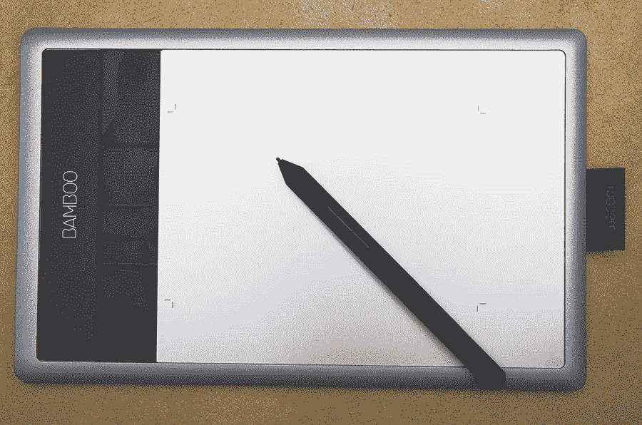
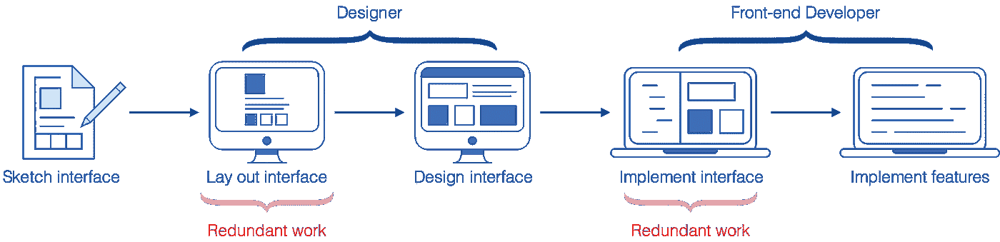
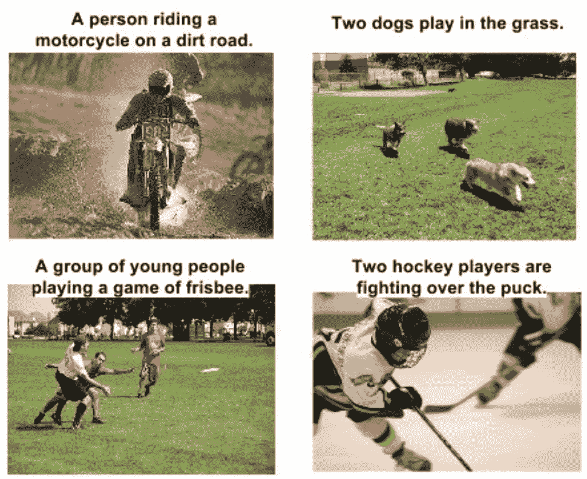
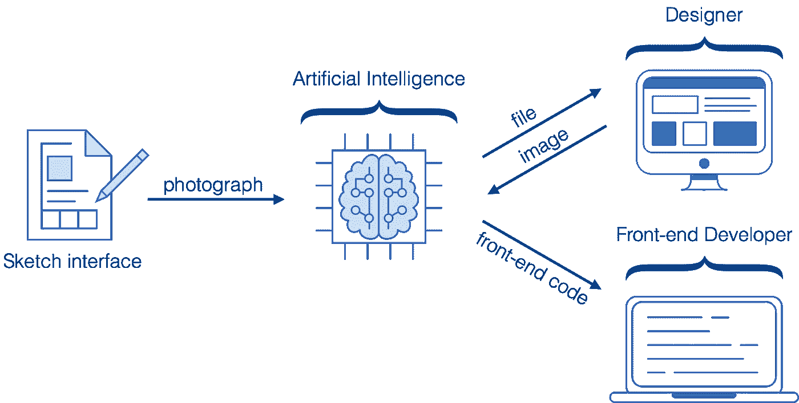

# 教机器理解用户界面

> 原文：<https://medium.com/hackernoon/teaching-machines-to-understand-user-interfaces-5a0cdeb4d579>

*我们的* [*研究页面*](https://uizard.io/research) *中的这个条目更多的是一篇博文而非实际的研究工作；目标是分享我们正在做的事情以及我们为什么要做。*

**TL；**博士:带我去[先睹为快](#f48a)。

# **1)开发应用和网站极其缓慢**

回到我读本科的时候，我曾经在一家数码机构兼职做前端开发。我很幸运地成为一个团队的一员，这个团队由极具才华的人组成，有艺术总监和 UI/UX 设计师制作华丽的界面，有创意的前端工程师使用最新的技术构建尖端的应用程序*(还记得 WebGL 变得越来越酷，Adobe Flash 奄奄一息的时候吗，那就是那个时候)*。该团队专门为知名客户工作，并获得各种奖项，如*FWA 奖*和 *Awwwards* ，以表彰他们的工艺质量。

在网页设计行业工作很有趣，但有件事让我震惊:**工作流程完全中断**。

与我合作过的大多数设计师更喜欢在白板或他们精美的笔记本上勾画他们的创意，而不是使用线框图工具，如 Balsamiq 或 Axure。他们会说这些工具限制了他们的思想，会扼杀创造力——坦率地说，我同意他们的观点。毫不奇怪，图形平板电脑在设计师中如此受欢迎，因为这款设备试图以数字方式重现纸笔的感觉。为了节省时间，一些设计师会直接用图形输入板在软件中画出他们的想法。

The graphic tablet, designer’s best friend. [source: Wikipedia](https://en.wikipedia.org/wiki/Graphics_tablet)

无论选择哪种方法来勾画想法，设计师都必须使用线框工具重新绘制图纸，以获得客户或项目经理的验证，或者直接使用他们喜欢的设计工具制作用户界面，如 *Adobe Photoshop* 或*草图*。这实质上意味着必须通过将一种格式的工作转换为另一种格式来重复两次完全相同的工作。这是工作流程中断的第一种方式。

一旦设计者最终确定了给定用户界面的外观，他们将把工作交给前端开发人员，以便用代码实现它。实现用户界面基本上包括用代码重新创建设计者在软件中用图形创建的内容。这听起来不像是又一次重复工作吗？

事情是这样的，作为一名开发人员，你要专注于实现客户端-服务器逻辑，核心功能，优化交互式图形，动画和过渡；但是你最终会浪费大部分时间来编写用户界面。编写 HTML/CSS 超级无聊，重复，令人沮丧，非常耗时，以至于妨碍了设计师的迭代周期。在一些数字机构中，设计师负责实现他们绘制的用户界面。但问题还是一样，有人不得不坐下来手动编写繁琐、枯燥、重复的 UI 代码。这是工作流程中断的第二种方式。

The classical workflow for building apps and websites.

如上图所示，这些多余的步骤给项目带来的价值为零，因为它们的唯一目的是将一种格式编码的用户界面转换为另一种格式，以便启用工作流中的下一个步骤。因为这些转换是由人们手动执行的，所以它们昂贵、耗时、令人沮丧，并且阻止了创新，因为它们消耗了本应花费在迭代周期上以改进正在构建的应用的宝贵时间。

# **2)深度学习是一个可能解决方案的核心**

作为一名专注于机器学习的研究生，我对深度学习可能带来的突破感到惊讶。计算机最终能够以某种令人满意的方式处理图像。我记得我完全被谷歌的 Vinyals 等人的论文【T4 展示和讲述】给定一张输入图片，深度神经网络被训练生成一个英文描述。

[Show and Tell: A Neural Image Caption Generator, Vinyals et al. 2015](https://arxiv.org/abs/1411.4555)

受这项工作和许多其他工作的启发，我设想给定一张照片生成英文描述应该基本上和给定一个 UI 模型生成计算机代码一样。在这两种情况下，您都希望在给定视觉输入的情况下产生文本输出。在让那个想法在我的笔记本上尘封了很久之后，我终于决定写一些代码，看看我的假设是否正确。

令我惊讶的是，它真的起作用了！当然，它在一个受控的环境中工作，并且需要更多的工作来改进技术以满足现实世界的要求。尽管如此，这令人鼓舞的第一步表明，深度学习确实可以用于从用户界面图像自动生成代码*(以及 Airbnb* [*同意我们*](https://thenextweb.com/artificial-intelligence/2017/10/25/airbnb-ai-sketches-design-code/) *)* 。就在那时，我写了一篇 [pix2code](https://arxiv.org/abs/1705.07962) 论文，并决定开源一个[基本实现和一个玩具数据集](https://github.com/tonybeltramelli/pix2code)用于教育目的。令人惊讶的是，该项目得到了相当多[lot](http://www.wired.co.uk/article/pix2code-ulzard-technologies)[of](https://thenextweb.com/apps/2017/05/26/ai-raw-design-turn-source-code/)[media](https://www.fastcodesign.com/90127911/this-startup-uses-machine-learning-to-turn-ui-designs-into-raw-code)的关注，被一对 [夫妇](https://soundcloud.com/nlp-highlights/17a)的 ML 相关播客[所覆盖，甚至是一个](https://dataskeptic.com/blog/episodes/2017/pix2code)[两分钟论文](https://www.youtube.com/watch?v=Fevg4aowNyc)插曲的主题。

# 3)看到更大的画面

在 Uizard，我们基本上是在教机器像人类一样理解图形用户界面，以便为构建应用程序和网站提出更有效的工作流程。自从我们的 [pix2code 论文](https://arxiv.org/pdf/1705.07962.pdf)发布以来，我们的核心技术已经发展了很多，但中心思想仍然是相同的:我们正在构建一个由神经网络权重组成的软件管道，以将像素值*(例如照片、截图)*转换为字符序列*(例如 iOS 代码、草图文件)*。我们设想的工作流程如下图所示。

The modern AI-driven workflow we are envisioning for building apps and websites.

对于设计师和开发人员等专业用户来说，这种技术可以快速测试想法，加快迭代周期，并最终开发出更好的应用，从而节省项目早期的关键时间。目标是在琐碎的任务上尽可能节省时间；没有人喜欢多余的工作。最重要的是，这将使设计者和开发者专注于重要的事情:为最终用户带来价值。

构建简单应用的入门水平会变得非常低。学习使用 UI 设计工具需要时间，学习编码可能需要更多的时间。然而，大多数人能够在一张纸上画出用户界面；让您的奶奶在几秒钟内就能从一个想法变成在手机上运行的物化用户界面。

我们的愿景是用人工智能赋予人们权力，因为我们相信未来机器会帮助人类，而不是取代人类。

# 先睹为快

我们正在努力实现我们的愿景。与此同时，我们四个人非常兴奋地分享我们的一些进展。