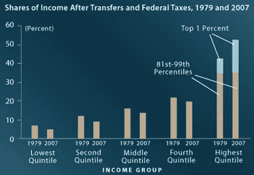
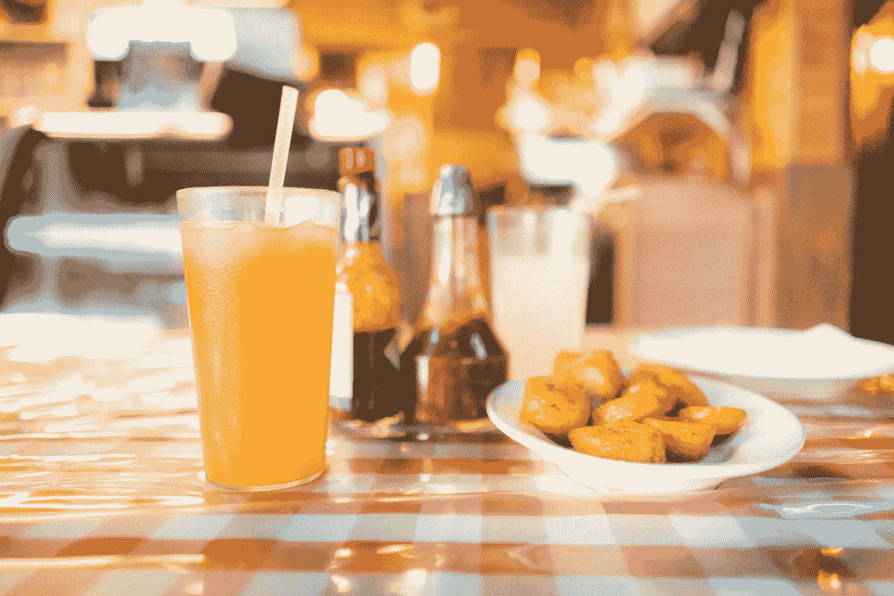
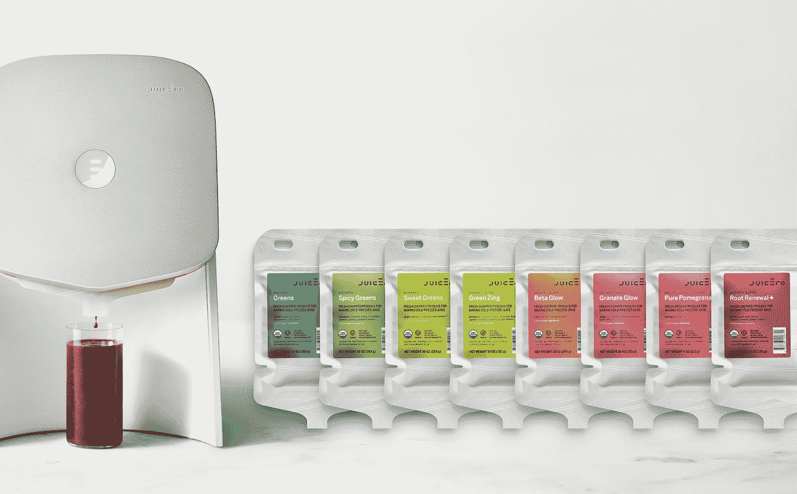
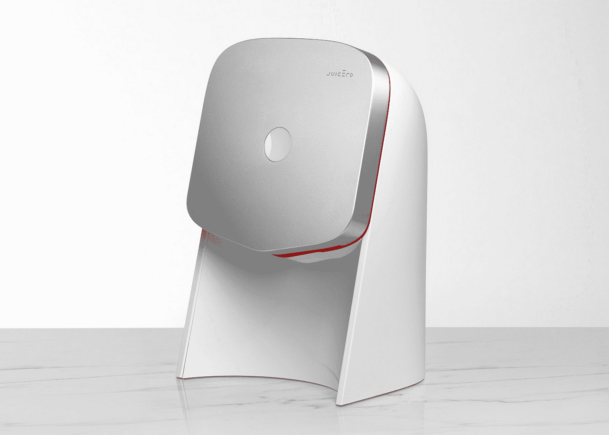
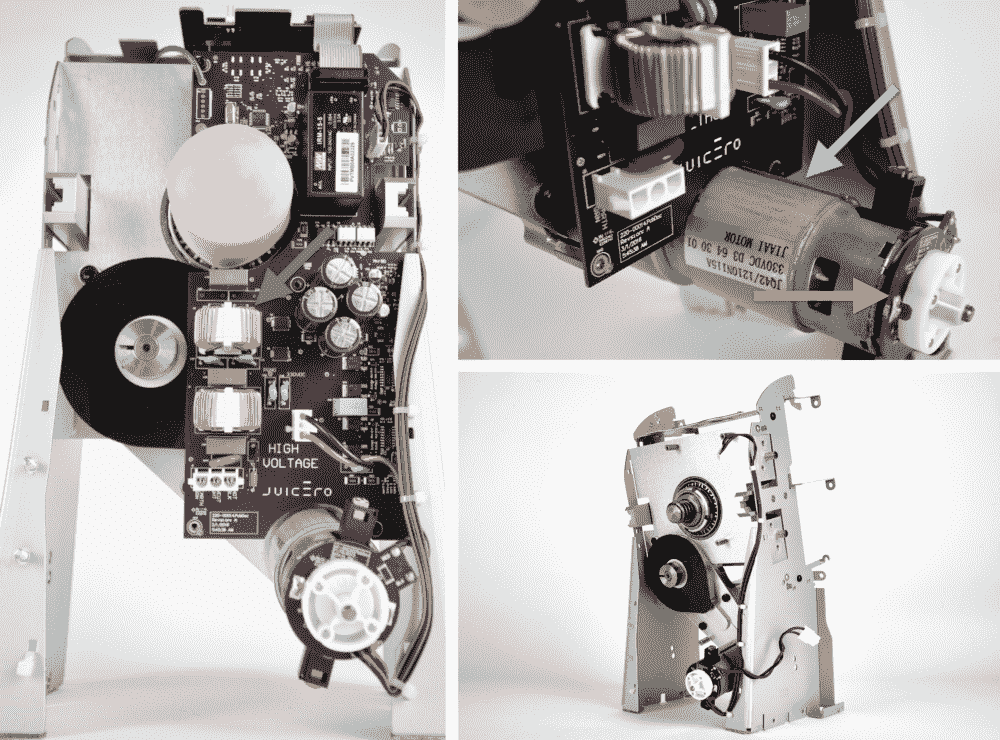

# 科技和精英设计

> 原文：<https://medium.com/hackernoon/tech-and-elitist-design-8994061d2176>

在过去的几十年里，美国的收入不平等急剧增加。1979 年至 2007 年间，收入最高的 1%家庭的税后收入增长了 275%，相比之下，接下来的 19%家庭的税后收入增长了 65%，接下来的 60%家庭的税后收入增长了约 40%，收入最低的五分之一家庭的税后收入增长了 18%。

[Source: Congressional Budget Office](https://www.cbo.gov/publication/42729)

随着这种收入不平等的加剧，美国的收入分配变得越来越双峰化，富人和其他人之间的鸿沟越来越大。这导致了影响整个社会的二度变化。一是将风险资金分配给消费品。

尽管风险资本与不到 1%的公司有[关联](https://hbr.org/2013/05/six-myths-about-venture-capitalists)，但它对未来[消费的产品和服务有着巨大的影响。自 1979 年以来，风险资本已经支持了 43%的美国上市公司，而这些公司又承担了美国上市公司 82%的研发工作。今天的风险投资创业公司将成为明天最重要的公司。](https://hackernoon.com/tagged/future)

因此，重要的是要考虑什么类型的公司得到风险投资。风险资本家在考虑是否投资一家初创公司时，最重要的因素之一是市场的规模。鉴于风险投资是一个全垒打游戏，风险投资者正在寻找至少总价值数十亿美元的潜在市场。在过去，专门吸引 1%甚至 10%的人的产品通常被认为太小而不能支持。因此，初创公司决定以中产阶级为产品目标，即使是致力于昂贵的尖端技术、需要进入高端市场的初创公司也计划最终将这种技术带入低端市场。

市场的大小是由人数和他们愿意支付的价格决定的。那么，如果富裕家庭继续以比其他家庭更快的速度积累收入，会发生什么呢？考虑到这种收入积累速度很可能会高于人口增长率，最终它将把富裕家庭变成一个比中产阶级和穷人加起来还要大的市场。因此，为大众制造技术的激励机制将逐渐减少，让位于越来越迎合富人的产品。

相对于富裕市场，贫穷市场也处于天然劣势，即使它们的规模相同。一个 20 人每人愿意花 10 万美元的市场和另一个 2000 人每人愿意花 1 美元的市场可能是同样的规模(200 万美元)，但迎合高端市场仍然是更好的选择。一美元对穷人的边际效用高于富人，因此富人比穷人更愿意放弃一美元。此外，说服新客户为产品付费的成本比说服现有客户支付更多费用的成本高得多。

在“[网络公众中的白色飞行](http://www.danah.org/papers/2009/WhiteFlightDraft3.pdf)”中，丹娜·博伊德强调品味和审美是“与种族和阶级深深交织在一起的两个充满价值的元素。”随着收入不平等的加剧，我们开始看到，在消费科技领域，富人的品味和审美越来越压倒中产阶级和穷人。

精英[设计](https://hackernoon.com/tagged/design)是主要迎合富人的产品或系统的设计，允许它从根本上建立在过剩的基础上。这是一种不再受效率、成本或理性的首要原则约束的设计。评估消费技术领域精英设计的一个有用框架是从三个层面来审视它:市场、模型和机器。举个例子，让我们把这个 to framework 应用到 Juicero。

# 精英设计#1:市场

Juicero 的基本价值主张建立在美国富人普遍存在的一种误解之上:果汁有益健康。这在一定程度上是健康成为“[21 世纪终极地位象征](https://qz.com/965505/juicero-turns-out-to-be-pointless-so-is-juice-itself.)”的结果，这引发了一波昂贵的健康和健身选择，如冷榨果汁、愈合晶体、SoulCycle 和 Peloton。

不幸的是，果汁实际上并不健康，因为水果中大部分健康的部分都在果汁制作过程中被丢弃了。因此，专家强调,“果汁，即使是鲜榨的，100%的果汁，也只比糖水多不了多少。”

[T2【营养学】的一项重大研究](http://www.nutritionjrnl.com/article/S0899-9007(14)00192-0/fulltext)发现，果汁的糖浓度平均为 45.5 克/升，仅比苏打水的 50 克/升低 4.5 克。Juicero 的果汁含糖相对较多。“甜蔬菜”和“甜根”套餐[每份 8 盎司均含 17 克糖。相比之下，一份 8 盎司的可口可乐含有 26 克糖。](http://www.motherjones.com/tom-philpott/2016/04/juicero-start-up-silicon-valley-expensive-juice-fiber-sugar)

果汁还有一个[隐患](https://www.washingtonpost.com/posteverything/wp/2017/04/26/people-think-juice-is-good-for-them-theyre-wrong/)果汁比水果更难让人感觉到营养。因此，很容易暴饮果汁，超过热量和糖的摄入量。将一个单位的水果等同于一杯果汁，在精神上也是方便的，尽管一杯果汁的卡路里含量通常是一片水果的两倍多(一个橙子的卡路里含量为 45 卡路里，而一杯 8 盎司的橙汁的卡路里含量为 110 卡路里)。

# 精英设计 2:模型

[*Image source: Juicero*](http://www.prnewswire.com/news-releases/juicero-resets-price-18-months-ahead-of-schedule-making-it-easier-than-ever-to-get-cold-pressed-juice-at-home-300391677.html)

Juicero 的野心不仅仅局限于制造更方便的榨汁机；它想创造一个全新的系统来提供最大的便利，同时也获取最大的利润。结果就是 GV 的管理合伙人 David Krane 曾经描述的“我资助过的最复杂的生意”就上下文而言，Krane 还为优步、Nest 和蓝瓶咖啡等公司提供了[资金。](https://www.gv.com/team/david-krane)

juice ero 业务[包括](http://www.businessinsider.com/juicer-juicer-product-review-2016-4)三个仓库、一个制造设施、[一个 LEED 黄金加工设施](/@iamdougevans/journey-to-juicero-ea57953e8084)、一个全国有机农场网络、一个智能手机应用和一大批农产品切碎机，所有这些都支持两个主要的赚钱机器:Juicero Press 和 Juicero Packs。

Juicero Press 是 399 美元的榨汁机，Juicero Packs [是](/@iamdougevans/journey-to-juicero-ea57953e8084)生水果和蔬菜的“透气包”，它们“在 35 华氏度的环境中经过三次清洗”一旦购买了 Juicero，消费者必须选择订阅 Juicero 包装，单个包装可以生产 8 盎司的果汁，每个价格从 4 美元到 8 美元不等。

这种商业模式使 Juicero 不仅可以从榨汁机中获利，还可以定期从包装中获利。仅考虑包装成本，一盎司 Juicero 果汁的价格从 0.50 美元到 1.25 美元不等。*《华盛顿邮报》* [发现](https://www.washingtonpost.com/news/wonk/wp/2016/04/01/this-juice-is-bananas)即使在高档杂货店的高级果汁区，也没有果汁接近这么贵，最贵的果汁比最便宜的 Juicero 果汁便宜 0.17 美元。

这些包允许 Juicero 创建一个有效的果汁专用 DRM 系统。每个 Juicero 包装都有自己独特的二维码，由榨汁机扫描，并根据在线数据库进行检查。如果没有 Wi-Fi、没有二维码、二维码已被使用，或者二维码用于过期的袋子，Juicero 印刷机将不会启动。因此，它对非 Juicero 水果和蔬菜不起作用，即使这些水果和蔬菜被切片、切块并放入用过的 Juicero 包装中。这是 Juicero 经过深思熟虑后做出的选择，他们发现 Keurig 面临着其他公司为其咖啡机生产咖啡盒的问题。

围绕 Juicero 系统还有一些环境问题。由于一包相当于一杯果汁，剩余的包装和果肉会很快堆积起来。果肉通常占植物总物质的 20%，经常被扔掉，尽管 Juicero [建议](https://www.juicero.com/blog/health-fitness/pulp-fiction)将它们变成“果肉”和“身体磨砂”

包装"[不可通过市政方法](https://www.juicero.com/sustainability)回收，但可以通过特殊的过程回收:切开包装，取出果肉，冲洗包装，或者邮寄回 Juicero，或者带到特定的回收设施。对同一位消费者来说，这是相当合理的期望，他们打赌这位消费者将支付 399 美元，不必在喝完每杯果汁后清洗榨汁机。

Juicero 没有专注于修复流程的特定部分，而是打着创新的幌子重新创造了它。正如[在*反思修理*中所指出的](https://sjackson.infosci.cornell.edu/RethinkingRepairPROOFS(reduced)Aug2013.pdf)，“创新的语言通常是为新的……明亮闪亮的工具保留的，而修理往往会完全消失。”这些明亮闪亮的工具，从读取二维码的相机到透气包，都是一个系统的产品，在这个系统中，“当新产品被制造出来时，我们听到令人兴奋的技术创新，这些创新被广泛认为是值得支付(更多)的。”

# 精英设计#3:机器

[*Image source: Wired*](https://www.wired.com/2016/05/juicero-yves-bhar/)

然后是 399 美元的榨汁机，这是一个飞机铝包层的大教堂，致力于传播果汁的福音。这款榨汁机是名人设计师 [Yves Behar](https://www.dezeen.com/2016/06/01/juicero-machine-yves-behar-nespresso-style-countertop-cold-press-juicer/) 、可口可乐北美[前总裁](http://www.businessinsider.com/juicero-names-jeff-dunn-ceo-replacing-doug-evans-2016-10)[、12 名博士、50 名工程师、7 名食品科学家](http://www.vogue.com/article/juicero-cold-pressed-juice-home-juicer-no-mess)和亚马逊 Echo 的创造者[历时两年多开发的巅峰之作，这款榨汁机被](https://www.recode.net/2016/4/14/11586128/juicero-malachy-moynihan-built-amazon-echo)[形象地描述为“一个将果汁喷入玻璃杯的大 iPod”](https://www.vice.com/en_us/article/silicon-valley-is-wetting-itself-over-a-700-juicing-machine)

这种产品的每一个部分都有多余的成分。道格·埃文斯[吹嘘道](https://www.recode.net/2016/9/12/12893026/doug-evans-juicero-too-embarrassed-to-ask-podcast-transcript)“这里有 400 个定制零件。”硬件风险投资公司 Bolt，[的合伙人本·爱因斯坦(Ben Einstein)评论道](https://blog.bolt.io/heres-why-juicero-s-press-is-so-expensive-6add74594e50)“这些年来，在我拆开的数百种消费产品中，这很容易就进入了复杂程度最高的 5%之列。”

Juicero 的外表面在前门中央有一个用于榨汁的按钮。这扇门是“[喷珠](https://www.juicero.com/the-press)，由“[航空级铝](https://www.juicero.com/the-press)制成榨汁机的其他主要外部部件是复杂的注射成型塑料组件，纹理为[“苹果般光滑的表面](https://blog.bolt.io/heres-why-juicero-s-press-is-so-expensive-6add74594e50)”这种审美极简主义反映了社会阶层的偏好。正如 Danah Boyd 指出的那样，富人认为“干净”的设计往往被低收入消费者认为“无聊”、“蹩脚”和“精英主义”。

[*Image source: Bolt*](https://blog.bolt.io/heres-why-juicero-s-press-is-so-expensive-6add74594e50)

极简主义的外观隐藏了一台过于复杂的机器。Juicero 有 8 个大型定制零件，[而](https://blog.bolt.io/heres-why-juicero-s-press-is-so-expensive-6add74594e50)通常类似的消费类硬件产品使用一到两个。内部还包含一系列复杂的组件，[包括](https://blog.bolt.io/heres-why-juicero-s-press-is-so-expensive-6add74594e50)一个支持 Wi-Fi 的微控制器、一个摄像头、一个无线天线、10 块印刷电路板、一个定制电源和一个 led 板。

精英设计本身并不是一件坏事。许多人真心喜欢使用他们的果汁饮料，即使它和徒手使用一样有效。精英设计仅仅是设计为之而生的社会的反映。它代表了一个由少数人的金钱欲望支撑的不断增长的市场，为昂贵的产品支付额外费用是好的。

一些人想知道 Juicero 是否是硅谷过剩的代表。不是，更能代表商业意识。Juicero 知道，它有能力向市场收取其型号和机器的溢价。问题是这种商业意识反映了什么样的社会变化。如果面向 1%人群的果汁市场已经变得可以进行风险投资，这对社会意味着什么？

> [黑客中午](http://bit.ly/Hackernoon)是黑客如何开始他们的下午。我们是 [@AMI](http://bit.ly/atAMIatAMI) 家庭的一员。我们现在[接受投稿](http://bit.ly/hackernoonsubmission)并乐意[讨论广告&赞助](mailto:partners@amipublications.com)机会。
> 
> 如果你喜欢这个故事，我们推荐你阅读我们的[最新科技故事](http://bit.ly/hackernoonlatestt)和[趋势科技故事](https://hackernoon.com/trending)。直到下一次，不要把世界的现实想当然！

