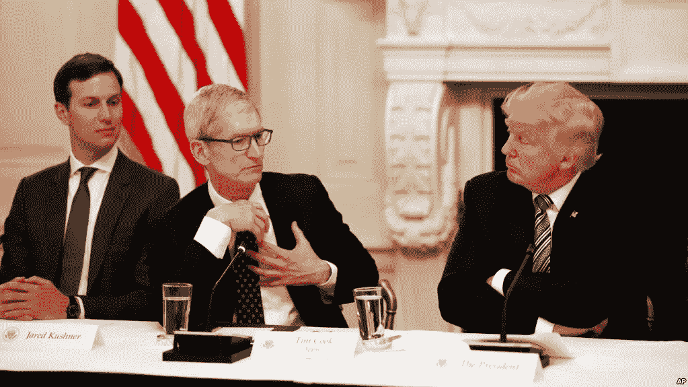

# 技术和政治——以及技术的政治

> 原文：<https://medium.com/hackernoon/tech-and-politics-politics-and-tech-428fd02f4045>

President Trump Participates in an American Technology Council Roundtable. (Credits: The White House)

## 美国技术委员会会议是关于什么的？

美国总统唐纳德·特朗普昨天在白宫举行的美国技术委员会会议上表示:“我们加入了一个不可思议的处于绝对创新前沿的领导者群体，其中包括许多来自世界上最成功企业的首席执行官。”。

> 今天房间里有很多想法。

对于房间里的许多科技领袖来说，这是[自大选以来与川普总统的第二次会面。这是他宣誓就职以来的第一次。](https://hackernoon.com/whos-going-to-trump-s-tech-roundtable-911d4f05fe5d)

除了特朗普和他的团队——其中包括女儿伊万卡、总统高级顾问和女婿贾里德·库什纳、副总统迈克·彭斯、国家安全顾问 H.R. McMaster 以及财政部、国土安全部和商务部的部长——参加会议的还有许多科技集团的首席执行官，包括:

*   万事达卡首席执行官 Ajay Banga
*   亚马逊首席执行官杰夫·贝索斯
*   OpenGov 首席执行官扎卡里·布克曼
*   甲骨文联席首席执行官萨弗拉·卡兹
*   苹果公司首席执行官蒂姆·库克
*   凯鹏华盈董事长约翰·杜尔登
*   VMware 首席执行官帕特·基尔辛格
*   阿历克斯·卡普，Palantir 首席执行官
*   英特尔首席执行官布莱恩·科兹安尼克
*   Akamai 首席执行官汤姆·雷顿
*   SAP 首席执行官比尔·麦克德莫特
*   高通首席执行官史蒂文·莫伦科夫
*   微软首席执行官塞特亚·纳德拉
*   Adobe 首席执行官尚塔努·纳拉延
*   IBM 首席执行官吉尼·罗梅蒂
*   埃里克·施密特，Alphabet 执行主席
*   埃森哲首席执行官朱莉·斯威特
*   彼得·泰尔，创始人基金

三人明显缺席:特斯拉(Tesla)的埃隆马斯克(Elon Musk)，他在特朗普让美国退出巴黎气候协议后退出了白宫商业顾问委员会；优步的特拉维斯·卡兰尼克，他早些时候辞去了总统的商业顾问一职；和脸书的马克·扎克伯格，原因是“时间安排冲突”，至于该公司。

“脸书高管在一些方面对川普持批评态度，”[美国消费者新闻与商业频道指出](http://www.cnbc.com/2017/06/19/facebook-avoids-kushner-tech-meeting.html)。

> 今年一月，桑德伯格批评政府对来自几个中东国家的公民的旅行禁令，称他们“违背了我们国家最优秀的精神和价值观”扎克伯格 6 月 1 日在脸书的一篇帖子中在[说，川普让美国退出巴黎气候协定的决定“对环境不利，对经济不利，并且将我们孩子的未来置于危险之中。”](https://www.facebook.com/zuck/posts/10103765754210171)

但类似的担忧并没有阻止其他科技领袖参与进来，值得注意的是贝佐斯，他[站出来反对](http://www.cnbc.com/2017/01/30/amazon-weighing-other-legal-options-in-opposition-to-trumps-immigration-order-ceo-bezos-says.html)旅行禁令，库克，他在给苹果员工的电子邮件中批评总统对巴黎协议的决定[，称这“对我们的星球是错误的”](http://www.cnbc.com/2017/06/01/apple-ceo-tim-cook-slams-donald-trumps-decision-to-withdraw-from-climate-deal.html)

然而,《纽约时报》强调，只有来自白宫的少数技术专家出席了会议。

> “政府还没有任命几个主要的科技职位，”报纸补充道但与总统关系最密切的商业和经济团队参加了会议，包括国家经济委员会主任加里·科恩(Gary D. Cohn)和经济倡议高级顾问迪娜·鲍威尔(Dina Powell)。

在会议上，特朗普解释说，他的政府的目标是“领导联邦政府技术的全面转型，为公民提供更好的服务，更强的网络攻击保护。”云计算、分析、大数据、采购和合同改革、人才招聘和再培训、政府和私营部门合作、H1 B 签证和未来趋势等问题也在议程之中。

> 我们正在拥抱巨大的变革、大胆的思考和局外人的观点，以更低的成本改造政府，使其成为应有的样子。

库什纳在活动开幕式上对技术人群发表讲话时说:“我们挑战自己，追求变革，为美国人民提供远远超出我们任期的效用。我们共同制定了雄心勃勃的目标，并授权跨部门团队来实现我们的目标。它正在发挥作用，这非常令人兴奋。”

“我们将共同释放私营部门的创造力，以前所未有的方式提供公民服务，”他补充道，同时声称，他的目标是“努力为一个长期以来依赖过去的做法作为其继续存在的自动理由的政府带来商业敏感性。”

库什纳作为美国创新办公室的负责人，与白宫战略倡议主任、前微软首席财务官克里斯·里德尔一起组织了这次活动。

在一条推文中，特朗普的女儿伊万卡重复了她父亲的讲话，并强调“创新已经并将继续改变世界——以及美国政府代表所有美国人的工作方式。”

Liddell [周一告诉美国消费者新闻与商业频道](http://www.cnbc.com/2017/06/19/jared-kushner-speaks-at-technology-summit-in-washington-dc.html)峰会的重点是云和网络安全。Liddell 说，政府拥有 6000 多个数据中心，每年在技术上花费 860 亿美元，这些数字比私营市场的同类产品高出“几个数量级”。

网络安全和打击恐怖主义也是最近在意大利举行的七国集团峰会的议程重点之一，特朗普总统出席了此次峰会。

“尽管互联网是过去几十年最重要的技术成就之一，但它也被证明是恐怖主义目的的强大工具，”上个月 G7 峰会第一天发表的 G7 关于打击恐怖主义和暴力极端主义的联合声明写道。

 [## G7 呼吁科技集团打击网络恐怖主义

### G7 领导人于 5 月 26 日至 27 日齐聚意大利陶尔米纳，参加 2017 年 G7 峰会。

hackernoon.com](https://hackernoon.com/g7-calls-for-tech-groups-to-fight-terrorism-online-34bf99cbdcc8) 

G7 领导人——加拿大总理贾斯廷·特鲁多；[埃马纽埃尔·马克龙](https://medium.com/u/bb9cecbbf08d?source=post_page-----428fd02f4045--------------------------------)法兰西；德国的安格拉·默克尔；意大利的保罗·真蒂洛尼；日本的安倍晋三；联合王国的特里萨·梅；美国的唐纳德·特朗普；欧盟委员会[的让-克洛德·容克](https://medium.com/u/960f4c0ad987?source=post_page-----428fd02f4045--------------------------------)和欧盟理事会的姜懿翔·图斯克——呼吁科技集团和社交媒体平台“大力应对恐怖主义内容”

> 我们鼓励行业采取紧急行动，开发和分享新技术和工具，以改善对煽动暴力内容的自动检测，我们承诺支持行业在这方面的努力，包括拟议的行业牵头的打击网上极端主义论坛。

然而，昨天的白宫会议似乎主要关注特朗普的工作议程和为公民提供的服务。

微软的领导解释了他们如何提出“高技术移民和教育投资”的理由。

库克告诉特朗普，“政府应该专注于其公民”，他特别推动教育，他说:“编码应该在每所学校。”

据《纽约时报》报道，贝佐斯鼓励总统尽可能使用商业技术，并强调对工人进行再培训的必要性，并表示人工智能的重要性“怎么强调都不为过”。

“州和地方政府应该是民主的实验室，”OpenGov 的 Bookman 告诉 CNN。“重要的是，不仅要听听科技巨头的意见，还要听听那些正在快速发展的人们的意见。这种情况不仅发生在硅谷，也发生在所有的硅谷小巷和海滩，一小批工程师正在反思旧的流程，扰乱市场。”

参加会议的还有“美国代码”的创始人兼执行董事詹妮弗·帕尔卡，她在一篇媒体文章中解释了她参加会议的决定。

“这不是我轻易做出的决定，”她写道。“我个人认为，除了本次会议讨论的问题之外，特朗普政府的政策对美国公众来说是危险和有害的，政府对政府、公共服务和法治的原则和价值观表现出了令人恐惧的漠视。”

> [黑客中午](http://bit.ly/Hackernoon)是黑客如何开始他们的下午。我们是 [@AMI](http://bit.ly/atAMIatAMI) 家庭的一员。我们现在[接受投稿](http://bit.ly/hackernoonsubmission)，并乐意[讨论广告&赞助](mailto:partners@amipublications.com)机会。
> 
> 如果你喜欢这个故事，我们推荐你阅读我们的[最新科技故事](http://bit.ly/hackernoonlatestt)和[趋势科技故事](https://hackernoon.com/trending)。直到下一次，不要把世界的现实想当然！

