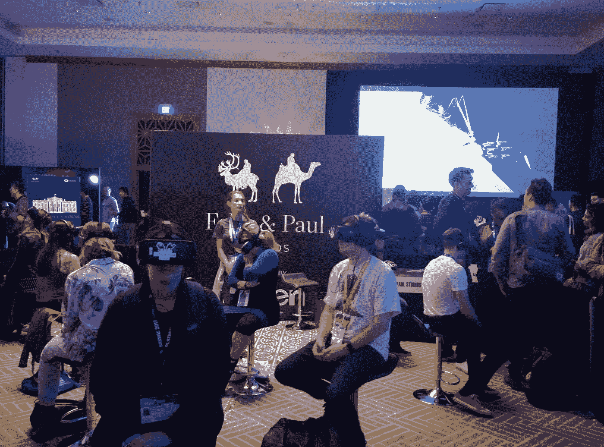
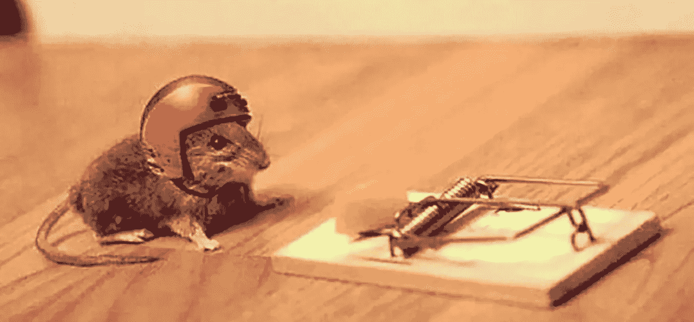
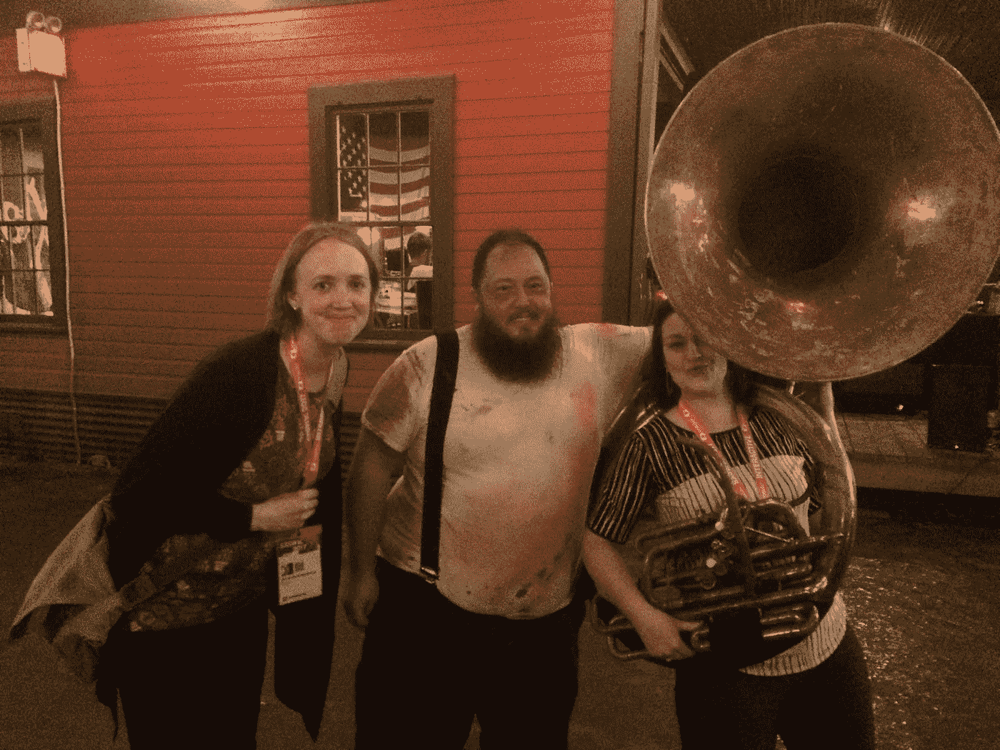
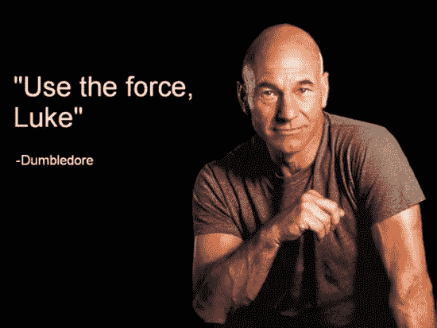
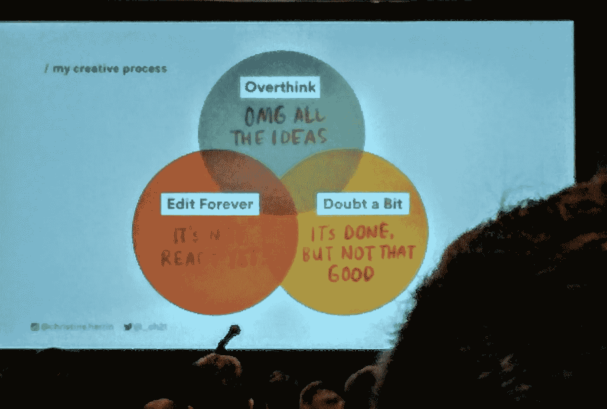
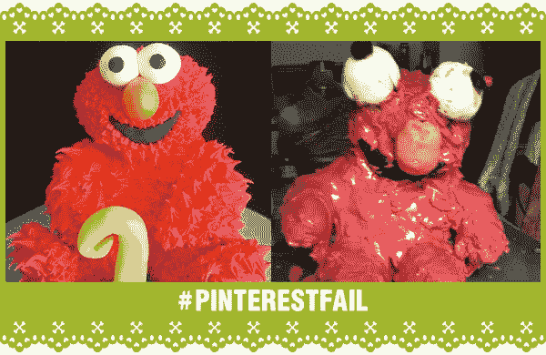
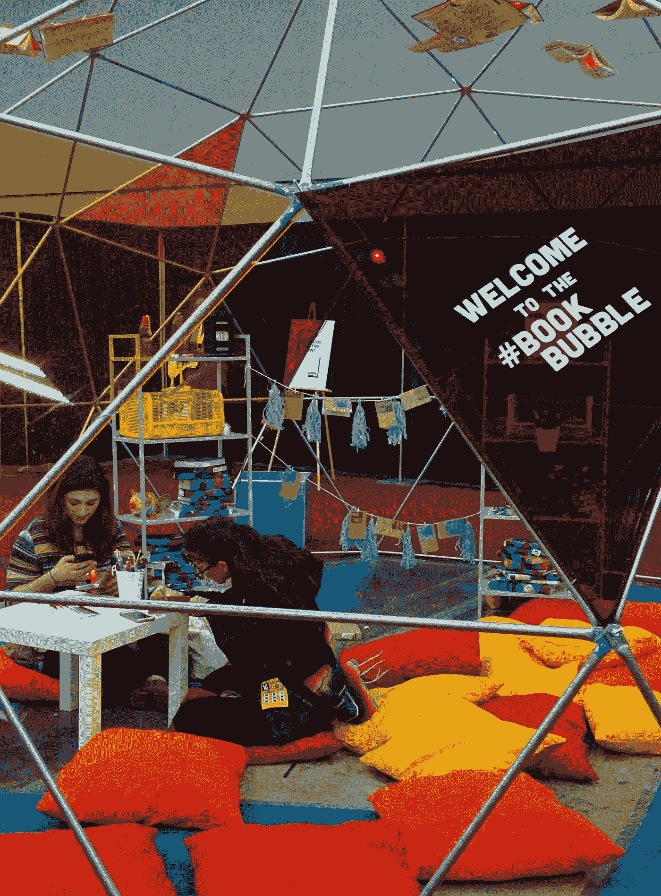
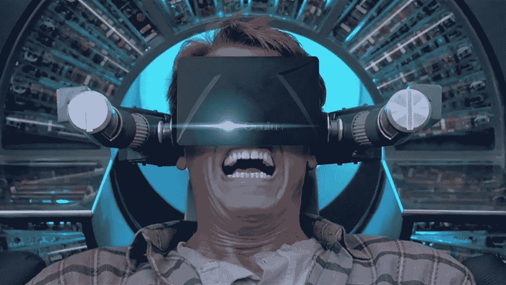
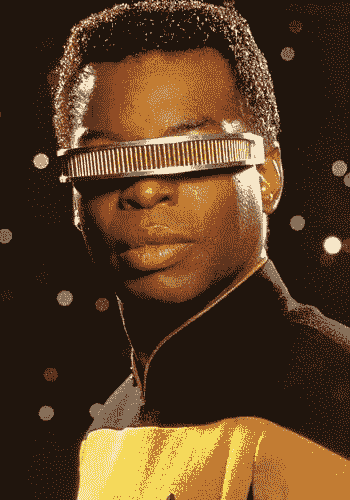
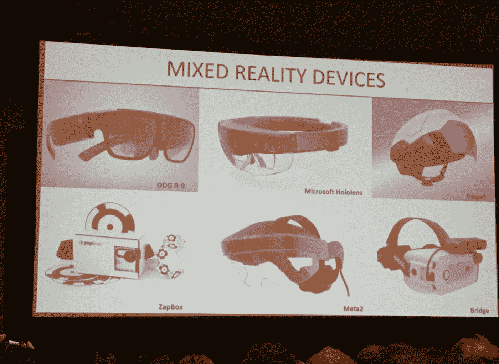

# 科技产品或锡箔:无论如何你都要戴上头盔。

> 原文：<https://medium.com/hackernoon/tech-based-or-tinfoil-youll-be-wearing-a-helmet-one-way-or-another-eee34dfb1571>

## 我在 SXSW 学到的 4 件事:2017 年最终总结

我已经从西南偏南回来将近两周了，所以有时间让我所有的新知识沉淀下来。在 SXSW 的每一天都是灵感、自我反思和前瞻性思维的旋风。这意味着每天都有高潮，甚至更高的高潮；很容易——几乎是必须的——把注意力集中在最近几个小时的外卖上，而不去反思前几天学到的任何东西。随着这段时间的流逝，我觉得更容易从整体上看待我的经历。而且，虽然仍然很难选出我的首要观点，但肯定有一些值得高度关注的重要主题。

Timidness won’t get you that yummy, orange, processed cheese.

# #1:大胆

(仍然允许恐惧、焦虑和咬指甲。)

如果有一件事我相信所有的发言者都有，一个我只适用于我亲眼所见的人的假设，那就是没有人*觉得*好像他们知道他们在做什么。在所有那些看似拥有一切，知道他们要去哪里以及如何到达那里，并在他们所选择的领域里步步高升的人当中，几乎所有人都和你我一样有着完全相同的自我怀疑。

那么，为什么那些人会成功，而我们却觉得自己在日常生活中苦苦挣扎？我认为很简单:他们没有让恐惧或反对者停止他们的追求。当然，说起来容易做起来难，不是吗？

My coworker, Amanda, and I posing with a member from a Zombie Band. A friendly “hello,” and he even let me hold his tuba!

# #2:拥抱每个人

*(当然，这是一种比喻——不是每个人都喜欢陌生人的拥抱。)*

我认为当去参加像西南偏南这样的大型活动时，很容易形成狭隘的观点。有些会议你想看，有些人你想见。很多时候，这种以工作为导向的心态非常适合完成预先选定的任务。然而，当一个人敞开心扉与你遇到的任何人进行随机和新的对话时，你会学到令人惊讶的东西。我从奥斯汀居民那里听到的一些最好的故事发生在被认为是平凡的日常生活中。一个乘坐奥斯汀司机解释了他的创业涉及一种创新的住房材料。另一个人在印度呆了半年，在宝莱坞风格的电影中担任演员。每一次偶然的相遇都提供了一个学习更多和变得更好的机会。

我相信比尔·奈说过:“你遇到的每个人都会知道一些你不知道的事情。”这句话是纯粹的真理，而且说得非常好。

*免责声明:我不保证此声明的准确性，也不保证是谁说的。毕竟，我只在互联网上见过它——一个以其无可挑剔的真实性而闻名的实体——而且，我不能声称曾经见过“科学人”然而，如果比尔·奈偶然看到这个博客，并想证实自己说过这句话，我会很乐意边喝咖啡边记录。*

Proof that every quote found on the internet is 100% accurate.

I’ve shown this image before, but it’s important enough for a second look.

# #3:不需要完美

*(除非你是航空工程师；那么，非常感谢。)*

如果每个人都等到事情完美后再公开揭露，我们还是会回到穴居人时代。

或许这也是不准确的。我现在可以想象 Jood:“该死，博士，你吓到我了。现在我的手印水牛都脏了。我们不可能让智人吃晚饭了，现在！”

重点是:除了你，没有人要求完美，你只要求自己完美。把你未完成的或者有问题的项目放出来。可能的结果如下:

*   其他人会帮助你看到你试图用不同的方式解决的问题。
*   人们想帮助你。事实上，大多数人希望看到你成功，并会提供他们可能提供的任何帮助。
*   新鲜的眼睛会帮助你比你自己更快地解决问题。

从为我的家庭博物馆雇主 Glensheen 工作的角度来看，我可以很容易地说，当我们努力提高自己的意识时，我们有许多成功和失败。一些快速推出的想法已经取得了巨大的成功；其他人都失败了。深思熟虑的想法也蓬勃发展。不过，也不尽然。尽管付出了巨大努力，有些还是失败了。所有这些的共同点是我们从每个事例中学到了很多。

当然，提出不完美的想法或项目需要一点勇气，但是清单上的第一条是“大胆”，所以试试吧！

If nothing else, try and then laugh at the result. At least you learned something and gave others a smile while doing so.

If you look closely, that yellow thing in the back looks like a hamster cage. It’s probably not, but one can hope.

# #4:建立你快乐的地方

*(我更喜欢 Tinker Toys 和 Lincoln Logs，但是你可以用最适合你的。)*

如果你想成功——不管你在做什么——弄清楚什么样的环境能发挥你的优势。我在以前的帖子中已经陈述过这一点，但是我有更多的时间来思考我的完美空间可能包含什么。虽然我可以想象没有两个创造性的快乐地方对任何两个人来说都是一样的，但我喜欢列出一个适合我的清单。

*   **我需要音乐。具体来说，我需要我的音乐。我从来都不是流行音乐、摇滚、乡村音乐之类的超级粉丝。不是因为作文，而是文字让我感到困惑。从我年轻的时候起，我就被一种叫做预告片的音乐所吸引。不，这不是拖车公园的音乐；这是你在电影预告片、商业广告中听到的器乐片段，也是劣质警匪片中的戏剧性背景。我发现这可以让我的思想去史诗般的地方，我可以为项目量身定制音乐。我可以为孩子们的活动找一首轻快的曲子，或者为一个更戏剧性的设计结果找一首重拍。虽然，我不得不承认，我最近创作了一张圣诞海报，听着音乐，我只能说听起来像是一个机器人被放进了碎木机。**
*   我需要噪音。我无法忍受安静的环境。安静实际上变得响亮，无所不包。相反，我更喜欢背景噪音。这可能是远处同事的谈话声，可能是一些学生在参观完我的博物馆后发出的咯咯笑声，甚至可能是我办公室里雨点敲打单层玻璃窗的声音。不管怎样，噪音要求我集中注意力。
*   **我需要批评和/或辩论。我是一名创意人员。作为我在这一领域所受训练的一部分，我从小就被灌输这样一种观念:来自一个人的想法是不完整的。虽然在展示了第一张海报后，我内心的自我可能喜欢听到“太完美了”，但我内心的智慧妖精确保我知道这不是真的。我需要有人来挑战我在创作中做出的选择。我可能不总是同意他们的想法或意见，但我从来没有过比这更糟糕的对话了。**

额外的项目可以很容易地添加到我的清单。不过，名单本身并不是重点。关键是，一旦你找到了适合你的工作，尽可能地重新创造那个空间。认识到你的清单可能对其他人不一样也是非常重要的。我认为，我自己列出了一些，帮助我认识到，即使在我的同事群体中，我们所有的子弹都是不同的。当你认识到什么对你有用，就更容易认识到什么对别人有用。默认情况下，一个更有利于创新的环境将会出现。

VR was predicted in the 1990s Sci-Fi epic, Total Recall. Secret agent (imagined or suppressed) memories not included.

# #4:虚拟现实和增强现实已经存在。

*(科技产品或锡箔:无论如何你都会戴上头盔。)*

虚拟现实和增强现实将改变我们的日常生活方式。集成过程会很慢，比我希望的要慢，但最终我们都需要接受这项技术。

在最近的几周和几个月里，我和很多人进行了这样的对话。在 SXSW 之前，我的观点主要基于观察。现在，我对这个信念有了更坚实的基础。

我了解其他人关于他们为什么认为 VR 和 AR 将成为一种趋势的论点，我了解。例如，看看谷歌眼镜。

Google Glass circa 1992.

许多人会认为谷歌在这个项目上的努力是失败的。他们在 2013 年左右推出了这个项目《炮火连天》。四年后，你很难在街上找到一个敢穿这些的人。

而且，我们不要忘记起飞前崩溃的 3D 电视“热潮”。围绕损害视力的研究可能在这里发挥了作用，但现实是消费者只是不想买这么无聊的东西。

## 虽然这些并不是真正的“失败”。每一步，远见者都在学习。

*(回头参考#3，了解为什么这很重要。)*

*   消费者想要什么？
*   消费者到底需要什么？
*   什么能为消费者的生活增加价值？
*   我们如何将这些融入他们现有的生活？

A handful of the VR/AR headsets currently available.

事实上，尽管过去十年在这一领域“失败”,公司仍在继续前进。新的 [Snapchat Spectacles](https://www.spectacles.com/) 努力让用户更容易、更方便地拍照。我们自己的军队已经在使用各种版本的 AR 来加快某些过程。我们的青春是伴随着 VR 游戏和手持 AR 成长起来的，比如 Pokemon Go。他们将继续对这些平台提出更多要求。

一旦公司找到将这些新兴技术融入我们日常生活的方法，我们将变得像依赖手机一样依赖它们。事物不会为了进化而进化。为了方便起见，固定电话变成了无绳电话。为了方便起见，手机进一步发展成了手机。翻盖手机进化成智能手机(或迷你电脑)是为了，等等…方便。当技术赶上我们对便利的新渴望时，VR 和 AR(主要是 AR)将被视为一种近乎必要的东西。

当然，虚拟和增强现实将在前进的道路上经历更多的尝试和错误、成功和失败。这是过程的一部分。

对于所有仍然存在的反对者，我只想提醒大家:曾经有一段时间，家用电脑被认为是轻浮的，是大众一时的狂热。你有多开心那不是真的？大胆的远见者接受新想法，在产品完善之前推出产品，并开始创造新想法蓬勃发展的工作环境——所有这些都是为了给你带来我们今天认为理所当然的东西:计算机，你有多高兴？毕竟，如果没有一个，你甚至无法阅读我的 4 大 SXSW 外卖！

> [黑客中午](http://bit.ly/Hackernoon)是黑客如何开始他们的下午。我们是 [@AMI](http://bit.ly/atAMIatAMI) 家庭的一员。我们现在[接受投稿](http://bit.ly/hackernoonsubmission)并乐意[讨论广告&赞助](mailto:partners@amipublications.com)机会。
> 
> 如果你喜欢这个故事，我们推荐你阅读我们的[最新科技故事](http://bit.ly/hackernoonlatestt)和[趋势科技故事](https://hackernoon.com/trending)。直到下一次，不要把世界的现实想当然！

