# 图形科技生活 2

> 原文：<https://medium.com/hackernoon/tech-life-as-graphs-ii-f1aa454f5838>

另一方面，我试图将我的科技生活形象化为图表

# 原生应用

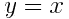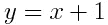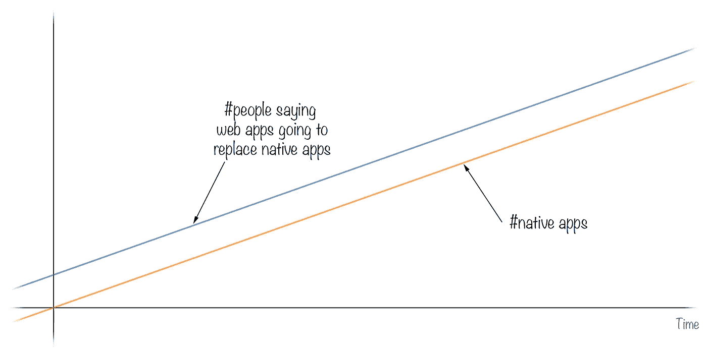

# 结对编程

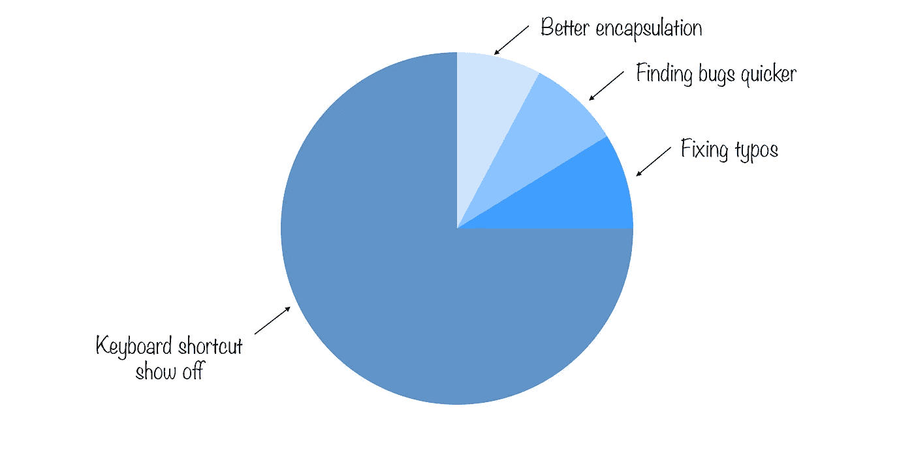

# Ruby on Rails magic

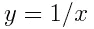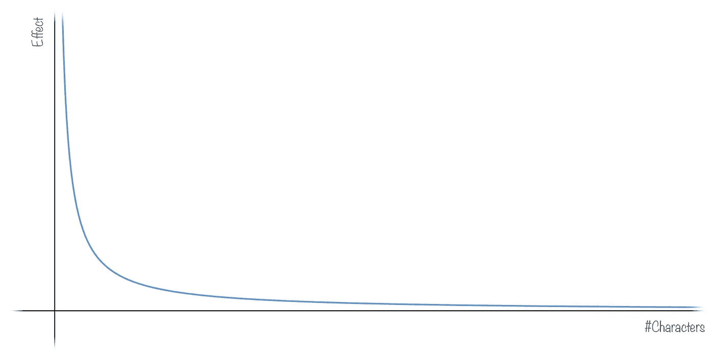

# 演讲

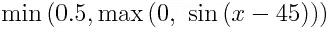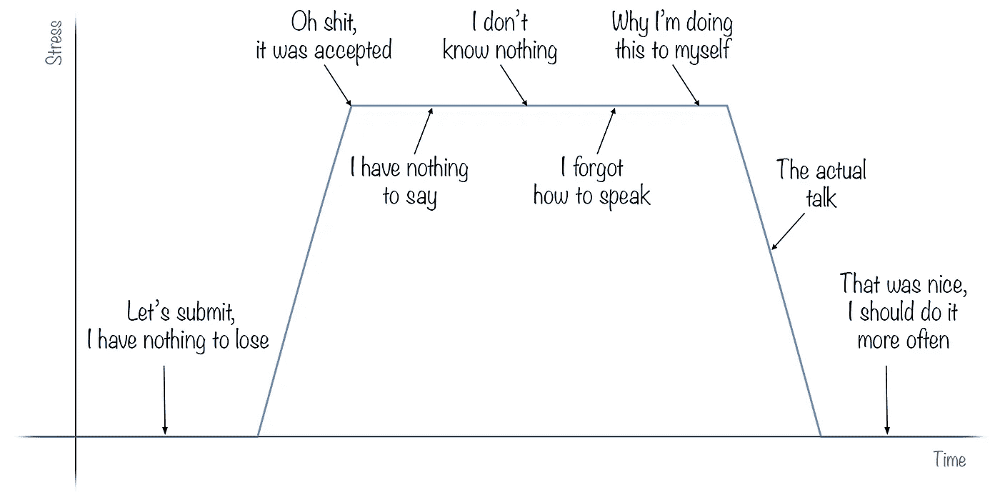

# JS 炒作

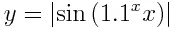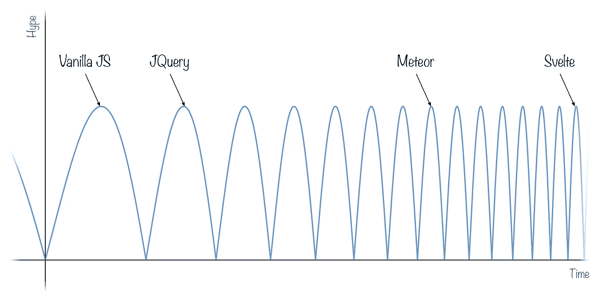

# 工作时间

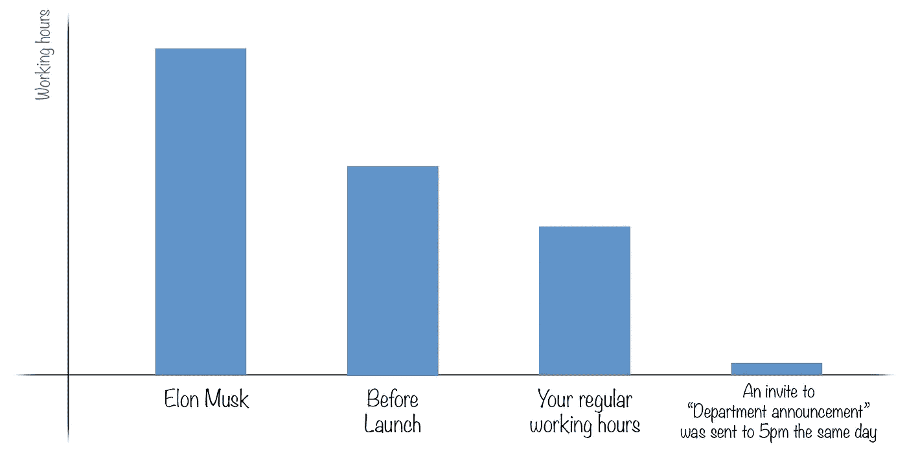

# 拉取请求

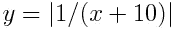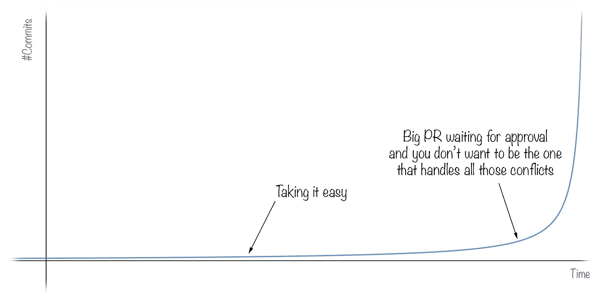

# 看[韦斯博斯](https://medium.com/u/86a55cd7983b?source=post_page-----f1aa454f5838--------------------------------) JS 教程的时候

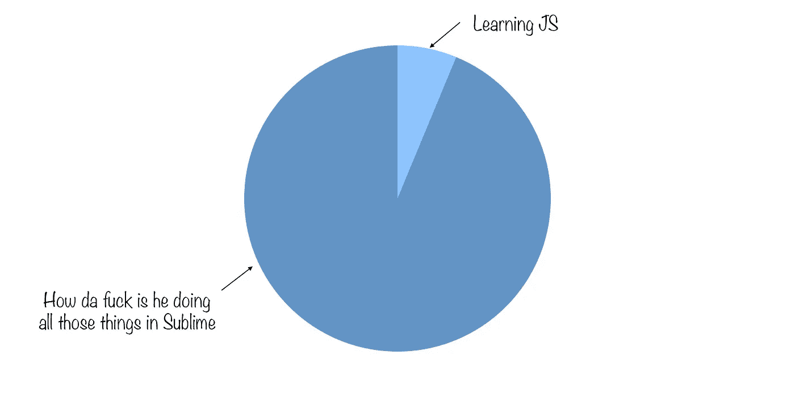

# 电子邮件

如果你喜欢这篇文章，请点击下面的♡。作为一个作家，它意味着整个世界。

如果您想让 Medium 告诉您有关新帖子的信息，请点击关注按钮。

*原载于 2017 年 5 月 19 日*[*she M8 . github . io*](http://shem8.github.io/blog/2017/05/19/tech-life-as-graphs-2/)*。*

> [黑客中午](http://bit.ly/Hackernoon)是黑客如何开始他们的下午。我们是 AMI 家庭的一员。我们现在[接受投稿](http://bit.ly/hackernoonsubmission)并乐意[讨论广告&赞助](mailto:partners@amipublications.com)机会。
> 
> 如果你喜欢这个故事，我们推荐你阅读我们的[最新科技故事](http://bit.ly/hackernoonlatestt)和[趋势科技故事](https://hackernoon.com/trending)。直到下一次，不要把世界的现实想当然！

