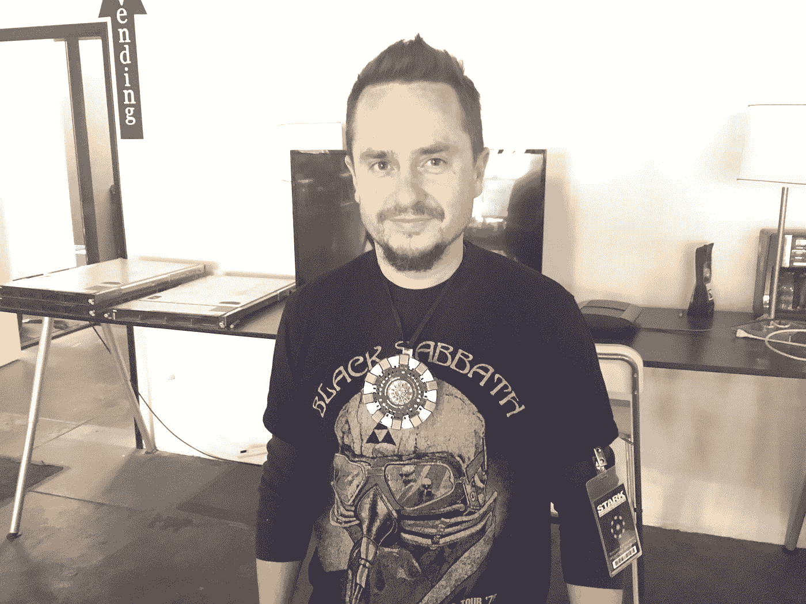
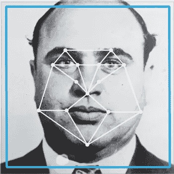
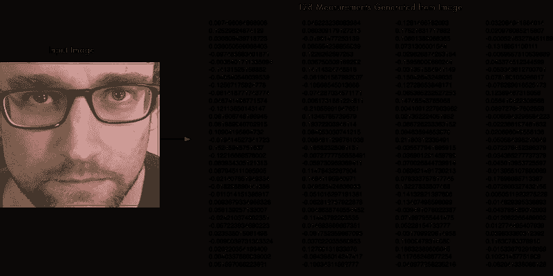
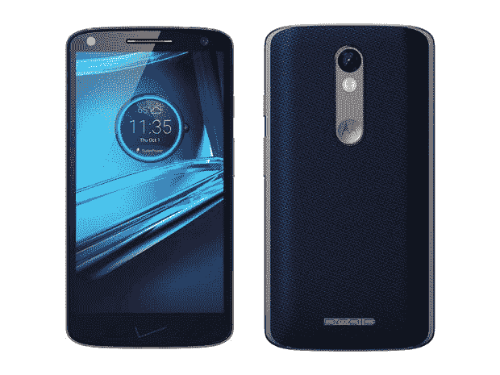
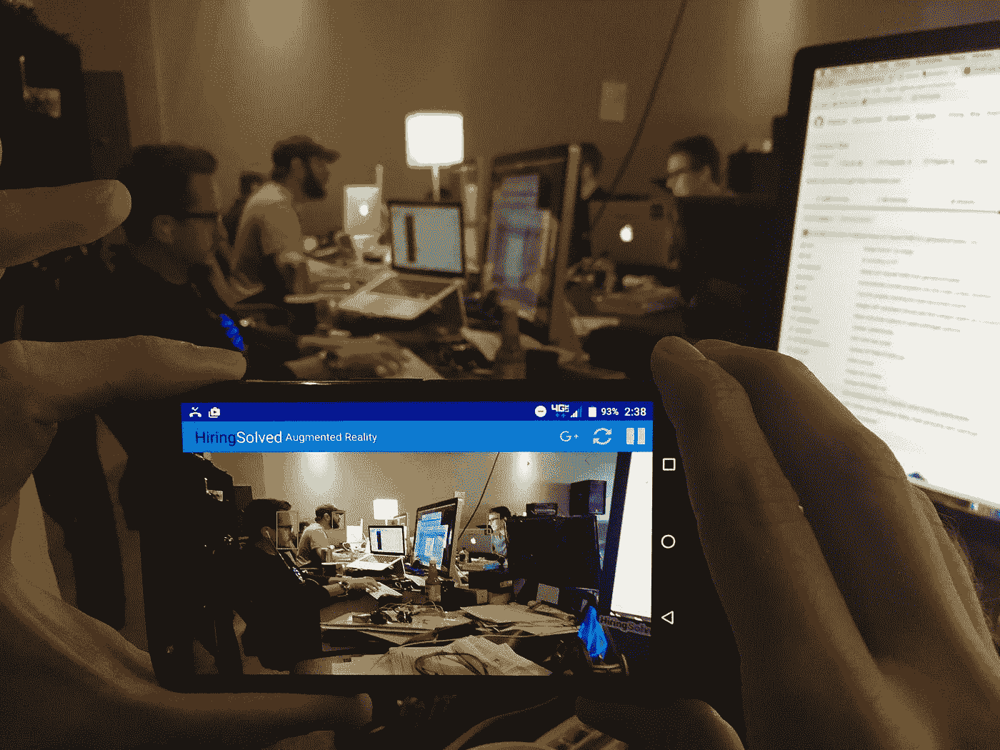

# 科技创业公司在面部识别方面击败联邦调查局

> 原文：<https://medium.com/hackernoon/tech-startups-beating-fbi-at-facial-recognition-81a03666c54>

所以不要慌。还是做？我不知道

一天晚上，公司创始人兼首席执行官肖恩·伯顿做了一个疯狂的梦，梦见自己变成了钢铁侠。他穿着机械化的超级套装，配有所有的火箭、激光束和瞄准头盔。

反气候，他不在战场附近。他在参加一个人力资源会议。

像我们中的许多人一样，Shon 已经成为梦见工作的受害者。

起初很失望，然后 Shon 注意到他的头盔正在做一些有趣的事情。无论他看向哪里，瞄准十字线都会锁定某人的脸，并填充一个包含该人所有专业信息的浮动字段。

名字，联系方式，头衔，成就…你说吧。

当他醒来时，他认为“这是完全可行的”。

“我们愿意并很兴奋地看到可以做些什么——我们有大量的数据和有趣的功能，所以我们与工程团队一起看看会发生什么。这成了我们的暑期实验室项目之一。”伯顿说。

# 同时…

最近[乔治敦大学的一项关于联邦调查局使用面部识别的法律研究表明，1984 年已经到来，我们正在成为这个政党的成员。](https://www.perpetuallineup.org/conclusion)

标题为 [*警察的文章拥有 1.17 亿张人脸的数据库。你大概在里面*](https://www.wired.com/2016/10/cops-database-117m-faces-youre-probably/) 来自 *Wired* 帮忙描绘一下老大哥在这里的画面。

高级图像处理是否像乔治敦大学建议的那样，为当地执法部门、联邦调查局、中央情报局和其他联邦机构创建了一个“[永久阵容](https://www.perpetuallineup.org/conclusion)”？

还是世界上的托尼·斯塔克斯先到了那里？

“在过去的二十年里，人脸识别的错误率已经降低了三个数量级”——脸书研究

# 伴随着大数据而来的是巨大的责任

# 招聘背景已解决

[招聘解决方案](https://hiringsolved.com/?code=techcrunch)主要在人才获取领域发挥作用。他们的工程团队开发了像 [RAI](https://hiringsolved.com/hello/rai) 这样的产品——一种帮助招聘人员在网上发现候选人的对话式人工智能。[PROPHET](https://chrome.google.com/webstore/detail/prophet/alikckkmddkoooodkchoheabgakpopmg)——一个 Chrome 扩展，可以预测和发现你访问的任何人的页面信息，还有[talent feed](https://hiringsolved.com/?code=techcrunch)——一个类似谷歌的搜索引擎，可以抓取网络和签约公司的候选人数据库，将每个人汇集和组织到一致的专业档案中。

# 托尼·斯塔克诉法律

# 面部识别的原则

“常规流水线由四个阶段组成:**检测** → **对齐→** **表示→** **分类**。”— [脸书大学的研究](https://research.facebook.com/publications/deepface-closing-the-gap-to-human-level-performance-in-face-verification/)

# 检测:找到一张脸

# 联邦调查局

在执法中，这个阶段依赖于像[眼睛位置或皮肤纹理](https://www.perpetuallineup.org/)这样的东西。这就产生了区别黑人的问题。

# 科技创业公司

与联邦调查局在图像中寻找人脸的方法不同， [HiringSolved 的](https://hiringsolved.com/?code=techcrunch)人脸检测步骤不使用任何东西，除了光线的方向。

这种方法被称为梯度方向直方图或 HOG。对于该方法的第一步，系统使图像去饱和，使其黑白渲染颜色不相关。

然后，系统会根据像素从亮到暗的顺序，用箭头替换所有像素，使系统能够根据创建的模式检测面部的不同特征。

# 对齐:面向前方居中

# 联邦调查局

FBI 很难处理模糊或排列不当的人脸。

为了准确读数，联邦调查局系统必须直接捕捉人脸。他们不能处理偏离中心轴超过 15 度的图像。

FBI Tech Designed for Mugshots

# 科技创业公司

[HiringSolved](https://hiringsolved.com/?code=techcrunch) 使用的技术可以使用两部分对齐方法在任何位置对齐任何面。

第一部分是基于“面部标志估计”方法的算法这将一张脸分解成 68 个点，每个点代表一个面部标志。

第二部分是进行“仿射变换”的算法这会旋转、缩放和剪切图像，因此所有内容都在前面和中心。

任何处理过的图像现在应该有眼睛和嘴巴在大致相同的位置，这样它就可以准备编码了。

# 表示:将图像转换为数值集

# 联邦调查局

联邦调查局可能不会采取这一关键的节省时间的步骤。

一份来自他们面部识别[程序](https://hackernoon.com/tagged/program)的[文件](https://www.eff.org/document/fbi-face-recognition-documents)建议他们可以完全跳过代理:

“所有提交给 IPSFRP 系统的搜索文件必须包括搜索对象的一张正面照片。此外，必须使用 JPEG 编码在搜索交易中压缩人脸图像。”

此外，他们的系统会比较预先确定的特征测量值，如两眼之间的距离。

# 科技创业公司

将数百万个图像文件相互匹配需要很长时间，因此科技初创公司使用一组数字来表示，处理匹配的速度要快得多。

HiringSolved 的系统使用机器[学习](https://hackernoon.com/tagged/learning)技术来决定记录面部的哪 128 个测量值，不像 FBI 系统使用人类确定的测量值。

[HiringSolved](https://hiringsolved.com/?code=techcrunch) 然后获取对齐的面部并捕捉面部测量值以供表示。这种捕获在机器学习界被称为“嵌入”。

为了在下面的分类步骤中获得最佳结果，经验法则是每人嵌入 20+张图像以获得更高的准确性。

# 分类:在数据库中寻找最接近的匹配

# 联邦调查局

联邦调查局不会只找到一个匹配的。相反，系统会找到前 50 名。根据电子前沿基金会(Electronic Frontier Foundation)的一项研究，在这前 50 个匹配中，它声称其中一个匹配的概率只有 85%。

EFF 的报告评论说，像这样的系统“将返回大量错误的人的图像。”

美国联邦调查局依靠的数据库只包括驾驶执照照片和面部照片。因此，他们的系统实际上只能参考一两张人的照片，这降低了他们的测量精度。

# 科技创业公司

[HiringSolved](https://hiringsolved.com/?code=techcrunch) 有一个与 FBI 类似的问题，因为他们的图像数据库的人均数量也很低。

工程师们选择为分类器构建一个实时训练器，而不是依赖于低于标准的图像量。

培训师在 MacBook 上启动，询问用户的姓名和公司，然后捕捉一个短视频。这需要用户的 50 个图像用于嵌入。

一旦使用 50 幅图像训练了分类器，它就可以通过服务器由计算机的摄像头访问。

由于 [HiringSolved](https://hiringsolved.com/?code=techcrunch) 正在开发一款移动面部识别产品，他们为 Droid Turbo 2 开发了分类器应用。

||

v

在用多个人的脸训练分类器后，该设备能够在两秒钟内找到匹配！

# 害怕联邦调查局？

我们应该害怕我们的政府统治者吗？

不，还没有。

虽然联邦调查局有权访问面部数据，但这些数据过于分散，他们不能有效地利用这些数据。

如果一家小型科技初创公司能够开发出高度准确的面部识别软件，以相对低廉的价格用于拍照手机，与脸书目前吹嘘的 98%的准确率相媲美，我们需要相信世界上的托尼·斯塔克斯(以及 Facebook、Snapchats 或谷歌)正在善用他们的力量。

一些实体，如脸书，拥有大量索引图像的主要固有优势，而其他实体则努力创造收集面部数据的噱头(参见微软的“[我看起来有多大?”？](https://how-old.net/)“app)。

让人们给你做面部埋线很难。

要是有一种胁迫人们的方法就好了。我们可以让它变得有趣。免费。和社交。让人们邀请他们的朋友。展开它。让他们把愚蠢的卡通物品放在脸上。那你保证我们会全部删除。

公平地说，Snapchat [声称](https://www.snapchat.com/privacy-center/our-approach)他们无法“识别特定的面孔”。

那么为什么要担心呢？这并不像他们有一个[秘密](http://www.businessinsider.com/what-its-like-to-work-at-snapchat-2016-10?utm_content=buffer95448&utm_medium=social&utm_source=facebook.com&utm_campaign=buffer-ti)工程翼或类似的东西。

(*免责声明:我在 2016 年秋天写了这个故事，所以联邦机构很有可能已经开始采纳最新的面部识别系统。技术到现在。*)

> [黑客中午](http://bit.ly/Hackernoon)是黑客如何开始他们的下午。我们是 [@AMI](http://bit.ly/atAMIatAMI) 家庭的一员。我们现在[接受投稿](http://bit.ly/hackernoonsubmission)并乐意[讨论广告&赞助](mailto:partners@amipublications.com)机会。
> 
> 如果你喜欢这个故事，我们推荐你阅读我们的[最新科技故事](http://bit.ly/hackernoonlatestt)和[趋势科技故事](https://hackernoon.com/trending)。直到下一次，不要把世界的现实想当然！

