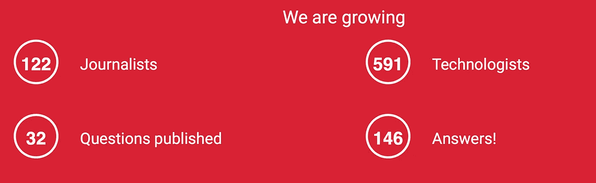

# TechforReporters:它还活着！

> 原文：<https://medium.com/hackernoon/techforreporters-its-alive-61d5ad8d3a9e>

几周前，我发表了一篇关于我的新项目 [TechForReporters](http://techforreporters.com) 的[高调的黑客午间贴](/@johnbiggs/unleash-technology-get-freedom-8bb5cfd89a0f)。这些都是大胆的声明和对“真相”的疯狂搜寻。它没有包含的是冷冰冰的、硬邦邦的数字。

现在我有了。吊杆:

在几个月的时间里，在没有积极营销的情况下，我们用 146 个专家答案回答了 32 个问题。我已经说服了 591 个坏脾气的线人和 122 个坏脾气的记者联系。我们在了解技术的人和知道如何讲故事的人之间建立了联系。

我非常高兴。

我也有一个额外的小故事给你。几天前，我在剑桥分析内部发布了一个[联系人的请求。我本以为它会在 grill 上失败，但是它被观看了 47 次，并获得了一个真正有用的线索。我用自己的工具给自己找了些东西。我吃了自己的狗粮，味道很好。](https://techforreporters.com/main/questions/59c8feab83922958d9dff9ac)

我现在可以说这件事成功了。事实上，第一次，我对 T4R 和我的另一个[项目](http://typewriter.plus)非常满意。几周前，我的一个朋友看着我笑了。

“我知道你这些天为什么高兴，”他说。

我耸耸肩。我不知道我很快乐。

"你所感受到的那种感觉就是当你受到牵引力时所发生的."

看来他是对的。

— -

在这里报名参加[TechforReporters.com](http://techforreporters.com)。早上好！