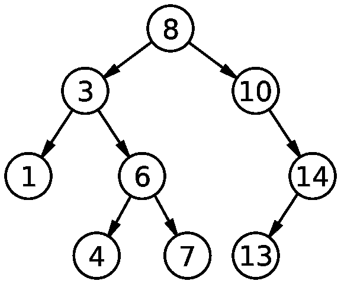

# 对不擅长算法的人进行技术面试

> 原文：<https://medium.com/hackernoon/technical-interviewing-for-people-who-suck-at-algorithms-96178d389a83>

我最近开始在谷歌进行面试，到目前为止，我对能够产生复杂代码的程度感到非常震惊*不是*让我认为一个候选人值得雇用的一部分。

我认为这是件好事。我知道有算法奇才，但我个人不是其中之一。我认为我是一个相当不错的程序员，但是出于各种原因，包括:

*   缺乏对算法的集中练习，以及
*   我在学校做的那种课程，还有
*   在< 30 minutes, on a whiteboard, when I very much want to do well,

I tended to underperform in interviews relative to my actual technical ability. I’m sure there are a lot of other people in the same situation. This article is directed to you — the good-programmer bad-interviewee — to outline some things that never ocurred to me when I was sitting on the other side of the table.

I’ll note, first, that yes, the traditional algorithmic interview isn’t a great gauge for actual programming ability. I do think that it’s a reasonable compromise between competing demands of the tech hiring process:

*   avoiding implicit bias vs trusting the interviewer
*   keeping the bar high vs holding on to good candidates
*   testing general programming ability vs exercising practical skills

I’ll avoid getting too sidetracked on that, for now. But the takeaway message is that *算法中处理一个(非自然的)未详细说明的问题的焦虑不是面试的重点*。在一个协作的环境中，找出你的一般软件能力，处理不熟悉的、领域中立的问题，这是一件很无聊的工作。记住这一点，你快速说出一个“通过单元测试”的解决方案的能力并不是面试过程的全部，就像你每天大量生产 SLOC 的能力并不是你专业软件开发生活的全部。

(声明:这纯属我个人观点。它不反映任何内部招聘准则，我没有资格给你任何保证，这将有助于你被录用。)

## 技术面试的黄金法则

> 当你写代码的时候，按照给你的输入例子一行一行的走一遍。

就是这样。

这或多或少和传统的建议“在解决问题的时候大声思考”是一样的——如果你真的能写出任何代码，那么在你写你的解决方案的时候，你很可能正在你的大脑中处理输入的内容。但我发现在面试中很难记住在压力下大声思考。当你在努力解决一个问题时，很难从你头脑中提取所有的垃圾；对于任何问题，您都可以一行一行地浏览示例输入，而不需要任何特殊的洞察力。

除此之外，我认为受访者倾向于高估他们代码的清晰程度。面试官脑子里没有一大堆测试案例，他们无法即时运行这些案例来验证你的解决方案——不幸的是，我不是 HackerRank 的在线评委。

受访者倾向于粗制滥造出一个解决方案，然后转向你说:“好了！搞定！”如果不在输入中运行，真的很难判断答案是否正确。白板代码通常是不必要的复杂。人们对同一个问题产生截然不同的代码，因为他们对它的概念化不同。作为面试官，很难区分错误的代码和特殊的代码。

如果你在测试用例中一行一行地测试你的代码，你会让我相信你用按位操作符重新实现加法的选择会产生正确的输出，不管我一开始有多怀疑。除此之外，我认为这种来来回回，让审查者相信你的代码是最好的，真的代表了你作为专业人员每天所做的事情。如果面试过程能让你展示自己在该部门的能力，那么它就能起到预期的作用。

你从自己的代码中得到的最后一个好处是，它让你在面试官之前发现你的错误。如果你的解决方案中有一个错误，这并不可怕，但是如果你能够自己发现它，这表明在没有监督的情况下，你能够在第一天就富有成效。

## 浏览一个例子

本着这篇文章的精神，让我们来讨论一下我所提倡的策略。以下是摘自[此链接](https://www.reddit.com/r/cscareerquestions/comments/20ahfq/heres_a_pretty_big_list_of_programming_interview/)的一个面试问题:

> 给定一个 BST，找出第二大元素。

假设我们的候选人正在编写 Python，并且我们同意用下面的类来表示输入:

```
class Node:
  def __init__(self, value, left, right):
    self.value = value
    self.left = left
    self.right = right
```

我们也同意输入至少有三个节点，为了简单起见，提供下面的输入示例:



An Example BST

我们期望输出 13。

坐在家里的电脑前，你可以看到解决方案是这样的:BST 的最大节点是最右边的叶子，BST 的定义保证了下一个最大值是最右边叶子的父节点，所以你沿着每个顶点的最右边走，直到你看到一个顶点的子节点没有子节点，然后返回那个值。

在平静、合理的条件下编写的代码可能看起来像这样:

```
def second_largest_value(root):
  child = root.right or root.left
  if child.right or child.left:
    return secold_largest_value(child)
  else:
    return child.value
```

如果你写了这样一个答案，为了子孙后代，你仍然应该在你的输入上测试它。但这是我对这个问题的预期，它看起来像是我自己头脑中的解决方案，它没有做任何让我怀疑的奇怪事情。

问题是白板代码通常不是这样的。我知道我的没有。候选人可能会向您描述完全正确的算法，然后生成如下所示的代码:

```
def second_largest_value_helper(root, biggest_vals=[]):
  if not root:
    return biggest_vals

  if root.value > max(biggest_vals):
    biggest_vals.append(root.value)
    biggest_vals.remove(min(biggest_vals))
  elif root.value > min(biggest_vals):
    biggest_vals[0] = root.value

  if not (root.right is not None):
    return second_largest_value_helper(root.right, biggest_vals)
  else:
    return second_largest_value_helper(root.left, biggest_vals)

def second_largest_value(root):
  return second_largest_value_helper(root)[0]
```

我在这里有点开玩笑，因为我认为这个问题比现实的面试问题简单一点，但是在白板上看到这段代码我不会感到惊讶。

现在轮到你了——快，在你进入下一个问题之前，你有 30 秒的时间——这个代码是正确的吗？它与自然的解决方案大相径庭，并且没有利用我们确定为键的 BST 属性(第二大值是最右边叶子的父节点)。它提交[可变默认参数 sin](http://stackoverflow.com/questions/1132941/least-astonishment-and-the-mutable-default-argument) 。它混淆了对*最大值*的思考方式——有时我们需要使用 min 来计算第二大值是什么，而其他时候我们依赖于它被排序。

候选人在黑板上写下听起来正确的想法时，表现得相当健谈，但现在他或她已经惊呼“完成了！”转向你，等待你的回应。你说什么？

## 讨论我们的问题

如果你写了这个解决方案，你可以挽救它。一个好的演讲听起来可能是这样的:

> 候选人:我们从顶部开始，所以“ *root.value* 是 8。我们点击“如果不是根”这是假的，所以我们继续。现在如果*root . value*>*max(maximum _ vals)*…哦，哎呀，那是个错误。我可以假设输入现在是正的吗？
> 
> 面试官:当然可以。
> 
> 考生:好的。所以我会把我的第一个电话改成这样:

```
def second_largest_value(root):
  return second_largest_value_helper(root, [0, 0])[0]
```

> 考生:好的。所以现在 root.value *大于零，所以在这个块的末尾我会有*maximum _ vals =[0，8]* 。现在 *root.right* 不是 *None* 所以我们进入第一个递归调用。*
> 
> 记者:好的。
> 
> 候选人:在顶部，*根*仍然不是*无*所以我们不返回。现在 *root.value = 10* 。那比 *8* 大，所以第一个条件为真。我们再次更新*maximum _ vals*，所以现在是*【8，10】*。那么 *root.right* 仍然不是 *None* ，那么我们进入第二次递归调用。
> 
> 记者:好的。
> 
> 候选人:我们又经历了同样的事情，现在*最大值*是*【10，14】*。现在*根左*是*无*所以我们不进入第一个调用。我们确实进入了第二个调用，在顶部我们的*根*不是 *None* 并且*根.值*是 *13* 。它小于 *14* ，所以我们不进入第一个条件，但它大于 10，所以我们进入第二个条件。所以在那之后，*最大 _ 瓦尔斯*就是*【13，14】*。
> 
> 记者:有道理。
> 
> 候选人:那么现在我们再用 *root.left* 进入通话。没有，所以我们返回*maximum _ vals*。这一直回到顶部，在那里我们返回第一个元素，即 *13* 。这就是我们想要的，所以在输入上是正确的。

现在，通过这次谈话，我们采取了一个非常糟糕的解决方案，它有一堆危险信号，在没有面试官提示的情况下发现了一个错误，我们都确信你的答案是正确的。我们花了一些时间，但都花在了做面试要做的事情上——展示你对问题的理解，并证明你可以不用手牵着手从 A 点到 B 点。我们不需要花 150 个小时来练习同一个动态编程问题的细微变化。

> [黑客中午](http://bit.ly/Hackernoon)是黑客如何开始他们的下午。我们是 [@AMI](http://bit.ly/atAMIatAMI) 家庭的一员。我们现在[接受投稿](http://bit.ly/hackernoonsubmission)并乐意[讨论广告&赞助](mailto:partners@amipublications.com)机会。
> 
> 要了解更多信息，[请阅读我们的“关于”页面](https://goo.gl/4ofytp)、[在脸书上给我们点赞/发消息](http://bit.ly/HackernoonFB)，或者简单地说， [tweet/DM @HackerNoon。](https://goo.gl/k7XYbx)
> 
> 如果你喜欢这个故事，我们推荐你阅读我们的[最新科技故事](http://bit.ly/hackernoonlatestt)和[趋势科技故事](https://hackernoon.com/trending)。直到下一次，不要把世界的现实想当然！