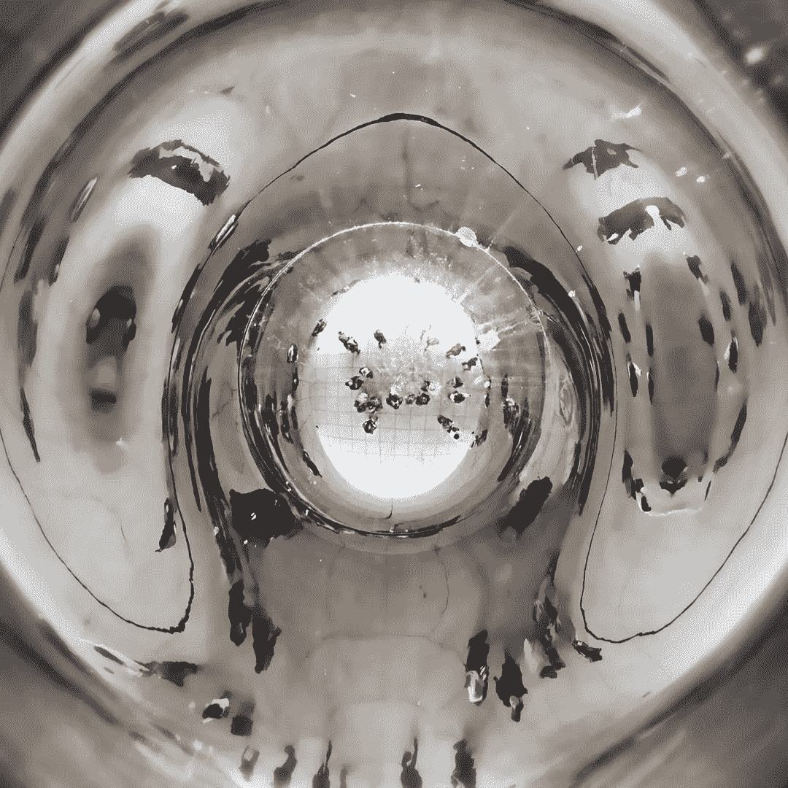

# 技术重塑我们的生活

> 原文：<https://medium.com/hackernoon/technologies-reshape-our-lives-92b19a45a765>

有些人可能想要更快、更新的技术，而不考虑短期和长期的后果。营销可能会诱使一些人相信创新是通向美好未来的手段。有些人可能会变得乐观。但是技术不应该根据新颖性来判断，而应该根据它们如何影响我们的生活来判断。

精神上的痛苦和困惑可能来自对新技术的盲目采用和使用。从市场营销来看，新技术的好处是显而易见的，但其后果却难以预料。技术推动和拉动不同的杠杆，使某些任务更有效，但可能有一些副作用，一些人可能想更好地了解。

未能理性地理解和使用新技术，一些人可能会觉得理论家马歇尔·麦克卢汉在*媒介就是信息*中写道:“无数的困惑和深深的绝望总是出现在伟大的技术和文化转型时期”(1967)。

对技术转型带来的精神痛苦和社会文化景观变化的担忧并不新鲜。

新技术简化了任务。我们的 iPhones 和社交媒体简化了沟通。但是不自然的加速可能会让一些人觉得超载。考虑使用哪些技术以及使用频率。

当新技术改善生活时，退后一步，控制该拉什么杠杆。如果我们不这样做，他们就会控制我们。

放慢速度，夺回控制权。

*我写了一本关于数字成瘾的书。现在购买从* [*巴诺*](https://www.barnesandnoble.com/w/trapped-in-the-web-an-turner/1129986845) *或*[*indie bound*](https://www.indiebound.org/book/9781732182196)*。*