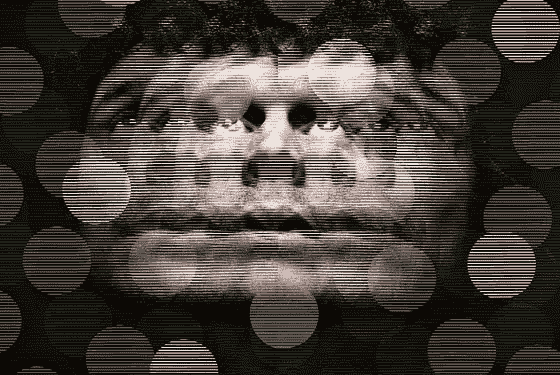

# 技术简化了流程，导致超负荷

> 原文：<https://medium.com/hackernoon/technologies-streamline-processes-and-thus-our-experience-8c3d94784501>

为什么有些人会对他们的数字生活感到超负荷和压力？

技术简化了任务，加快了我们的生活。无论是工作场所的自动化，更快速的交通，还是新形式的信息传播和交流。然后，我们可能需要努力应对不断变化的文化和社会价值观——我们如何评价和相互交往——这些都源于这种变化。

今天的信息技术让人们通过数字技术不断互动。每当信息技术进步时——无论是印刷媒体还是今天的数字媒体——我们交流和分享信息的能力都会提高。但是这可能会导致信息超载的感觉，就像人们报道的那样，即使在印刷时代也是如此。无论是过去的印刷文本还是现在的数字内容，新的信息技术都需要更多的心理处理。它也提供了好处，但超负荷的感觉可能随之而来。

我们的时代涉及信息消费和交换的快速增长。如果我们需要，手机和笔记本电脑的处理速度可以让我们持续交流和分心。

虽然此刻令人愉快，但一些人可能需要重新考虑孤独的缺失和持续消费表面的分心和新颖的数字信息。就像人们在过去利用印刷技术和大量可用信息所做的那样，一些人可能会从小心保护自己中受益。

我写了一本关于数字成瘾的书。现在购买从 [*巴诺*](https://www.barnesandnoble.com/w/trapped-in-the-web-an-turner/1129986845) *或*[*indie bound*](https://www.indiebound.org/book/9781732182196)*。*