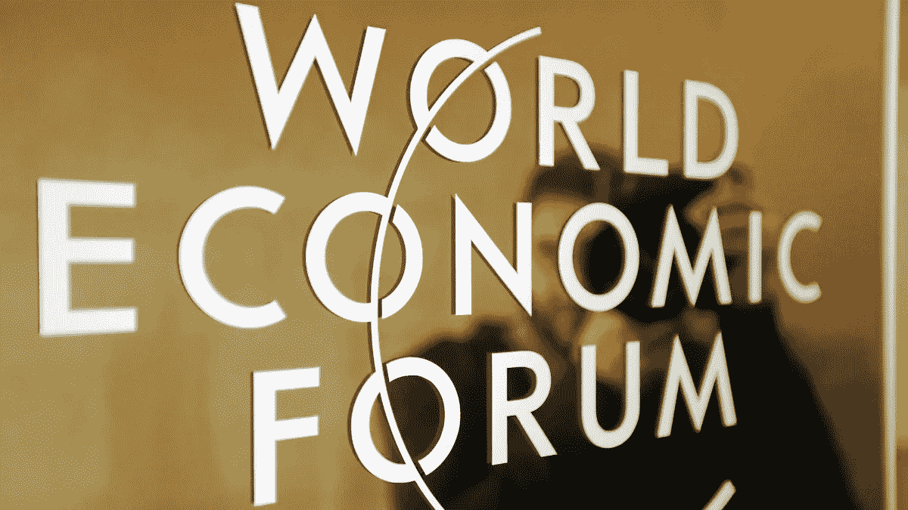

# 技术不一定会加剧不平等——这是给 WEF 领导人的一个信息

> 原文：<https://medium.com/hackernoon/technology-doesnt-have-to-increase-inequality-a-message-to-the-leaders-at-wef-100f0c0a16dc>

© [Philips Communications](https://flic.kr/p/dPaFrD), [CC BY-NC-ND 2.0](https://creativecommons.org/licenses/by-nc-nd/2.0/)

从人工智能和自动化，到数十亿未联网的人被数字经济抛在后面，我们有足够的理由质疑技术和互联网是否巩固甚至恶化了不平等。本周，世界各国领导人齐聚达沃斯参加一年一度的世界经济论坛(WEF)会议，WEF 的最新报告强调了日益加剧的不平等是 2017 年的首要全球风险，并指出技术在这一鸿沟中的作用。

但是我们并没有走上预定的道路。我们未来的故事不一定是只有少数精英获得互联网和技术的接入和好处。我们的数字未来的另一个积极愿景是可能的——在这个愿景中，每个人都相互联系，拥有平等的发言权和平等的机会使用网络参与 21 世纪的社会。响应迅速、负责任的领导力——WEF 2017 的主题——意味着选择它。

政府和企业中反应迅速、负责任的领导人必须采取什么措施才能让我们走上数字平等的道路？

# 1.分散对技术和网络的控制

随着数字技术的力量和好处的增加，不平等地获得和控制这种技术所造成的伤害也在增加。我们正在走向一个未来，在这个未来，少数政府和公司可以控制世界人口在线访问的绝大多数内容，越来越强大和不透明的算法决定我们看到什么新闻，我们提供什么服务，甚至如果我们犯罪，我们的刑期会是多少。

负责任的领导意味着确保这项技术植根于强大的监管框架，保护它不受任何利益集团的控制。我们需要使网络信息的把关者多样化，并利用网络使政府对使用公开数据的公民更加透明。政府必须认识到数字权利是人权，并根据需要更新法律框架。企业必须认识到自己必须扮演的基本角色，并致力于让算法变得公平、公开和可审计。

# 2.保护和加强妇女和女孩的在线权利

没有什么微妙的方式来表达这一点——互联网是性别歧视的。根据我们的研究，在世界各地，女性和女孩上网的可能性比男性低 50%。而且，一旦上网，女性比男性更不可能使用网络来通过找工作、接受教育或就政治问题发表意见来改善自己的生活。同时， [74%的国家没有有效的法律或政策来阻止针对女性的网络暴力。](http://thewebindex.org/report/#4.2_gender-based_violence_online)

是时候解决这种性别不平等了。我们希望看到政府将接入和使用方面的性别平等置于其宽带政策的核心，并看到公司通过真正的投资和为自己的员工提供机会来支持这一点。此外，各国必须通过和执行法律，以有意义的方式惩罚在线性别暴力，而社交网络等公司必须加强保护妇女免受仇恨言论、虐待或暴力。

# 3.连接所有人

世界上一半以上的人口仍然没有上网。联合国言论自由权特别报告员戴维·凯伊说，今天，离线相当于沉默。如果我们想要我们的世界真正包容，如果我们想要一个为每个人创造并由每个人创造的未来，如果我们想要每个人都有机会参与全球经济，我们就必须让每个人都参与到这个未来的建设中来——在网上。

网络基金会发起的[平价互联网联盟](http://www.a4ai.org/) (A4AI)的研究表明，除非我们大幅加快进展，否则到 2020 年**世界上最贫穷国家只有 16%的人能够上网，这将进一步加深不平等。为了帮助扭转这一趋势，网络基金会支持 A4AI 的呼吁，为互联网的可负担性制定一个新的目标——1gb 的数据，不到月收入的 2%——与广泛和资源充足的公共访问计划相配合。公共和私营部门的领导人必须团结起来推进这些目标。**

# **4.保护隐私和加密**

**随着我们的生活越来越多地转移到网上，公司和政府负责任的领导对于保护我们大多数个人数据和信息的安全至关重要。这意味着既要重新平衡消费者对其数据的控制权，又要确保加密受到保护。**

**这也意味着取消大规模监控项目。2016 年，我们看到一个令人担忧的趋势，即各国都在实施或加快此类方案。也许最引人注目的是英国的知识产权法案，它收集了每个英国人的浏览历史，并提供给近 50 个政府部门。为了让互联网成为一个安全的私人空间，我们每个人都必须能够浏览网页，而不必担心政府正在收集我们最隐私的想法。政府必须否认这些不相称的举措，公司必须抵制政府不必要的数据要求，发布年度透明度报告以安抚用户。**

# **5.确保全球网络中立**

**网络改变了世界，因为任何人、任何地方都可以创建网页，而无需征得许可，而且每个在线的人都可以访问同一个网络。如果我们想继续看到创新和创造力在网上蓬勃发展，我们必须保护让互联网成为机会引擎的核心原则之一:网络中立。这意味着确保互联网流量的平等，避免价格歧视。**

**我们已经看到网络中立在许多国家受到保护——从意大利到巴西到印度到美国。但是，为了让每个人都从网络及其全部潜力中受益，我们需要在每个国家都保护网络中立性。政府必须将网络中立写入法律，而公司应该公开承诺不推进违反网络中立的商业模式。**

**—**

**现在比以往任何时候都更需要负责任的领导——WEF 强调不平等加剧是正确的，这在很大程度上是由技术造成的。我们现在必须行动起来，扭转这一趋势，让网络和技术成为平等机会的力量。网络基金会致力于这一使命，我们邀请你加入我们。**

**在推特上关注我们[@网络基金会](http://twitter.com/webfoundation)**

**注册我们的[时事通讯](https://webfoundation.us8.list-manage.com/subscribe?u=b3c8e6e91fe1905e99f8b59fd&id=8516b77d8a)**

**进行[捐赠](https://webfoundation.secure.nonprofitsoapbox.com/wfdonate)！**

***最初发表于*[*webfoundation.org*](http://webfoundation.org/2017/01/technology-doesnt-have-to-increase-inequality-a-message-to-the-leaders-at-wef/)*。***