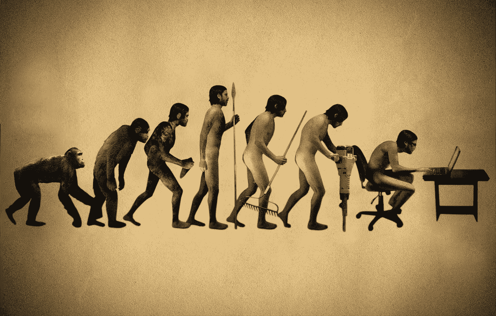
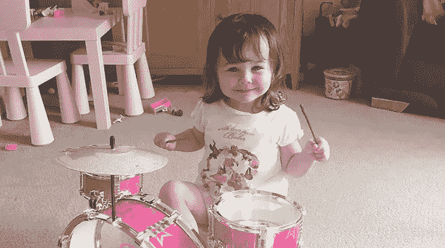

# 科技是发生在我身上最糟糕的事情

> 原文：<https://medium.com/hackernoon/technology-is-the-worst-thing-to-ever-happen-to-me-f086f8faed6c>

大家都说技术很棒。我们可以做得更多！我可以和老朋友叙叙旧！我对发生的每一件事都会立即得到提醒，所以我永远不会错过！看看这张照片，我最好的朋友，姐妹，兄弟姐妹，狗在印度尼西亚喝奶昔！

我对 2017 年的逆势真理是，技术，或者至少是当前即时总是连接的通信的进步，已经毁了我的生活。我的意思不是夸张，我的意思是它已经对我每天的生活质量产生了负面影响。

它滋生了一种痴迷，其程度在智能手机出现之前是不可想象的。在人类历史上，我们从未像现在这样与周围的每个人联系紧密，但也从未像现在这样如此疏远。会议和对话已经被赞和转发所取代，并成为给我们带来快乐的社交货币。

人们希望我一直回复电子邮件，回复打来的电话，回复 WhatsApp 上的朋友，回复 LinkedIn 上的同事，回复 Twitter 上的熟人。我经常被交流的压力所淹没，如果我忽视它，我就会成为一个弃儿。

只是我不会，但我们都害怕错过。

我们改变，变老，渐行渐远。我们透过智能手机的棱镜看待朋友的生活，就像透过客厅窗户看陌生人一样。我们忽略了偶尔的叙旧，而是倾向于花更多的时间在社交网络上描绘的虚假世界的诱人诱惑背后。我们知道他们在做什么，为什么还要费神去追赶呢？技术摧毁了人类接触和交流的欲望。它侵蚀了我们的人性，让我们成为人们提供的数据的消费者，而不是享受丰富的体验生活和社区。

我们看到了人们生活中所有美好的一面，却没有看到任何不好的一面。它让我们对自己的生活有了不切实际的期望，所以我们试图去竞争。我们描绘了一幅比我们经历的现实更加生动的画面，直到那个世界崩溃，没有人预料到。我们的朋友走了，因为他们认为我们的生活是完美的。我们不再与人交谈，而是将自己置身于数字世界，构建角色来扮演我们希望其他人看到的角色。我们不是生活，而是在生活的电影中扮演自己的角色，通过经历来行动，而不是珍惜每一刻。

今天，我站在女儿的圣诞音乐会上，看着她唱着圣诞颂歌，心里充满了幸福。当她凝视着我的眼睛，唱着每一个字的时候，我们都沉浸在其中。这首歌结束了，我的目光暂时转移到其他父母的歌曲之间，所有人都通过他们手机的过滤器消费他们面前发生的事情的内容。我心碎了。没有智能手机，我们的孩子能认出我们的脸吗？

我没有评判，我也经常这样做。我变得更专注于一个不存在的世界，而不是关注我生命中最重要的两件事。我知道我在做，但我还是停不下来。为什么脱离一个我们知道是虚伪的、会侵蚀我们幸福的虚拟现实如此困难？

我在 2016 年一整年都没有喝酒，我怀疑我能放弃手机一天，更不用说一周了。在我们每天查看手机 130 次之前，我们做了什么？我出于无聊查看手机。我总是希望有事情发生，如果不是这样，我会变得焦躁不安。如果什么都没发生，我想知道出了什么问题，所以我们创造一些东西来填充我们的注意力。我们设计情境来娱乐自己，而不是享受我们的生活，

智能手机是一个可怕的习惯，也是一个毒瘤。我们上瘾了，它们造成的伤害不亚于许多非法物质。在很多方面，我们在手机上的时间比在其他事情上的时间更少。我们甚至不在场；如果你的注意力没有集中在你的现实上，你真的有意识吗？无数次，我对别人说话或被别人说话和回应时，都没有注意结果。

我女儿也这样对我。最近，我发现我女儿做了一件不可思议却令人心碎的事情。她真的敲她的鼓越来越大声，直到我的注意力都被捕获和确保。赢得我的注意后，她微笑着看着我，继续用同样的方式演奏和歌唱，她的听众只有一个。

当我坐在那里享受这一刻时，它立即让我充满了罪恶感，让我质疑她以前这样做过多少次，但没有像打鼓一样吸引注意力的东西来把我的注意力从黑暗屏幕后面越来越诱人的世界上转移开。我已经错过了多少，有一天，我会不会透过手机屏幕看着我的女儿，对这些年因全神贯注于充斥在我收件箱或新闻订阅中的无聊琐事而错过的时光感到绝望。

我已经受够了。我不能在我所有的关系都受到影响的情况下继续这样工作，因为我的注意力一直在转移或转移。我真的很害怕这对我们这一代孩子接受的教育质量意味着什么。直升机父母得到一个不好的说唱，那么 Instagram 父母呢？他们唯一关心的是为了他们的节目的利益记录他们的生活。

2017 年，我将放弃我的智能手机。它的美妙之处？我仍然会保持联系，但是如果我想的话，这将是一个有意识的选择。我将不再漫无目的地浏览 facebook 或 twitter，而是与身边的人交谈，我意识到这是意义深远的一步。想和我说话的人会打电话或发短信，我会联系重要的人；我不得不。

最终，生活是关于幸福的，我选择了幸福。

# 我是这样脱离的

*我在建* [*克里克*](http://www.cleeyk.com)*；减轻生活中最大烦恼的生活方式管理系统；浪费时间和精力。它消除了您对保险续保和每月订阅服务的担忧，确保您永远不会再与另一个呼叫中心通话或讨价还价。您的服务会以最具成本效益的价格自动续订，这意味着您无需搜索或比较。*

*我们还会对比平台上的其他用户，审查您为每月订阅服务支付的费用，并代表您进行协商，以尽可能降低您的所有成本。* [***让我知道你的想法。***](https://www.youtube.com/watch?v=ldJdPQf80F0)

> [黑客中午](http://bit.ly/Hackernoon)是黑客如何开始他们的下午。我们是 AMI 家庭的一员。我们现在[接受投稿](http://bit.ly/hackernoonsubmission)并乐意[讨论广告&赞助](mailto:partners@amipublications.com)机会。
> 
> 如果你喜欢这个故事，我们推荐你阅读我们的[最新科技故事](http://bit.ly/hackernoonlatestt)和[趋势科技故事](https://hackernoon.com/trending)。直到下一次，不要把世界的现实想当然！

