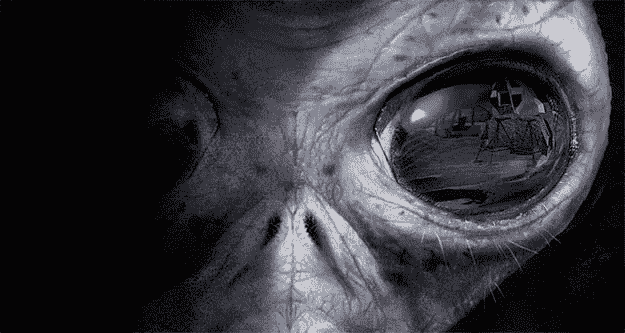

# 能让我们到达火星的技术还不存在

> 原文：<https://medium.com/hackernoon/technology-that-can-get-us-to-the-mars-does-not-exist-yet-dac99da790ed>

Source: [Unsplash](https://unsplash.com/search/space?photo=VBNb52J8Trk)

每个人都在谈论我们将如何很快去火星。再猜，我们不会，有一个大问题，**火星相当遥远。我们不能去那里，** [**技术**](https://hackernoon.com/tagged/technology) **不存在。**

# 火星相当遥远

> “它比空间站远六个数量级。我们需要开发新的远离地球的生活方式，这是前所未有的。永远不会。”山姆·西米，美国宇航局国际空间站主任

让我们客观地看待这个问题，因为我们记录了地球和火星之间最近的 3480 万英里。最远相距 2.5 亿英里。值得注意的是，地球和火星都绕着太阳转，而地球只需 365 天就能绕太阳转一圈，而火星则需要更长时间。火星每 687 天绕太阳一周。

我们从地球到火星需要多长时间？大约在 150 到 300 天之间。如果我们查看这条路线的旅行历史，我们会看到平均时间:

*   水手 4 号(1965)——228 天
*   水手 6 号(1969)——156 天
*   水手 7 号(1969)——131 天
*   水手 9 号(1971)——167 天
*   维京 1 号(1976)——335 天
*   维京 2 号(1976)——360 天
*   火星勘测轨道飞行器(2006)——210 天
*   凤凰号着陆器(2008)——295 天
*   好奇号着陆器(2012)——253 天

Source: [National Geographics](http://images.nationalgeographic.com/wpf/media-live/photos/000/578/overrides/mars-rover-landing-sequence-lowering-sky-crane_57832_600x450.jpg)

# 我们不能带走所有我们需要的东西

在火箭里是机器人还是人是不一样的。为了在太空中生存，人们需要吃东西，他们需要水和氧气。此外，还有燃料，火箭需要很多燃料才能到达火星。往返要多一倍。这就是为什么这种趋势是通往火星的单程票的主要原因。**没有往返行程。**

# 离开地球

火星任务的规模将比我们以前做过的几乎任何事情都要大得多，这与常规任务不同。尽管如此，仍然没有一枚火箭能够从地球表面起飞，摆脱其引力到达太空，携带大型航天器的重量、宇航员和到达火星所需的所有物资和材料。火箭将不得不多次往返，为进入近地轨道的运载工具空投补给和零件。

然后，在火箭准备开始火星之旅之前，一切都应该在太空中建造好。但是，燃料有一个问题，**低地球轨道上的物体每 90 分钟运行一周**。在其中的一半时间里，它们会感受到太阳的热量。如果对象没有得到很好的管理，那么很有可能在开始之前一切都会被破坏。

# 辐射也让我们成为问题

2013 年 5 月，美国宇航局的科学家报告说，根据 2011 年至 2012 年从地球到火星旅行期间[火星科学实验室](https://en.wikipedia.org/wiki/Mars_Science_Laboratory)上的 RAD 探测到的高能粒子辐射量，可能的火星任务可能涉及很大的辐射风险。**计算的辐射剂量为 0.66 西弗特往返**。该机构对宇航员的职业辐射极限是 1 西弗

# 但是，我们正在努力

新闻上到处都在报道，美国国家航空航天局、太空探索技术公司和其他一些公司正在尝试这样做。**他们正试图开发一种能将人带到火星的技术。他们还没打算送我们去。他们只是想为它制造一个机会，准备好一切。**

# 技术的未来是不可预测的

我想我们会找到一种方法，在 2030 年前把人类送上火星。你知道最棒的是什么吗？从 1930 年到 2030 年刚好过了 100 年。在这 100 年里，人类发展从我们第一次成功发射太空任务开始，一直到我们能够在火星表面行走。

Source: [Geek.com](https://www.geek.com/wp-content/uploads/2016/04/alien-face-625x333.jpg)

**这真的好像是一部电影。下一步是火星，然后我们会发现外星文明，如果我们幸运的话，他们不会殖民地球。**

## 最后一件事…

*如果您喜欢这篇文章，请点击💚所以其他人会在这里看到它。*

> [黑客中午](http://bit.ly/Hackernoon)是黑客如何开始他们的下午。我们是阿妹家庭的一员。我们现在[接受投稿](http://bit.ly/hackernoonsubmission)并乐意[讨论广告&赞助](mailto:partners@amipublications.com)机会。
> 
> 如果你喜欢这个故事，我们推荐你阅读我们的[最新科技故事](http://bit.ly/hackernoonlatestt)和[趋势科技故事](https://hackernoon.com/trending)。直到下一次，不要把世界的现实想当然！

