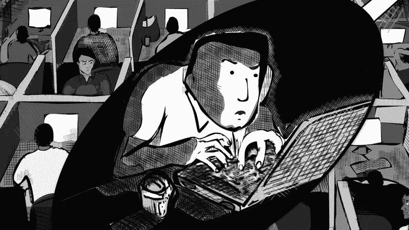
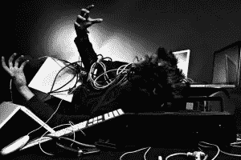

# 科技会把我们生吞活剥。

> 原文：<https://medium.com/hackernoon/technology-will-eat-us-whole-208e87a93dfd>

雷·布雷德伯里的《草原会下小雨》和《T2 会下小雨》描述了人类生活被 T4 科技消耗殆尽，以至于人类在字面上和象征上都不复存在。有一种普遍的观点认为计算机和技术是我们的未来，而没有考虑到让技术如此干涉我们生活的后果。

这些故事让我想起一些人在过马路之前是如何停止寻找汽车的，这表明人类是多么依赖微型计算机，这样一个基本的东西现在被忽视到了简直要人命的地步。人类与现实脱节的另一个例子是当孩子们呆在室内玩电子游戏而不是出去玩，这正是发生在 *The Veldt* 中的事情。父母缺乏管教也无助于这种情况。许多父母沉浸在他们的工作或电话中，他们宠坏了他们的孩子，鼓励反社会行为，然后教他们的孩子完全相同的习惯。这种滚雪球效应会让社会崩溃，在某种程度上是社会的死亡。

> [黑客中午](http://bit.ly/Hackernoon)是黑客如何开始他们的下午。我们是阿妹家庭的一员。我们现在[接受投稿](http://bit.ly/hackernoonsubmission)并乐意[讨论广告&赞助](mailto:partners@amipublications.com)的机会。
> 
> 如果你喜欢这个故事，我们推荐你阅读我们的[最新科技故事](http://bit.ly/hackernoonlatestt)和[趋势科技故事](https://hackernoon.com/trending)。直到下一次，不要把世界的现实想当然！

