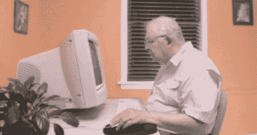
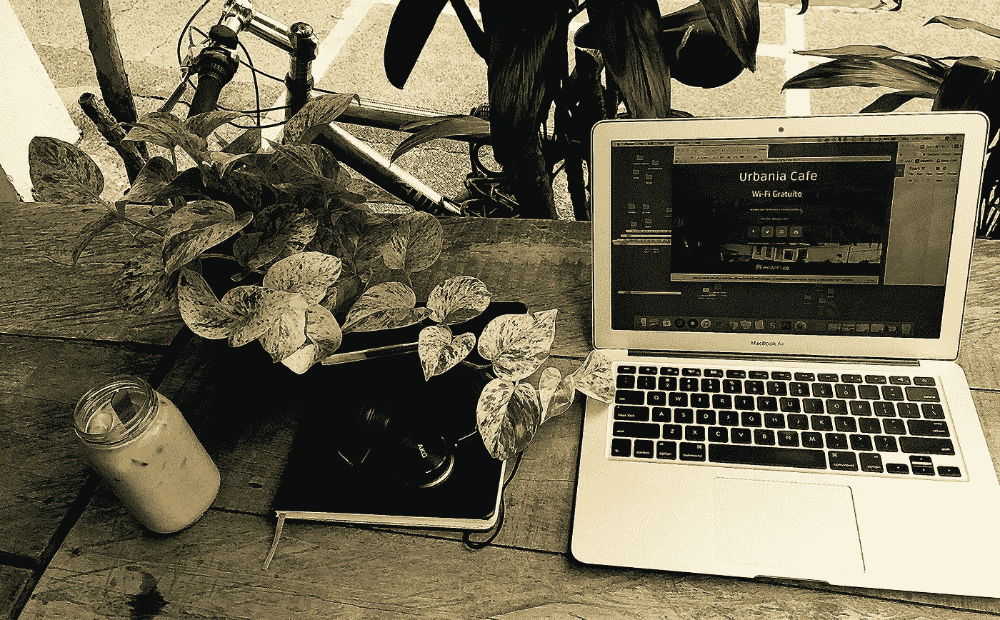
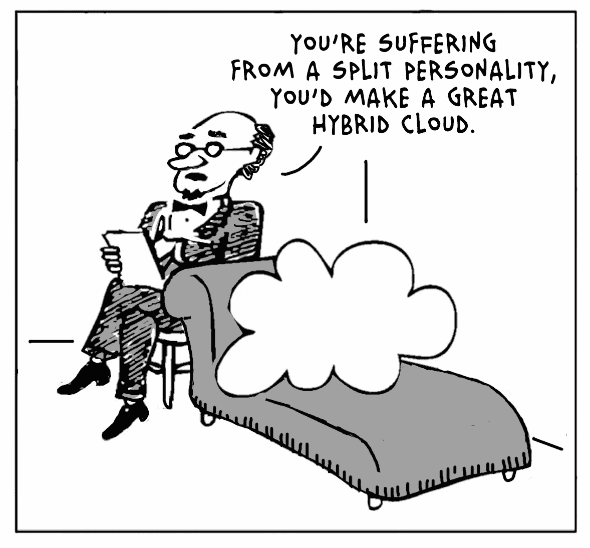
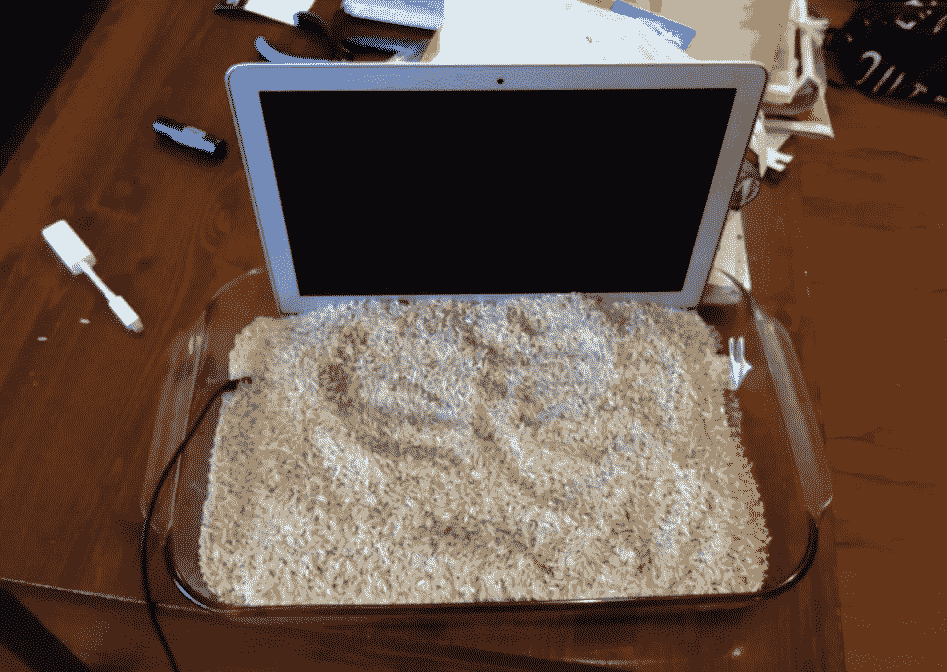

# 技术会让我们自由

> 原文：<https://medium.com/hackernoon/technology-will-set-us-free-324bac3a0ffc>

## 也可能不是。

最近我花了很多时间在苹果的 [**店。不是出于选择，也不是为了消费更多的产品本身(好吧，也许是间接的)——而是为了修理我快要报废的**](https://www.inc.com/jonas-altman/apples-new-headquarters-proves-that-the-coolest-of.html) **[**笔记本电脑**](https://www.inc.com/john-brandon/how-this-new-macbook-pro-will-change-perceptions-about-computers.html) 。你看每两年左右，就像摩尔定律一样，我的技术在最关键的时候崩溃。我后来称之为奥特曼定律。这很烦人，非常令人沮丧，而且不可否认是一个世界难题。**

我的 [**职业生活**](https://www.inc.com/jeff-haden/8-statements-that-transform-your-professional-and-personal-life.html) 的现代不适总是围绕着技术。每次技术失败，我都会经历一个越来越轻松的悲伤过程(否认、愤怒、讨价还价、沮丧和接受)。有时它是由水神奇地从杯子跳到我的键盘上触发的。有时候，我的手机会决定从桌子上跳下来，看看它的屏幕能否承受 3/12 英尺的跌落。其他时候，它可能涉及一个小偷，无法抗拒我的神圣产品。但大多数时候，这项技术只是失败了。完蛋了。不管*为什么*，这里有一些帮助减轻心痛(和戏剧)的提示。

# 时间机器

如果你还没有为你的时间机器购买一个专用硬盘，停止阅读，现在就去做吧。除了为您提供当前工作环境的精确副本备份，保护您的数据还能让您高枕无忧。

当我的电脑死机时，我通常会目瞪口呆。我祈祷故障是一个微不足道的问题。我希望电脑真的累了，决定小睡一会儿。第一次崩溃发生在 2005 年，我承认我很生自己的气，因为我没有备份无用地放在我面前的那堆垃圾。同样的怨恨情绪在 2007 年和 2009 年再次出现。从那以后，我的愤怒似乎变成了某种扭曲的幽默。我会对我的小银哥们说，“我给了你这么好的家，你为什么这么恨我？”回想起来，如果我每次都有最新的备份，我就不会那么讨厌我的笔记本电脑了。

# 飘在云端

说我因技术失败而患上抑郁症是言过其实的。这本身就很可悲。但我确实经常发现自己在和自己的设备讨价还价，“如果你今天为我工作，我明天就给你放假——我保证。”我变聪明了，现在虔诚地在云中工作。

这实际上意味着什么因人而异。我的一个摄影师朋友每月付给第三方云公司一大笔钱来备份他所有的照片和计算机文件。另一方面，我写的是*media*，在 *Google Drive* 工作，在 *iCloud* 玩耍。真的很简单。如果您对数据有很大的胃口，那么将 iCloud 升级到 200GB 应该就可以了。如果你碰巧是一名俄罗斯间谍，还有一个 2TB 的选择(好吧，你那时可能不会在云中工作，但你明白了)。

# 爱情走了很远

我知道有人和她的苹果手机睡觉。是的，直接在她身边(显然这并不罕见)。这不是我说的那种爱。小心处理您的设备是轻而易举的事，但包括我以前的自我治疗技术在内的许多设备都是如此。

和人类一样，技术也有缺陷。我好几年都没有关掉笔记本电脑，实际上从来没有好好休息过。我未能在早期运行内存和硬盘诊断程序来帮助识别任何问题。我从未清洁过屏幕或键盘，对此我深感内疚。上帝知道我经常会被看到在我的键盘旁吃喝——玩一个奇怪的苹果轮盘游戏。正如你可能想象的那样，我已经改变了我的习惯。如果您想让您的技术走得更远，请像对待您的狗一样对待它。

当其他一切都失败了，你的技术也失败了，我建议跳过否认和讨价还价，直接接受。认为这是一种必然性，你现在已经做好了充分的准备。假设故障在您的保修范围内，您可以直接走到 g *enius* 处，想一想，“看看现在谁是自作聪明的人？”如果是在保修期满之后，至少你可以说再见了。

*乔纳斯·奥特曼(Jonas Altman)是一名作家和系列企业家。加入成千上万的书呆子行列，点击*[***(此处为***](https://www.jonasaltman.com/newsletter) )即可获得他的《未来工作》月刊**