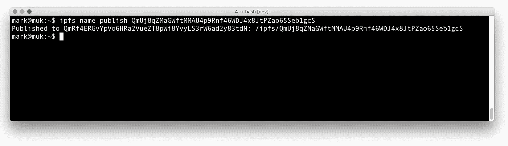

# 让行星间文件系统对人类友好的十种可怕尝试

> 原文：<https://medium.com/hackernoon/ten-terrible-attempts-to-make-the-inter-planetary-file-system-human-friendly-e4e95df0c6fa>



**本文是《区块链列车日志》第六部分，从这里开始阅读:** [**搭上区块链列车**](https://hackernoon.com/catching-the-blockchain-train-9a0945aab958) **。**

# IPFS 人性化命名；可能吗？

你看到我想出的交通磁铁标题了吗？这有点过了；我们只是在看如何使内容的寻址比`ipfs cat /ipfs/QmcJTRZuGVdqUoNS1414G2mim3mt39RU14JsTmbh4KJYeV`更容易一点。

正如在上一篇文章中提到的，添加一些可变的“标签”来指向(不可变的)IPFS 内容有时是需要的。

这个博客的内容就是一个例子:首页`/ipfs/QmcPx9ZQboyHw8T7Afe4DbWFcJYocef5Pe4H3u7eK1osnQ/`的原始地址(hash)和现在的不同(啊不，已经过期了！)首页`/ipfs/QmcJTRZuGVdqUoNS1414G2mim3mt39RU14JsTmbh4KJYeV/`。

可变链接是必要的，但对我们人类来说还不够。它们很难读懂，更不用说记住了。

这一集我们将探索不同的方法来:

*   解决添加可变链接的问题
*   使链接更加人性化，同时
*   尽可能保持分散。

我们将看到以下方法的实际应用:

1.  IPFS 门户
2.  IPNS
3.  DNS TXT IPNS 记录
4.  浏览器扩展
5.  命名硬币
6.  块堆栈 ID
7.  以太坊名称服务
8.  Proquint 可发音标识符
9.  姓名缩写
10.  Filecoin

**TL；为了让 IPFS 变得更加人性化——在一个分散化的 IPFS 网站的背景下——目前没有其他办法，只能牺牲一部分分散化，使用 HTTP-to-IPFS 网关和老式的 DNS。区块链领域中的命名系统(Blockstack、Namecoin、EthNames)是在保持 100%去中心化的同时改进 UX 的可能候选系统，但目前这些系统都不是现成的。Filecoin 可能是一条可行之路，但那还很遥远。**

# IPFS 门户

让内容可以在旧的 skool 互联网上用普通浏览器浏览的最明显的步骤是利用 IPFS 网关。这些网关使用 HTTP 并通过它们的 IPFS 节点访问内容。

任何网关都可以，但是内容钉住的网关当然更快。访问本博客之前主页的示例:

*   [http://decentralized . blog:8080/ipfs/qmcjtrzugvdquons 1414 G2 mim 3 mt 39 ru 14 jstmbh 4 kjyev/](http://decentralized.blog:8080/ipfs/QmcJTRZuGVdqUoNS1414G2mim3mt39RU14JsTmbh4KJYeV/)
*   [https://gateway . ipfs . io/ipfs/qmcjtrzugvdquons 1414 G2 mim 3 mt 39 ru 14 jstmbh 4k jyev/](https://gateway.ipfs.io/ipfs/QmcJTRZuGVdqUoNS1414G2mim3mt39RU14JsTmbh4KJYeV/)
*   [http://localhost:8080/ipfs/qmcjtrzugvdquons 1414 G2 mim 3 mt 39 ru 14 jstmbh 4k jyev/](http://localhost:8080/ipfs/QmcJTRZuGVdqUoNS1414G2mim3mt39RU14JsTmbh4KJYeV/)(如果有本地 ipfs 节点运行)

因此，尽管这种方法可行，但也存在一些问题:

*   当主页的内容改变时，这些 URL 仍然指向旧的内容
*   这种杂凑对人类不太友好(也就是丑陋)
*   它引入了集中化的元素(某种程度上，不依赖于特定的单一网关)

# IPNS

要解决这三个问题中的第一个，我们当然可以用 IPNS。每当内容发生变化时，我们都会发布最新的内容哈希，例如:

```
ipfs name publish QmcJTRZuGVdqUoNS1414G2mim3mt39RU14JsTmbh4KJYeV
Published to QmRf4ERGvYpVo6HRa2VueZT8pWi8YvyLS3rW6ad2y83tdN: /ipfs/QmcJTRZuGVdqUoNS1414G2mim3mt39RU14JsTmbh4KJYeV
```

现在，我们可以通过任何网关访问主页，但不能使用可变的 IPNS 链接:[http://decentralized . blog:8080/ipns/qmrf 4 ergvypvo 6 HRA 2 vuezt 8 pwi 8 yvyls 3 rw 6 ad 2y 83 tdn/](http://decentralized.blog:8080/ipns/QmRf4ERGvYpVo6HRa2VueZT8pWi8YvyLS3rW6ad2y83tdN/)

好多了，但还是丑…

注意:IPNS 仍然有点发抖，大约 12 小时后会忘记公布的名字。您可能希望每 8 小时左右运行一次 cron 作业来重新发布。

# DNS TXT IPNS 记录

现在，让我们去掉杂凑。白皮书提到了 DNS TXT 记录的使用。维基百科是这么说的:

> TXT 记录(文本记录的缩写)是域名系统(DNS)中的一种资源记录，用于提供将一些任意和无格式的文本与主机或其他名称相关联的能力，例如关于服务器、网络、数据中心的人类可读信息以及其他记账信息。

因此，域的所有者可以通过添加 TXT 记录将任何数据与该域相关联。它就像一个键值存储，只有域的所有者可以写，而所有人都可以读。

如果您插入一个有效的域作为路径，IPNS 将使用它来查找`/ipns/<peerID>`路径。

IPNS 通常是这样解决的:

```
# Publish
ipfs name publish QmcJTRZuGVdqUoNS1414G2mim3mt39RU14JsTmbh4KJYeV
Published to QmRf4ERGvYpVo6HRa2VueZT8pWi8YvyLS3rW6ad2y83tdN: /ipfs/QmcJTRZuGVdqUoNS1414G2mim3mt39RU14JsTmbh4KJYeV# Normally IPFS resolves the peerID hash
$ ipfs name resolve /ipns/QmRf4ERGvYpVo6HRa2VueZT8pWi8YvyLS3rW6ad2y83tdN
/ipfs/QmcJTRZuGVdqUoNS1414G2mim3mt39RU14JsTmbh4KJYeV
```

为了能够解析一个域，我们需要添加一个 [dnslink](https://github.com/ipfs/go-dnslink) 到该域的 TXT 记录中。

这样做之后，这个博客的域名(decentralized.blog)指向了`/ipfs`链接

```
$ dig txt decentralized.blog
.
.
;; ANSWER SECTION:
decentralized.blog. 900 IN  TXT "dnslink=/ipfs/QmcJTRZuGVdqUoNS1414G2mim3mt39RU14JsTmbh4KJYeV"
```

我们可以通过域名来解析

```
$ ipfs name resolve decentralized.blog
/ipfs/QmcJTRZuGVdqUoNS1414G2mim3mt39RU14JsTmbh4KJYeV
```

这使得我们可以使用一个更好的地址:

[/ipns/decorized . blog](https://ipfs.io/ipns/decentralized.blog/)

这是可行的，但是每次我更改内容时，我都必须更改 DNS TXT 记录并等待传播。最酷的是，我可以让 DNS TXT 记录指向一个`/ipns`链接，并在内容发生变化时简单地执行一个`ipfs name publish`:

```
$ dig TXT decentralized.blog
.
.
;; ANSWER SECTION:
decentralized.blog. 900 IN  TXT "dnslink=/ipns/QmRf4ERGvYpVo6HRa2VueZT8pWi8YvyLS3rW6ad2y83tdN"# points to /ipns path now
```

请注意，我应该在一开始就这样做，但是我被白皮书中的这个例子引向了错误的方向:

> #此 DNS TXT 记录
> ipfs . benet . ai . TXT " ipfs = xlf 2 ipq 4 JD 3 u…"
> 
> #表现为 symlink
> ln-s/ipns/xlf 2 ipq 4 JD 3 u/ipns/fs . benet . ai

这可能是一个拼写错误，尽管出于某种原因，ipfs.io 域也指向一个不可变的`/ipfs`路径:

```
$ dig TXT ipfs.io
.
.
;; ANSWER SECTION:
ipfs.io.        60  IN  TXT "dnslink=/ipfs/QmPCawMTd7csXKf7QVr2B1QRDZxdPeWxtE4EpkDRYtJWty"
```

更多关于 IPFS 如何解析路径的信息请点击这里。

所以现在我们有了一个人性化的 URL，但代价是增加了更多的集中化(DNS)。

# 浏览器扩展

我希望有一个浏览器扩展可以让我浏览由`/ipfs`和`/ipns`路径组成的网页，但是现有的扩展并不是为这个目的而设计的。

因为还是有意思，反正我还是要提一下。最新的扩展是 [ipfs-companion](https://github.com/ipfs/ipfs-companion) 。有适用于 [Firefox](https://addons.mozilla.org/en-US/firefox/addon/ipfs-companion/) 和 [Chrome](https://chrome.google.com/webstore/detail/ipfs-companion/nibjojkomfdiaoajekhjakgkdhaomnch/) 的浏览器扩展。

它做的一件很酷的事情是通过将公共网关的请求重定向到本地节点来帮助分发数据。

另一个令人兴奋的项目是 [Beaker 浏览器](https://github.com/beakerbrowser/beaker)，它曾经支持 IPFS，但现在不再支持了。它是基于 [Dat](https://datproject.org/) 的分布式内容浏览器。

# 命名硬币

# 什么是 Namecoin？

Namecoin 是一个非常有趣的基于区块链技术的协议。我不会在这里深入探讨，因为我想先开始探索全区块链之母(即比特币，但你知道)。

我才意识到，这是[赶区块链列车](http://decentralized.blog/catching-the-blockchain-train.html)第六集，我们还没看到一个区块链呢！最糟糕的是，我们也不会在这里讨论这个问题……请耐心等待，我们最终会到达那里的。

所以，命名币。这是他们在网站上对自己的描述:

> Namecoin 是一项实验性的开源技术，它改善了互联网基础设施某些组件(如 DNS 和身份)的去中心化、安全性、审查阻力、隐私和速度。
> 
> (对于技术人员来说，Namecoin 是一个基于比特币技术的密钥/值对注册和转移系统。)
> 
> 比特币解放了金钱——name coin 解放了域名系统、身份和其他技术。

关于 DNS 的部分也许能帮到我们。Namecoin 为拥有自己的[门户](https://bit.namecoin.org/)的`.bit` TLD 提供便利。

# 获取. bit 域

首先，我们需要获得一个. bit 名称。不久前我在一个交易所租了一个，但是我现在[发现](https://bit.namecoin.org/your_website.html)有一个更好的方法:使用一个名币客户端。如果你走交换的路，意识到你没有控制域的私钥(在 KV 对中改变值)，所以你不拥有它。

去找你自己的。位域名，按照[的步骤注册并配置。位域](https://wiki.namecoin.org/index.php?title=Register_and_Configure_.bit_Domains)。

你会发现你需要一点硬币(NMC)来获得你的。位域，但挖矿并不是一个真正的选项(它是与比特币挖矿和 hard 一起完成的)，但你也可以购买一些。这里有一个交易所列表，你可以在那里购买 NMC，名为 coin Markets，但如果你已经拥有一些比特币或替代币，我会推荐 ShapeShift。你需要 0.02 NMC，这大约是[无](https://coinmarketcap.com/currencies/namecoin/)。您可以使用这个[姓名硬币浏览器](https://namecha.in/)来查看您想要的姓名是否仍然可用。

# 位查找的工作原理

。位域有一个 unix 路径等价物，如下所示:`d/somedotbitname`。这些路径是存储在命名硬币区块链中的记录的关键。因此，要查看值是多少，您必须访问 Namecoin 节点，并使用键`d/somedotbitname`请求记录的值。

该值可以是任何值，但在实践中，它要么是对名称服务器(标准 DNS)的引用，要么是对 IP 地址的直接引用，要么是对[位消息](https://en.wikipedia.org/wiki/Bitmessage)地址的引用。其他人添加他们的电子邮件，并说。位地址出售。

我们需要访问一个 namecoin 节点来查询它，但是我们可以使用在线 REST API(引入一个中心故障点)，比如 [webbtc](https://namecoin.webbtc.com/api/name) :

```
# Bitmessage address value
$ curl [http://namecoin.webbtc.com/name/d/mysite.json](http://namecoin.webbtc.com/name/d/mysite.json)
{
  "name": "d/mysite",
  "value": "BM-2cUyrUNq91XqdPSKvcHSytuED9nnTazf5r",
  "txid": "78e212c47b41b3ae80413a7064c7bee044f8f2bc27362e9c37d5474b68bfd9e3",
  "address": "NFE3ED8C3BGRXuzjBRD3YGJV6jrmbS5h3Q",
  "expires_in": 23292
}# IP address value
$ curl [http://namecoin.webbtc.com/name/d/dappersoftware.json](http://namecoin.webbtc.com/name/d/dappersoftware.json)
{
  "name": "d/dappersoftware",
  "value": "{\"ip\":\"207.111.216.146\",\"map\":{\"*\":{\"ip\":\"207.111.216.146\"}}}",
  "txid": "da72c6b0cf85c94d7b2d4f2f8534d1cdafa47ca94fd00489bf205f00c3fc1cb2",
  "address": "N2hrunEcP3PNxdKvihMKCoEnvLUcCcBhKw",
  "expires_in": 4344
}
```

# 如何浏览。比特网站工作

很明显，正常的 DNS 系统不知道如何处理一个`.bit`域名，所以在浏览器中不会解析任何东西。Namecoin 团队在 namecoin 节点上提供了一个层，能够浏览`.bit`域名: [ncdns](https://github.com/namecoin/ncdns) 。既然我们偏离了目标，我就不说了...

# 我们如何将. bit 域名解析为 IPFS 哈希？

我们要做什么来着？如此多令人兴奋的事情正在发生，以至于我们几乎迷失在 shapeshiftbitmessagewebbtcncdnschain 中。专注！

这一探索的目标是能够传递一个像`dweb.bit`这样的人友好的地址来打开一个 IPFS 驱动的网站。如果 IPNS 系统知道如何读取名币区块链中`dweb.bit`的值，并对其进行解释和解析，将其解析为 IPFS 地址，这将是可能的。

这就像我们看到的 DNS TXT 记录技巧一样，但是现在 IPFS 节点需要访问 Namecoin 区块链(或者像我们之前看到的 webbtc 这样的集中式公共 API)。

所以:`/ipns/dweb.bit`需要解析到`/ipfs/<some multihash>`。位记录的值字段可以是任何值，因此很容易解决。另一部分是 IPNS 解析器实现需要识别。位域名，并以某种方式访问命名硬币网络。很容易看出，这并没有实现:

```
$ ipfs name resolve dweb.bit
Error: Could not resolve name.
```

此处将讨论[IPFS-命名币的整合。就我个人而言，我会首先提供一个中心。ipfs.io 上的位查找服务，并在 ipfs 代码中使用 Namecoin 解析器实现对其进行扩展。不过，看起来它现在在 IPFS 项目中没有优先权。](https://github.com/ipfs/notes/issues/41)

无论如何，我准备好了: [dweb.bit](https://namecha.in/name/d/dweb) 指向`{ "ipns": "/ipns/QmRf4ERGvYpVo6HRa2VueZT8pWi8YvyLS3rW6ad2y83tdN" }`。

# 块堆栈 ID

Juan Benet 的演讲中提到的命名层的另一个竞争者是 Blockstack。

# 什么是 Blockstack？

维基百科是这么说的:

> Blockstack 是比特币区块链之上的第一个分散式 DNS 系统的实现。它将 DNS 功能与公钥基础设施结合起来，主要供新的区块链应用程序使用。

这听起来很像 Namecoin 做的事情，但它使用比特币区块链，而不是自己的叉子。过去，[使用了](http://blog.onename.com/namecoin-to-bitcoin/)硬币区块链这个名字，但是现在的想法是它应该是[区块链不可知论者](https://www.youtube.com/watch?v=Itp6eRv1wRQ)。

Blockstack 的主页上有一个更大的目标:

> 分散应用的新互联网
> 
> Blockstack 是一种新的去中心化互联网，用户拥有自己的数据，应用程序在本地运行。只需要一个浏览器门户就可以开始了。

但是现在，让我们把注意力集中在分散的 DNS 系统上。

# 如何注册块堆栈 ID

命名系统叫做 Blockstack ID，TLD 是`.id`。你可以得到你自己的。id 在[on name](https://onename.com/)或者使用这里描述的终端: [Blockstack CLI](https://blockstack.org/docs) 。

让我们试试:

```
# First install blockstack with pip (Python2 only, booh!)# Create a wallet; not mentioned in the documentation, but required to do first
$ blockstack setup # Check price for the desired name, the shorter the name, the more expensive
$ blockstack price dweb.id
{
    "name_price": {
        "btc": 0.016,
        "satoshis": 1600000
    },
    "preorder_tx_fee": {
        "btc": 0.00219904,
        "satoshis": 219904
    },
    "register_tx_fee": {
        "btc": 0.0020583,
        "satoshis": 205830
    },
    "total_estimated_cost": {
        "btc": 0.02213352,
        "satoshis": 2213352
    },
    "total_tx_fees": 613352,
    "update_tx_fee": {
        "btc": 0.00187618,
        "satoshis": 187618
    }
}# Get a bitcoin address to pay the fee to
$ blockstack deposit
{
    "address": "3BmAHjCLgELuRdg3jM1MMgm5twXPWWxr7s",
    "message": "Send bitcoins to the address specified."
}# Start the API server; also not documented, but the error on register is helpful
$ blockstack api start
{
    "status": true
}# Now register a name
$ blockstack register dweb.id
Calculating total registration costs for dweb.id...
Registering dweb.id will cost about 0.02213352 BTC.
Use `blockstack price dweb.id` for a cost breakdownThe entire process takes 48 confirmations, or about 5 hours.
You need to have Internet access during this time period, so
this program can send the right transactions at the right
times.Continue? (y/N): y
{
    "message": "Name queued for registration.  The process takes several hours.  You can check the status with `blockstack info`.",
    "success": true,
    "transaction_hash": "c4fc237f4b13d9925f8180fbe9e131cd0a1ee54d9b8c7455c4b2e2464fbe1315"
}# Check the status
$ blockstack info
{
    "cli_version": "0.14.4.2",
    "consensus_hash": "47f015a3959a80e7ce9c5fb425833860",
    "last_block_processed": 482064,
    "last_block_seen": 482070,
    "queues": {
        "preorder": [
            {
                "confirmations": 0,
                "name": "dweb.id",
                "tx_hash": "c4fc237f4b13d9925f8180fbe9e131cd0a1ee54d9b8c7455c4b2e2464fbe1315"
            }
        ]
    },
    "server_alive": true,
    "server_host": "node.blockstack.org",
    "server_port": 6264,
    "server_version": "0.14.4.0"
}
```

这是一笔比特币交易，可以在这里考察[c4fc 237 F4 b 13d 9925 f 8180 FBE 9 e 131 CD 0 a 1 ee 54d 9 b 8 c 7455 C4 B2 e 2464 FBE 1315](https://live.blockcypher.com/btc/tx/c4fc237f4b13d9925f8180fbe9e131cd0a1ee54d9b8c7455c4b2e2464fbe1315/)。

大约 5 小时后，注册完成:

```
# Check if we own the dweb.id name now
$ blockstack names
{
    "addresses": [
        {
            "address": "3PR8Js7pLt5Bagk5MZHffXoR43EpQrJHxT",
            "names_owned": [
                "pors.id",
                "dweb.id"
            ]
        }
    ],
    "names_owned": [
        "error"
    ]
}
# Hmm, sort of I guess :)
```

总而言之，这看起来更像是一个身份问题，但是`.id`域名也可以用作 DNS 记录(在这个例子中是 BNS)。Blockstack 还引入了名称空间，即点之后的位(现在是 id)，这显然是昂贵的。

# . id 查找的工作原理

有一个在客户端查找的命令:

```
$ blockstack lookup timblee.id
{
    "profile": {
        "@type": "Person",
        "account": [
            {
                "@type": "Account",
                "identifier": "timbl",
                "proofType": "http",
                "proofUrl": "https://gist.github.com/timbl/04e8ac7c81cd2dee2f51a5e8c672188d",
                "service": "github"
            },
            {
                "@type": "Account",
                "identifier": "timberners_lee",
                "proofType": "http",
                "proofUrl": "https://twitter.com/timberners_lee/status/740677355950080001",
                "service": "twitter"
            }
        ],
        "image": [
            {
                "@type": "ImageObject",
                "contentUrl": "https://s3.amazonaws.com/97p/lUU.jpeg",
                "name": "cover"
            }
        ]
    },
    "zonefile": "$ORIGIN timblee.id\n$TTL 3600\n_http._tcp URI 10 1 \"https://blockstack.s3.amazonaws.com/timblee.id\"\n"
}
```

zonefile 位是我们用例中有趣的部分；我们可以在那里存储路由信息。

还有，还有一个 API(看起来有点不靠谱，但对某些账号有效):[https://core.blockstack.org/v2/users/werner](https://core.blockstack.org/v2/users/werner)。对于 [pors.id](https://core.blockstack.org/v2/users/pors) 来说，API 不起作用，但是 [blockstack explorer](https://explorer.blockstack.org/name/pors.id) 确实会返回这个账户的数据。

那么我们该如何利用这一切呢？

# 我们如何将. id 域名解析为 IPFS 哈希？

如上所述，区域文件条目似乎是存储路由信息的最佳位置。这可以通过 CLI 客户端的`blockstack update`命令来完成。但是我们需要将它设置为什么值呢？这完全取决于 Blockstack 和 IPFS 团队达成的共识。

在 Blockstack 和 IPFS 论坛上搜索和挖掘了一下，没有给我任何答案，我的希望寄托在这个双人演示上[mune EB Ali&Juan Benet:block stack IPFS 在 CONSTRUCT 2017](https://www.coindesk.com/events/construct-2017/videos/) 上的“CTO 简报”，但没有一个关于集成的词(至少不是寻址位)。

有一些关于 Blockstack 和 IPFS 之间作为数据存储层[的集成的工作。但这不是我们要找的。](https://github.com/blockstack/blockstack-core/issues/430)

所以就像 Namecoin 一样，没有办法使用 Blockstack 作为 IPFS 的命名层。

但是，我想在他们准备好之前做好准备，所以我更新了我的 zonefile:

```
$ echo '{"ipns":"ipns/QmRf4ERGvYpVo6HRa2VueZT8pWi8YvyLS3rW6ad2y83tdN"}' > new_zone_file.txt
$ blockstack update dweb.id new_zone_file.txt
{
    "message": "Name queued for update.  The process takes ~1 hour.  You can check the status with `blockstack info`.",
    "success": true,
    "transaction_hash": "026c739761ec6ed60119b4d80da2ccf81f274d558f53f377d6862a6020d767b8",
    "zonefile_hash": "4db474dd1dda7502c6152d248b7a24302f6e104a"
}
```

在此查看生成的块堆叠区域文件[。](https://explorer.blockstack.org/name/dweb.id)

一旦我们从总体上对区块链技术有了更好的理解，我将在以后的帖子中深入讨论 Blockstack。

# 以太坊名称服务

我们开始在这里看到一个趋势:非常酷的区块链驱动的名字系统，但在 IPFS 没有支持。让我们看看 ENS 的表现。

# ENS 是什么？

从文档中:

> ENS 是以太坊名称服务，一个基于以太坊区块链的分布式、开放和可扩展的命名系统。
> 
> ENS 可用于解析各种资源。ENS 的初始标准定义了以太坊地址的解析，但是该系统在设计上是可扩展的，允许将来解析更多的资源类型，而不需要升级 ENS 的核心组件。

我们还没有看到[以太坊](https://www.ethereum.org/)，但是在接下来的文章中肯定会出现这种情况(很可能是多篇文章)。它是仅次于比特币的最重要的区块链。

简而言之:以太坊正在构建一个去中心化的虚拟机，你可以在其中运行应用。来自以太坊网站:

> 以太坊是一个运行智能合约的分散平台:应用程序完全按照编程运行，没有任何停机、审查、欺诈或第三方干扰的可能性。
> 
> 这些应用程序运行在定制的区块链上，这是一个非常强大的共享全球基础设施，可以移动价值并代表财产的所有权。这使得开发商能够创建市场，存储债务或承诺的登记册，根据很久以前发出的指令(如遗嘱或期货合同)转移资金，以及许多其他尚未发明的东西，所有这些都没有中间人或交易对手风险。

如前所述，稍后会有更多的介绍，现在我们只看一下命名系统。

要了解 ENS 基础知识，我建议:

*   阅读 [ENS 文件介绍](http://docs.ens.domains/en/latest/introduction.html)和
*   观看 [ENS 以太坊域名系统](https://www.youtube.com/watch?v=pLDDbCZXvTE)，幻灯片[此处](https://arachnid.github.io/devcon2/#/title)。

目前可用的 TLD 是`.eth`。让我们设法得到一个...

# 如何注册. eth 名称

eth 名称的注册被设置为拍卖。细节并不相关，但你可以在这里了解更多: [registrar.ens.domains](https://registrar.ens.domains/) 。

这也是 officail 的 app，但是因为某些原因对我不起作用。这个好用多了: [myetherwallet](https://www.myetherwallet.com/#ens) 。它与以太坊浏览器或该浏览器扩展: [metamask](https://metamask.io/) 结合使用。

你需要一些以太(以太币)和一点耐心，你将成为一个`.eth`地址的主人。

进展可以在这里关注 [etherscan.io](https://etherscan.io/enslookup?q=yourname.eth) 。

# eth 查找的工作原理

有一个 [javascript 库](https://github.com/ethereum/ens/blob/master/ensutils.js)可以让你挂钩到 ENS 系统。这段代码需要在以太坊虚拟机上运行。目前，似乎没有其他方式与之互动。

# 我们如何将. eth 域解析为 IPFS 哈希？

我们不知道。虽然 IPFS 在 ENS 文档中被提到过一次(在介绍中),但是没有代码可以使集成成为可能。

# 中场休息:现在怎么办？

正如我们到目前为止所看到的，没有(简单的)方法使用区块链的名字来称呼 IPFS 的内容。我们希望能够传递`.eth`、`.id`和`.bit`地址，并知道它将以可信的方式解析为正确的内容。即这种地址的所有者希望它指向的内容。

以太网和 Blockstack 的一个发展方向是，IPFS 将被用作支持的文件系统之一。在这种情况下，用户生活在以太网或 Blockstack 世界中，并且能够使用`.eth`或`.id`地址。

另一种选择是，IPFS 自己解析这些地址比较困难，因为 IPFS 节点需要对其他网络节点的可信访问。例如，这种[概念证明](https://github.com/llopv/go-ipfs/commit/c206f41072f405b09c05b7a0ed929218e1c15c55)依赖于能够访问运行 IPFS 节点的同一台机器上的一个名称币节点。这显然是不可行的(谁愿意为每一个靠近其 IPFS 节点的命名系统运行一个节点？).

我喜欢的一个解决方案是[可插拔 ipns 解析器](https://github.com/ipfs/go-ipfs/issues/3942)。我已经加了我自己的 2 美分，让我们看看它会通向哪里。但是直到有一个解决方案，我们仍然有几个竞争者，从…

# Proquint 可发音标识符

又一轮又一个机会！

根据白皮书:

> 一直都有将二进制编码成可发音单词的方案。IPNS 支持普罗昆特。因此:
> 
> #此 proquint 短语
> /ipns/dahi h-doli j-sozuk-vosah-luvar-ful uh
> 
> #将解析为相应的
> /ipns/KhAwNprxYVxKqpDZ

我不确定这是否是一个进步，尤其是因为“可发音”的定义在这里有点牵强。

顺便说一下，这让我想起了 2000 年我的第一个开源贡献`Sort-of-pronounceable password generator`。当时还没有 github，所以源代码已经没有了，但是 11 年后有人把它放在了一个[文件夹](https://pastebin.com/HaDBpB8Z)里(我在谷歌搜索自己的名字时发现了它，咳咳)。为了确保这段[历史代码](http://localhost:8080/ipfs/QmZBN1F7r6FFPndxRxvYCvLS3cHWzdo74crmzEykjj6wgB)不会丢失，我把它添加到了 IPFS。

回到普罗昆特！这实际上是在 IPFS 实施的。让我们试一试:

```
$ ipfs name resolve -r /ipns/dahih-dolij-sozuk-vosah-luvar-fuluh
EU�o�C.��M�
# yuk
```

所以，是的，这是有效的，但是`/ipns/KhAwNprxYVxKqpDZ`不是有效的。

您可以使用以下在线工具重播:

*   [Proquint 在线工具](http://l-ra.github.io/proquint/js/proquint.html)
*   [Base58 编码器/解码器在线](http://lenschulwitz.com/base58)

要编码一个有效的 IPNS peerId 需要做更多的工作。我现在对此不感兴趣，也很懒，所以我将把它留给那些喜欢[钻研那个](https://github.com/Bren2010/proquint/blob/master/proquint.go):)的人

白皮书中提到的另一个解决方案是…

# 姓名缩写

来自白皮书:

> 将名称缩短作为服务提供的服务必然会涌现，向用户提供它们的名称空间。这类似于我们今天看到的 DNS 和 Web URLs:
> 
> #用户可以从
> /ipns/shorten.er/foobar 获得链接
> 
> #到她自己的命名空间
> /ipns/xlf 2 ipq 4 JD 3 udex 5 XP 1 kbgeehrhemutaa8 VM

因此，这是基于 ipns 的功能，它可以通过 DNS TXT 记录解析域。

解析过程是这样的:

*   对`/ipns/shorten.er/foobar`的请求被解析到`/ipns/<hash-of-shortener-service-provider>/foobar`。
*   这个文件`/ipns/<hash-of-shortener-service-provider>/foobar`T15 指向`foobar`的 peerID 地址，比如:`/ipns/XLF2ipQ4jD3UdeX5xp1KBgeHRhemUtaA8Vm`

现在，这种指向并不像听起来那么简单。这可能是白皮书中描述的对等链接的预期用途:

> 正如 SFS 所鼓励的，用户可以将其他用户的对象直接链接到他们自己的对象(名称空间、home 等)。这样做的好处是还创建了一个信任网(并支持旧的认证机构模型):
> 
> # Alice 链接到 Bob Bob
> ipfs link/<Alice-PK-hash>/friends/Bob/<Bob-PK-hash>
> 
> # Eve 链接到 Alice
> ipfs link/<Eve-PK-hash/friends/Alice/<Alice-PK-hash>
> 
> # Eve 还可以访问 Bob
> /<Eve-PK-hash/friends/Alice/friends/Bob
> 
> #访问 Verisign 认证的域名
> /<Verisign-PK-hash>/foo . com

不幸的是，`ipfs link`命令还没有实现，这可能解释了为什么没有人实现 IPFS 名字缩写。

有一种方法可以用`ipfs files`做一些类似于对等链接的事情，但是不适合构建名称解析器。请点击这里寻找我的解决方案:[支持对等链接吗？](https://discuss.ipfs.io/t/are-peer-links-supported/1035)。

这里又一次没有成功，但是未来可能会有希望…

# Filecoin

如前所述，Filecoin 将成为一种加密货币，有助于刺激文件存储市场。这意味着在 IPFS 网络中将有一个区块链可用。这个区块链的主要功能是为存储付费和获得付费，但既然它在那里，它也可以用于其他功能。比如身份或者名字系统。

换句话说，就像 Namecoin、Blockstack 和 ENS 提供支持区块链的身份/命名一样，Filecoin 也可以做到这一点。我们必须看看这一切在未来几个月(几年)会如何发展？)但这似乎是一个有吸引力的选择，因为 IPFS 节点和 Filecoin 节点很可能是同一个节点，或者至少是紧密集成的。

Filecoin 白皮书没有提到任何关于命名的事情，但是现在说任何关于命名的事情还为时过早。

这是一个迷人的介绍 [Filecoin |白皮书细分和代币销售分析](https://www.youtube.com/watch?v=e02czCnCuCM)尽管他对 ICO 进行了几分钟的仇恨演讲(我认为这不是完全不应该的)。

好了，我要说的是，友好的命名已经够多了！是时候进入我们博客去中心化之旅的下一步了(下一集会有更多)。

*原载于*[*decentralized . blog*](http://decentralized.blog/ten-terrible-attempts-to-make-ipfs-human-friendly.html)*。*