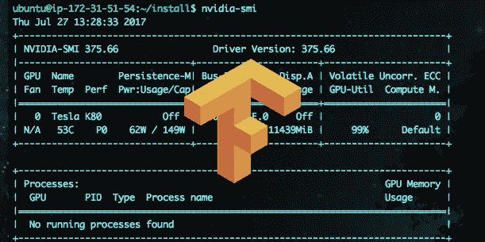
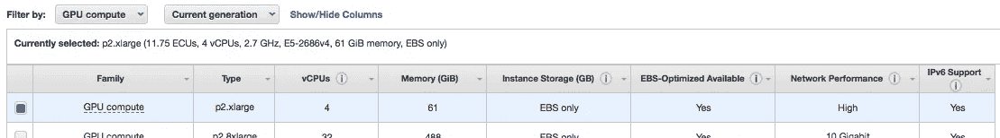
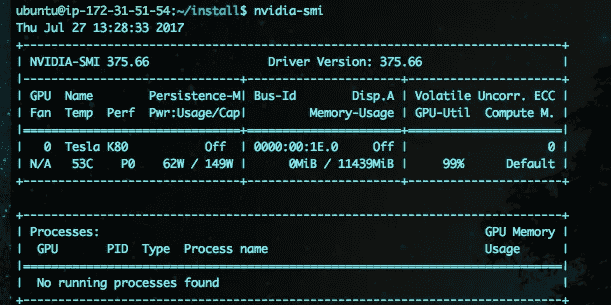
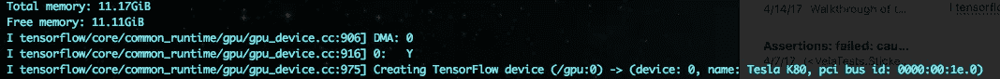

# 面向开发人员的 TensorFlow (GPU)设置

> 原文：<https://medium.com/hackernoon/tensorflow-gpu-setup-for-developers-7371ec0f04de>



tensorflow, machine learning, gpu, setup-guide

# 介绍

…适用于希望使用 TensorFlow 运行一些很酷的模型或实验的开发人员(在 GPU 上进行更高强度的训练)。这可能不适合专业数据科学家或任何创建实际模型的人——我想他们的设置可能会更冗长一些。

这篇博文将涵盖我用 [GPU](https://hackernoon.com/tagged/gpu) 支持设置/构建 TensorFlow 的手工实现。我已经花了相当多的时间阅读帖子和进行演练…并从中学习了很多…所以我拼凑了这个安装指南，我一直在使用它(应该很快就会有 CloudFormation 脚本)。很明显，通过 pip/conda 可以进行简单的安装，但是我们想要手动构建 TF 并让它在 GPU 上运行……本安装指南仍然针对简单/默认的配置和设置。

核心(我们将继续讨论这些内容):

*   AWS EC2 p2.xlarge
*   Ubuntu 16.04
*   CUDA 8.0(以及 CUDDN)
*   张量流 1.0
*   Python 2.x 和 libs(这里不直接需要 libs，但是我的安装是基于 Python 的使用)

# 启动 AWS EC2 实例

1.  选择操作系统类型: **Ubuntu Server 16.04**
2.  选择实例类型:GPU Compute > **p2.xlarge**



为什么是 p2？它们是专门为我们想要做的事情而制造的，即在 GPU 上运行密集的计算。p2.xlarge 为我们提供了 12gb 的 GPU。我们将能够在这台机器上很好地进行(批量)计算密集型[学习](https://hackernoon.com/tagged/learning)

**警告:** p2 实例在运行时的价格是**$ 0.90/小时** —所以我建议您只在执行训练等任务时保持实例状态运行。

3)配置:基本配置就可以了，您需要使用 VPC(默认 VPC 和子网设置也可以)

4)存储:**注意:**添加存储时，考虑您最有可能进行训练的数据量。例如，COCO 2014 数据集(图像)约为 15GB，COCO 最常用的训练神经网络为. 5GB。此外，我们将下载数百 MB 的单个软件和库。我在工作中选择了 **50GB 的存储空间**，并且已经使用了大约 30-40GB。

5)继续，使用您的首选项或默认值进行设置。没有其他特殊设置需要继续，所以启动并等待实例启动。

启动实例，等待它运行，我们应该可以继续了。

# 安装指南

SSH 到您新启动的实例中。

## Ubuntu 更新

```
$ sudo apt-get update
$ sudo apt-get upgrade
```

> **注意:**如果得到回应:
> 
> “boot/grub/menu.lst 的新版本…”
> 
> —我在测试环境中保留了本地版本。对于生产用途，需要进行尽职调查。

## 属国

我们需要的有用工具:

```
$ sudo apt-get -y git vim curl build-essential cmake pkg-config zip
```

这也是我安装将要使用的 python 库的地方(tensorflow 安装不需要):

```
$ sudo apt-get -y install python-pip python-dev python-numpy python-scipy ipython python-matplotlib python-sklearn python-wheel
```

我发现在构建和使用 tensorflow 时需要其他系统库:

```
$ sudo apt-get -y install -y libpng12-dev ibjasper-dev libfreetype6 libjpeg-dev libtiff5-dev libgtk2.0-dev libavcodec-dev libavformat-dev libswscale-dev libv4l-dev swig
```

现在为我们创建一个目录:

```
$ mkdir install && cd install
```

## 建筑张量流

我们将从源头建立张量流。有一个简单的 pip 安装，但是我们将通过构建获得更好的性能

[https://www . tensor flow . org/performance/performance _ guide # build _ and _ install _ from _ source](https://www.tensorflow.org/performance/performance_guide#build_and_install_from_source)

Bazel 是 TenorFlow 的构建工具。Bazel 需要使用我们的 ip，因为我们在 VPC，我们需要更改主机文件。

为了让**获得您的私有 ip 地址**，在终端中运行*ifconfig*…您将获得一个输出，因此查找 *inet adds* 并注意 ip —(也可以在 AWS 控制台中获得)

1.  修改/etc/hosts:

```
$ sudo vim /etc/hosts
// [vim opens the file …]
## change this line:
127.0.0.1 localhost
## to (if your private ip is 155.10.100.10)
127.0.0.1 ip-155–10–100–10
```

2.安装 Java(Bazel 需要):

```
$ sudo add-apt-repository ppa:webupd8team/java
// [press enter]
$ sudo apt-get update
$ sudo apt-get install -y oracle-java8-installer
// [accept terms]
```

3.安装 Bazel (0.5.1):

```
$ wget [https://github.com/bazelbuild/bazel/releases/download/0.5.1/bazel-0.5.1-installer-linux-x86_64.sh](https://github.com/bazelbuild/bazel/releases/download/0.5.1/bazel-0.5.1-installer-linux-x86_64.sh)$ chmod +x bazel-0.5.1-installer-linux-x86_64.sh
$ ./bazel-0.5.1-installer-linux-x86_64.sh
```

巴泽尔现在将被安装。让我们把它加进去。巴沙尔

修改~/。bashrc(将这两行添加到文件末尾):

```
$ vim ~/.bashrc
// [vim opens the file]# Add to end of file:
# BAZEL
source /home/ubuntu/.bazel/bin/bazel-complete.bash
export PATH=”$PATH:$HOME/bin”
```

让我们装货。巴沙尔现在变成了我们的外壳:

```
$ source ~/.bashrc
```

我们现在有了巴泽尔。

好了，在我们得到 TensorFlow 和 build 之前，我们需要为 GPU 支持安装我们的依赖项。其中包括 CUDA 和 CUDNN。
了解更多信息:[https://en.wikipedia.org/wiki/CUDA](https://en.wikipedia.org/wiki/CUDA)

安装 CUDA:

```
$ wget [http://developer.download.nvidia.com/compute/cuda/repos/ubuntu1404/x86_64/cuda-repo-ubuntu1404_8.0.44-1_amd64.deb](http://developer.download.nvidia.com/compute/cuda/repos/ubuntu1404/x86_64/cuda-repo-ubuntu1404_8.0.44-1_amd64.deb)$ sudo dpkg -i cuda-repo-ubuntu1404_8.0.44–1_amd64.deb
$ sudo apt-get -y update
$ sudo apt-get -y upgrade
$ sudo apt-get install -y cuda// [will take a couple of minutes]$ sudo sh -c “sudo echo ‘/usr/local/cuda/lib64’ > /etc/ld.so.conf.d/cuda.conf”
$ sudo ldconfig
```

要测试我们是否正确安装了这个，运行一个简单的命令:

```
$ nvidia-smi## note, using:
## watch -n 0.5 nvidia-smi
## is a useful way to launch a “live” monitor of GPU stats, use this when you train your models
```



**注意:**对于 CUDNN，你需要一个 Nvidia 开发者账号。你可以从这里得到这个:[https://developer.nvidia.com/rdp/cudnn-download](https://developer.nvidia.com/rdp/cudnn-download)

在你设置好你的账户后，继续**下载*8.0-Linux-x64-v 5.1*tarball 到你自己的机器上。**

我们将使用 *scp 将这个文件(以及来自我们机器的所有其他文件)传输到我们的 EC2 实例。*

**注意:**在 scp cud nn tarball 之前，用您的 ec2 和正确的路径编辑下面的命令

从您自己的机器上运行 [scp](https://en.wikipedia.org/wiki/Secure_copy) 命令(替换 ip):

```
$ scp -i \
     ~/keys/learner-key.pem \
     ~/Downloads/cudnn-8.0-linux-x64-v5.1.tgz \
     ubuntu@ec2–34–203–215–27.compute-1.amazonaws.com:~/install/## the syntax:
## scp -i <path_to_ec2_private_key> <path_to_file_to_transfer> <receiving_machine_and_path_to_dest>
```

tarball 转移后，拉开拉链并放置:

```
$ tar -zxf cudnn-8.0-linux-x64-v5.1.tgz
$ sudo cp -P cuda/lib64/* /usr/local/cuda/lib64/
```

***张量时间***

赞成..酷毙了。我们去找张量流吧。这里用 v1。

```
$ git clone [https://github.com/tensorflow/tensorflow](https://github.com/tensorflow/tensorflow)
$ cd tensorflow
$ git checkout v1.0.0$ ./configure// [launches configuration]
```

这将启动配置脚本。

**注意:**您需要配置一个非默认设置:CUDA 使用。所以[回车]获得所有默认设置，直到你看到询问你是否要支持 CUDA 的问题。**是的**我们有。以下 CUDA 设置也可以是默认设置。

好了，TensorFlow 配置好了，可以开始构建了。构建过程是及时的。通常在 p2.xlarge 上持续大约 1 小时。所以为了解决这个问题，并且不把你的进程绑定到开放的 shell 上，我们将使用*屏幕。Screen* 是一个工具，它允许我们在 shell 中启动一个新窗口，启动一个进程，然后*将*从该窗口中分离……并最终允许我们返回/重新连接到该窗口/进程。更多见此:[https://www . rackaid . com/blog/Linux-screen-tutorial-and-how-to/](https://www.rackaid.com/blog/linux-screen-tutorial-and-how-to/)

(在训练您的模型和运行那些相应的流程时，屏幕也很方便)

启动新的屏幕窗口:

```
$ screen
```

我们应该还在 install/tensorflow 目录中

使用 Bazel 构建 TensorFlow:

```
$ bazel build -c opt — config=cuda //tensorflow/tools/pip_package:build_pip_package// [bazel builds tensorflow here — long process]
```

**注意:**这是一个漫长的过程，预计需要一个小时。多亏了 screen，我们可以脱离这个窗口(如果您愿意，可以关闭 ssh 连接)并休息一下

要从巴泽尔正在建造的纱窗上拆下来:

```
ctrl-a + d
```

…张量流建筑的时间段…

休息后，重新连接到正在建造/建造 TensorFlow 的纱窗:

```
$ screen -r
```

使用 pip 安装新版本:

```
$ bazel-bin/tensorflow/tools/pip_package/build_pip_package /tmp/tensorflow_pkg$ sudo pip install /tmp/tensorflow_pkg/tensorflow-1.0.0-cp27-cp27mu-linux_x86_64.whl
```

我们现在要确保 TensorFlow 可以在运行之前找到 cuda。我们需要将它添加到我们的环境中。

修改~/。bashrc

```
$ vim ~/.bashrc
// [vim opens the file]# Add to end of file:
# CUDA
export LD_LIBRARY_PATH=”$LD_LIBRARY_PATH:/usr/local/cuda/lib64:/usr/local/cuda/extras/CUPTI/lib64"export CUDA_HOME=/usr/local/cuda
```

cd 输出到主目录(确保您不在 tensflow 目录下)

和

# TENSORFLOW 安装完毕！

让我们在交互式 Python 中测试一下:

```
$ python
// [python interpreter opens]>>>
>>> import tensorflow as tfI tensorflow/stream_executor/dso_loader.cc:135] successfully opened CUDA library libcublas.so.8.0 locally
I tensorflow/stream_executor/dso_loader.cc:135] successfully opened CUDA library libcudnn.so.5 locally… more like output like this (good sign that we see CUDA) ## TEST SCRIPT:>>> with tf.Session() as sess:…… sess.run(tf.global_variables_initializer())…… print sess.run(output)……[press enter]// [script runs — you will see an initial output]
```

为了确认我们正在使用 GPU，请查看以下输出:



***现在去做点爽的 s***。***

[跟着我](https://twitter.com/rambossa)