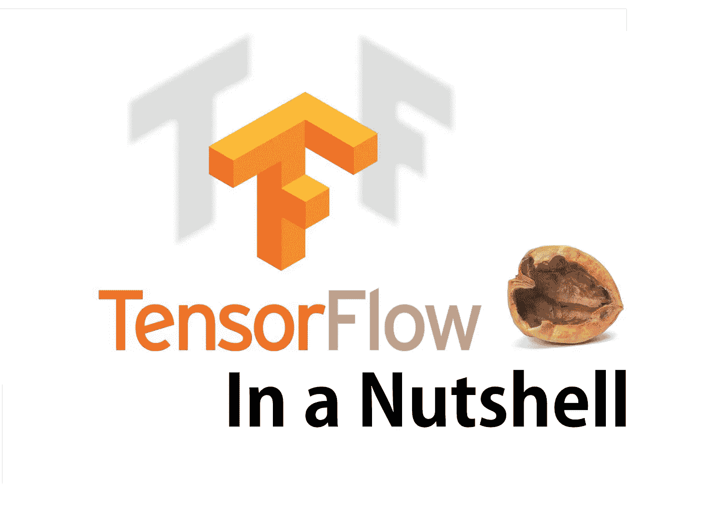
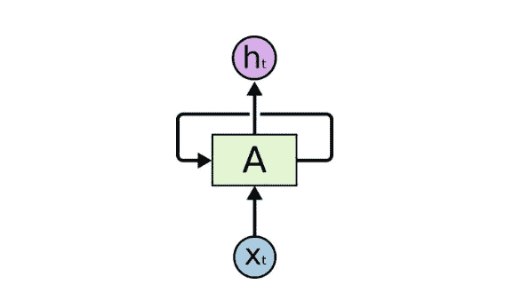
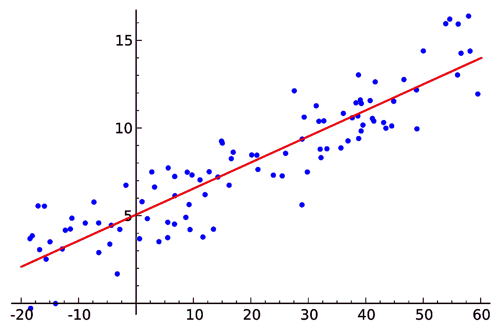
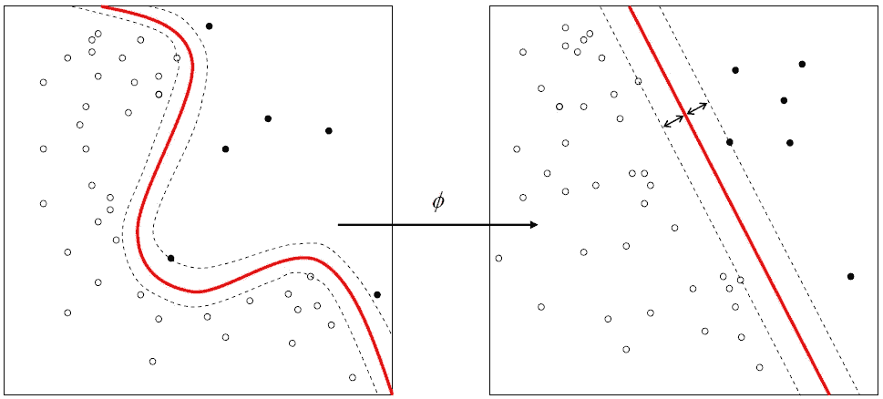
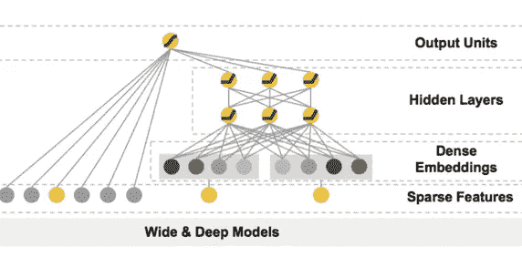
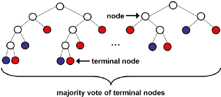
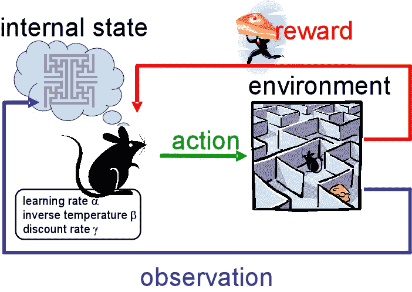
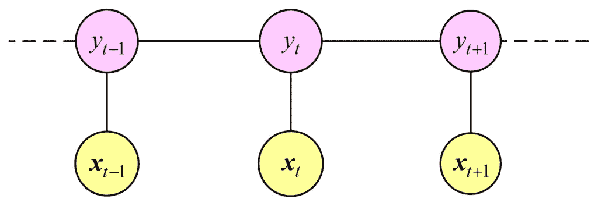

# 张量流概述——第三部分:所有模型

> 原文：<https://medium.com/hackernoon/tensorflow-in-a-nutshell-part-three-all-the-models-be1465993930>



## 世界上最流行的深度学习框架的快速简单指南。

请务必在此查看其他文章[。](http://camron.xyz)

## 概观

在这一期中，我们将回顾 TensorFlow 中当前可用的所有抽象模型，并描述该特定模型的用例以及简单的示例代码。工作示例的完整来源在[tensor flow In a null repo](https://github.com/c0cky/TensorFlow-in-a-Nutshell)中。



A recurrent neural network

## 递归神经网络

***用例:*** 语言建模、机器翻译、单词嵌入、文本处理。

自从长短期记忆和门控递归单元出现以来，递归神经网络在自然语言处理中取得了超越其他模型的飞跃。它们可以被输入代表字符的向量，并被训练以基于训练集生成新的句子。这个模型的优点是它保留了句子的上下文，并推导出“猫坐在垫子上”意味着猫在垫子上的意思。自从张量流写作的出现，这些网络变得越来越简单。Denny Britz [在这里](http://www.wildml.com/2016/08/rnns-in-tensorflow-a-practical-guide-and-undocumented-features/)甚至提到了一些隐藏的特性，这些特性使得编写 RNN 的代码更加简单。

```
import tensorflow as tf
import numpy as np*# Create input data*
X = np.random.randn(2, 10, 8)

*# The second example is of length 6* 
X[1,6,:] = 0
X_lengths = [10, 6]

cell = tf.nn.rnn_cell.LSTMCell(num_units=64, state_is_tuple=**True**)
cell = tf.nn.rnn_cell.DropoutWrapper(cell=cell, output_keep_prob=0.5)
cell = tf.nn.rnn_cell.MultiRNNCell(cells=[cell] * 4, state_is_tuple=**True**)

outputs, last_states = tf.nn.dynamic_rnn(
    cell=cell,
    dtype=tf.float64,
    sequence_length=X_lengths,
    inputs=X)

result = tf.contrib.learn.run_n(
    {"outputs": outputs, "last_states": last_states},
    n=1,
    feed_dict=**None**)
```


Convolution Neural Network

## 卷积神经网络

***使用案例:*** 图像处理、面部识别、计算机视觉

卷积神经网络是独特的，因为它们在创建时就考虑到了输入将是图像。CNN 对矩阵执行滑动窗口功能。该窗口被称为内核，它在图像上滑动，创建一个卷积特征。


from [http://deeplearning.standford.edu/wiki/index.php/Feature_extraction_using_convolution](http://deeplearning.standford.edu/wiki/index.php/Feature_extraction_using_convolution)

创建一个卷积特征允许边缘检测，然后允许一个[网络](https://hackernoon.com/tagged/network)从图片中描绘物体。


edge detection from GIMP manual

创建该矩阵的卷积特征如下图所示:


Convolved feature from GIMP manual

下面是从 MNIST 数据集中识别手写数字的代码示例。

```
### Convolutional network
def max_pool_2x2(tensor_in):
  return tf.nn.max_pool(
      tensor_in, ksize=[1, 2, 2, 1], strides=[1, 2, 2, 1], padding='SAME')def conv_model(X, y):
  # reshape X to 4d tensor with 2nd and 3rd dimensions being image width and
  # height final dimension being the number of color channels.
  X = tf.reshape(X, [-1, 28, 28, 1]) # first conv layer will compute 32 features for each 5x5 patch
  with tf.variable_scope('conv_layer1'):
    h_conv1 = learn.ops.conv2d(X, n_filters=32, filter_shape=[5, 5],
                               bias=True, activation=tf.nn.relu)
    h_pool1 = max_pool_2x2(h_conv1) # second conv layer will compute 64 features for each 5x5 patch.
  with tf.variable_scope('conv_layer2'):
    h_conv2 = learn.ops.conv2d(h_pool1, n_filters=64, filter_shape=[5, 5],
                               bias=True, activation=tf.nn.relu)
    h_pool2 = max_pool_2x2(h_conv2) # reshape tensor into a batch of vectors
    h_pool2_flat = tf.reshape(h_pool2, [-1, 7 * 7 * 64]) # densely connected layer with 1024 neurons.
  h_fc1 = learn.ops.dnn(
      h_pool2_flat, [1024], activation=tf.nn.relu, dropout=0.5)
  return learn.models.logistic_regression(h_fc1, y)
```


## 前馈神经网络

***用例:*** 分类和回归

这些网络由多层感知器组成，接受输入，将信息传递给下一层。网络的最后一层产生输出。给定层中的每个节点之间没有连接。没有原始输入和最终输出的层称为隐藏层。

该网络的目标类似于使用反向传播的其他监督神经网络，以使输入具有期望的训练输出。这些是用于分类和回归问题的一些最简单有效的神经网络。我们将展示创建一个前馈网络来分类手写数字是多么容易:

```
def init_weights(shape):
    return tf.Variable(tf.random_normal(shape, stddev=0.01))def model(X, w_h, w_o):
    h = tf.nn.sigmoid(tf.matmul(X, w_h)) # this is a basic mlp, think 2 stacked logistic regressions
    return tf.matmul(h, w_o) # note that we dont take the softmax at the end because our cost fn does that for usmnist = input_data.read_data_sets("MNIST_data/", one_hot=True)
trX, trY, teX, teY = mnist.train.images, mnist.train.labels, mnist.test.images, mnist.test.labelsX = tf.placeholder("float", [None, 784])
Y = tf.placeholder("float", [None, 10])w_h = init_weights([784, 625]) # create symbolic variables
w_o = init_weights([625, 10])py_x = model(X, w_h, w_o)cost = tf.reduce_mean(tf.nn.softmax_cross_entropy_with_logits(py_x, Y)) # compute costs
train_op = tf.train.GradientDescentOptimizer(0.05).minimize(cost) # construct an optimizer
predict_op = tf.argmax(py_x, 1)# Launch the graph in a session
with tf.Session() as sess:
    # you need to initialize all variables
    tf.initialize_all_variables().run()for i in range(100):
        for start, end in zip(range(0, len(trX), 128), range(128, len(trX)+1, 128)):
            sess.run(train_op, feed_dict={X: trX[start:end], Y: trY[start:end]})
        print(i, np.mean(np.argmax(teY, axis=1) ==
                         sess.run(predict_op, feed_dict={X: teX, Y: teY})))
```



## 线性模型

***用例:*** 分类和回归

线性模型采用 X 值并生成一条最佳拟合线，用于 Y 值的分类和回归。例如，如果您有一个住宅区的房子大小及其价格的列表，您可以使用线性模型预测给定大小的房子的价格。

需要注意的一点是，线性模型可以用于多个 X 特征。例如，在住房示例中，我们可以创建一个线性模型，给出房屋大小、房间数量、浴室数量和价格，并预测给定房屋大小、房间数量和浴室数量的价格。

```
import numpy as np
import tensorflow as tfdef weight_variable(shape):
    initial = tf.truncated_normal(shape, stddev=1)
    return tf.Variable(initial)# dataset
xx = np.random.randint(0,1000,[1000,3])/1000.
yy = xx[:,0] * 2 + xx[:,1] * 1.4 + xx[:,2] * 3# model
x = tf.placeholder(tf.float32, shape=[None, 3])
y_ = tf.placeholder(tf.float32, shape=[None])
W1 = weight_variable([3, 1])
y = tf.matmul(x, W1)# training and cost function
cost_function = tf.reduce_mean(tf.square(tf.squeeze(y) - y_))
train_function = tf.train.AdamOptimizer(1e-2).minimize(cost_function)# create a session
sess = tf.Session()# train
sess.run(tf.initialize_all_variables())
for i in range(10000):
    sess.run(train_function, feed_dict={x:xx, y_:yy})
    if i % 1000 == 0:
        print(sess.run(cost_function, feed_dict={x:xx, y_:yy}))
```



## 支持向量机

***用例:*** 目前仅二进制分类

SVM 背后的一般思想是，对于线性可分模式，存在一个最优超平面。对于不可线性分离的数据，我们可以使用核函数将原始数据转换到一个新的空间。支持向量机最大化分离超平面的边界。它们在高维空间中非常有效，如果维数大于样本数，它们仍然有效。

```
def input_fn():
      return {
          'example_id': tf.constant(['1', '2', '3']),
          'price': tf.constant([[0.6], [0.8], [0.3]]),
          'sq_footage': tf.constant([[900.0], [700.0], [600.0]]),
          'country': tf.SparseTensor(
              values=['IT', 'US', 'GB'],
              indices=[[0, 0], [1, 3], [2, 1]],
              shape=[3, 5]),
          'weights': tf.constant([[3.0], [1.0], [1.0]])
      }, tf.constant([[1], [0], [1]])price = tf.contrib.layers.real_valued_column('price')
    sq_footage_bucket = tf.contrib.layers.bucketized_column(
        tf.contrib.layers.real_valued_column('sq_footage'),
        boundaries=[650.0, 800.0])
    country = tf.contrib.layers.sparse_column_with_hash_bucket(
        'country', hash_bucket_size=5)
    sq_footage_country = tf.contrib.layers.crossed_column(
        [sq_footage_bucket, country], hash_bucket_size=10)
    svm_classifier = tf.contrib.learn.SVM(
        feature_columns=[price, sq_footage_bucket, country, sq_footage_country],
        example_id_column='example_id',
        weight_column_name='weights',
        l1_regularization=0.1,
        l2_regularization=1.0)svm_classifier.fit(input_fn=input_fn, steps=30)
    accuracy = svm_classifier.evaluate(input_fn=input_fn, steps=1)['accuracy']
```



## 深度和宽度模型

***用例:*** 推荐系统，分类和回归

深度和宽度模型在第二部分的[中有更详细的介绍，所以我们在这里不会讲太多。宽而深的网络将线性模型与前馈神经网络相结合，这样我们的预测将具有记忆性和泛化能力。这种类型的模型可用于分类和回归问题。这允许具有相对准确预测的较少特征工程。因此，两全其美。下面是来自第二部分 github](/@camrongodbout/tensorflow-in-a-nutshell-part-two-hybrid-learning-98c121d35392#.oubizxp18) 的代码片段。

```
def input_fn(df, train=False):
  """Input builder function."""
  # Creates a dictionary mapping from each continuous feature column name (k) to
  # the values of that column stored in a constant Tensor.
  continuous_cols = {k: tf.constant(df[k].values) for k in CONTINUOUS_COLUMNS}
  # Creates a dictionary mapping from each categorical feature column name (k)
  # to the values of that column stored in a tf.SparseTensor.
  categorical_cols = {k: tf.SparseTensor(
    indices=[[i, 0] for i in range(df[k].size)],
    values=df[k].values,
    shape=[df[k].size, 1])
                      for k in CATEGORICAL_COLUMNS}
  # Merges the two dictionaries into one.
  feature_cols = dict(continuous_cols)
  feature_cols.update(categorical_cols)
  # Converts the label column into a constant Tensor.
  if train:
    label = tf.constant(df[SURVIVED_COLUMN].values)
      # Returns the feature columns and the label.
    return feature_cols, label
  else:
    return feature_colsm = build_estimator(model_dir)
m.fit(input_fn=lambda: input_fn(df_train, True), steps=200)
print m.predict(input_fn=lambda: input_fn(df_test))
results = m.evaluate(input_fn=lambda: input_fn(df_train, True), steps=1)
for key in sorted(results):
  print("%s: %s" % (key, results[key]))
```



## 随机森林

***用例:*** 分类和回归

随机森林模型采用许多不同的分类树，每棵树为该类别投票。森林选择投票最多的分类。

随机森林不会过度适应，你可以跑尽可能多的树，这是相对较快的。用下面的片段试试虹膜数据:

```
hparams = tf.contrib.tensor_forest.python.tensor_forest.ForestHParams(
        num_trees=3, max_nodes=1000, num_classes=3, num_features=4)
classifier = tf.contrib.learn.TensorForestEstimator(hparams)iris = tf.contrib.learn.datasets.load_iris()
data = iris.data.astype(np.float32)
target = iris.target.astype(np.float32)monitors = [tf.contrib.learn.TensorForestLossMonitor(10, 10)]
classifier.fit(x=data, y=target, steps=100, monitors=monitors)
classifier.evaluate(x=data, y=target, steps=10)
```



## 贝叶斯强化学习

***用例:*** 分类和回归

在 TensorFlow 的 contrib 文件夹中有一个名为 BayesFlow 的库。除了一个增强算法的例子，BayesFlow 没有任何文档。这个算法是由罗纳德·威廉姆斯在一篇论文中提出的。

> **RE**ward**I**increment =**N**on negative**F**actor ***O**ffset**R**enforcement ***C**character istic**E**责任

这个网络试图解决一个即时强化[学习](https://hackernoon.com/tagged/learning)任务，在每次试验获得强化值后调整权重。在每次试验结束时，每个权重增加一个学习率因子乘以强化值减去基线乘以特征合格性。Williams 的论文还讨论了使用反向传播来训练增强网络。

```
"""Build the Split-Apply-Merge Model.
  Route each value of input [-1, -1, 1, 1] through one of the
  functions, plus_1, minus_1\.  The decision for routing is made by
  4 Bernoulli R.V.s whose parameters are determined by a neural network
  applied to the input.  REINFORCE is used to update the NN parameters.
  Returns:
    The 3-tuple (route_selection, routing_loss, final_loss), where:
      - route_selection is an int 4-vector
      - routing_loss is a float 4-vector
      - final_loss is a float scalar.
  """
  inputs = tf.constant([[-1.0], [-1.0], [1.0], [1.0]])
  targets = tf.constant([[0.0], [0.0], [0.0], [0.0]])
  paths = [plus_1, minus_1]
  weights = tf.get_variable("w", [1, 2])
  bias = tf.get_variable("b", [1, 1])
  logits = tf.matmul(inputs, weights) + bias# REINFORCE forward step
  route_selection = st.StochasticTensor(
      distributions.Categorical, logits=logits)
```



## 线性链条件随机场

***用例:*** 时序数据

CRF 是根据一个无向模型进行因子化的条件概率分布。它们预测单个样本的标签，保持来自相邻样本的上下文。CRF 类似于隐马尔可夫模型。CRF 通常用于图像分割和对象识别，以及浅层解析、命名实体识别和基因查找。

```
# Train for a fixed number of iterations.
session.run(tf.initialize_all_variables())
  for i in range(1000):
    tf_unary_scores, tf_transition_params, _ = session.run(
       [unary_scores, transition_params, train_op])
    if i % 100 == 0:
      correct_labels = 0
      total_labels = 0
      for tf_unary_scores_, y_, sequence_length_ in zip(tf_unary_scores, y, sequence_lengths):
        # Remove padding from the scores and tag sequence.
        tf_unary_scores_ = tf_unary_scores_[:sequence_length_]
        y_ = y_[:sequence_length_]

        # Compute the highest scoring sequence.
        viterbi_sequence, _ = tf.contrib.crf.viterbi_decode(
            tf_unary_scores_, tf_transition_params)

        # Evaluate word-level accuracy.
        correct_labels += np.sum(np.equal(viterbi_sequence, y_))
        total_labels += sequence_length_
      accuracy = 100.0 * correct_labels / float(total_labels)
      print("Accuracy: %.2f%%" % accuracy)
```

## 结论

自从 TensorFlow 发布以来，围绕该项目的社区一直在添加更多的包、示例和案例来使用这个令人惊叹的库。甚至在撰写本文时，还有更多的模型和示例代码正在编写中。看到张量流在过去的几个月里增长了这么多是令人惊讶的。随着时间的推移，软件包的易用性和多样性正在增加，而且似乎不会很快放缓。

> 一如既往——如有任何问题或咨询，请随时发送电子邮件至 camron@camron.xyz

> 最初发布于 [Camron.xyz](http://camron.xyz)

[](http://bit.ly/HackernoonFB)[](https://goo.gl/k7XYbx)[](https://goo.gl/4ofytp)

> [黑客中午](http://bit.ly/Hackernoon)是黑客如何开始他们的下午。我们是这个家庭的一员。我们现在[接受投稿](http://bit.ly/hackernoonsubmission)并乐意[讨论广告&赞助](mailto:partners@amipublications.com)机会。
> 
> 如果你喜欢这个故事，我们推荐你阅读我们的[最新科技故事](http://bit.ly/hackernoonlatestt)和[趋势科技故事](https://hackernoon.com/trending)。直到下一次，不要把世界的现实想当然！

[](https://goo.gl/Ahtev1)