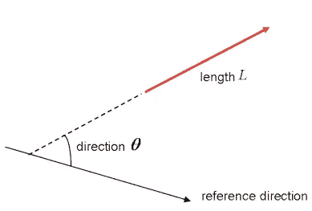
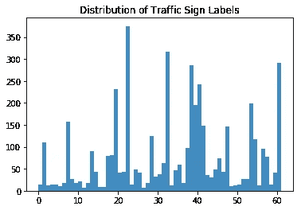
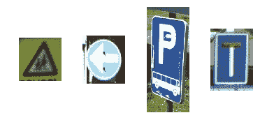
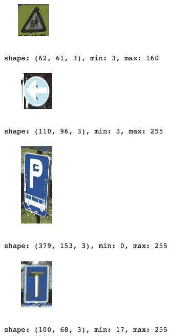
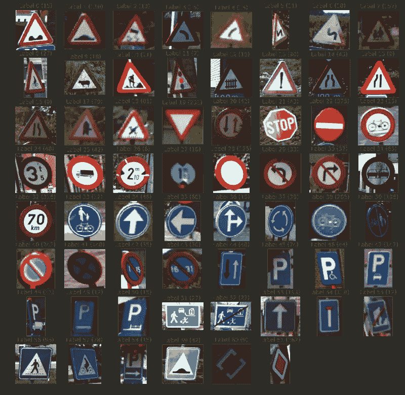
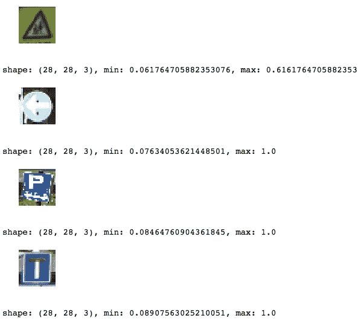
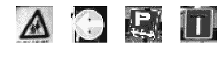

# 面向初学者的 TensorFlow 教程

> 原文：<https://medium.com/hackernoon/tensorflow-tutorial-for-beginners-69358e73dee7>

*原载于*[*https://www . data camp . com/community/tutorials/tensor flow-tutorial*](https://www.datacamp.com/community/tutorials/tensorflow-tutorial)

[深度学习](https://hackernoon.com/tagged/deep-learning)是[机器学习](https://hackernoon.com/tagged/machine-learning)的一个子领域，机器学习是一套受大脑结构和功能启发的算法。

TensorFlow 是谷歌创建的第二个机器学习框架，用于设计、构建和训练深度学习模型。您可以使用 TensorFlow 库进行数值计算，这本身看起来并不特别，但是这些计算是用数据流图完成的。在这些图中，节点表示数学运算，而边表示在这些边之间传递的数据，通常是多维数据数组或张量。

你看到了吗？“TensorFlow”这个名字来源于神经网络对多维数据数组或张量执行的操作！它实际上是一个张量流。现在，这就是你需要知道的关于张量的全部内容，但是你将在下一节中更深入地了解它！

今天的 TensorFlow 初学者教程将向您介绍以互动的方式执行深度学习:

*   你将首先了解更多关于[张量](https://www.datacamp.com/community/tutorials/tensorflow-tutorial#tensors)；
*   然后，本教程将简要介绍在您的系统上安装 TensorFlow 的一些方法，这样您就可以开始在您的工作空间中加载数据；
*   在这之后，你将复习一些[张量流的基础知识](https://www.datacamp.com/community/tutorials/tensorflow-tutorial#basics):你将看到如何轻松地开始简单的计算。
*   在这之后，你开始真正的工作:你将载入比利时交通标志的数据，并通过简单的统计和绘图来探索这些数据。
*   在您的探索中，您将会看到有必要[操纵您的数据](https://www.datacamp.com/community/tutorials/tensorflow-tutorial#manipulate)，以便您可以将其输入到您的模型中。这就是为什么你会花时间重新缩放你的图像，并将其转换为灰度。
*   接下来，你终于可以开始[你的神经网络模型](https://www.datacamp.com/community/tutorials/tensorflow-tutorial#model)了！您将逐层构建您的模型层；
*   一旦架构建立起来，你就可以用它来[交互式地训练你的模型](https://www.datacamp.com/community/tutorials/tensorflow-tutorial#train)，最终[也可以通过输入一些测试数据来评估](https://www.datacamp.com/community/tutorials/tensorflow-tutorial#evaluate)。
*   最后，您将获得一些关于[进一步](https://www.datacamp.com/community/tutorials/tensorflow-tutorial#further)改进您刚刚构建的模型以及如何使用 TensorFlow 继续学习的指导。


在这里下载本教程[的笔记本。](https://github.com/Kacawi/datacamp-community/blob/master/TensorFlow%20Tutorial%20For%20Beginners/TensorFlow%20Tutorial%20For%20Beginners.ipynb)

此外，你可能会对关于 Python 深度学习的课程感兴趣，比如 DataCamp 的 Keras 教程。

# 张量介绍

为了更好地理解张量，有一些线性代数和向量微积分的工作知识是很好的。你已经在介绍中读到张量在 TensorFlow 中是作为多维数据数组实现的，但是为了完全掌握张量及其在机器学习中的用途，可能还需要更多的介绍。

在你学习平面向量之前，最好先修改一下“向量”的概念；向量是特殊类型的矩阵，是数字的矩形阵列。因为向量是有序的数字集合，所以它们通常被视为列矩阵:它们只有一列和一定数量的行。换句话说，你也可以把向量看作是有方向的标量。

**记住**:标量的一个例子是“5 米”或“60 米/秒”，而矢量是，例如，“北 5 米”或“东 60 米/秒”。这两者的区别很明显，向量是有方向的。然而，到目前为止，你所看到的这些例子可能与你在处理机器学习问题时可能遇到的向量相去甚远。这很正常；数学向量的长度是一个纯数字:它是绝对的。另一方面，方向是相对的:它是相对于某个参考方向测量的，单位是弧度或度。通常假设方向为正，从参考方向逆时针旋转。



当然，从视觉上来说，你用箭头表示矢量，就像你在上图中看到的那样。这意味着你也可以把向量看作有方向和长度的箭头。方向用箭头的头部表示，长度用箭头的长度表示。

那么平面向量呢？

平面向量是最简单的张量设置。正如你在上面看到的，它们很像常规向量，唯一的区别是它们在向量空间中。为了更好地理解这一点，让我们从一个例子开始:你有一个向量是 *2 X 1* 。这意味着向量属于一组一次成对出现的实数。换句话说，它们是二维空间的一部分。在这种情况下，您可以用箭头或射线来表示坐标 *(x，y)* 平面上的向量。

从这个坐标平面开始，在标准位置，向量的端点在原点 *(0，0)* ，通过查看向量的第一行，您可以导出 *x* 坐标，而您将在第二行找到 *y* 坐标。当然，这个标准位置并不总是需要保持:向量可以在平面内平行于自身移动，而不会经历变化。

**注意**类似地，对于大小为 *3 X 1* 的向量，你说的是三个空间。您可以将矢量表示为一个三维图形，箭头指向矢量空间中的位置:它们绘制在标准的 *x* 、 *y* 和 *z* 轴上。

有这些向量，并把它们表示在坐标平面上是很好的，但本质上，你有这些向量，所以你可以对它们进行运算，有一件事可以帮助你做到这一点，就是把你的向量表示为基向量或单位向量。

单位向量是大小为 1 的向量。你经常会通过一个带扬抑符的小写字母，或者“帽子”来识别单位向量。如果您想将二维或三维矢量表示为两个或三个正交分量之和，例如 x 轴和 y 轴或 z 轴，单位矢量会很方便。

当你谈论表达一个向量时，例如，作为分量的和，你会看到你谈论的是分量向量，是两个或更多的向量，它们的和是给定的向量。

**提示**:观看[这段视频](https://www.youtube.com/watch?v=f5liqUk0ZTw)，借助简单的家居物件解释了张量是什么！

除了平面向量，还有向量和线性算子，这三种情况有一个共同点:它们是张量的特殊情况。您还记得在前面的章节中，向量是如何被描述为标量大小的，并给出了一个方向。因此，张量是一个物理实体的数学表示，可以用大小和多个方向来表征。

就像你在三维空间中用一个数字表示一个标量，用三个数字的序列表示一个矢量一样，例如，一个张量可以用三维空间中的 3R 个数字的数组来表示。

这个符号中的“R”代表张量的秩:这意味着在三维空间中，一个二阶张量可以用 3 的 2 次方或 9 次方来表示。在 n 维空间中，标量仍然只需要一个数，而向量需要 n 个数，张量需要 N^R 数。这解释了为什么你经常听到标量是秩为 0 的张量:由于它们没有方向，你可以用一个数来表示它们。

记住这一点，识别标量、向量和张量并把它们区分开来就相当容易了:标量可以用一个数字来表示，向量可以用一组有序的数字来表示，张量可以用一组数字来表示。

张量之所以如此特殊，是因为分量和基向量的组合:基向量在参考系之间单向变换，而分量变换的方式恰好使分量和基向量之间的组合保持不变。

# 安装 TensorFlow

现在您对 TensorFlow 有了更多的了解，是时候开始安装这个库了。在这里，很高兴知道 TensorFlow 提供了 Python、C++、Haskell、Java、Go、Rust 的 API，还有一个 R 的第三方包叫做`tensorflow`。

**提示**:如果你想了解更多 R 中的深度学习包，可以考虑查看 DataCamp 的[keras:R 中的深度学习教程](https://www.datacamp.com/community/tutorials/keras-r-deep-learning)。

在本教程中，您将下载 TensorFlow 的一个版本，该版本将使您能够用 Python 编写深度学习项目的代码。在 [TensorFlow 安装网页](https://www.tensorflow.org/install/)上，您将看到使用`virtualenv`、`pip`、Docker 安装 TensorFlow 的一些最常用的方法和最新说明，最后，还有一些在您的个人电脑上安装 TensorFlow 的其他方法。

**注意**如果你在 Windows 上工作，你也可以用 Conda 安装 TensorFlow。不过，由于 TensorFlow 的安装是社区支持的，所以最好查看一下[官方安装说明](https://www.tensorflow.org/install/install_windows)。

现在，您已经完成了安装过程，是时候通过将 TensorFlow 导入到您的工作区，并使用别名`tf`来仔细检查您是否已经正确安装了 tensor flow:

```
import tensorflow as tf
```

**请注意**您在上面的代码行中使用的别名是一种约定——它用于确保您一方面与在数据科学项目中使用 TensorFlow 的其他开发人员保持一致，另一方面与开源 TensorFlow 项目保持一致。

# TensorFlow 入门:基础知识

你通常会编写 TensorFlow 程序，这些程序是作为一个块来运行的；当你使用 Python 时，乍一看这是矛盾的。但是，如果您愿意，您也可以使用 TensorFlow 的交互式会话，您可以使用该会话与库进行更多的交互。当您习惯使用 IPython 时，这尤其方便。

对于本教程，您将专注于第二个选项:这将帮助您在 TensorFlow 中快速启动深度学习。但是，在您进一步深入之前，让我们先尝试一些小东西，然后再开始繁重的工作。

首先，导入别名为`tf`的`tensorflow`库，正如您在上一节中看到的。然后初始化两个实际上是常量的变量。将四个数字的数组传递给`constant()`函数。

**注意**你也可以传入一个整数，但是更多的时候，你会发现自己在处理数组。正如你在介绍中看到的，张量都是关于数组的！所以一定要传入一个数组:)接下来，你可以用`multiply()`把你的两个变量相乘。将结果存储在`result`变量中。最后，借助`print()`功能打印出`result`。在这里找到练习[。](https://www.datacamp.com/community/tutorials/tensorflow-tutorial)

**注意**您已经在上面的 DataCamp Light 代码块中定义了常量。然而，还有另外两种类型的值可以使用，即[占位符](https://www.tensorflow.org/api_docs/python/tf/placeholder)，它们是未赋值的值，将在运行会话时由会话初始化。就像已经给出的名字一样，它只是一个张量的占位符，当会话运行时，这个张量将总是被填充；还有[变量](https://www.tensorflow.org/api_docs/python/tf/Variable)，是可以变化的值。正如你可能已经收集到的，常量是不会改变的值。

代码行的结果是计算图中的抽象张量。然而，与你所期望的相反，`result`实际上并没有被计算出来；它只是定义了模型，但没有运行任何流程来计算结果。您可以在打印结果中看到这一点:实际上没有您想要看到的结果(即 30)。这意味着 TensorFlow 有懒评！

但是，如果您想看到结果，您必须在交互式会话中运行这段代码。你可以用几种方法做到这一点，如下面的 DataCamp Light 代码块[所示。](https://www.datacamp.com/community/tutorials/tensorflow-tutorial)

**注意**您也可以使用以下代码行启动一个交互式会话，运行`result`并在打印`output.`后再次自动关闭会话

在上面的代码块[中，您刚刚定义了一个默认会话，但是知道您也可以传入选项也很好。例如，您可以指定`config`参数，然后使用`ConfigProto`协议缓冲区为您的会话添加配置选项。](https://www.datacamp.com/community/tutorials/tensorflow-tutorial)

例如，如果您将`config=tf.ConfigProto(log_device_placement=True)`添加到您的会话中，您需要确保记录分配给某个操作的 GPU 或 CPU 设备。然后，您将获得在每个操作的会话中使用了哪些设备的信息。您也可以使用以下配置会话，例如，当您对设备放置使用软约束时:`config=tf.ConfigProto(allow_soft_placement=True)`。

现在，您已经安装了 TensorFlow 并将其导入到您的工作空间中，并且已经了解了使用该包的基本知识，现在是时候将它放在一边，将注意力转移到您的数据上了。就像往常一样，在开始对神经网络建模之前，您将首先花时间探索和更好地理解您的数据。

# 比利时交通标志:背景

尽管交通是一个大家都知道的话题，但在开始之前，简单浏览一下这个数据集中包含的观察结果，看看自己是否理解了所有内容，并无大碍。实质上，在这一节中，您将快速掌握本教程中需要进一步掌握的领域知识。

当然，因为我是比利时人，我保证你也会得到一些趣闻:)

*   比利时的交通标志通常用荷兰语和法语。知道这一点很好，但是对于您将要使用的数据集来说，这并不太重要！
*   比利时有六种交通标志:警告标志、优先标志、禁止标志、强制标志、与停车和停在路上有关的标志，最后是指示标志。
*   2017 年 1 月 1 日，比利时道路上移除了 3 万多个交通标志。这些都是与速度有关的禁止标志。
*   谈到拆除，交通标志的大量存在一直是比利时(以及整个欧盟)正在讨论的问题。

# 加载和浏览数据

现在你已经收集了更多的背景信息，是时候下载数据集[了。您应该会在“BelgiumTS for class ification(cropped images)”旁边看到两个 zip 文件，分别名为“BelgiumTSC_Training”和“BelgiumTSC_Testing”。](http://btsd.ethz.ch/shareddata/)

**提示**:如果你已经下载了文件，或者在完成本教程后将要这样做，看看你已经下载的数据的文件夹结构！您将看到测试文件夹和训练数据文件夹包含 61 个子文件夹，它们是您将在本教程中用于分类的 62 种类型的交通标志。此外，您会发现这些文件具有文件扩展名`.ppm`或便携位图格式。您已经下载了交通标志的图像！

让我们开始将数据导入您的工作区。让我们从用户定义的函数(UDF) `load_data()`下面的代码行开始:

*   首先，设定你的`ROOT_PATH`。这个路径是您用培训和测试数据创建目录的路径。
*   接下来，您可以借助`join()`功能将特定路径添加到您的`ROOT_PATH`中。你把这两条具体路径存储在`train_data_directory`和`test_data_directory`里。
*   你看到之后，你可以调用`load_data()`函数，并传递`train_data_directory`给它。
*   现在，`load_data()`函数本身通过收集出现在`train_data_directory`中的所有子目录开始；它是在列表理解的帮助下做到这一点的，这是构造列表的一种非常自然的方式——它基本上是说，如果您在`train_data_directory`中找到了什么，您将仔细检查这是否是一个目录，如果是，您将把它添加到您的列表中。**记住**每个子目录代表一个标签。
*   接下来，您必须遍历子目录。首先初始化两个列表，`labels`和`images`。接下来，收集子目录的路径和存储在这些子目录中的图像的文件名。之后，您可以借助`append()`功能收集两个列表中的数据。

请注意，在上述代码块的[中，训练和测试数据位于名为“training”和“Testing”的文件夹中，这两个文件夹都是另一个目录“TrafficSigns”的子目录。在本地机器上，这可能看起来像“/Users/your name/Downloads/traffic signs”，然后有两个子文件夹叫做“Training”和“Testing”。](https://www.datacamp.com/community/tutorials/tensorflow-tutorial)

随着数据的加载，是时候进行一些数据检查了！借助于`images`数组的`ndim`和`size`属性，您可以从一个非常简单的分析开始:

注意，`images`和`labels`变量是列表，所以您可能需要使用`np.array()`将变量转换成您自己工作空间中的数组。这里已经为您完成了！

**注意**您打印出来的`images[0]`实际上是一个由数组中的数组表示的单一图像！这起初似乎违反直觉，但随着你在机器学习或深度学习应用程序中进一步处理图像，你会习惯这一点。

接下来你也可以小看看`labels`，不过在这一点上应该看不到太多惊喜[。](https://www.datacamp.com/community/tutorials/tensorflow-tutorial)

这些数字已经让您对导入的成功程度和数据的确切大小有了一些了解。乍一看，一切都按照您预期的方式执行了，如果您考虑到要处理数组中的数组，您会发现数组的大小相当大。

**提示**尝试将以下属性添加到您的数组中，以获得更多关于内存布局、一个数组元素的长度(以字节为单位)以及具有`flags`、`itemsize`和`nbytes`属性的数组元素所消耗的总字节数的信息。您可以在上面的 DataCamp Light chunk 中的 IPython 控制台中对此进行测试！

接下来，你还可以看一看交通标志的分布。

干得好！现在让我们仔细看看你做的直方图！



您可以清楚地看到，并非所有类型的交通标志都在数据集中得到了同等的表示。这是你在开始建模你的神经网络之前，处理数据时要处理的事情。

乍一看，您会发现数据集中出现了比其他标签更多的标签:标签 22、32、38 和 61 肯定会跳出来。在这一点上，记住这一点是很好的，但是在下一节中，您肯定会更深入地了解这一点！

之前的小规模分析或检查已经让您对正在处理的数据有了一些了解，但是当您的数据主要由影像组成时，您应该采取的探索数据的步骤是将其可视化。

让我们来看看一些随机的交通标志:

*   首先，确保您在通用别名`plt`下导入了`matplotlib`包的`pyplot`模块。
*   然后，你要用 4 个随机数做一个列表。这些将用于从您刚刚在上一节中检查过的`images`阵列中选择交通标志。在这种情况下，你选择`300`、`2250`、`3650`和`4000`。
*   接下来，你会说，对于列表长度中的每个元素，从 0 到 4，你将创建没有轴的支线剧情(这样它们就不会吸引所有的注意力，你的注意力只集中在图像上！).在这些支线剧情中，你将展示一个来自`images`数组的特定图像，它与索引`i`中的数字一致。在第一个循环中，您将通过`300`到`images[]`，在第二个循环中通过`2250`，以此类推。最后，你将调整支线剧情，使它们之间有足够的宽度。
*   最后剩下的就是借助`show()`功能展示你的剧情了！

这就对了。

正如你从这个数据集中包含的 62 个标签中所猜测的那样，这些符号是互不相同的。

但是你还注意到了什么？仔细看看下面的图片:



这四张图片大小不一样！

很明显，您可以摆弄一下`traffic_signs`列表中包含的数字，并更彻底地跟踪这一观察结果，但尽管如此，这是一个重要的观察结果，当您开始更多地处理您的数据以便将它输入神经网络时，您需要将它考虑在内。

让我们通过打印形状、你已经包含到支线剧情中的特定图像的最小值和最大值来确认不同尺寸的假设。

[下面的代码](https://www.datacamp.com/community/tutorials/tensorflow-tutorial)与您用来创建上面的绘图的代码非常相似，但不同之处在于，在这里，您将替换大小和图像，而不是只绘制相邻的图像。

**注意**你如何在字符串`"shape: {0}, min: {1}, max: {2}"`上使用`format()`方法来填充你定义的参数`{0}`、`{1}`和`{2}`。



既然您已经看到了松散的图像，您可能还想[重新查看您在数据探索的第一步中打印出的直方图](https://www.datacamp.com/community/tutorials/tensorflow-tutorial)；通过绘制所有 62 个类的概览和属于每个类的一个图像，可以很容易地做到这一点。

**注意**即使你定义了 64 个支线剧情，也不是所有的都会显示图像(因为只有 62 个标签！).还要注意，你没有包括任何轴，以确保读者的注意力不会远离主题:交通标志！



正如你在上面的直方图中所猜测的，有相当多的交通标志标有 22、32、38 和 61。这个假设现在在这个图中得到了证实:您看到标签为 22 的有 375 个实例，标签为 32 的有 316 个实例，标签为 38 的有 285 个实例，最后标签为 61 的有 282 个实例。

你现在可以问自己的一个最有趣的问题是，所有这些例子之间是否有联系——也许它们都是指示符号？

让我们仔细看看:你看到标签 22 和 32 是禁止标志，但标签 38 和 61 分别是指示标志和优先标志。这意味着这四个符号之间没有直接的联系，除了在数据集中有大量出现的符号中有一半是禁止性的。

# 特征抽出

既然您已经彻底研究了您的数据，现在是时候动手了！让我们简要回顾一下您的发现，以确保您不会忘记操作中的任何步骤:

*   图像的大小是不平等的；
*   有 62 个标签或目标值(因为你的标签从 0 开始，到 61 结束)；
*   交通标志值的分布很不均匀；数据集中大量出现的符号之间并没有真正的联系。

现在你已经清楚地知道你需要改进什么了，你可以开始处理你的数据，这样它就可以输入到神经网络或者你想输入的任何模型中。让我们首先从提取一些特征开始——您将重新缩放图像，并将保存在`images`数组中的图像转换为灰度。您将进行这种颜色转换，主要是因为颜色在分类问题中不太重要，就像您现在正在尝试回答的问题一样。然而，对于检测来说，颜色确实起了很大的作用！因此，在这些情况下，不需要进行转换！

为了解决不同的图像尺寸，你要重新缩放图像；在`skimage`或 Scikit-Image 库的帮助下，你可以很容易地做到这一点，sci kit-Image 库是图像处理算法的集合。

在这种情况下，`transform`模块将派上用场，因为它为您提供了一个`resize()`功能；你会看到你利用了列表理解(再次！)将每个图像的大小调整为 28×28 像素。再一次，您看到了您实际上形成列表的方式:对于您在`images`数组中找到的每个图像，您将执行从`skimage`库中借用的转换操作。最后，将结果存储在`images28`变量中:

```
# Import the `transform` module from `skimage` 
from skimage import transform # Rescale the images in the `images` array 
images28 = [transform.resize(image, (28, 28)) for image in images]
```

这相当容易，不是吗？

**注意**图像现在是四维的:如果您将`images28`转换为一个数组，并且将属性`shape`连接到它，您会看到打印输出告诉您`images28`的维度是`(4575, 28, 28, 3)`。这些图像是 784 维的(因为你的图像是 28×28 像素)。

您可以通过在`traffic_signs`变量的帮助下，重新使用上述用于绘制 4 幅随机图像的代码来检查重新缩放操作的结果；只是不要忘记将所有对`images`的引用都改为`images28`。

点击这里查看结果:



**注意**因为你重新缩放，你的`min`和`max`值也发生了变化；它们现在似乎都在相同的范围内，这真的很好，因为这样你就不需要标准化你的数据了！

正如在本节教程的介绍中所说，当你试图回答一个分类问题时，图片的颜色并不重要。这就是为什么你也要经历将图像转换成灰度的麻烦。

**注意**，然而，你也可以自己测试一下，如果你不按照这个特定的步骤去做，你的模型的最终结果会怎么样。

就像重新缩放一样，您可以再次依靠 Scikit-Image 库来帮助您；在这种情况下，您需要使用带有`rgb2gray()`函数的`color`模块来到达您需要的地方。

那会很好很容易！

然而，不要忘记将`images28`变量转换回一个数组，因为`rgb2gray()`函数确实需要一个数组作为参数。

```
# Import `rgb2gray` from `skimage.color` 
from skimage.color import rgb2gray # Convert `images28` to an array 
images28 = np.array(images28) # Convert `images28` to grayscale 
images28 = rgb2gray(images28)
```

通过绘制一些图像来仔细检查灰度转换的结果；[在这里](https://www.datacamp.com/community/tutorials/tensorflow-tutorial)，您可以再次重用并稍微修改一些代码来显示调整后的图像。

**注意**您确实需要指定彩色地图或`cmap`并将其设置为`"gray"`来绘制灰度图像。这是因为`imshow()`默认使用类似热图的颜色图。点击阅读更多[。](https://stackoverflow.com/questions/39805697/skimage-why-does-rgb2gray-from-skimage-color-result-in-a-colored-image)



**提示**:由于你在本教程中反复使用了这个函数，你可能会考虑如何把它变成一个函数:)

这两个步骤是非常基本的；您可以在数据上尝试的其他操作包括数据扩充(旋转、模糊、移动、改变亮度等)。如果你愿意，你也可以建立一个完整的数据操作管道来发送你的图像。

# 使用 TensorFlow 进行深度学习

现在，您已经探索并操作了您的数据，是时候在 TensorFlow 包的帮助下构建您的神经网络架构了！

*这里继续阅读*[](https://www.datacamp.com/community/tutorials/tensorflow-tutorial)**。**

# *接下来去哪里？*

*如果您想继续使用此数据集和您在本教程中放在一起的模型，请尝试以下操作:*

*   *在将数据提供给模型之前，对数据应用正则化 LDA。这是一个来自原始论文之一的建议，由收集和分析该数据集的研究人员撰写。*
*   *如教程中所述，您还可以查看一些可以在交通标志图像上执行的其他数据增强操作。此外，你也可以尝试进一步调整这个网络；您现在创建的这个非常简单。*
*   *早期停止:在训练神经网络时，跟踪训练和测试错误。当两个错误都下降，然后突然回升时，停止训练——这是神经网络开始过度拟合训练数据的迹象。*
*   *和优化者一起玩。*

*一定要看看 Nishant Shukla 写的《使用 TensorFlow 进行机器学习》一书。*

***提示**还可以去看看 [TensorFlow 游乐场](http://playground.tensorflow.org/#activation=tanh&batchSize=10&dataset=circle&regDataset=reg-plane&learningRate=0.03&regularizationRate=0&noise=0&networkShape=4,2&seed=0.90110&showTestData=false&discretize=false&percTrainData=50&x=true&y=true&xTimesY=false&xSquared=false&ySquared=false&cosX=false&sinX=false&cosY=false&sinY=false&collectStats=false&problem=classification&initZero=false&hideText=false)和 [TensorBoard](https://www.tensorflow.org/get_started/summaries_and_tensorboard) 。*

*如果你想继续处理图像，一定要看看 DataCamp 的 [scikit-learn 教程](https://www.datacamp.com/community/tutorials/machine-learning-python)，它在 PCA、K-Means 和支持向量机(SVM)的帮助下处理 MNIST 数据集。或者看看其他教程，比如使用比利时交通标志数据集的[这一个](https://github.com/waleedka/traffic-signs-tensorflow/blob/master/notebook1.ipynb)。*

**原载于*[*www.datacamp.com*](https://www.datacamp.com/community/tutorials/tensorflow-tutorial)*。**