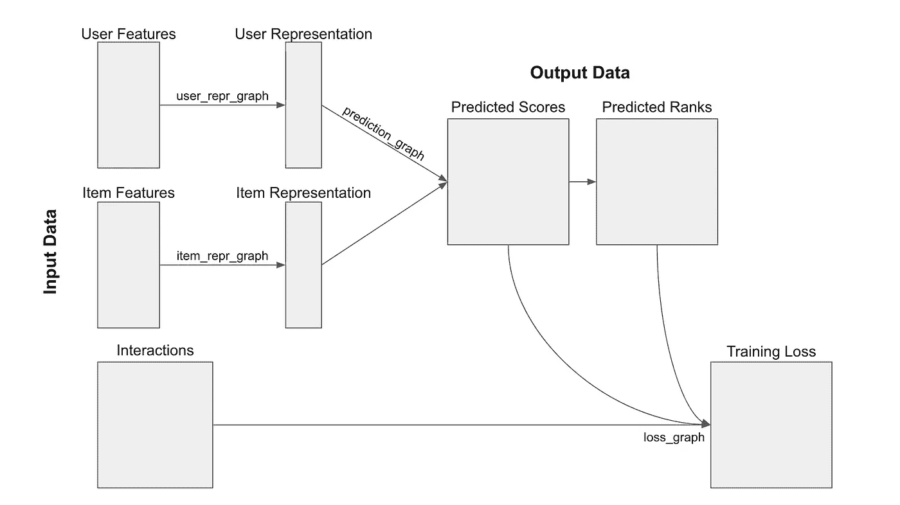
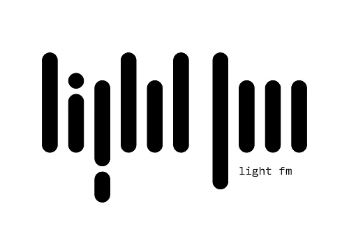
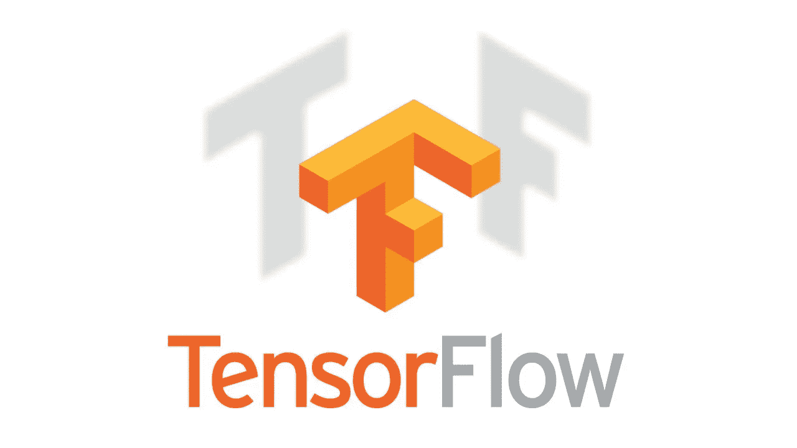
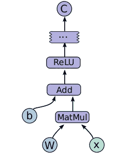

# tensor rec:tensor flow 中的推荐引擎框架

> 原文：<https://medium.com/hackernoon/tensorrec-a-recommendation-engine-framework-in-tensorflow-d85e4f0874e8>

当构建推荐系统时，当真正的进展来自于开发更好地理解我的用户和项目的算法时，我对我在数据操作和 API 构建上花费的精力感到沮丧。

这就是为什么我建立了 TensorRec ，这是一个旨在简化基于 TensorFlow 推荐引擎的物流的框架，让你专注于有趣的事情:开发你对表示(也称为嵌入)函数、损失函数和更健壮的[学习的想法](https://hackernoon.com/tagged/learning)。

*2019 年 1 月 22 日编辑:TensorRec* 现在有了 [*入门指南*](/@jameskirk1/getting-started-with-recommender-systems-and-tensorrec-8f50a9943eef)

TensorRec 是一种推荐算法，具有用于训练和预测的简单 API，类似于 Python 中常见的机器学习[工具](https://hackernoon.com/tagged/tools)。它还为您提供了试验自己的表示和损失函数的灵活性，让您可以构建一个适合于理解特定用户和项目的推荐系统。

TensorRec 项目还很年轻，但是我邀请您提供任何用法、参与或批评。

在建立 TensorRec 的过程中，我有四个目标:

1.  构建一个能够从明确的正面和负面反馈中学习的推荐引擎。
2.  允许将任意张量流图用作表示函数和损失函数。
3.  为表示函数和损失函数提供合理的默认值。
4.  将尽可能多的机器学习术语打包到一个中等帖子中。

虽然前三个目标仍在进行中——你的里程可能会有所不同——但我对第四个目标非常满意。

# 它是如何工作的

TensorRec 通过消费用户和项目[特征](https://en.wikipedia.org/wiki/Feature_(machine_learning))(id、标签或其他元数据)并构建两个低维向量，一个“用户表示”和一个“项目表示”，来对推荐进行评分。这两个向量的[点积](https://en.wikipedia.org/wiki/Dot_product)是该用户和该项目之间关系的得分——最高得分被预测为最佳推荐。

```
# Predict scores for all users and all items
predictions = model.predict(user_features=user_features,
                            item_features=item_features)
```

用于生成这些表示的算法称为表示函数，可以定制:可以应用从直接线性变换到深度神经网络的任何东西，这取决于您需要 TensorRec 解决的问题的细节和您可用的特征数据。此外，用户和项目表示功能可以独立定制。你可以在这里找到一个表示函数定制[的例子。](https://github.com/jfkirk/tensorrec/wiki/Representation-Graphs)

TensorRec 通过将其生成的分数与用户和物品之间的实际交互(喜欢/不喜欢)进行比较来进行学习。比较器被称为“损失函数”，TensorRec 还允许您自定义自己的损失函数。你可以在这里找到一个自定义损失函数[的例子](https://github.com/jfkirk/tensorrec/wiki/Loss-Graphs)。

用于拟合 TensorRec 模型的函数类似于用于其他常见机器学习工具的拟合函数:

```
# Fit the model for 5 epochs
model.fit(interactions, user_features, item_features,
          epochs=5, verbose=True)
```



Update 3/30/18 — System Diagram

# 灵感

我已经广泛使用了由马切伊·库拉和 [Lyst](https://medium.com/u/e49fe8455a34?source=post_page-----d85e4f0874e8--------------------------------) 开发的 [LightFM](https://github.com/lyst/lightfm) ，我对它的性能和可用性印象深刻。我在这里写了一篇关于使用 LightFM [的博文](/product-at-catalant-technologies/using-lightfm-to-recommend-projects-to-consultants-44084df7321c)。



LightFM 通过充当因式分解机器并学习每个特征的线性嵌入来生成用户和项目表示。通过取这两个表示向量的点积，可以得到一个无单位的分数，当对这个分数进行排序时，它会告诉你一个给定的用户-项目匹配的好坏。

这种线性因子分解方法是有效的，计算效率高，但我在使用 LightFM 时遇到了不平衡、冗余、不一致或高度相关的特征的问题——学习有意义地嵌入这些特征需要更复杂的表示函数，如深度神经网络。该表示功能将能够学习用户和项目特征中的细微关系，并增加系统的总体信息容量。这让我对探索非线性表示函数的选项感到好奇，我开发了 TensorRec 作为框架来做这件事。

# TensorFlow 求推荐

[TensorFlow，](https://www.tensorflow.org/)最初由 Google 开发，是一个开源工具，允许您构建、优化和分发大型、任意的机器学习系统。



在 TensorFlow 中，机器学习过程被表示为“图形”,显示数据如何在系统中流动。这些图表可以使用 [TensorBoard](https://www.tensorflow.org/get_started/summaries_and_tensorboard) 可视化，给出手头的机器学习过程的更清晰的解释。



A single ReLU layer of a neural network shown as a TensorFlow graph.

为了构建我们的推荐系统，我们需要完成四项任务的张量流图:

1.  将输入数据转换为便于嵌入的特征张量。
2.  将用户/项目特征张量转换为用户/项目表示(表示功能)。
3.  将一对表示转换成一个预测。
4.  将预测值和真实值转换为损失值(损失函数)。

TensorRec 解决了 1 和 3，同时为 2 和 4 提供了模块化和合理的默认值，让您可以自由地试验表示和损失函数。你所需要做的就是插入一个函数，构建你的自定义表示函数图或损失函数图，就像[这个例子](https://github.com/jfkirk/tensorrec/wiki/Representation-Graphs)。

# 少了什么

信息检索的许多最新进展都来自复杂的损失函数。我特别感兴趣的是成对的损失函数，如[扭曲](http://www.thespermwhale.com/jaseweston/papers/wsabie-ijcai.pdf)，但这些很难用张量流图来表示。TensorRec 对用户的价值将随着这些损失函数的实施而增加。

对 TensorRec 有价值的补充是处理大量交互数据、管理模型状态和处理隐式交互的新特性。

如果你想为 TensorRec 做贡献，或者只是尝试一下，我很乐意在 GitHub 上或者在这篇文章的评论区听到你的反馈。

*注:这是一个个人项目，在撰写本文时，与 Spotify 无关*