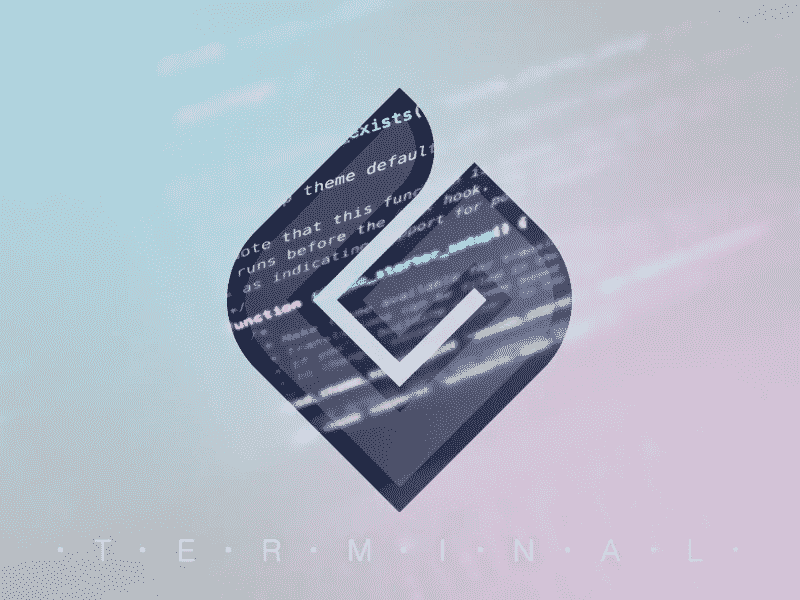
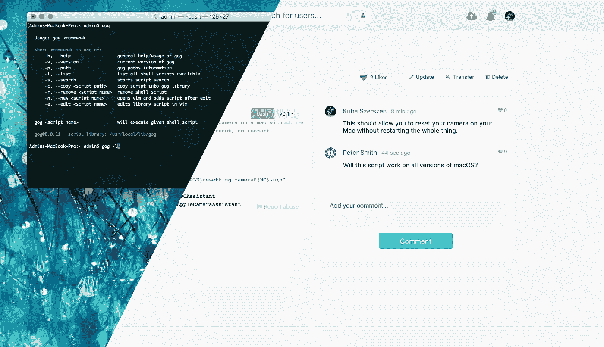
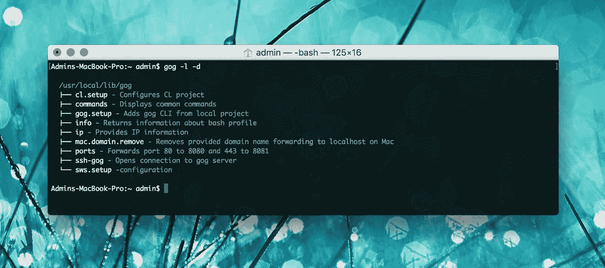
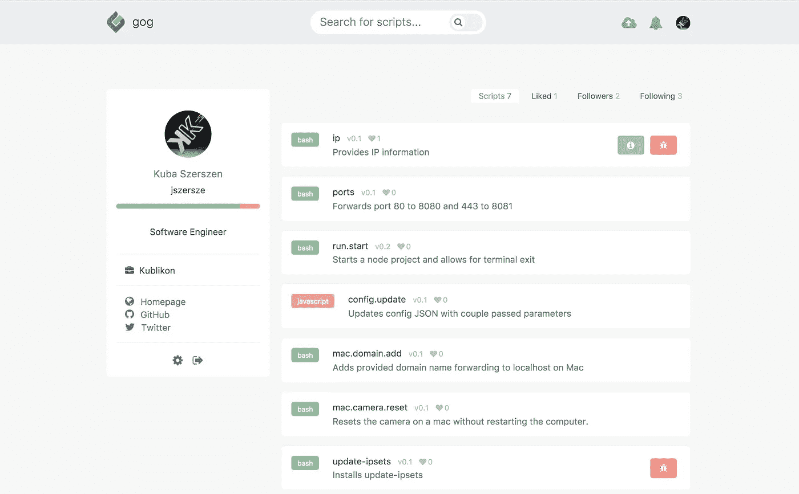
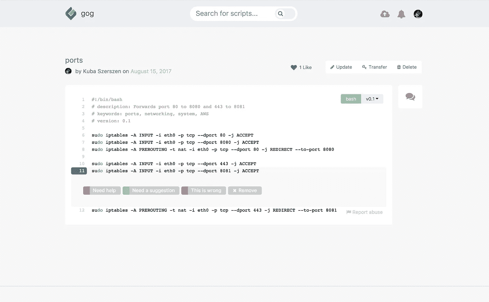

# 终端脚本— gog 模式。

> 原文：<https://medium.com/hackernoon/terminal-scripts-gog-mode-2589d45dd714>

*“让我们坐下来一个月，安装一些别名，并学习如何制作有效的终端脚本。”*~从来没有人说过

[gog](https://gog.codes) 是一个开发者社区平台，旨在提高终端脚本的质量——与 [gog CLI](https://github.com/kublikon/gog) 一起，它允许用户直接从终端快速查找、管理和执行终端脚本。

# 为什么我决定开始 gog

2015 年年中，在一家初创公司担任高级全栈开发人员时，我遇到了一个构建过程问题，这个问题以越来越麻烦的方式不断出现。在两个月的时间里，我积累了如此多的代码，以至于我有时会忘记它的执行顺序或者与特定症状相关的可选参数。有时，它甚至要求我以非常特殊的方式手动重新安装完整的代码堆栈。我最终决定开始编写问题的解决方案。

虽然脚本使它不那么笨重，但我不能永久地修复构建过程，因为我们的项目需要新的功能，每次更新都感觉有人在从我下面拉地毯。这让我想到了一个更好的解决方案。我决定通过在 CLI 中组织脚本来改进它们。

# 走向全球

我的第一个任务是找出一种方法，每次都以完全相同的方式一致地执行我的脚本。因为我的脚本可能会因为我从哪个目录执行它们而失败，所以我需要确保我不会意外地从根目录而不是正确的项目文件夹运行它们。于是， [gog](https://github.com/kublikon/gog) 诞生了( *go-global* )。我创建了一个 CLI，它将驻留在`local/bin`目录中，并从`local/lib`目录执行脚本，这样无论我在终端的哪个位置，我都不必花费数小时来修复一个仓促的错误。这也允许我跨用户执行脚本——非常方便！

# 结构

除了正确执行之外，我还希望在我定期更新脚本时跟踪对它们的更改，但是当我们有时恢复更改或对项目应用热修复时，需要一种返回的方法。我可以在 GitHub 中创建一个 repo，并在那里跟踪我的更改。但是谁想处理这些乱七八糟的事情？尤其是凌晨 1 点的时候，你半睡半醒，在入睡前推送你的第 10 次更新。

我还添加了代码附带的**描述**，以及快速列出我所有脚本的能力。由于[高格](https://github.com/kublikon/gog)已经执行脚本的名字，这是非常简单的版本一切，并迅速看到什么正在执行，而不是跳来跳去的回购。输入:

Listing all scripts with descriptions with gog CLI

Executing script with gog CLI

对于手头的问题来说，这是一个相当不错的解决方案，所以我暂时不去管 [gog](https://github.com/kublikon/gog) 了，只是为了系统支持而不时更新它。

# 创建一个平台

几年后，我发现我不是唯一一个在构建过程中遇到问题的人，因为混合应用程序开发越来越受欢迎。此外，几乎每个我曾经交谈过的开发人员都告诉我，他们仍然在某种程度上使用终端脚本。要么是为了他们自己的构建过程、一些遗留代码、他们仍然需要支持的平台，要么是为了修复他们系统中的一些问题。具有讽刺意味的是，那些不经常执行脚本的人更难记住如何去做，他们希望能花更多的时间让脚本变得更好。但是，他们不会。

与他人分享 gog CLI 还不够。跨机器共享脚本是有问题的，人们仍然必须寻找解决方案，在 StackOverflow 上筛选伪代码页面，或者在像[tldp.org](http://tldp.org/)这样的网站上筛选困难的例子。我知道我无意中发现了一些其他编码人员可以使用和受益的东西。我创建了[Gog . codes](https://gog.codes)——一个门户网站——它连接到 [gog CLI](https://github.com/kublikon/gog) 并允许用户从终端快速搜索脚本。它还创建了一个地方，人们可以添加自己的脚本，并让其他人根据实际情况对它们进行改进。可执行。代码。我还添加了一些社交功能来推广更好的脚本，并在特定的代码行上标记脚本中的问题。

Gog.codes user profile with multiple scripts.

Script in gog.codes with additional line annotation

# 利益

单独使用终端脚本有很多好处，包括:

*   构建流程
*   系统信息/监控
*   系统配置
*   应用程序修复
*   存储清理
*   网络结构

…以及更多。

为了帮助用户充分利用这些好处， [gog](https://github.com/kublikon/gog) 旨在消除脚本开发和执行的所有可怕方面。该平台是为终端脚本构建的，因此只考虑支持终端使用的特性。已经有很好的项目管理平台，比如 GitHub 或 npm，而 [gog](https://github.com/kublikon/gog) 并不想取代它们。

围绕终端使用的最常见的担心是由于执行不正确的命令而导致的系统全面损坏，由于不正确地执行命令而导致的系统全面故障，以及由于将文件转换应用到整个硬盘驱动器而导致的数据损坏。当然，这些问题都可以在 gog 中通过从一致的位置执行每个命令来解决。此外，拥有完整的可用工作脚本而不是伪代码示例大大降低了出现可怕错误的可能性。

在未来的计划中，机器学习将进一步防止意外执行像 RM-RF *或:(){:|:&}这样的命令；:并希望有一天成为人们共享脚本的方式，而不是在博客帖子中键入命令并期待最好的结果。

*(注意:不要执行上述命令。他们绝对会破坏你的系统)*

# 安全性

我收到的关于 [gog](https://github.com/kublikon/gog) 的最大负面反馈是，“你从互联网上下载脚本并在你的机器上执行，这很危险！”由于这种担心是完全正确的，而且我绝不会建议在不知道终端功能的情况下盲目地在终端上执行随机代码，所以我必须指出，您一直都在这样做。作为一名开发人员，如果您曾经使用过依赖项，那么您已经安装了代码，包括 bash 脚本，甚至没有意识到它的存在。作为消费者，您相信您安装的应用程序不会在您的计算机上安装恶意脚本。

gog 被特别设计成永远不会自动执行你从平台上下载的代码。这允许用户在代码执行前检查他们下载的代码。最终，我计划添加机器学习来自动检测恶意脚本并标记格式错误的代码。目前，我建议阅读注释并编辑您执行的代码。

# 未来的改进

gog 已经计划了许多新增功能，包括:

**对具有别名的 Linux 平台或终端的更广泛系统支持**

不同的 Linux 系统对 Bash 的支持略有不同，有时会破坏 CLI。此外，终端别名可能会因为具有不同的配置文件策略而导致问题，这些策略也会破坏 CLI。不幸的是，完整的系统支持需要一些时间，但是 CLI 目前完全是用 Bash 编写的，它的运行没有任何特殊的依赖性。这应该会扩展系统支持，尤其是对遗留系统的支持。

**自动启动和 cron 作业**

脚本自动化是任何系统生态系统的重要组成部分，gog 最终将允许一种简单的方法来添加已安装的脚本到自动启动或 cron 任务中。

**门户网站和机器学习中的语法支持**

为了简化编写优秀脚本的过程，gog 将支持 Bash、JavaScript 和 Python 的语法，包括可以检测明显问题或恶意代码的机器学习。

**虚拟功能**

为了刺激快速、高效的脚本编写体验，gog 将包含一组模块化的脚本片段，它们可以接受参数并返回参数。每个片段或虚函数都将被版本化，并且可以很容易地插入脚本来执行某些功能。将保留函数的每个版本，以防止破坏使用特定版本的当前脚本。

**代码注释**

除了语法支持之外，代码注释将提供关于您正在编写的代码的信息，包括用户创建脚本时的提示和小示例。

# 结论

我的希望是，其他开发人员不必经历我多年来经历的那种令人毛骨悚然的例行公事。你可以通过访问网站免费使用 [gog](https://gog.codes) 。我一直在寻找反馈，以便让它更加高效和安全。随时给我发电子邮件:kpx.dev@gmail.com。