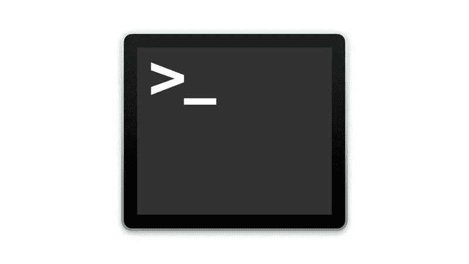
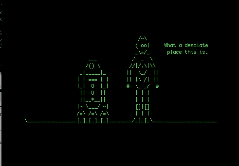

# 终极刺激——命令行中的冒险

> 原文：<https://medium.com/hackernoon/terminal-thrillness-adventures-in-the-command-line-e3a1179883bd>

在 2004 年的一部电影中，汤姆·汉克斯扮演了一个来自虚构的克拉科日亚的男人。汉克斯扮演的维克多·纳沃斯基因为护照过期，被迫住在 JFK 机场的候机楼里。


虽然使用 Mac 的终端可能不像被迫在机场里呆上几个月那样令人心痛，但一个没有任何 GUI 或提示告诉你如何操作的空白屏幕会带来特别的焦虑。然而，作为一名开发人员，掌握终端是有回报的，所以升级绝对符合您的最佳利益。

# 终点站是哪里，我如何到达那里？



终端是一个 Mac 程序，作为控制台的接口。你会问，控制台是什么？嗯，是整个系统在使用，所以在这种情况下，可能是你的笔记本电脑。还记得在 90 年代，视频游戏机被称为 [SNES](https://en.wikipedia.org/wiki/Super_Nintendo_Entertainment_System) 控制台或 [Playstation](https://en.wikipedia.org/wiki/PlayStation_(console)) 控制台吗？见鬼，任天堂和世嘉玩了一整场战争，准确地说是主机战争，但那是一个不同的故事。

若要进入终端，请按住 command 并按空格键。然后，输入终端(其实使用 spotlight 搜索是 Mac 用户最大的快捷键之一)。一旦你打开终端，它看起来会很光秃秃的，但是相信我，从这里[推送到 Heroku](https://devcenter.heroku.com/articles/git) ，或者对 GitHub 进行任何[提交和推送到 GitHub](https://git-scm.com/docs/git-commit)，甚至[用 Python 写一个基于控制台的游戏](https://hackernoon.com/return-of-the-consoles-recreating-pok%C3%A9mon-in-python-94e0d7d860de?source=user_profile---------1----------------)(我保证我会在某个时候读到第二章)会更流畅。

现在，让我们简单介绍一下如何在不烧电脑的情况下浏览终端的基本知识。把这个留给狗迷因吧。


Don’t let this be you

# 像专家一样导航终端

显示终端后，您可以在命令行中输入的第一个命令是:

```
whoami
```

没什么好惊讶的。你的电脑会根据你最初的设置告诉你你是谁。但是现在，让我们来看看更实际的情况:

```
pwd
```

输入并按回车键。你看到了什么？ *pwd* 代表*打印工作目录*。无论你的终端在哪里，指针都会显示出来，不要担心，不会有任何东西被点燃。下面是下一个命令:

```
ls
```

*ls* 代表*入围*。它列出了您当前位置的所有文件和文件夹。如果你从主目录开始， *ls* 可能会给你一些列表，比如桌面、文档或下载。哦，如果您想查看关于这些文件和文件夹的更多信息，您还可以使用以下命令查看所谓的*长列表*:

```
ls -l
```

基本上是相同的命令，但是包含了更多的信息。当使用 git 初始化的文件时，另一个流行的命令是:

```
ls -a 
```

类似地，它列出了当前文件夹中的所有内容，但是列出‘a’甚至允许隐藏文件(比如任何以句点开头的文件，比如您的。gitignore 等)来显示。

接下来，让我们进入你的桌面文件夹。这可以通过“更改目录命令:

```
cd Desktop
```

另请注意，您不必键入整个命令。终端足够智能来假设事情，所以在输入 *cd Des* 之后，你可以按 Tab 键，让单词的其余部分自动完成。我们确实生活在未来。

现在我们在桌面上，让我们创建一个文件夹:

```
mkdir new-folder
```

再次运行 *ls* 并看到一个名为 *new-folder* 的全新文件夹，它最初并不存在。让我们运行 *cd 新文件夹*并进入内部。然后，再运行一次 *pwd* 以确保我们成功了。

从这里开始，让我们创建一个文件:

```
touch index.js
```

*touch* 命令创建一个新文件，在我们的例子中，是一个全新的 JavaScript 文件。如果使用 Visual Studio 代码，我们可以设置一个选项，让 VSCode 打开该文件夹中的任何内容:

```
code .
```

那个句点基本上意味着当前文件夹中的所有内容。同样，跑两个周期会让你从当前位置向上跳。但在此之前，让我们尝试删除刚刚创建的文件:

```
rm index.js
```

很简单。现在我们有一个空文件夹。让我们试着运行这两个周期来跳回桌面。试试这个:

```
cd ..
```

这将带您回到您的桌面。现在，让我们再运行一次来删除我们的*新文件夹*:

```
rmdir new-folder
```

瞧，我们已经成功地创建了一个包含文件的文件夹，然后删除文件夹和文件。找到窍门了吗？这需要一些时间，但是成为一个终端超级用户绝对应该在你的遗愿清单上。

这里还有几个命令可能会有意思:

```
uptime
```

正常运行时间告诉你你的 Mac 已经运行了多长时间。

```
caffeinate
```

不想让电脑休眠？用*咖啡因*命令让它脱离睡眠模式。

```
ditto -V /old/work/ /new/work/
```

如果你想将大量数据从一个文件夹转移到另一个文件夹，同上命令非常有用。

```
clear
```

最后，如果你写了这么多命令后遇到了麻烦，那么 *clear* 命令会给你一个空白屏幕，同时仍然指向你之前所在的位置。这也可以通过按住*控制键*并按下字母 *l* 来完成。

编码快乐！

