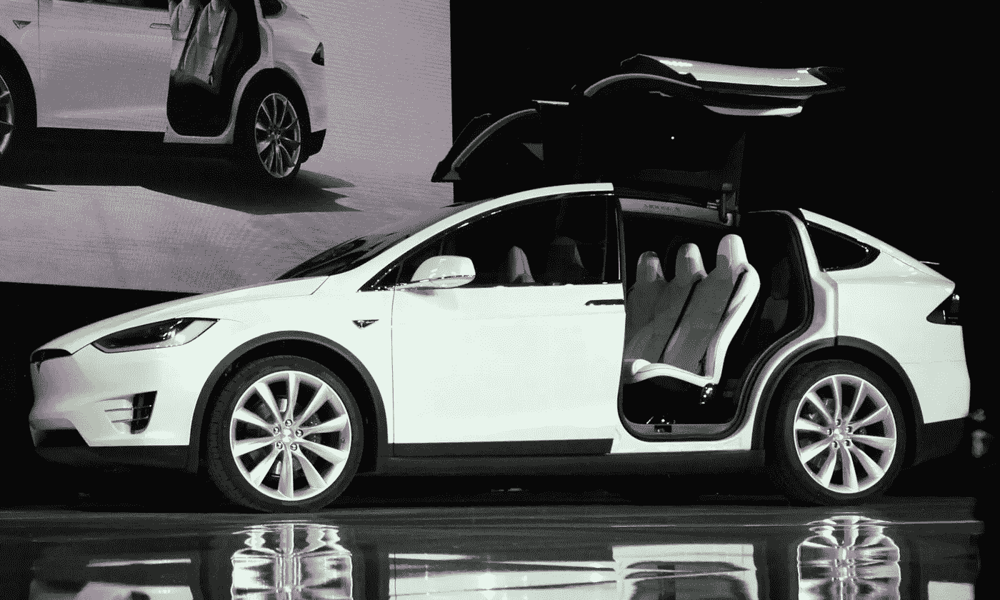

# 特斯拉将更换 Model X 汽车中不安全的第三排座椅

> 原文：<https://medium.com/hackernoon/tesla-to-replace-unsafe-third-row-seats-in-model-x-vehicles-2f3533f709ac>

美国国家公路管理局最近[宣布](http://www-odi.nhtsa.dot.gov/owners/SearchResults?searchType=ID&targetCategory=R&searchCriteria.nhtsa_ids=16V192000&refurl=rss)特斯拉汽车公司发起了一项召回活动，与可能使消费者面临重大风险的问题相关。

官方召回报告已经宣布，召回的 2016 款 Model X 车辆是在 2015 年 9 月至 2016 年 3 月期间制造的。由于这些车辆配备了第三排座椅靠背，在发生正面碰撞时，由于车辆后部负载的压力，座椅靠背可能会向前移动，因此该公司决定立即发布召回公告。

根据官方声明，与召回的特斯拉汽车相关的问题代表着不符合与座椅系统相关的重要联邦安全标准。

特斯拉声称将直接联系所有受影响的车主。据 NHTSA 称，该公司已经开始联系受影响的车主。

一旦授权经销商对车辆进行检查，受影响的第三排座椅将被完全更换或免费更换。

如果你是特斯拉 Model X 车主，并且你的车辆受到了影响，请联系特斯拉，了解如何确保你的车辆得到全额免费维修的更多详细信息。

安全倡导者[敦促](http://www.thenblawgroup.com/tesla-suvs-recalled-over-unsafe-third-row-seats/)消费者不要忽视与此次召回相关的潜在风险，所以要尽快行动。

> [黑客中午](http://bit.ly/Hackernoon)是黑客如何开始他们的下午。我们是 [@AMI](http://bit.ly/atAMIatAMI) 家庭的一员。我们现在[接受投稿](http://bit.ly/hackernoonsubmission)并乐意[讨论广告&赞助](mailto:partners@amipublications.com)机会。
> 
> 如果你喜欢这个故事，我们推荐你阅读我们的[最新科技故事](http://bit.ly/hackernoonlatestt)和[趋势科技故事](https://hackernoon.com/trending)。直到下一次，不要把世界的现实想当然！

