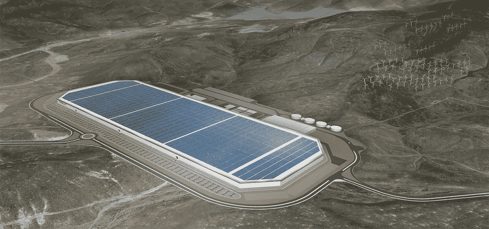
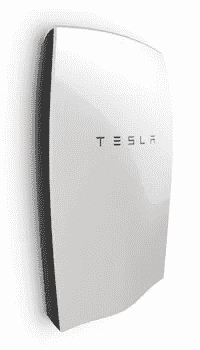
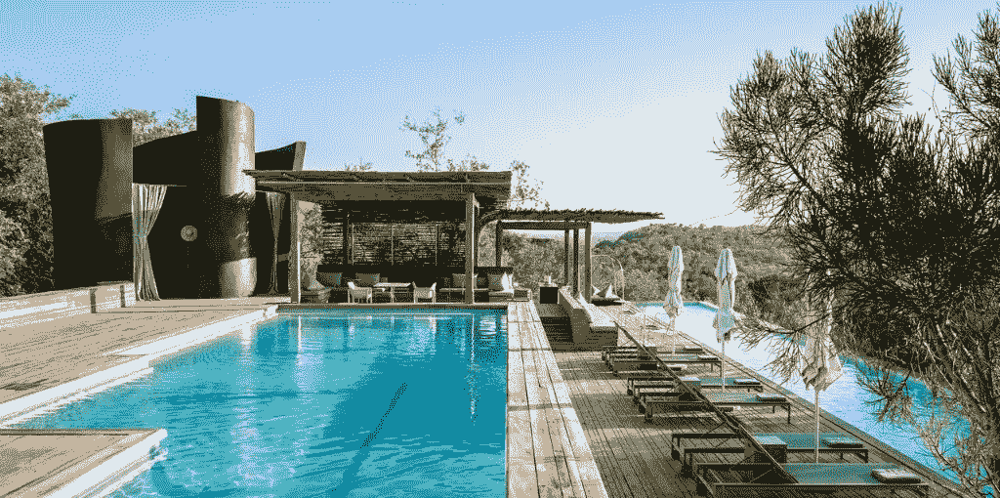

# 特斯拉天文数字的股价？跟车关系不大。

> 原文：<https://medium.com/hackernoon/teslas-astronomical-stock-price-it-has-little-to-do-with-cars-c828187f9084>

Tesla Gigafactory (Image courtesy of [https://www.tesla.com/gigafactory](https://www.tesla.com/gigafactory))

特斯拉的价值[在过去一周](https://www.google.com/finance?q=tesla&ei=pLg9WcnzJYSr2AbGt5_ADw)暴涨。天文数字。它现在是[全球价值第八高的汽车品牌](https://www.driverless.id/news/and-suddenly-tesla-becomes-5-9-billion-car-brand-with-32-jump-value-0177903/)。自 2016 年 12 月以来，该公司股价上涨了 85.93%，目前市值约为 560 亿美元。[是的，在这个世界上，它](http://www.businessinsider.com/investors-ignoring-tesla-production-problem-2017-6)一生生产的汽车还没有第一汽车制造商[去年生产的](https://www.forbes.com/sites/bertelschmitt/2017/01/30/its-official-volkswagen-worlds-largest-automaker-2016-or-maybe-toyota/#41cf873676b0)多。是这样吗？我们是否因为公司比其他公司更具技术创新性而扭曲了对公司的估值？答案是肯定的。但是，在特斯拉的情况下，这要复杂得多，而且肯定不是因为我们认为的原因。我和一些非公用事业行业的朋友进行了这样的对话，我不得不写一篇文章来分享。

大多数特斯拉投资者都专注于该公司可以从以下方面获得的长期价值可能性:I)释放无人驾驶汽车(如下视频)，ii) [在 98%的市场上安装太阳能电池板](https://www.bloomberg.com/news/articles/2016-11-17/tesla-seals-2-billion-solarcity-deal-set-to-test-musk-s-vision)，以及 iii)向大众销售更多汽车(特斯拉 Model 3)。

但这些东西并不是特斯拉股价真正(超额)价值的来源。虽然汽车销售和太阳能电池板很有价值，但它们不如兑现埃隆·马斯克在他的[特斯拉总体规划第二部分](https://www.tesla.com/blog/master-plan-part-deux)中所做承诺的机会更有价值。

## 一切都与 Powerwall 有关

有很多关于埃隆·马斯克和其他太阳能、风能、储能等供应商的讨论。、*都被归类为分布式能源资源(DER)* 、[正在颠覆传统的公用事业](/startup-grind/how-elon-musk-might-be-screwing-this-up-4421f4dc2dbf)，这是一种在一个地方发电并通过一定距离传输给客户的集中式商业模式，客户支付他们消耗的任何电量。这种破坏是马斯克希望特斯拉做的事情的核心。

这确实是关于 DER 的利用。马斯克在他的[特斯拉总体规划第二部分](https://www.tesla.com/blog/master-plan-part-deux)中明确陈述了这一点。公司的目标是

1.  **整合能量产生和储存**:下面讨论
2.  扩展到地面交通的主要形式:更多的车，更多的人
3.  **自主性**:无人驾驶汽车和
4.  **分享** : [一个不太大且有很多公司参与竞争的市场](https://hackernoon.com/why-companies-like-lyft-uber-postmates-instacart-etc-will-never-be-profitable-ecdfde647175)。

这是 gigafactory 的全部意义所在，[与大多数其他特斯拉公告](http://Tesla’s High Stock Price Has Less To Do With Electric Cars Than You Think.)不同，它实际上可能会按时交付。Powerwall 也不需要类似的首先向高价值客户销售的颠覆性创新模式(如特斯拉对电动汽车所做的那样)，因为目前存在 Powerwall 的电力价格/千瓦时具有市场竞争力的市场和使用案例。

## 整合能源生产和储存

特斯拉作为一家公司的真正价值来自于特斯拉可以从简单的太阳能发电(通过 Solarcity)和在任何地方部署电动汽车和电力墙作为储能设备中获得的许多全球用例。从储存太阳能电池板产生的能量(举例来说)，像 Powerwall 和 Tesla 汽车电池这样的储能技术基本上有两个好处。存储可用于

1.  **避免电力成本和损失** : [用于避免或降低成本的高价值存储用途包括平衡](https://www.nrel.gov/tech_deployment/state_local_governments/blog/batteries-101-series-use-cases-and-value-streams-for-energy-storage)电力负载峰值以减少您的电费账单上的需求费用(需求费用减少)，减少电池所有者在高电费期间从电网中提取的电力(使用时间账单减少)，在价格低时存储电力以在价格高时出售(套利)，用于停电期间的关键负载使用(备用电力)。
2.  **创收**:存储创收的高价值用途包括当客户参与公用事业项目时使用存储，该项目为不从电网获取电力(需求响应)和稳定电网频率(频率调节)提供资金。

虽然电网中还有许多其他中低价值的存储用例，但上面的列表显示的是(对电力行业内的人以及现在对您而言),存储**几乎涵盖了对维护稳定和正常运行的电网**有任何价值的所有用例。[存储也是电网当前状态(并不理想)和未来效用](http://amzn.to/2scEVs1)之间的最佳过渡技术。显而易见但值得一提的是，电力是我们在全球数字经济中所做一切的核心。除了干净的水、空气和(在一定程度上)食物，电力在世界各地都是一样的商品。这实质上使整个地球成为了存储/电力的总目标市场。所以，这完全是关于 Powerwall 的…

## 那么特斯拉值那么多钱吗？

随着交付的持续延迟， [Elon 现在预计会发布他的公司无法在](http://www.newyorker.com/business/currency/elon-musk-has-delivery-issues)交付的产品声明，在匹配公司价值和股价的过程中会出现问题。

 [## 特斯拉可能会在大多数市场放弃 DC Powerwall 2 选项

### 根据澳洲阿德莱德的博主 Ronald Brakels 的说法，DC 版的 Tesla Powerwall 2 将不会…

cleantechnica.com](https://cleantechnica.com/2017/03/03/tesla-may-drop-dc-powerwall-2-option-markets/) 

也就是说，特斯拉可以在世界各地的市场提供上述共享的存储用例解决方案。随着 Powerwalls 以[的规模在夏威夷](https://www.theverge.com/2017/3/8/14854858/tesla-solar-hawaii-kauai-kiuc-powerpack-battery-generator)部署，在[澳大利亚](https://www.choice.com.au/home-improvement/energy-saving/solar/articles/living-with-the-tesla-powerwall-for-a-year)安装，出售给[南非的 Singita Safari Lodge](https://singita.com/press-release/singita-partners-tesla-use-powerpacks-sustainable-energy/)(下图)和[刚果的维龙加大猩猩公园](/solar-microgrid/solarcity-tesla-and-virunga-6008526f4a53)，这些都有不同的电网使用案例。这里的关键点是，存储解决方案的市场机会是全球性的。这就是股票的定价。我们将看到它如何发展。

[Image courtesy of Electrek](https://electrek.co/2016/10/05/tesla-powerpack-power-off-grid-solar-system-safari-lodge-africa/)

埃隆·马斯克(Elon Musk)和他的团队要做的是，不要把他们的投资者和我们这些(未来)电网的客户搞砸了。我们都无法承受物质与宣传不符…

*请分享、点赞、推文。* [*使用我们的 WYOP 工具(它让你进入写作流程)和*](http://harperjacobs.com/writeyourownpost/) s *ign 撰写你自己的博客文章，点击这里* *，你会爱上它的。*

> [黑客中午](http://bit.ly/Hackernoon)是黑客如何开始他们的下午。我们是这个家庭的一员。我们现在[接受投稿](http://bit.ly/hackernoonsubmission)并乐意[讨论广告&赞助](mailto:partners@amipublications.com)机会。
> 
> 如果你喜欢这个故事，我们推荐你阅读我们的[最新科技故事](http://bit.ly/hackernoonlatestt)和[趋势科技故事](https://hackernoon.com/trending)。直到下一次，不要把世界的现实想当然！

