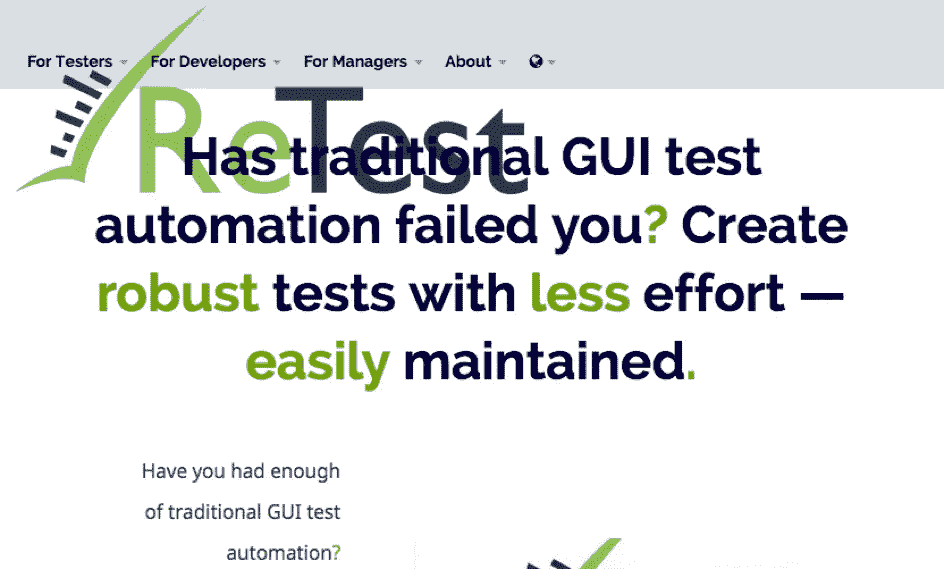
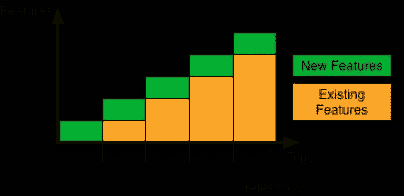

# 测试自动化不是自动化测试

> 原文：<https://medium.com/hackernoon/test-automation-is-not-automated-testing-b88d748a7561>

作为一门手艺，测试是一项高度复杂的努力，一个交互式的认知过程。人类能够评估数百种问题模式，其中一些只能用纯粹主观的术语来描述。许多其他的是复杂的，模糊的，不稳定的。因此，我们只能自动化非常窄范围的测试，例如搜索技术错误(即崩溃)。

更重要的是，测试不仅仅是寻找 bug。正如《成长中的敏捷》中的[测试宣言非常直观和中肯地总结的那样，测试是关于理解产品和它试图解决的问题，并找到产品或底层过程可以改进的地方。它是关于防止错误，而不是通过反复质疑每一个方面和潜在的假设来发现错误和建立最好的系统，而不是破坏系统。一个好的测试人员是一个高度熟练的专业人员，不断地与客户、利益相关者和开发人员交流。因此，谈论自动化测试是深奥的，甚至有点滑稽。](https://www.growingagile.co.za/2015/04/the-testing-manifesto/)

另一方面，测试自动化是预定义测试的自动化执行。在这种情况下，测试是一系列预先定义的动作，中间穿插着评估，T2 称之为检查。这些检查是手动定义的算法决策规则，在软件产品的特定和预定义的观察点上进行评估。这就是问题所在。例如，如果你定义了一个网站的自动化测试，你可以定义一个检查来确定一个特定的文本(例如标题)是否显示在该网站上。当执行该测试时，这正是要检查的——也只有这一项。所以如果你的网站看起来像图中所示，你的测试还是通过了，让你觉得一切正常。

This website is clearly broken, yet contains all the correct strings

另一方面，一个人只要瞥一眼就能意识到有些事情出了差错。

Work of developers adds up, work of testers not

但是，如果测试自动化如此有限，为什么我们首先要这么做呢？因为我们必须这样做，没有其他办法。因为[开发加起来，测试不加](/@roesslerj/why-there-is-no-way-around-test-automation-except-one-9c51aefd7806)。每一次迭代和发布都会给软件增加新的特性(或者应该如此)。它们需要手动测试。但是新功能通常也会导致软件的改变，从而破坏现有的功能。所以现有的功能也必须测试。理想情况下，你甚至希望现有的功能被不断地测试，这样你就能很快识别出变化是否破坏了现有的功能并需要一些返工。但是，即使你只是在发布之前进行测试，在一个有固定数量的开发人员和测试人员的团队中，随着时间的推移，测试人员肯定会落后。这就是为什么在某些时候，测试*需要*自动化。

考虑到它的所有缺点，我们很幸运，测试现有的功能并不是真正的测试。正如我们之前所说的，*真正的*测试是质疑产品的每一个方面和潜在假设。现有的功能已经经受住了那种测试。尽管可能有必要重新评估在测试时被认为有效的假设，但这通常在每次发布之前是没有必要的，当然也不是连续的。测试现有的功能并不是真正的测试。它被称为[回归测试](https://en.wikipedia.org/wiki/Regression_testing)，尽管它*听起来*一样，回归测试对于测试就像宠物对于地毯一样——完全没有关系。回归测试的目标仅仅是重新检查现有的功能是否仍然像实际测试时那样工作。所以回归测试是关于控制软件行为的变化。在这方面，它更多的是版本控制，而不是测试。事实上，可以说回归测试是控制软件静态属性(配置和代码)的变化和控制软件动态属性(外观和行为)的变化之间的缺失环节。自动化测试简单地将那些动态属性固定下来，并将它们转换成静态的人工制品(例如，测试脚本)，这同样可以由当前的版本控制系统来管理。

这种测试(我更愿意称之为检查)可以自动化。出于几个原因，它应该是自动化的:

1.  从长远来看，自动化成本更低。
2.  它可以持续地进行，让您更快地得到变更是否破坏了现有功能的反馈。
3.  随着软件的增长，您的测试人员将不再能够完全执行它，因为开发增加了——测试没有。
4.  这是一个琐碎的、重复的、令人厌烦和疲惫的任务，它侮辱了任何体面的测试人员的智力和能力，使他们无法从事实际工作。
5.  更糟糕的是，一遍又一遍地测试相同的功能使测试人员变得盲目，失去了质疑假设和发现改进潜力的能力。

测试自动化是整体质量控制的重要部分，但是因为它不是真正的测试，术语“自动化测试”是非常容易误导的，应该避免。这也强调了测试自动化和手工测试是相互补充的，而不是相互替代的。

许多人试图以不同的方式证明这一点(例如，这也是詹姆斯·巴赫和迈克·伯顿开始的关于[测试与](http://www.satisfice.com/blog/archives/856)检查的讨论的精髓)。但是情绪化的讨论(因为它是关于人们的自我形象*和*他们的工作)经常将讨论者分成两大阵营:那些认为测试自动化是“[蛇油](http://www.satisfice.com/articles/test_automation_snake_oil.pdf)”并且应该谨慎地使用的人，以及那些认为它是解决我们所有质量问题的灵丹妙药的人。测试自动化是当今质量保证不可或缺的工具，但是和其他工具一样，它也可能被误用。

**TL；DR:** 测试是一项复杂的任务，需要广泛的技能，目前可用的手段无法实现自动化。能够(也应该)自动化的是回归测试。这就是我们通常所说的测试自动化。回归测试不是测试，而仅仅是重新检查现有的功能。所以回归测试更像是软件动态属性的版本控制。