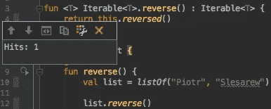
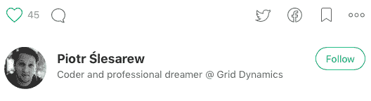

# 好好考，好好睡

> 原文：<https://medium.com/hackernoon/test-well-sleep-well-f4ba89b0a8cc>

> 不可测试的系统是不可验证的。可以说，一个无法验证的系统永远不应该被部署。罗伯特·马丁

睡眠是你能为你的身体做的最重要和最健康的事情之一。都说好的睡眠者专注力和生产力更好，这不都是我们追求的目标吗？我已经写了将近十年的代码了，我看到并写了很多难闻的意大利面条一样的代码。测试让我晚上睡得很好，这就是为什么我想分享我的想法和实践。

## 开始编写测试

当你认为自己是专业的软件工程师时，编写测试应该是我们日常工作不可或缺的一部分。如果这对你来说听起来很新鲜，请**从今天**开始测试你的代码 **。相信我。我处在你的位置，我知道这有多难，但事实上，这比你想象的要容易。开始时，你会感到有点失望，因为这会影响你的工作效率，但是我可以向你保证“测试投资”迟早会有回报。此外，随着时间的推移，你会变得更加自信，成为测试中更快的工程师。**

## 像对待代码库一样对待测试

我见过的几乎所有软件工程师都知道罗伯特·c·马丁是谁。他是一个干净代码的传播者，也是改变了我们对软件开发的思考方式的令人惊叹的书籍和文章的作者。现在有很多关于代码重构、代码可读性和代码简洁性的讨论，那么你为什么不把这些知识应用到你的测试中呢？人们倾向于在代码和测试之间划一条明显的线，但是对我来说，没有区别，我把它们看作兄弟姐妹。这就是为什么我对待我的测试就像对待我的代码库一样，关心可读性、简洁性和有用性。干固测试！

## 通过测试记录代码

文档总是一个大麻烦，因为维护它很困难，此外，它经常是过时的。在我看来，代码必须通过清晰、简单和一整套测试自我记录。我总是试图让我的**测试**像**一样可读**，因为**可能为我的代码**提供最好的文档 **。这是每个软件工程师都应该意识到的测试的潜在好处。**

## 让他们失败

如果没有失败的测试，这是一个信号，表明你没有做好。首先编写测试是一个非常好的实践，但这不是我的意思。**让他们检查**如果**你的**设置工作不正确嘲讽会让你的**断言** **和验证**变弱。

## 快乐之路是不够的

最糟糕的事情是覆盖着**【快乐之路】**测试的代码，因为它们给出了一种虚幻的安全性。设计健壮可靠的测试用例是我日常工作中最难也是最令人满意的部分。为了使它更有趣，把你的手艺发挥到极致，使用测试驱动开发，和你的同事一起配对编程。

## 不要更改代码来编写测试

这一点对于建筑和安全来说是至关重要的，所以它应该和你的出生日期一样重要。在破坏一个封装来测试你的代码时要三思，因为**泄漏的架构会在未来拖慢你的工作**。事实上，这种情况总是指向糟糕的设计。我犯了这个错误，在大多数情况下，我最终都是从头开始重写组件。

## 小心测试替身

不要误用测试替身，因为它们会导致不明显的**实现泄漏**。当生产代码中的实现细节发生变化时，您将不得不重构您的测试来反映这些变化。此外，由于庞大的设置，测试将变得更难阅读和维护。

## 审查测试**案例**

代码审查是检查预生产代码并从中找到 bug 的最佳工具。最近，我采访了几位工程师，我注意到他们的代码审查技能被严重忽视了。他们中的大多数甚至没有尝试打开一个测试类来检查里面是什么，可怕吧？

就个人而言，我喜欢**回顾测试用例**，并且我总是首先调查它们。我使用 IntelliJ 中内置的代码覆盖工具来检查“命中”。太多或太少都无法告诉你代码是否被覆盖了。

## 测试挑选用例

阅读和理解别人的代码是我们的日常工作。当你不得不修改未测试的代码时，你知道那种感觉吗？在此期间，你研究知识库，与其他程序员交谈，做笔记，然后应用更改。这个链条中缺少了一个步骤。在修改代码之前，你应该**对你挑选的每一个用例进行测试**。此外，您可以对现有代码使用“特性测试”来理解其背后的逻辑。

## 尝试不同的框架

不仅仅是软件工程师害怕新的工具，尽管他们确实害怕。也是因为他们真的相信，当你用一种特定的方式做一件事已经有一段时间了，那一定是最好的方式。我注意到在 [Java](https://hackernoon.com/tagged/java) 世界中有一种强烈的趋势，即使用 JUnit 作为编写单元测试的主要工具，尽管事实上它有很多缺陷。我用 Spock 作为交换，让 JUnit 将健壮的 Groovy 语法应用到我的测试中，它非常有效。有许多**其他**，伟大的**框架**像 TestNG 和最新的 Spek】可以 **帮助你达到简洁和可读性**。

## 务实点

随着技能的增长，饥饿会迅速加剧，为了满足它，你会尝试一切。记住，你写的测试越多，你需要维护的代码就越多。**务实会阻止你** **测试样板代码，比如 getters、setters、constructors 等等。**

总之，我希望你已经找到了一些有用的建议，或者至少我已经给了你足够的启发，让你开始着手你自己的最佳测试实践。

*如果你对此感兴趣，请点击❤的心脏按钮或* [*在推特上告诉我*](https://twitter.com/SliskiCode) *。*

> [黑客中午](http://bit.ly/Hackernoon)是黑客如何开始他们的下午。我们是阿美族家庭的一员。我们现在[接受投稿](http://bit.ly/hackernoonsubmission)并乐意[讨论广告&赞助](mailto:partners@amipublications.com)机会。
> 
> 如果你喜欢这个故事，我们推荐你阅读我们的[最新科技故事](http://bit.ly/hackernoonlatestt)和[趋势科技故事](https://hackernoon.com/trending)。直到下一次，不要把世界的现实想当然！

