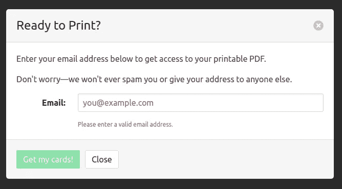
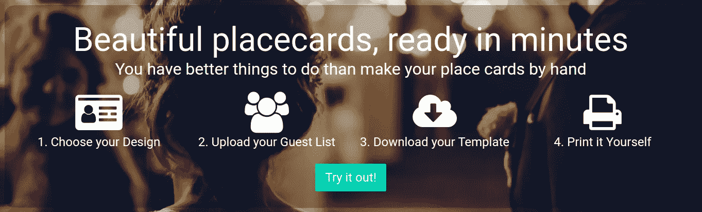
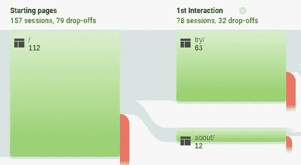
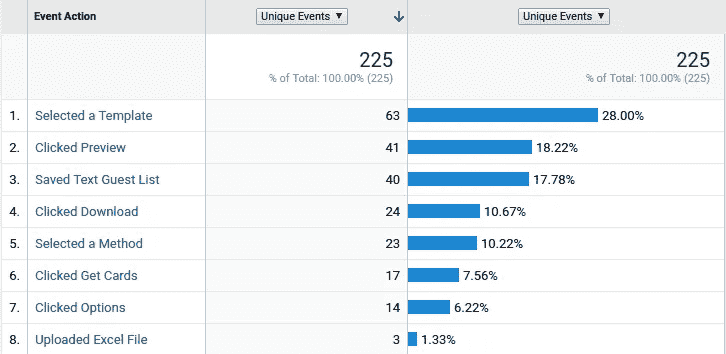
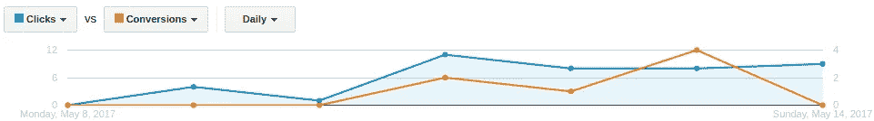
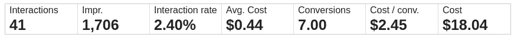

# 用谷歌广告和分析测试 MVP

> 原文：<https://medium.com/hackernoon/testing-an-mvp-with-google-ads-and-analytics-8c605297aecd>

## 我如何用 18 美元的广告费来决定我是否应该继续我的项目。

上周，我发布了 placecard.me 的[最小可行产品(MVP)——一个让制作 placecard 变得简单的网站——并决定在 Google Adwords 上花费 20 美元，希望回答一个简单的问题:*有人真的想用这个东西吗？*](http://www.placecard.me/)

看了初步数据后我想我有答案了！

在这篇文章中，我将快速谈论我如何设置和运行我的测试，我从结果中学到了什么，以及我下一步打算做什么。

# 定义测试

我决定通过一系列测试来验证 placecard.me，每一项测试的门槛都越来越高。这样我就可以确定我的假设在哪个阶段被证明是错误的，而不是交付一个完整的成品却不知道人们为什么不买它。

第一次测试，我想学两件事:

1.  如果产品足够容易使用，人们就能理解它。
2.  如果人们觉得他们从产品中获得了足够的价值，他们会愿意给我他们的电子邮件地址。

我想如果我打不中这个标杆，我就没有办法让任何人支付我的产品——但是如果我*能*打中这个标杆，那么我的产品仍有可能成功。

在这个过程中，我应用了一些我曾经得到的好建议:

> 试着尽快粉碎你的梦想

# 将测试设计到 MVP 中

因为我知道我想要测试什么，我可以围绕这些问题设计 MVP。

我设置它是为了让人们可以随心所欲地使用它——他们可以在网站上完全创建、定制和预览他们的位置卡——但如果他们想下载完全完成的 PDF，他们需要输入他们的电子邮件地址。

通过让人们自由探索产品，我希望获得更好的数据，了解它对用户的友好程度，并让他们投资于这个工具。然后，希望当他们点击“下载”并得到电子邮件提示时，他们会觉得有足够的决心提供邮件。

Hopefully, you only see this box after you’ve already finished making your cards and are then more inclined to provide your email.

# 尺寸

当然，为了运行这个测试，我需要能够测量用户在网站上做了什么。这就是谷歌分析的用武之地。

我设置了 MVP 来跟踪你点击它的每一次点击。我可以从登录页面判断人们是否点击了“尝试”,如果是，他们在创建过程中走了多远，他们选择了哪个模板，他们如何输入他们的客人，最重要的是他们是否给了我他们的电子邮件并点击了下载链接。

Google analytics 可以非常容易地将所有这些事情记录为“事件”,你可以将某些事件定义为“目标”,以获得各种有趣的数据和关于转化的报告。这不是一个关于如何使用谷歌分析的帖子，但我会说，我觉得我只是抓到了它能做什么的表面，这是非常惊人的。

# 获取流量

我决定使用 [Google Adwords](https://adwords.google.com/) 来获得我的测试流量。我听说脸书的广告可能更具成本效益，但就我而言，我想确保到达我网站的人尽可能想要我提供的东西，我认为搜索“可打印的婚礼贺卡”等内容的人几乎肯定是最佳候选人。

谷歌建议我想要的大多数关键词的每次点击费用超过 1 美元，但我很便宜，所以我把它保持在 0.5 美元。我不知道这有什么影响，但它似乎给我带来了足够多的流量。

# 结果呢

好了，接下来是有趣的事情——结果！

我想用这个测试回答三个问题:

1.  登陆页面正在转换吗？
2.  人们能够使用该产品吗？
3.  人们从产品中获得的价值是否足以让他们给我发电子邮件？

这些我一个一个看。

# 登陆页面正在转换吗？

因此，placecard.me 有一个[登陆页面](http://www.placecard.me/)，人们可以在那里快速了解产品是什么，然后它有一个 [placecard maker](http://www.placecard.me/try/) ，这就是我想让人们使用的东西。我这样做是因为我担心在人们明白自己在看什么之前，把他们扔进一个可能很复杂的位置卡制作工具中，会让他们迷失方向。

为了让人们尝试一下制卡机，我在登录页面上放了一个巨大的“试用”按钮，你可以在这里看到:

You want to click that button, don’t you?

人们点击进入了吗？

让我们来看看:

这里我们可以看到上周登陆页面的 112 个会话。在这 112 人中，那个看起来像红色瀑布的人是 38 人(33%)，他们什么也没做就离开了网站。剩下的人中，有 62 人(约 55%)尝试过，另有 12 人(11%)通过标题中的链接进入了“关于”页面。在那些访问了“关于”页面的人当中，有 3 个人接着尝试了一下。

总结一下:*112 个访问者中有 65 个，或者说大约 58%的人，在访问了登陆页面后正在试用产品。*

还不错！

上面的数字实际上代表了*网站*所有流量的行为，其中包括朋友和博客读者。如果我们将这种分析仅限于广告驱动的流量，转化率实际上增加到 73%(尽管，不可否认，样本量非常小)。

**答案:登录页转换良好(足够)。**

# 人们能使用这个产品吗？

因此，登录页转换！不幸的是，如果人们不知道如何使用该产品，这并不重要。我们来看看能否解决这个问题。

正如我提到的，我基本上检测了某人在智能卡制造商中采取的每一个动作，因此基于以下数据来尝试和猜测这一点非常容易:

Google analytics makes it really easy to see were events were triggered in each user’s session

不幸的是，我不能肯定访问这个页面的总人数的分母是多少，尽管我希望它是上面的 65。

无论如何，我们可以看到，在选择模板的 63 人中，有 41 人(65%)预览了*某个东西*。

我假设没有选择模板的人从来没有真正尝试过制作卡片。因此，从这些数据中，我想我可以自信地说，至少*有一半以上的人尝试过在哪里能够成功使用它*。

**回答:产品可用(足够)。**

# 产品是否有价值？

所以产品是可用的！不过，这并不重要，如果它没有提供真正的价值，有人的问题。正如我已经提到的，我决定通过查看人们是否愿意提供他们的电子邮件地址来下载他们的卡，从而测试价值的创造。

为了便于分析，我决定只关注广告流量，因为我觉得通过博客找到这个网站的人可能并不能代表真实的用户行为。

我在 Google 广告词中创建了一个“got email 地址”转换，并将其链接到 Google Analytics 中的相应事件。

然后我可以看到有多少点击和转换，我从我的广告。

我在这里要找的是*转化率*，也就是 41 次点击中有 7 次转化率(收集到的电子邮件地址)，约为 17%。*也就是说，约六分之一点击我广告的人实际上制作了购物卡，并告诉了我他们的电子邮件地址。*

这个数字不是很大，但我确实很满意。如果我的产品已经足够好，以至于六分之一的人都在他们的电子邮件中放入了 placecards，这似乎表明它可能为人们解决了一个真正的问题！

顺便说一句，这个数字旁边的数字没那么吸引人:2.45 美元。这就是我现在在谷歌广告上一个电子邮件地址要花的钱。如果我想用广告作为招揽顾客的渠道来赚钱，那将是一场硬仗。

**回答:产品有价值(足够)。**

# 这些统计数据有意义吗？

所以我目前有一个 41 人的样本。我真的可以说我的电子邮件转换率是 17%？

**答案:绝对不会！**

41 是个很小的样本，要相信这个数字，我需要更多的人使用这个网站。

但重要的是*没关系*。这个测试的目的不是确定我的应用程序的精确转换率，而是确定这个产品是否有任何生存能力。

从这个角度来看，41 题中的 7 题已经足够说“也许”，这是我进入下一个测试所需要的全部信息。

# 下一步是什么？

总的来说，我对第一次测试的结果很满意。我不仅能够用数据回答我所有的问题，而且所有的答案都是肯定的(足够了)。

本周，我曾担心没有人会想使用这款制卡机，这将是 placecard.me 创业之旅的终结。

看来这艘船要驶向下一个港口了！

我需要运行的下一个测试是弄清楚我是否能从电子邮件地址跳到美元钞票上。我会在未来写下这方面的内容…一旦我找到了答案。

敬请关注。

*最初发表于*[T5【www.coryzue.com】](http://www.coryzue.com/writing/first-test/)*。*

*如果你喜欢这篇文章，请点击绿色小心脏，帮助他人找到它！*

> [黑客中午](http://bit.ly/Hackernoon)是黑客如何开始他们的下午。我们是 AMI 家庭的一员。我们现在[接受投稿](http://bit.ly/hackernoonsubmission)并乐意[讨论广告&赞助](mailto:partners@amipublications.com)机会。
> 
> 如果你喜欢这个故事，我们推荐你阅读我们的[最新科技故事](http://bit.ly/hackernoonlatestt)和[趋势科技故事](https://hackernoon.com/trending)。直到下一次，不要把世界的现实想当然！

