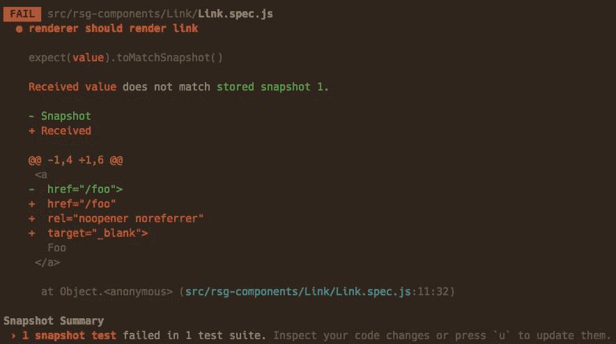

# 用 Jest 和酶测试反应组分

> 原文：<https://medium.com/hackernoon/testing-react-components-with-jest-and-enzyme-41d592c174f>

【2019 年 8 月:这篇文章过时了，查一下 [**我的关于用 Jest 和酶测试 React 组件的新文章**](https://blog.sapegin.me/all/react-testing-2-jest-and-enzyme/) **。**

【2017 年 10 月:文章更新为 React 16 和 Enzyme 3。

有些人说测试 React 组件是无用的，在许多情况下确实如此，但是在一些情况下我认为它是有用的:

*   组件库，
*   开源项目，
*   与第三方组件集成，
*   错误，以防止倒退。

我尝试了许多工具，最终找到了一个我非常喜欢的组合，并向其他开发人员推荐:

*   [Jest](https://facebook.github.io/jest/) ，试跑者；
*   [酶](http://airbnb.io/enzyme/)，用于反应的测试工具；
*   [酶到 json](https://github.com/adriantoine/enzyme-to-json) 为 Jest 快照匹配器转换酶包装器。

在我的大部分测试中，我使用 Jest 快照进行浅层渲染。



Snapshot testing in Jest

## 浅层渲染

浅层渲染只渲染组件本身，而不渲染其子组件。所以如果你改变了子组件中的一些东西，它不会改变你的组件的浅层输出。或者引入到子组件中的一个 bug 不会破坏组件的测试。它也不需要 DOM。

例如，该组件:

```
const ButtonWithIcon = ({icon, children}) => (
    <button><Icon icon={icon} />{children}</button>
);
```

会被反应成这样:

```
<button>
    <i class="icon icon_coffee"></i>
    Hello Jest!
</button>
```

但是像这样用浅显的渲染:

```
<button>
    <Icon icon="coffee" />
    Hello Jest!
</button>
```

请注意，没有呈现图标组件。

## 快照测试

Jest 快照就像那些带有由文本字符组成的窗口和按钮的旧文本 ui:它是存储在文本文件中的组件的渲染输出。

您告诉 Jest，您希望确保该组件的输出永远不会意外更改，Jest 将它保存到一个文件中，如下所示:

```
exports[`test should render a label 1`] = `
<label
  className="isBlock">
  Hello Jest!
</label>
`;

exports[`test should render a small label 1`] = `
<label
  className="isBlock isSmall">
  Hello Jest!
</label>
`;
```

每次你改变你的标记 Jest 会显示一个差异，并要求你更新一个快照，如果改变是有意的。

Jest 在 _ _ snapshot _ _/label . spec . js . snap 之类的文件中存储测试快照，您需要在代码中提交它们。

## 为什么开玩笑

*   非常快。
*   快照测试。
*   令人敬畏的交互式观察模式，只重新运行与您的更改相关的测试。
*   有用的失败消息。
*   配置简单。
*   嘲笑和间谍。
*   使用单一命令行开关的覆盖报告。
*   积极发展。
*   不可能在 Chai 中默写错误的断言像 expect(foo).to.be.a.function 而不是 expect(foo).to.be.a('function ')因为在(正确的)expect(foo)to . be . true 之后写是唯一自然的事情。

## 为什么是酶

*   使用浅层渲染、静态渲染标记或 DOM 渲染的便利工具。
*   类似 jQuery 的 API，用于查找元素、读取属性等。

## 安装

首先安装所有依赖项，包括对等依赖项:

```
npm install --save-dev jest react-test-renderer enzyme enzyme-adapter-react-16 enzyme-to-json
```

您还需要[巴别塔-玩笑](https://github.com/facebook/jest/tree/master/packages/babel-jest)代替巴别塔，以及[ts-玩笑](https://github.com/kulshekhar/ts-jest)代替打字稿。

更新您的包。json:

```
"scripts": {
  "test": "jest",
  "test:watch": "jest --watch",
  "test:coverage": "jest --coverage"
},
"jest": {
  "setupFiles": ["./test/jestsetup.js"],
  "snapshotSerializers": ["enzyme-to-json/serializer"]
}
```

snapshotSerializers 允许您将酶包装器直接传递给 Jest 的快照匹配器，而无需通过调用酶到 json 的 toJson 函数来手动转换它们。

创建一个测试/jestsetup.js 文件来定制 Jest 环境(参见上面的 setupFiles):

```
import Enzyme, { shallow, render, mount } from 'enzyme';
import Adapter from 'enzyme-adapter-react-16';// React 16 Enzyme adapter
Enzyme.configure({ adapter: new Adapter() });// Make Enzyme functions available in all test files without importing
global.shallow = shallow;
global.render = render;
global.mount = mount;
```

对于 CSS 模块，还可以添加到包中的 jest 部分。

```
"jest": {
  "moduleNameMapper": {
    "^.+\\.(css|scss)$": "identity-obj-proxy"
  }
}
```

然后运行:

```
npm install --save-dev identity-obj-proxy
```

请注意 [identity-obj-proxy](https://github.com/keyanzhang/identity-obj-proxy) 要求节点 4 和 5 有节点-协调-代理标志。

## 写作测试

## 测试基本组件渲染

对于大多数非交互式组件来说，这已经足够了:

```
test('render a label', () => {
    const wrapper = shallow(
        <Label>Hello Jest!</Label>
    );
    expect(wrapper).toMatchSnapshot();
});

test('render a small label', () => {
    const wrapper = shallow(
        <Label small>Hello Jest!</Label>
    );
    expect(wrapper).toMatchSnapshot();
});

test('render a grayish label', () => {
    const wrapper = shallow(
        <Label light>Hello Jest!</Label>
    );
    expect(wrapper).toMatchSnapshot();
});
```

## 测试道具

有时，您想更明确地看到测试中的真实值。在这种情况下，使用酶 API 和常规的 Jest 断言:

```
test('render a document title', () => {
    const wrapper = shallow(
        <DocumentTitle title="Events" />
    );
    expect(wrapper.prop('title')).toEqual('Events');
});

test('render a document title and a parent title', () => {
    const wrapper = shallow(
        <DocumentTitle title="Events" parent="Event Radar" />
    );
    expect(wrapper.prop('title')).toEqual('Events — Event Radar');
});
```

在某些情况下，您不能使用快照。例如，如果您有随机身份证或类似的东西:

```
test('render a popover with a random ID', () => {
    const wrapper = shallow(
        <Popover>Hello Jest!</Popover>
    );
    expect(wrapper.prop('id')).toMatch(/Popover\d+/);
});
```

## 测试事件

您可以模拟单击或更改等事件，然后将组件与快照进行比较:

```
test('render Markdown in preview mode', () => {
    const wrapper = shallow(
        <MarkdownEditor value="*Hello* Jest!" />
    );

    expect(wrapper).toMatchSnapshot();

    wrapper.find('[name="toggle-preview"]').simulate('click');

    expect(wrapper).toMatchSnapshot();
});
```

有时，您希望与子组件中的元素进行交互，以测试组件中的效果。为此，您需要使用酶的挂载方法进行适当的 DOM 渲染:

```
test('open a code editor', () => {
    const wrapper = mount(
        <Playground code={code} />
    );

    expect(wrapper.find('.ReactCodeMirror')).toHaveLength(0);

    wrapper.find('button').simulate('click');

    expect(wrapper.find('.ReactCodeMirror')).toHaveLength(1);
});
```

## 测试事件处理程序

类似于事件测试，但是使用 Jest 的模拟函数来测试事件处理程序本身，而不是用快照来测试组件的呈现输出:

```
test('pass a selected value to the onChange handler', () => {
    const value = '2';
    const onChange = jest.fn();
    const wrapper = shallow(
        <Select items={ITEMS} onChange={onChange} />
    );

    expect(wrapper).toMatchSnapshot();

        wrapper.find('select').simulate('change', {
        target: { value },
    });

    expect(onChange).toBeCalledWith(value);
});
```

## 不仅是 JSX

Jest 快照与 JSON 一起工作，所以您可以像测试组件一样测试任何返回 JSON 的函数:

```
test('accept custom properties', () => {
    const wrapper = shallow(
        <Layout
            flexBasis={0}
            flexGrow={1}
            flexShrink={1}
            flexWrap="wrap"
            justifyContent="flex-end"
            alignContent="center"
            alignItems="center"
        />
    );
    expect(wrapper.prop('style')).toMatchSnapshot();
});
```

## 调试和故障排除

**调试浅层渲染器输出**

使用酶的调试方法打印浅渲染器的输出:

```
const wrapper = shallow(/*~*/);
console.log(wrapper.debug());
```

**在启用承保范围的情况下未通过测试**

当您的测试因 coverage 标志为 diff 而失败时，如下所示:

```
-<Button
+<Component
```

尝试用常规函数替换箭头函数组件:

```
- export default const Button = ({ children }) => {
+ export default function Button({ children }) {
```

**请求动画帧错误**

运行测试时，您可能会看到类似以下的错误:

```
console.error node_modules/fbjs/lib/warning.js:42
  Warning: React depends on requestAnimationFrame. Make sure that you load a polyfill in older browsers. [http://fb.me/react-polyfills](http://fb.me/react-polyfills)
```

反应 16 [取决于](https://reactjs.org/docs/javascript-environment-requirements.html) `[requestAnimationFrame](https://reactjs.org/docs/javascript-environment-requirements.html)`，所以您需要在测试中加入[一种多晶型](https://github.com/chrisdickinson/raf):

```
// test/jestsetup.js
import 'raf/polyfill';
```

## 资源

*   [玩笑备忘单](https://github.com/sapegin/jest-cheat-sheet)
*   马克斯·斯托伊伯的《测试 React 应用程序》
*   [迁移到笑话](/@kentcdodds/migrating-to-jest-881f75366e7e#.pc4s5ut6z)作者肯特·c·多兹
*   [杰森·布朗将艾娃迁移到 Jest](http://browniefed.com/blog/migrating-ava-to-jest/)

感谢[克里斯·波杰尔](http://cpojer.net/)、[马克斯·斯托伊伯](http://mxstbr.com/)和安娜·格鲁斯的校对和评论。

页（page 的缩写）查看我的开源项目: [React Styleguidist](https://github.com/sapegin/react-styleguidist) ，一个带有热重载开发服务器的组件样式向导生成器。

**订阅我的简讯:**[**https://tinyletter.com/sapegin**](https://tinyletter.com/sapegin)

> [黑客中午](http://bit.ly/Hackernoon)是黑客如何开始他们的下午。我们是 T21 家庭的一员。我们现在[接受投稿](http://bit.ly/hackernoonsubmission)并乐意[讨论广告&赞助](mailto:partners@amipublications.com)机会。
> 
> 要了解更多信息，请阅读我们的“关于”页面、[喜欢/在脸书上给我们发消息](http://bit.ly/HackernoonFB)，或者简单地发送 [tweet/DM @HackerNoon。](https://goo.gl/k7XYbx)
> 
> 如果你喜欢这个故事，我们推荐你阅读我们的[最新科技故事](http://bit.ly/hackernoonlatestt)和[趋势科技故事](https://hackernoon.com/trending)。直到下一次，不要把世界的现实想当然！