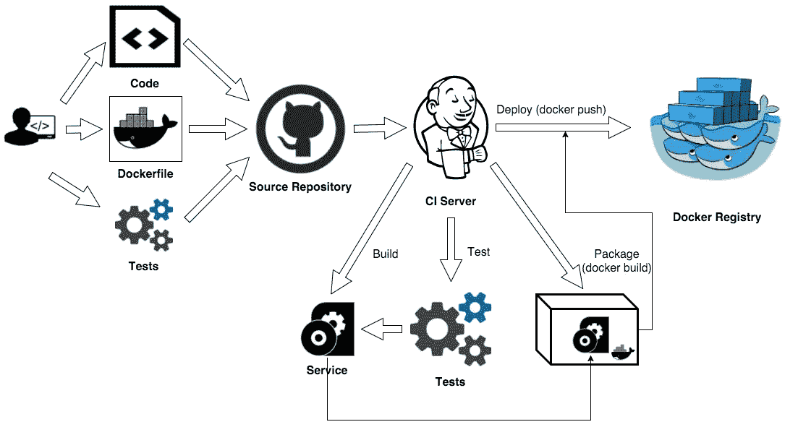
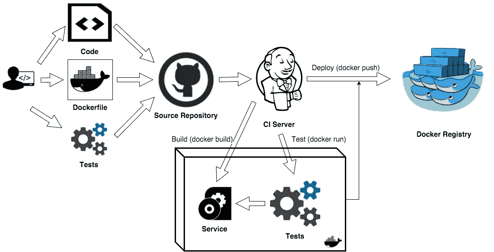
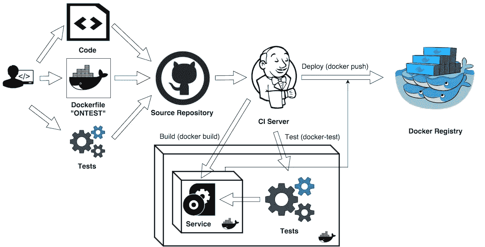
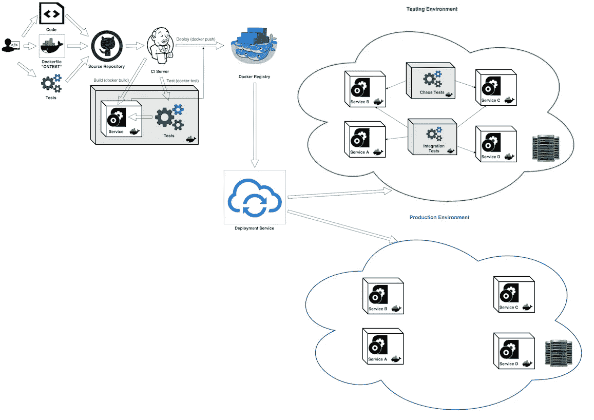

# 码头集装箱的测试策略

> 原文：<https://medium.com/hackernoon/testing-strategies-for-docker-containers-f633e261e75a>

恭喜你！您知道如何构建一个 [Docker](https://hackernoon.com/tagged/docker) 映像，并且能够将多个容器组合成一个有意义的[应用程序](https://hackernoon.com/tagged/application)。希望您已经创建了一个连续的交付管道，并且知道如何将新创建的映像推入生产或测试环境。

现在，问题是

> 我们如何测试 Docker 容器？

我们可以应用多种测试策略。在这篇文章中，我将强调它们各自的优点和缺点。

# “天真”的方法

这是大多数人的默认方法。它依靠 CI 服务器来完成这项工作。当采用这种方法时，开发人员使用 Docker 作为包管理器，这是比 **jar/rpm/deb** 方法更好的选择。CI 服务器编译应用程序代码并执行测试(单元、服务、功能等)。构建工件在 Docker **build** 中被重用以产生新的图像。这成为一个核心部署工件。生成的映像不仅包含应用程序“二进制文件”，还包含所需的运行时，包括所有依赖项和应用程序配置。

我们获得了应用程序的可移植性，然而，我们失去了开发和测试的可移植性。我们无法在 CI 之外复制完全相同的开发和测试环境。为了创建一个新的测试环境，我们将需要设置测试工具(正确的版本和插件)，配置运行时和操作系统设置，并获得相同版本的测试脚本以及测试数据。



解决了这些问题，我们就进入下一个问题。

# 应用和测试容器方法

在这里，我们尝试创建一个包含应用程序“二进制文件”的包，包括必需的包、测试工具(特定版本)、测试工具插件、测试脚本、测试环境以及所有必需的包。

这种方法的**优势**:

*   我们有一个可重复的测试环境，在我们的 CI、开发、试运行或生产环境中，我们可以使用相同的测试工具运行完全相同的测试
*   我们在特定的时间点捕获测试脚本，这样我们就可以在任何环境中重现它们
*   我们不需要设置和配置我们的测试工具——它们是我们映像的一部分

这种方法有明显的缺点:

*   增加图像大小——因为它包含测试工具、必需的包、测试脚本，甚至可能包含测试数据
*   用特定于测试的配置污染映像运行时环境，甚至可能引入不必要的依赖(集成测试所需要的)
*   我们还需要决定如何处理测试结果和日志；如何以及在哪里出口它们

这里有一个简化的 ***Dockerfile*** 。它说明了这种方法。



容器内测试肯定有更好的方法，而且确实有。

# 测试感知容器方法

今天，Docker 的承诺是

> **号建造- >舰- >号运行**

构建映像，将其发送到某个注册中心，并在任何地方运行它。在我看来，这里缺少了一个关键的步骤——测试。

正确完整的顺序应该是 **:**

> **构建- >测试- >发布- >运行**

让我们看看一个“测试友好”的 Docker 文件语法和 Docker 命令的扩展。这一重要步骤可以得到本地支持。这不是一个真正的语法，但是请原谅我。我将定义“理想”版本，并展示如何实现非常接近的东西。

```
**ONTEST** [INSTRUCTION]
```

让我们定义一个特殊的 **ONTEST** 指令，类似于现有的 **ONBUILD** 指令。 **ONTEST** 指令向图像添加一个触发指令，在稍后图像测试时执行。任何构建指令都可以注册为触发器。

新的**对接测试**命令应识别 **ONTEST** 指令。

```
**docker test** [OPTIONS] IMAGE [COMMAND] [ARG...]
```

**docker test** 命令语法将类似于 **docker run** 命令，有一个显著的区别:一个新的“可测试”图像将被自动生成，甚至被标记上 ***<图像名称> : <图像标签> -test*** 标签(“test”后缀被添加到原始图像标签)。该“可测试”映像将从应用映像的中生成**，执行所有构建指令，在 **ONTEST** 命令后定义，并执行 **ONTEST CMD** (或 **ONTEST ENTRYPOINT** )。如果任何测试失败，docker test 命令应该返回一个非零代码。测试结果应该写入自动生成的**卷**中，该卷指向***/var/tests/results***文件夹。**

让我们来看看下面一个修改过的 docker 文件——它包含了新提出的 **ONTEST** 指令。



# 让“测试感知容器”成为现实

我们认为 Docker 应该让 **docker-test** 成为容器管理生命周期的一部分。现在需要一个简单的工作解决方案，我将描述一个非常接近理想状态的解决方案。

如前所述，Docker 有一个非常有用的 **ONBUILD** 指令。这条指令允许我们在后续构建中触发另一条构建指令。基本思想是在运行 d **ocker-test** 命令时使用 **ONBUILD** 指令。

由 **docker-test** 命令执行的流程:

1.  **docker-test** 将在应用 Dockerfile 中搜索 **ONBUILD** 指令，并将…
2.  从原来的 ***Dockerfile*** 生成临时的 ***Dockerfile.test***
3.  执行**docker build-f docker file . test[OPTIONS]PATH**和 **docker build** 命令支持的附加选项: **-test** 将自动追加到**标签**选项
4.  如果构建成功，执行**docker run-v ./tests/results:/var/tests/results[OPTIONS]IMAGE:TAG-test[COMMAND][ARG…]**
5.  移除**文件*文件*文件**文件

为什么不创建一个新的***docker file . test***而不需要 **ONBUILD** 指令呢？

因为为了测试正确的图像(和标签),我们需要保持**从**一直更新到**图像:标签**,我们想要测试。这可不是小事。

所描述的方法有一个限制——它不适合“onbuild”映像(用于自动构建应用程序的映像),比如 [Maven:onbuild](https://hub.docker.com/_/maven/)

让我们看一下 **docker-test** 命令的简单实现。它强调了这个概念: **docker-test** 命令应该能够处理构建和运行命令选项，并且能够正确处理错误。

让我们把重点放在最有趣和最相关的部分。

# 集成测试容器—测试策略

假设我们有一个由数十或数百个微服务构建的应用程序。假设我们有一个自动化 CI/CD 管道，其中每个微服务都由我们的 CI 构建和测试，并在构建和测试通过后部署到某个环境(测试、试运行或生产)中。很酷，是吧？我们的 CI 测试能够独立测试每个微服务——运行单元和服务测试(或 API 契约测试)。甚至可能是微集成测试——在子系统上运行的测试是以特别的方式创建的(例如使用 **docker compose** help)。

这导致了一些我们需要解决的问题:

*   真正的集成测试或者长时间运行的测试(比如性能和压力)怎么样？
*   弹性测试怎么样(“混沌猴”一样的测试)？
*   安全扫描？
*   需要时间并且应该在完全可操作的系统上运行的测试和扫描活动怎么办？

应该有更好的方法，而不是仅仅将新的微服务版本投入生产并严密监控一段时间。

应该有专门的**集成测试容器**。这些容器将只包含测试工具和测试工件:测试脚本、测试数据、测试环境配置等。为了简化这种容器的编排和自动化，我们应该定义并遵循一些约定，并使用元数据标签(Dockerfile **LABEL** 指令)。

## 集成测试标签

*   **测试类型** —测试类型；默认集成；可以是其中之一:*， ***性能*** ， ***安全*** ， ***混乱*** 或任何文本；该标签的出现表明这是**集成测试容器***
*   ***测试结果** —测试结果卷；默认***/var/测试/结果****
*   ***测试。XXX** —任何其他与测试相关的元数据；使用**测试即可。**标签名称的前缀*

## *集成测试容器*

***集成测试容器**只是一个普通的 Docker 容器。它不包含任何应用程序逻辑和代码。它的唯一目的是创建可重复和可移植的测试。**集成测试容器**的推荐内容:*

*   **测试工具* — Phantom.js，Selenium，Chakram，Gatling，…*
*   **测试工具运行时* — Node.js，JVM，Python，Ruby，…*
*   **测试环境配置* —环境变量、配置文件、引导脚本等*
*   **测试* —作为编译的包或脚本文件*
*   **测试数据* —测试使用的任何类型的数据文件:json、csv、txt、xml、…*
*   **测试启动脚本* —运行测试的一些“主”启动脚本；只需创建 test.sh 并从中启动您的测试工具。*

***集成测试容器**应该在部署了所有微服务的操作环境中运行:测试、试运行或生产。这些容器可以像所有其他服务一样进行部署。它们使用相同的网络层，因此可以访问多种服务；使用选定的服务发现方法(通常是 DNS)。真正的集成测试需要访问多个服务——我们需要模拟和验证我们的系统如何在多个地方工作。将集成测试放在某个应用服务容器中不仅会增加容器的占用空间，还会在多个服务之间产生不必要的依赖。我们将所有这些依赖保持在**集成测试容器**的级别。一旦我们的测试(和测试工具)被打包到容器中，我们总是可以在任何环境中重新运行相同的测试，包括开发人员的机器。您可以随时回到过去，重新运行特定版本的**集成测试容器**。*

**

*WDYT？非常感谢您的反馈，尤其是关于标准化 **docker-test** 命令的反馈。*

**视频和幻灯片可在 Codefresh* [*网站*](https://codefresh.io/docker-tutorial/testing-strategies-for-docker/) 获得*

*[](http://bit.ly/HackernoonFB)**[](https://goo.gl/k7XYbx)**[](https://goo.gl/4ofytp)*

> *[黑客中午](http://bit.ly/Hackernoon)是黑客如何开始他们的下午。我们是阿妹家庭的一员。我们现在[接受投稿](http://bit.ly/hackernoonsubmission)并乐意[讨论广告&赞助](mailto:partners@amipublications.com)的机会。*
> 
> *如果你喜欢这个故事，我们推荐你阅读我们的[最新科技故事](http://bit.ly/hackernoonlatestt)和[趋势科技故事](https://hackernoon.com/trending)。直到下一次，不要把世界的现实想当然！*

*[](https://goo.gl/Ahtev1)*