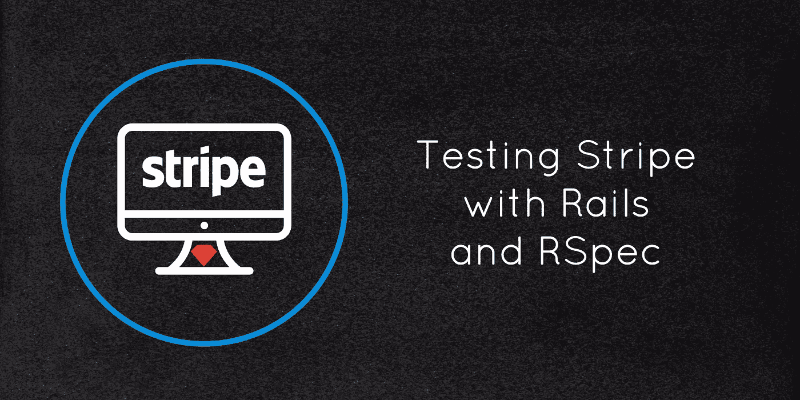

# 使用导轨和 RSpec 测试条带

> 原文：<https://medium.com/hackernoon/testing-stripe-with-rails-and-rspec-de79e1206839>



虽然 Stripe 可能不是到处都有，或者可能不是每个人最具成本效益的卡处理器，但我一次又一次地发现，他们的 API 和仪表板是经过深思熟虑的，“只是工作”。

测试 Stripe 将比您在应用程序中进行的大多数其他测试更复杂一些。您不仅要负责测试应用程序的行为，还要跟踪第三方 API(Stripe)上的远程对象和响应。我将省略一些关于获取 Stripe 并在您的应用程序中运行的细节，因为它似乎在很多地方都有涉及，并重点关注一些使用 RSpec 在您的 Rails 应用程序中测试 Stripe 的高级技术。

如果这是你喜欢的内容，那么你将能够从我即将出版的书[中看到一个完整的实现(包括一个全面的测试套件)，在 Rails 6](https://buildasaasappinrails.com) 中构建一个 SaaS 应用。这本书指导你从卑微的开始，通过部署一个应用到生产。这本书现在已经开始预售了，你可以马上拿到免费的一章！

此外，我的新项目[拉动式管理器](https://pullmanager.com)的测试版已经发布。如果您失去了对拉取请求的跟踪，让旧的请求留在身边，或者只是喜欢一个通过多个服务(Github、Gitlab 和 Bitbucket)聚集这些请求的仪表板，[查看一下](https://pullmanager.com)。

# 条纹红宝石色

[stripe-ruby-mock](https://github.com/rebelidealist/stripe-ruby-mock) 是一个 gem，它允许您在不实际访问外部 stripe API 服务器的情况下对 Stripe 进行测试(除非您想要并且能够明确地这样做)。这将使您不必担心外部连接，清理测试数据，并完全控制任何模拟数据。

对于 Rails 应用程序来说，安装是非常标准的:

添加`gem 'stripe-ruby-mock', '~> 2.5.0', :require => 'stripe_mock'`，然后再添加一个`bundle install`。然后，要开始，您可以将以下内容添加到您的`spec_helper.rb`:

```
config.before(:each) do
    @stripe_test_helper = StripeMock.create_test_helper
    StripeMock.start
  endconfig.after(:each) do
    StripeMock.stop
  end
```

这将启动模拟服务器并生成一些助手方法(比如在 Stripe 中创建一个计划或用户)

安装完成后，您可以遵循这个假设的控制器规范:

```
RSpec.describe PlansController, type: :controller do
  login_admindescribe 'GET #index' do
    it 'returns http success' do
      get :index
      expect(response).to have_http_status(:success)
      expect(assigns(:plans).count).to eq(3)
    end
  enddescribe 'GET #show' do
    let(:plan) { @stripe_test_helper.create_plan(id: 'free', amount: 0) }
    before(:each) do
      PaymentServices::Stripe::Subscription::CreationService.(
        user: @admin,
        account: @admin.account,
        plan: plan.id
      )
      @admin.reload
    endit 'returns http success starter token' do
      @stripe_test_helper.create_plan(id: 'starter', amount: 10)
      cus =
        Stripe::Customer
        .retrieve(@admin.account.subscription.stripe_customer_id)
      card = cus.sources.create(source: @stripe_test_helper.generate_card_token)
      @admin.account.subscription.update(stripe_token: card.id)
      get :show, params: {id: 'starter'}
      expect(response).to have_http_status(:redirect)
      expect(flash[:notice]).to eq 'Plan was updated successfully.'
    end
```

在这个控制器规范中(为了示例的简洁，它是部分的)，有一个规范确保`index`动作根据您使用的本地或远程计划检索方法显示正确的计划数量。

*就我个人而言，我喜欢使用本地的 yml 文件，按需同步计划。*

接下来，好东西。`let`定义允许我们在模拟的 Stripe 服务器中建立计划，以及创建订阅(这里基于处理 Stripe 客户和 Stripe 订阅创建的服务对象)。在特定的`show`规范中，创建了另一个计划(需要一个源/卡),并通过 Stripe Ruby gem 的接口添加了一个新的源/卡。在这种情况下，Stripe 希望您获取客户对象，然后通过该客户对源进行更新。完成后，它将被保存到本地订阅记录中。最后，`show`动作现在将使用已经连接到规范中本地用户的 Stripe 客户、订阅和卡来完成它的工作。

这只是如何编写与 Stripe 接口的控制器操作的一个小示例。接下来，让我们来看一个影响注册工作流的特性规范，它现在支持一些`Plans`和 Stripe API 交互。

```
require 'rails_helper'
include ActiveJob::TestHelper
ActiveJob::Base.queue_adapter = :testRSpec.feature "SignUpProcesses", type: :feature do
  it "should require the user to sign up and successfully sign up" dovisit root_pathclick_on 'Sign up'find(:xpath, "//a[[@href](http://twitter.com/href)='/account/plans/free']").clickwithin "#new_user" do
      fill_in "user_name", with: 'Test'
      fill_in "user_email", with: '[test@test.com](mailto:test@test.com)'
      fill_in "user_password", with: 'password123'
      fill_in "user_password_confirmation", with: 'password123'
    endclick_button "Sign Up"expect(current_path).to eql(new_accounts_path)within "#new_account" do
      fill_in "account_name", with: "Test Co"
    endexpect do
      click_button "Save"
      expect(ActionMailer::Base.deliveries.last.to).to eq ["[test@test.com](mailto:test@test.com)"]
      expect(current_path).to eql(root_path)
    end
  end
```

虽然这没有直接使用 StripeMock 的助手或服务器，但它实际上会将所有客户和订阅更改保存到本地 StripeMock 实例中(顺便说一下，该实例会在每次测试之间重置)。

无论如何，点击`Sign Up`会把你带到一个`plans#index`页面。在该页面上，您可以点击一个链接，选择开始试用的计划。一旦完成，该计划将通过注册过程的继续，最终在一个服务对象中使用，该服务对象将条带创建委托给之前的同一个`CreationService`类。

如果条带订阅有任何问题，工作流不会在`root_path`结束，也不会失败测试。您甚至可以更进一步，让该功能访问您的应用程序的计费部分，并确保选择的计划是显示为`current`的计划。

# Webhooks！

没有提到 Webhooks，关于条带的讨论是不完整的。如果您从未听说过 Webhooks，这意味着当第三方服务做出的更改不是来自 API 调用的直接结果时，它会向应用程序发送一个 HTTP 请求来处理这样的事件。举一个更具体的例子，假设几天后有一笔付款。Stripe 将创建一个事件 invoice.upcoming，并向 Rails 应用程序指定用于接收此类事件的端点广播一个 HTTP 请求。然后，由您的应用程序来处理事件。

在进入条纹网钩的规范之前。让我继续为[条纹事件](https://github.com/integrallis/stripe_event)宝石欢呼吧。作为一名优秀的软件维护者，我喜欢确保 gem 安装是值得的。Stripe_event 是一个设置 WebhooksController 的小型 gem，以及一个添加了一点元编程的小型类文件集。它使用 ActiveSupport::Notifications 将事件传递给处理代码的您(您可以在块之间进行选择，或者向您选择的类发送. call)。

也就是说，通过 StripeMock 测试 webhook 是另一个快速的设置。

```
require 'rails_helper'
include ActiveJob::TestHelperRSpec.describe Payments::InvoicePaymentSucceeded, type: :mailer do
  let(:plan) { @stripe_test_helper.create_plan(id: 'free', amount: 0) }before(:each) do
    @admin = FactoryGirl.create(:user, email: '[awesome@dabomb.com](mailto:awesome@dabomb.com)')
    PaymentServices::Stripe::Subscription::CreationService.(
      user: @admin,
      account: @admin.account,
      plan: plan.id
    )
    @event = StripeMock.mock_webhook_event(
      'invoice.payment_succeeded',
      customer: @admin.account.subscription.stripe_customer_id,
      subscription: @admin.account.subscription.stripe_subscription_id
    )
  endit 'job is created' do
    ActiveJob::Base.queue_adapter = :test
    expect do
      Payments::InvoicePaymentSucceeded.email(@event.id).deliver_later
    end.to have_enqueued_job.on_queue('mailers')
  endit 'email is sent' do
    expect do
      perform_enqueued_jobs do
        Payments::InvoicePaymentSucceeded.email(@event.id).deliver_later
      end
    end.to change { ActionMailer::Base.deliveries.size }.by(1)
  end
```

设置看起来非常相似。通过 StripeMock 帮助器添加计划。然后，在每个规范之前，FactoryGirl/FactoryBot 会创建一个`@admin`用户。创建后，将设置客户和订阅。最后，创建一个模拟 webhook 事件。这是这里的重要部分，因为 StripeEvent 或您自己的 Webhook 处理代码将从 Stripe 中检索事件。因此，我们的测试需要一个模拟版本。

默认情况下，StripeMock 实际上在 gem 结构内的 JSON fixtures 中保留了大多数 webhook 事件的副本。但是，对于每种类型的事件，您可以覆盖特定的属性。这里，为了确保事件为正确的客户带来订阅，在创建模拟事件的第二个参数中覆盖了它们。

一旦解决了这个问题，一切就都正常了。在规范开始的情况下，在将一个事件传递给邮件程序时，它确保邮件程序“完成了它的工作”,并将邮件排队到正确的队列中。

StripeMock 的另一个很酷的地方是能够让特定的请求抛出一个错误，从而允许您测试您的错误处理逻辑。语法非常简单，但是需要您查找特定请求类型/端点的符号定义:

```
StripeMock.prepare_error(
        Stripe::InvalidRequestError.new('s', {}),
        :get_charges
 )
```

这里，我们指定下次调用`Stripe::Charge.list`时要引发的`Stripe::InvalidRequestError`。

# 你用什么？

那是一个在几个不同的地方进行高水平测试的条纹。以及一些有助于条带实现(和测试)的工具。

在利用 Stripe 时，您使用或实施了什么(并按照您应该的方式进行测试)？