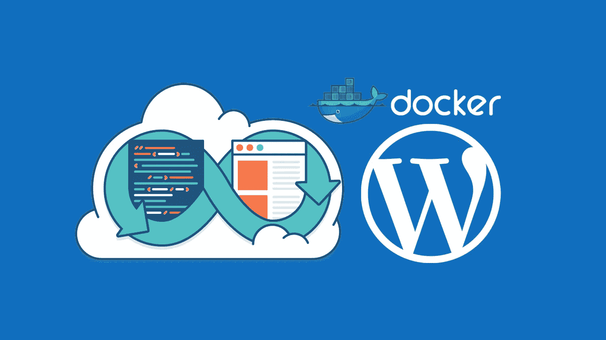
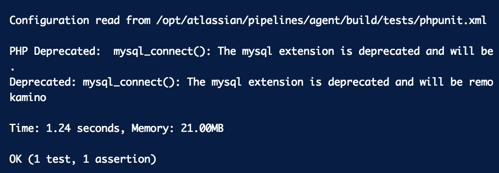
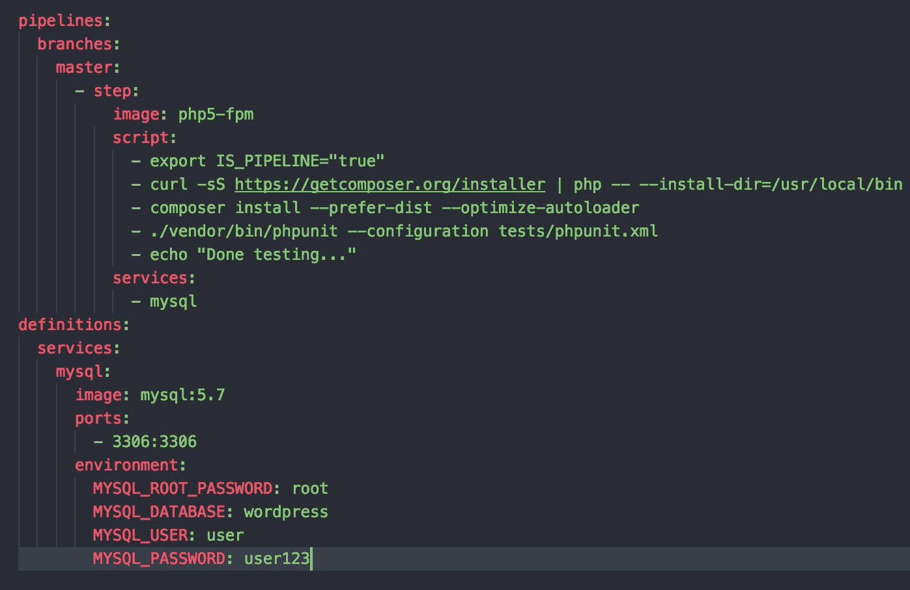

# 在 Bitbucket 管道中测试 Wordpress 主题和插件

> 原文：<https://medium.com/hackernoon/testing-wordpress-themes-and-plugins-in-bitbucket-pipelines-2527f2729064>



在过去的几天里，我和我的同事们正在寻找测试插件和主题的最佳方法，这些测试应该能够在我们的 CI 环境中运行，并确保在部署到某个地方之前一切都符合要求，这是我决定分享这个的主要原因，它可能会帮助许多寻找捷径和不想浪费时间的开发人员。

WordPress 提供并支持一个单元测试框架，但是只针对核心开发。然而，带着一点好奇心，你可以用它来测试主题和插件。

# 步骤 1:安装 PHPUnit

如果使用 composer，只需使用以下命令安装 PHPUnit:

```
curl -sS [https://getcomposer.org/installer](https://getcomposer.org/installer) | php — — install-dir=/usr/local/bin — filename=composer
```

或者，您可以使用以下命令在本地环境中安装二进制文件:

```
wget https://phar.phpunit.de/phpunit.phar
chmod +x phpunit.phar
mv phpunit.phar /usr/local/bin/phpunit
```

一旦安装了 PHPUnit，您应该能够直接从终端运行该命令:

```
phpunit — configuration=path/phpunit.xml 
```

或从您的供应商处获得:

```
./vendor/bin/phpunit — configuration=path/phpunit.xml
```

# 步骤 2:获得 WordPress 框架并配置您的测试数据库

Wordpress 将其核心框架捆绑在一个 svn repo 中。我们可以通过查看 includes 目录下载我们想要的工具。

你想在哪里组织你的[测试](https://hackernoon.com/tagged/testing)库由你决定。对于我们的例子，我们将假设您将它克隆到您的 WordPress 根目录下的“tests”文件夹中。

确保你选择的文件与你的 Wordpress 核心版本相匹配，在我们的例子中是 Wordpress 4.3，进入终端并输入:

```
svn co develop.svn.wordpress.org/branches/**4.3**/tests/phpunit/includes/
```

你将需要第二个 Wordpress 配置文件【wp-tests-config.php ，在那里你应该配置你的数据库和 Wordpress 站点信息，这里有一个例子:

```
https://develop.svn.wordpress.org/trunk/wp-tests-config-sample.php
```

注意:确保你使用另一个数据库，因为 Wordpress 在测试过程中会删除并重新创建表格。

在 Mysql Host 中，我们有 2 个不同的主机，“Mysql”和“127.0.0.1”，因此我们对配置文件做了一点修改，如下所示:

```
$remote = “mysql”;if(getenv(‘IS_PIPELINES’)) $remote = “127.0.0.1”;
```

如果我们从 Docker 容器运行测试，我们应该能够使用“mysql”主机进行连接，但在管道中却不是这样，因为我们定义了 mysql 服务，并且规则是不同的，请参见[https://confluence . atlassian . com/bit bucket/test-with-databases-in-bit bucket-Pipelines-856697462 . html](https://confluence.atlassian.com/bitbucket/test-with-databases-in-bitbucket-pipelines-856697462.html)

# 步骤 3:配置您的测试

为此，我们将创建一个名为“phpunit.xml”的文件，我们将在其中放置我们的测试设置，无论您将它放在哪里，因为您总是可以在命令中指定它。

```
<phpunit 
	bootstrap=“./tests/includes/bootstrap.php"
	backupGlobals="false"
	colors="true"
	convertErrorsToExceptions="true"
	convertNoticesToExceptions="true"
	convertWarningsToExceptions="true">
	<testsuites>
		<testsuite>
			<directory prefix="test-" suffix=".php">./tests/</directory>
		</testsuite>
	</testsuites>
</phpunit>
```

我们将运行前缀为“test-”的每个测试文件。/tests/"文件夹。

现在有了这个配置，你将只在 Wordpress 核心上运行测试，但是如果你需要在你自己的插件和主题上运行测试，我们将创建我们自己的引导文件:

```
<?phprequire_once dirname( dirname( __FILE__ ) ) . ‘/tests/includes/functions.php’;function _manually_load_environment() {*//* Add your theme …switch_theme(‘my_theme’);*//* Update array with plugins to include …*$plugins_to_active = array(**‘your-plugin/your-plugin.php’**);*update_option( ‘active_plugins’, $plugins_to_active );}tests_add_filter( ‘muplugins_loaded’, ‘_manually_load_environment’ );require dirname( dirname( __FILE__ ) ) . ‘/tests/includes/bootstrap.php’;
```

现在，我正在加载我的主题，以及让我的 Wordpress 工作所需的插件。

不要忘记指向 phpunit.xml 上的新引导文件，如下所示:

```
bootstrap="./bootstrap.php"backupGlobals="false"...
```

# 第四步:编写测试

你现在已经准备好了，像下面的例子一样编写你的第一个单元测试，检查主题是否正确加载。

```
<?phpclass VerificationTest extends **WP_UnitTestCase** { function testTheme() { $this->assertTrue( ‘my_theme’ == wp_get_theme() ); }}
```

运行 phpunit 命令，您应该看到以下关于您的测试的信息:



# 步骤 5:这完全是关于 CI(位桶管道)

嗯，我想我们已经解决了这个问题，我们只需要调整它来运行 Bitbucket 内部的构建。阅读文档，我为我们的测试数据库使用了一个“mysql”服务。



请注意，您应该使用您在 wp-tests-config.php 文件中提到的相同凭据。

我希望这将对你有用，如果有什么可以讨论或纠正的，欢迎你的评论。

谢谢你😃