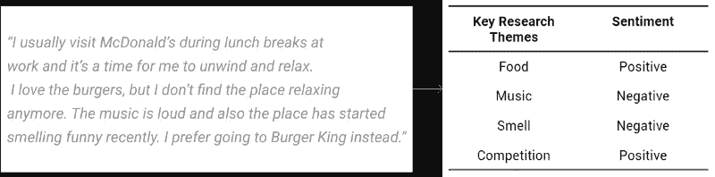

# Excel 中的文本分析:真实世界用例

> 原文：<https://medium.com/hackernoon/text-analysis-in-excel-real-world-use-cases-d683c5449daa>

上周，我们推出了 [ParallelDots Excel 插件](https://www.paralleldots.com/excel-plugin)，这是一个使用 ParallelDots NLP APIs 对非结构化数据进行文本分析的解决方案，无需编写一行代码。Excel 插件非常易于使用，为您的文本分析需求提供了一个方便而有效的解决方案。在早先的[帖子](http://blog.paralleldots.com/product/announcing-excel-add-paralleldots-ai-apis/)中，我们为您提供了 excel 插件如何工作的详细信息。在本帖中，我们将讨论一些真实的使用案例，在这些案例中，您可以使用 Excel 插件来提高您的分析水平，而无需花费大量资金来建立数据科学团队。

# 对来自电子商务网站、脸书网页和其他评论网站的产品评论进行文本分析

你可以分析大量的顾客评论来了解对你的产品的总体印象。Excel 插件在 ParallelDots AI APIs 上工作，自过去两年以来，开发人员和企业广泛使用这些 API 来增强他们的分析能力。

此外，你可以对积极和消极情绪的句子进行关键词分析，以发现人们喜欢或不喜欢你的产品的原因。这样的分析将使你能够理解对你的产品的总体感觉有贡献的关键短语。例如，一家手机制造商公司可以分析电子商务网站、社交媒体和技术评论博客对其模型的评论。然后，他们可以提取积极和消极情绪句子的关键词，以找到哪些特征(屏幕、电池寿命、摄像头、存储等)。)用户喜欢或不喜欢特定的手机型号。

此外，您可以更深入地分析产品评论的意图，并对其进行分类，以确定该评论是反馈、意见、查询还是垃圾邮件。这将有助于过滤重要的评论，并更快地回复/处理它们。

分析的数据，即情感、关键词和意图，可以与您的内部业务指标相关联，如营销支出、销售数据等。找到可行的见解。

# 分析来自调查的开放式用户反馈

事实证明，开放式反馈表格比封闭式反馈表格更有用(我们市场研究部门的 Karna AI 撰写了一篇关于分析开放式用户调查的内容丰富的博客。你可以在这里阅读)但是分析它们可能是非常耗时和昂贵的任务。

在分析开放式调查时，我们的 Excel 插件是救命稻草。一旦您以 xlsx 或 csv 格式导出了所有调查回复并安装了插件，您就可以直接开始分析回复，而无需编写任何代码。Excel 插件使任何人都可以轻松执行人工智能支持的文本分析。

方法可以与产品评论分析中提到的方法相同，您可以将实体提取功能与关键字分析结合起来，以发现更广泛的实体(产品名称、人名等。)在调查中谈到的。

# 金融内容的文本分析

财务数据，如收益电话会议、新闻报道、文字记录等。包含大量丰富的信息，可以为您的基本投资和金融研究奠定基础。BFSI 区配备了大量的文本数据。

由于 excel 仍然是任何金融分析师工具包中不可或缺的一部分，ParallelDots Excel 插件可以帮助将金融文档(资产负债表、交易历史、P&L 报表)中的许多结构化数据点与非结构化金融文档中的数据点关联起来。

# 从你的社交收听工具中分析社交媒体内容

虽然社交倾听工具在跟踪互联网上关于你的品牌或产品的每一次对话方面做得很好，但在大多数这些工具中，建立良好的文本分析能力只是事后才被考虑。通过 ParallelDots Excel add-in 等强大的文本分析工具分析这些社交收听工具的数据，可以很好地概述您的社交存在。

此外，与 ParallelDots 等 Excel 插件相比，提供良好文本分析功能的监听工具可能是一种昂贵的工具。

这些监听工具为导出 csv 格式的所有对话提供了一个非常方便的选项。然后，您可以像分析产品评论一样分析这些对话，以获得可操作的见解，如对话附带的情感、提及的关键词和关键短语、对话中检测到的情绪、提及的实体等。

# 支持业务分析师对非结构化数据集进行文本分析

业务分析师捕获、分析并记录业务需求和变化。业务分析师通常配备有来自不同领域的大量文本语料库，如市场研究、金融数据、历史观点等。

ParallelDots Excel 插件可以帮助分析师提高他们的游戏，因为 Excel 大量用于分析该部门的数据点。业务分析师可以使用 ParallelDots Excel 加载项中的多个函数更快地处理信息。他们可以收集相关的见解，例如提取实体，基于情感对产品、服务或市场进行分类，以及基于 IAB 类别对文本进行分类等。

ParallelDots Excel 外接程序的用例不限于上面提到的那些。实际上，只要您需要处理大量非结构化文本数据，就可以使用该插件。它超级容易使用，只需[下载](https://www.paralleldots.com/excel-plugin)插件，[注册](https://www.paralleldots.com/sign-up)你独特的 API 密钥，并开始分析你的内容。请查看[文档](https://www.paralleldots.com/excel-docs)，了解插件中可用的不同功能。

如果您使用的是 Windows 以外的操作系统，那么请尝试我们的 [Google Sheets 插件](https://www.paralleldots.com/google-sheet-add-on)，它的工作方式与我们的 Excel 插件相同。你可以在这里阅读更多相关信息[。](https://blog.paralleldots.com/product/announcing-google-sheets-add-on-for-paralleldots-apis/)

我们希望你喜欢这篇文章。请[注册](http://user.apis.paralleldots.com/signing-up?utm_source=blog&utm_medium=chat&utm_campaign=paralleldots_blog)免费的 ParallelDots 账户，开始你的 AI 之旅。你也可以点击查看 PrallelDots AI API[的演示。](https://www.paralleldots.com/ai-apis)

这里可以阅读原文[。](https://blog.paralleldots.com/product/use-cases-excel-add-text-analysis/)