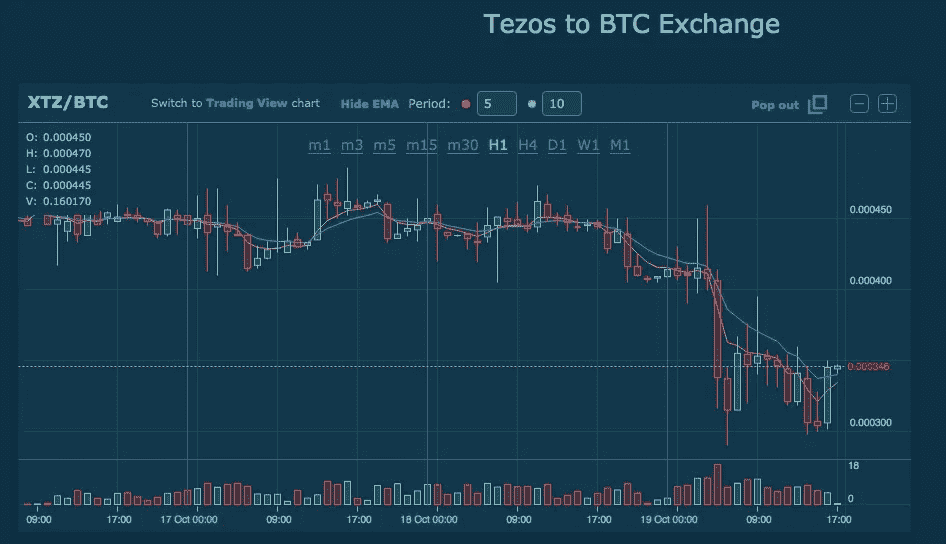

# Tezos ICO 死了吗？

> 原文：<https://medium.com/hackernoon/tezos-tested-bbeeaa7a5449>

Tezos 处于聚光灯下，因为创始团队和其管理基金会之间的内部斗争(特别是其负责人[约翰·格弗斯](https://www.linkedin.com/in/johanngevers/)，据称被指控欺诈)，这可能威胁到该项目的未来(已经影响到 Tezos 的“未来”借据)。这具有新闻价值，因为 Tezos 是市场上知名度最高的 ico 之一，在推出前筹集了近 4 亿美元(技术上是 2.32 亿美元，但 ETH 的价值现在更有帮助，因为他们尚未将资金转换为法定货币……)。许多人已经认为这个项目已经胎死腹中。我不太确定。

很明显，泰佐斯正在经受一系列艰难而重要的考验。关于这件事，我有几点想法要分享。

Tezos future getting hit, as expected.

# 治理测试

首先，具有讽刺意味的是，Tezos 的核心使命是带来一个治理管理和解决方案都包含在协议中的区块链，却受到自己的治理机构的威胁。如果你自己都不能自我管理你自己的公司，你怎么能成为一个可信的被更好管理的协议呢？但另一方面，这可能恰恰是一种测试，如果通过，只会加强公司的核心使命和可信度。让我们记住，以太坊在其早期也经历了一次濒临死亡的经历，内部斗争，我们就在我们眼前看到比特币社区正在进行的关于它正在经历的各种分叉的血腥斗争。

# 弹性测试

加密协议似乎具有这种有机的特征，能够经受住治理风暴。但是最好的协议和组织有足够的弹性去完成它们。比特币经历了 MtGox 和丝绸之路，最近中国的禁令，甚至杰米戴蒙光明的声明。以太坊经历了道骗局/崩溃和自己的分叉，为新生的更有价值的 ETH 留下了以太坊经典。

这是对特佐斯的考验。这不仅将决定它的未来，还将决定创始团队是否适合长期承担和捍卫它的核心使命。让我们称之为**承诺**测试。

# ICOs 测试

我也相信这一事件将对过去和未来的 ico 产生重大影响，让我们明确地说，短期内消息并不好。在之前的一篇文章中，我预计一些监管机构针对高知名度 ico 的行动将带来加密噩梦。

只有第二部分是真的。坏消息不是由监管机构带来的，而是由 ICO 驱动的公司本身带来的。Tezos 的纠纷不会在一夜之间解决，它本身将为 ICO 领域蒙上阴影，甚至可能加速监管机构密切关注 ICO 如何设计其治理机制和保护其支持者的兴趣。现在，我确信所有该项目的支持者都在想，如果项目失败了，他们是否能拿回他们的钱。我甚至不确定白皮书中是否有针对这种情况的保护措施。但是应该有。除了 Tezos，所有其他 ico 现在都将接受关于如何管理他们的治理以及在出现问题时会发生什么的测试。

消极的过程已经开始了。太多的 ico 没有达到他们的目标，业绩(即即时回报)也不如从前。太多愚蠢的钱和快速的鱼鳍已经充斥了这个领域，我预计 Tezos 的事情会在短期内进一步冻结人们对 ICOs 的兴趣。投入的资金将投向“更安全”的赌注，即 fat 协议和品牌 ico，特别是那些将改善治理实践的项目。新的 ico 必须更好地说服支持者，以防出现意外。举个例子，如果 ICO 募集的资金远远低于目标，或者如果代币没有按照承诺的时间(或合理的延迟)上市，或者如果创始人离开或离职，会发生什么。这些问题大多被忽视，每个人都投资于最好的情况，因为没有人能想象灾难会提前发生。但泰佐斯证明了他们有。因为我亲眼目睹了 ICOs 的失败，我可以告诉你 Tezos 不是第一个遇到问题的人，但它是最引人注目的一个。

# 信任测试

我确信这将会给加密空间带来更好的实践和更光明的未来。反对者将会因为“我告诉过你”，“很高兴我没有支持这个”而陷入黑暗，但音乐将会再次播放。在这个阶段，我们需要等待，看看 Tezos 是否能够处理好与他们基金会的关系，团队是否对他们的管理充满信心。但最终的考验是他们是否会在尊重[合理延迟](/@arthurb/the-path-forward-eb2e6f63be67?source=linkShare-454d729d5955-1508404688)(该团队宣布 2018 年 2 月)的情况下发布一些有意义的东西。任何区块链协议的主要资产都是**信任**。信任团队，信任代码，信任吞吐量。如果 Tezos 团队(其信任分数现在已经在地面上)不能通过以可见的速度交付、交流和运输来建立信任，我们可以认为该项目已经死亡。

但目前来看，并不是。

# 耐心测试

我很早就支持 Tezos ICO，显然我希望结果是积极的。我相信他们的核心任务是非常有价值的。我们看到比特币的演变是多么痛苦，通往更好、更有效的以太的道路是多么漫长和乏味，即使管理起来比比特币社区内部更加智能和优雅。治理不是沿着协议的道路而来的附加物。为了公平和流畅，它必须包含在核心协议中。

有人会说，过早投入过多资金与更好的治理不相容，因为人也是人。这是事实。现实是，当构建您自己的治理时，您需要从第一天起就为最坏的情况做好准备。显然，这里的情况并非如此。亡羊补牢，为时未晚。区块链公司还应该明白，在这种情况下，风投公司提供适当指导的价值。筹集到大量资金固然很好，但你也需要一个值得信赖的第三方，长期致力于你的项目**，帮助你在治理、设置和决策方面做出正确的选择。我知道 Tezos 得到了一些风投的支持，我想知道他们在这个过程中的角色和影响，我怀疑这是只由创始团队掌控的事情。**

**明确地说，我很担心，但仍然希望他们会走出这一点。我宁愿认为今天我的钱丢了，只有当事情发生变化时，我才会得到惊喜。**

**我们现在要经历的另一个考验是耐心。ICO 空间没有耐心就不可能健康。那些期待快速回报的人将从 Tezos 那里学到一些东西。耐心和信任一样重要。**

**等着瞧。**