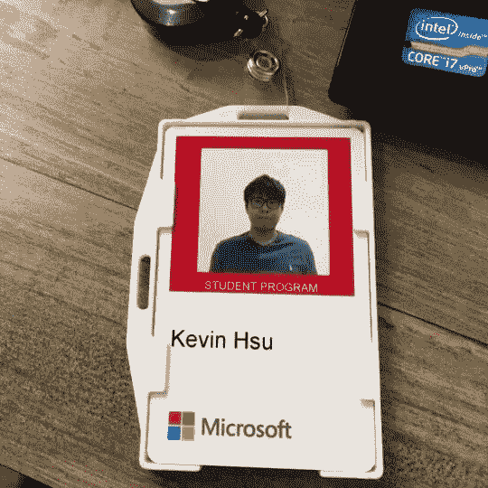

# 谢谢你，微软，感谢你给了我这么棒的软件工程师实习机会

> 原文：<https://medium.com/hackernoon/thank-you-microsoft-for-the-amazing-software-engineer-internship-407a49b8f816>

> 下午 3 点 15 分。

我现在坐在办公桌前，所有的工作都完成了，准备向微软台湾所有有趣的东西、津贴和有才华的同事说再见。

Really don’t want to give back my badge :(

我不敢相信自从我第一次来到这个办公室，整整 10 周的软件工程师实习已经过去了。我也该赶飞机去香港了…